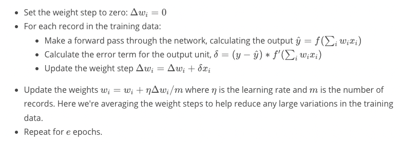
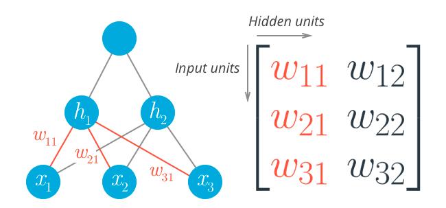

# Udacity Deep Learning Nanodegree: Neural Networks

These are my personal notes taken while following the [Udacity Deep Learning Nanodegree](https://www.udacity.com/course/deep-learning-nanodegree--nd101).

The nanodegree is composed of six modules:

1. Introduction to Deep Learning
2. Neural Networks and Pytorch Guide
3. Convolutonal Neural Networks (CNN)
4. Recurrent Neural Networks (RNN)
5. Generative Adversarial Networks (GAN)
6. Deploying a Model with AWS SageMaker

Each module has a folder with its respective notes. This folder is the one of the **second module**: Neural Networks.

Additionally, note that:

- I made many hand-written notes; check the PDFs.
- I made many hand-written notes; check the PDFs.
- I forked the Udacity repositories for the exercises; most the material and notebooks are there:
  - [deep-learning-v2-pytorch](https://github.com/mxagar/deep-learning-v2-pytorch)
  - [DL_PyTorch](https://github.com/mxagar/DL_PyTorch)
  - [sagemaker-deployment](https://github.com/mxagar/sagemer-deployment)

## Overview of Contents

- [Udacity Deep Learning Nanodegree: Neural Networks](#udacity-deep-learning-nanodegree-neural-networks)
  - [Overview of Contents](#overview-of-contents)
- [2. Neural Networks](#2-neural-networks)
  - [Lesson 1: Introduction to Neural Networks](#lesson-1-introduction-to-neural-networks)
    - [Notebook: `GradientsDescend.ipynb`](#notebook-gradientsdescendipynb)
    - [Notebook: `StudentAdmissions.ipynb`](#notebook-studentadmissionsipynb)
  - [Lesson 2: Implementing Gradient Descend](#lesson-2-implementing-gradient-descend)
    - [Gradient Descend in Numpy: Basic Idea](#gradient-descend-in-numpy-basic-idea)
    - [One Perceptron, One Data-Point](#one-perceptron-one-data-point)
    - [One Perceptron, Several Data Points](#one-perceptron-several-data-points)
    - [Multiple Perceptrons (MLP), Several Data Points, One Forward Pass](#multiple-perceptrons-mlp-several-data-points-one-forward-pass)
    - [Backpropagation: One Backward Pass](#backpropagation-one-backward-pass)
    - [Implementation of Backpropagation](#implementation-of-backpropagation)
    - [Notes on Matricial Operations](#notes-on-matricial-operations)
    - [Interesting Links](#interesting-links)
  - [Lesson 3: Training Neural Networks](#lesson-3-training-neural-networks)
  - [Lesson 4: GPU Workspaces Demo](#lesson-4-gpu-workspaces-demo)
  - [Lesson 5: Sentiment Analysis](#lesson-5-sentiment-analysis)
    - [Mini-Project 1: Create a Vocabulary of Words with Associated Sentiment Values](#mini-project-1-create-a-vocabulary-of-words-with-associated-sentiment-values)
    - [Mini-Project 2: A Vocabulary Is Built + Mappings Word \<-\> Index + Text Vectorizer](#mini-project-2-a-vocabulary-is-built--mappings-word---index--text-vectorizer)
    - [Mini-Project 3: A Neural Network Class for Sentiment Analysis Is Created](#mini-project-3-a-neural-network-class-for-sentiment-analysis-is-created)
    - [Mini-Project 4: Reducing the Noise Fed to the Network by Inpunting Word Detection, not Count](#mini-project-4-reducing-the-noise-fed-to-the-network-by-inpunting-word-detection-not-count)
    - [Mini-Project 5: Increasing the Speed by Replacing Matrix Multiplication in the First Layer](#mini-project-5-increasing-the-speed-by-replacing-matrix-multiplication-in-the-first-layer)
    - [Mini-Project 6: Reducing the Noise Input to the Network with a Vocabulary of Significant Words](#mini-project-6-reducing-the-noise-input-to-the-network-with-a-vocabulary-of-significant-words)
    - [(Mini-Project 7): Network Analysis](#mini-project-7-network-analysis)
  - [Project: Predicting Bike Sharing Patterns (Lesson 6)](#project-predicting-bike-sharing-patterns-lesson-6)
  - [Lesson 7: Deep Learning with Pytorch](#lesson-7-deep-learning-with-pytorch)


# 2. Neural Networks

## Lesson 1: Introduction to Neural Networks

The content is mostly recorded in the hand-written notes.
There is overlap with the CVND = Udacity Computer Vision Nanodegree (overlap in videos, notebooks, etc.).

List of concepts:

- Classification
- Perceptron
- Perceptron as Logical Operators
- Perceptron model optimization: Perceptron algorithm (mis-classified points added to the model parameters after scaling with learning rate)
- Error
- Discrete vs Continuous Outputs: We need to hava a continuous differentiable error
- Sigmoid Function: continuous output compressed to `(0,1)`
- Softmax Function: multi-class sigmoid
- One-hot encoding
- Maximum Likelyood: the best model has the highest maximum likelihood: products of the predicted data-point probabilities of the correct value; however, in practice the `log` is used to avoid products of small numbers!
- Cross Entropy: a way of interpreting the cross-entropy loss is the maximum likelihood product computed as sums of `logs`.
	- That way, the maximum likelihood is the probability of all the classes, and the cross-entropy is the error. The higher the probability, the lower the error!
	- Another way of interpreting the cross-entropy is the distance error from a discrete vector to our continuous probabilities: `CE([1,1,0],[0.8,0.7,0.1]) = 0.69`
- Error Function
- Gradient Descend
- Comparison: Perceptron Algorithm vs Gradient descend
- Nonlinear Models: Multi-layer Perceptrons = Neural Networks
- Feedforward
- Backpropagation

History of Deep Learning: [AI, Deep Learning, and Machine Learning: A Primer | Frank Chen, a16z](https://www.youtube.com/watch?v=ht6fLrar91U)

Interesting Jupyter Notebooks: [deep-learning-v2-pytorch](https://github.com/mxagar/deep-learning-v2-pytorch)

- `intro-neural-networks/GradientsDescend.ipynb`: Gradient descend implemented with `numpy` to a 2D pointcloud with two classes. The line defined by the weights is plotted along the time/training epochs. The code is below.
- `intro-neural-networks/StudentAdmissions.ipynb`: Gradient descent implemented with `numpy` to a linear model. The code is below.
	- Dataset: student admission data: 3D data (test result, GPA grades, class rank quantile), converted to one-hot 6D.
	- One-hot encoding is done in pandas using `get_dummies()`: Rank 0-4 -> rank_i 0/1 for i 1-4.
	- Variables are scaled.
	- Train/Test split done with `np.random.choice`

### Notebook: `GradientsDescend.ipynb`

```python
# Imports
import matplotlib.pyplot as plt
import numpy as np
import pandas as pd

# Some helper functions for plotting and drawing lines
def plot_points(X, y):
    admitted = X[np.argwhere(y==1)]
    rejected = X[np.argwhere(y==0)]
    plt.scatter([s[0][0] for s in rejected], [s[0][1] for s in rejected], s = 25, color = 'blue', edgecolor = 'k')
    plt.scatter([s[0][0] for s in admitted], [s[0][1] for s in admitted], s = 25, color = 'red', edgecolor = 'k')

def display(m, b, color='g--'):
    plt.xlim(-0.05,1.05)
    plt.ylim(-0.05,1.05)
    x = np.arange(-10, 10, 0.1)
    plt.plot(x, m*x+b, color)


# Load and visualize the data
data = pd.read_csv('data.csv', header=None)
X = np.array(data[[0,1]])
y = np.array(data[2])
plot_points(X,y)
plt.show()

# Activation (sigmoid) function
def sigmoid(x):
    return 1 / (1 + np.exp(-x))

# Output (prediction) formula
def output_formula(features, weights, bias):
    return sigmoid(np.dot(features, weights) + bias)

# Error (log-loss) formula
def error_formula(y, output):
    return - y*np.log(output) - (1 - y) * np.log(1-output)

# Gradient descent step
# x: 1 x n_features
# weights: 1 x n_features
# y: 1 x 1
def update_weights(x, y, weights, bias, learnrate):
    output = output_formula(x, weights, bias) # y_hat
    d_error = y - output
    weights += learnrate * d_error * x # watch out: dE/dw = - ...
    bias += learnrate * d_error
    return weights, bias

# Training Function
def train(features, targets, epochs, learnrate, graph_lines=False):
    errors = []
    n_records, n_features = features.shape
    last_loss = None
    weights = np.random.normal(scale=1 / n_features**.5, size=n_features)
    bias = 0
    for e in range(epochs):
        del_w = np.zeros(weights.shape)
        # Go through all samples, for each, update weights & bias with gradient descend
        for x, y in zip(features, targets):
            # That is not completely correct?
            # We should compute the complete batch gradient
            # and then update the weights?!
            weights, bias = update_weights(x, y, weights, bias, learnrate)
        # Printing out the log-loss error on the training set
        out = output_formula(features, weights, bias)
        #targets.shape
        #out.shape
        loss = np.mean(error_formula(targets, out))
        errors.append(loss)
        if e % (epochs / 10) == 0:
            print("\n========== Epoch", e,"==========")
            if last_loss and last_loss < loss:
                print("Train loss: ", loss, "  WARNING - Loss Increasing")
            else:
                print("Train loss: ", loss)
            last_loss = loss
            
            # Converting the output (float) to boolean as it is a binary classification
            # e.g. 0.95 --> True (= 1), 0.31 --> False (= 0)
            predictions = out > 0.5
            
            accuracy = np.mean(predictions == targets)
            print("Accuracy: ", accuracy)
        if graph_lines and e % (epochs / 100) == 0:
            display(-weights[0]/weights[1], -bias/weights[1])
    
    # Plotting the solution boundary
    plt.title("Solution boundary")
    display(-weights[0]/weights[1], -bias/weights[1], 'black')

    # Plotting the data
    plot_points(features, targets)
    plt.show()

    # Plotting the error
    plt.title("Error Plot")
    plt.xlabel('Number of epochs')
    plt.ylabel('Error')
    plt.plot(errors)
    plt.show()

# Apply all            
np.random.seed(44)
epochs = 100
learnrate = 0.01
train(X, y, epochs, learnrate, True)

```

### Notebook: `StudentAdmissions.ipynb`

Relevant pieces of code:

```python
# Dummy variables of rank: 1, 2, 3, 4 -> [1/0, 1/0, 1/0, 1/0]
one_hot_data = pd.concat([data, pd.get_dummies(data['rank'], prefix='rank')], axis=1)
one_hot_data = one_hot_data.drop('rank', axis=1)

# Manual Train/Test Split
sample = np.random.choice(processed_data.index,
						size=int(len(processed_data)*0.9),
						replace=False)
train_data, test_data = processed_data.iloc[sample], processed_data.drop(sample)
```

## Lesson 2: Implementing Gradient Descend

This lesson introduces very few new concepts; instead, the math behind the gradient descend is reviewed and implemented in code. Note that until now the cross-entropy loss has been used (classification). In this lesson, the *squared sums* are introduced, more suited for regression problems.

**Look at the handwritten nodes**. In them, backpropagation is derived. In the following, code examples are provided.

### Gradient Descend in Numpy: Basic Idea

`w_k <- w_k + dw_k`  
`dw_k = learning_rate * error_term * x_k`


### One Perceptron, One Data-Point

```python
import numpy as np

def sigmoid(x):
    return 1/(1+np.exp(-x))

def sigmoid_prime(x):
    return sigmoid(x) * (1 - sigmoid(x))

learnrate = 0.5
x = np.array([1, 2, 3, 4])
y = np.array(0.5)

# Initial weights
w = np.array([0.5, -0.5, 0.3, 0.1])

# Calculate the node's linear combination of inputs and weights
h = np.dot(w,x)

# Calculate output of neural network
nn_output = sigmoid(h)

# Calculate error of neural network
error = (y-nn_output)

# Calculate the error term
error_term = (y-nn_output)*sigmoid_prime(h)

# Calculate change in weights
del_w = learnrate*error_term*x
```

### One Perceptron, Several Data Points

The dataset used is the one from `StudentAdmissions.ipynb`:

```
admit,gre,gpa,rank
0,380,3.61,3
1,660,3.67,3
...
```

with:

- `admit`: admission or not
- `gre`: test score
- `gpa`: grade point average
- `rank`: rank quantile in class: `1, 2, 3, 4`

The dataset can be downloaded from here:

[http://www.ats.ucla.edu/stat/data/binary.csv)](http://www.ats.ucla.edu/stat/data/binary.csv))

The rank is encoded as a one-hot variable and the test result and the score are scaled. The goal is to build a model that predicts admission.

The basic gradient descend algorithm for one perceptron is:



with

- `E = MSE = 0.5 * m * sum(j = 1:m datapoints; (y(j) - y_pred(j))^2)`
- `f(h) = sigmoid(h) = 1/(1 + exp(-h))`
- `f'(h) = f(h)(1 - f(h))`, if `f` is the `sigmoid`
- `h = sum(i = 1:n features; w_i * x_i)`

This algorithm is implemented below.

```python
import numpy as np
import pandas as pd

admissions = pd.read_csv('binary.csv')

### -- Data Preparation

# Make dummy variables for rank
data = pd.concat([admissions, pd.get_dummies(admissions['rank'], prefix='rank')], axis=1)
data = data.drop('rank', axis=1)

# Standarize features
for field in ['gre', 'gpa']:
    mean, std = data[field].mean(), data[field].std()
    data.loc[:,field] = (data[field]-mean)/std
    
# Split off random 10% of the data for testing
np.random.seed(42)
sample = np.random.choice(data.index, size=int(len(data)*0.9), replace=False)
data, test_data = data.ix[sample], data.drop(sample)

# Split into features and targets
features, targets = data.drop('admit', axis=1), data['admit']
features_test, targets_test = test_data.drop('admit', axis=1), test_data['admit']

### -- Gradient Descend

def sigmoid(x):
    return 1 / (1 + np.exp(-x))

def sigmoid_prime(x):
    s = sigmoid(x)
    return s*(1-s)
    
# Use to same seed to make debugging easier
np.random.seed(42)

n_records, n_features = features.shape
last_loss = None

# Important: Initialize weights
# We need to break symmetry and allow for weight divergence
# Typical random values: N(0, 1/sqrt(num_features))
weights = np.random.normal(scale=1 / n_features**.5, size=n_features)

# Neural Network hyperparameters
epochs = 500
learnrate = 0.01

for e in range(epochs):
	# Weight change
    del_w = np.zeros(weights.shape)
    # Loop through all records, x is the input, y is the target
    for x, y in zip(features.values, targets):
        # Calculate the output: y_pred
        h = np.dot(weights, x)
        output = sigmoid(h)

        # Calculate the error
        error = y-output

        # Calculate the error term: delta
        error_term = error*sigmoid_prime(x)

        # Calculate the change in weights for this sample
        # and add it to the total weight change
        del_w += error_term*x

    # Update weights using the learning rate
    # and the average change in weights
    # Note that the weight change is `w_new = w_old - dE/dw`;
    # however, the error term `delta` contains already the `-` sign,
    # thus: `w_new = w_old + Dw; Dw = (lr/m)*sum(delta_j)`
    weights += (learnrate/n_records)*del_w

    # Printing out the mean square error on the training set
    if e % (epochs / 10) == 0:
        out = sigmoid(np.dot(features, weights))
        loss = np.mean((out - targets) ** 2)
        if last_loss and last_loss < loss:
            print("Train loss: ", loss, "  WARNING - Loss Increasing")
        else:
            print("Train loss: ", loss)
        last_loss = loss

# Calculate accuracy on test data
tes_out = sigmoid(np.dot(features_test, weights))
predictions = tes_out > 0.5
accuracy = np.mean(predictions == targets_test)
print("Prediction accuracy: {:.3f}".format(accuracy))

```

Some notes:

- Dummy variables for rank make sense because `rank = 2` is not `2x` `rank = 1`.
- Scaling is fundamental also because the sigmoid function squashes large and small values: the gradient becomes `0`.
- Taking the Mean Square Error (MSE) instead of the Sum of Square Error (SSE), makes the error and the learning rate to be in a known region independently of the size of the dataset.
- Typical learning rates are in `[0.001, 0.01]`
- Note that the weight change is `w_new = w_old - dE/dw`; however, the error term `delta` contains already the `-` sign, thus: `w_new = w_old + Dw; Dw = (lr/m)*sum(delta_j)`.
- The final accuracy is very low: 0.5

### Multiple Perceptrons (MLP), Several Data Points, One Forward Pass

See handwritten notes for this case, since the matrix derivation and the notation used are important.

A Multilayer Perceptron (MLP) should increase the accuracy.

The following architecture is used:

- Input layer with 3 units
- Hidden layer with 2 units
- Output layer with 1 unit



The unit `j` of the hidden layer is computed as follows:

`h_j = sum(i; x_i * w_ij) = x_1 * w_1j + x_2 * w_2j + x_3 * w_3j`  
`out_j = sigmoid(h_j)`

And everything is packed in matrices, as follows:

`[h_1, h_2] = [x_1, x_2, x3] x [[w_11, w_21, w_31]^T, [w_12, w_22, w_32]^T]`

Or we can use the transpose version, with column vectors: `h (2x1) = W (2x3) x X (3x1)`.

Note on transposing `numpy` arrays:

```python
# 1D: 1x3; shape = (3,), row vector
x = np.array([ 0.49671415, -0.1382643 ,  0.64768854])
# The transpose of 1D arrays is still a row vector!
# However, this does not happen with matrices
x.T # shape = (3,)
# To obtain a column vector from a row vector:
# 3x1
x[:, None] # shape = (3,1)
# Also, to obtain a column vector
# we can use ndim
# but the shape is different!
np.array(x, ndmin=2).T # (1,3)
```

Example of **one forward pass**:

```python
import numpy as np

def sigmoid(x):
    return 1/(1+np.exp(-x))

# Network size
N_input = 4
N_hidden = 3
N_output = 2

np.random.seed(42)
# Some fake data: X, 1 x N_input or (N_input,)
X = np.random.randn(4)

# N_input x N_hidden
weights_input_to_hidden = np.random.normal(
	0,
	scale=0.1,
	size=(N_input, N_hidden))
# N_hidden x N_output
weights_hidden_to_output = np.random.normal(
	0,
	scale=0.1,
	size=(N_hidden, N_output))

# A forward pass through the network
# X: 4 -> 4x1
# w_in: 4x3 -> 3x4
# w_in x X: 3x1
# w_hidden: 3x2 -> 2x3
hidden_layer_in = X[:,None] # (4,1)
hidden_layer_out = sigmoid(np.matmul(weights_input_to_hidden.T, X)) # (3,4)x(4,1)

print('Hidden-layer Output:')
print(hidden_layer_out) # (3,1)

output_layer_in = hidden_layer_out
output_layer_out = sigmoid(
	np.matmul(
		weights_hidden_to_output.T,
		output_layer_in)) # (2,3)x(3,1)

print('Output-layer Output:')
print(output_layer_out) # (2,1)
```

### Backpropagation: One Backward Pass

See my handwritten notes and my notes after following the Machine Learning course by Andrew Ng at Coursera:

[Neural Networks](https://github.com/mxagar/machine_learning_coursera)/`03_NeuralNetworks/ML_NeuralNetworks.md`

The basic idea is that we propagate backwards the error in order to compute the error term `delta` of each unit. Note that the error terms are related to the neuron units; they are used to compute the weight updates.


### Implementation of Backpropagation

This section computes an MLP with 3 input units, 1 hidden layer with 2 units and an output layer with one unit. The dataset is the same as in previous examples.

Have a look at my handwritten notes; the notation is slightly different to the one used by Udacity, but I think it is easier to understand:

`./NeuralNetworks_Backpropagation_Training.pdf`

Also, note that my handwritten notes consider the bias nodes; here there is no bias. That makes the coding more simple.

For a nice implementation of the backpropagation algorithm, have a look at

[Neural Networks](https://github.com/mxagar/machine_learning_coursera)/`03_NeuralNetworks/ML_NeuralNetworks.md`

Implementation code.

```python
import numpy as np
import pandas as pd

admissions = pd.read_csv('binary.csv')

### -- Data Preparation

# Make dummy variables for rank
data = pd.concat([admissions, pd.get_dummies(admissions['rank'], prefix='rank')], axis=1)
data = data.drop('rank', axis=1)

# Standarize features
for field in ['gre', 'gpa']:
    mean, std = data[field].mean(), data[field].std()
    data.loc[:,field] = (data[field]-mean)/std
    
# Split off random 10% of the data for testing
np.random.seed(42)
sample = np.random.choice(data.index, size=int(len(data)*0.9), replace=False)
data, test_data = data.ix[sample], data.drop(sample)

# Split into features and targets
features, targets = data.drop('admit', axis=1), data['admit']
features_test, targets_test = test_data.drop('admit', axis=1), test_data['admit']

### -- MLP Training with Backpropagation

np.random.seed(21)

def sigmoid(x):
    return 1 / (1 + np.exp(-x))

# Hyperparameters
n_hidden = 2  # number of hidden units
epochs = 900
learnrate = 0.005

n_records, n_features = features.shape
last_loss = None
# Initialize weights
weights_input_hidden = np.random.normal(scale=1 / n_features ** .5,
                                        size=(n_features, n_hidden))
weights_hidden_output = np.random.normal(scale=1 / n_features ** .5,
                                         size=n_hidden)

for e in range(epochs):
    del_w_input_hidden = np.zeros(weights_input_hidden.shape)
    del_w_hidden_output = np.zeros(weights_hidden_output.shape)
    for x, y in zip(features.values, targets):

        ## Forward pass ##

        # a(1) = x
        # z(2) = hidden_input
        hidden_input = np.dot(x, weights_input_hidden)
        # a(2) = hidden_output
        hidden_output = sigmoid(hidden_input)
        # a(3) = output
        output = sigmoid(np.dot(weights_hidden_output, hidden_output))

        ## Backward pass ##

        # Calculate the network's prediction error
        error = y-output

        # Calculate error term for the output unit
        # delta(3)
        output_error_term = error*output*(1-output)

        # Propagate errors to hidden layer

        # Calculate the hidden layer's contribution to the error
        # delta(2) <- delta(3) * w(2)
        hidden_error = np.dot(output_error_term, weights_hidden_output)
        
        # Calculate the error term for the hidden layer
        # delta(2) <- delta(2) * f'(z(2)) = delta(2) * f(z(2))*(1-f(z(2))
        hidden_error_term = hidden_error * hidden_output * (1 - hidden_output)
        
        # Update the change in weights
        # W(2): DW(2) = delta(3)*a(2)
        # W(1): DW(1) = delta(2)*a(1), a(1) = x
        del_w_hidden_output += output_error_term*hidden_output
        del_w_input_hidden += hidden_error_term*x[:,None]

    # Update weights  (don't forget to division by n_records or number of samples)
    weights_input_hidden += (learnrate/n_records)*del_w_input_hidden
    weights_hidden_output += (learnrate/n_records)*del_w_hidden_output

    # Printing out the mean square error on the training set
    if e % (epochs / 10) == 0:
        hidden_output = sigmoid(np.dot(x, weights_input_hidden))
        out = sigmoid(np.dot(hidden_output,
                             weights_hidden_output))
        loss = np.mean((out - targets) ** 2)

        if last_loss and last_loss < loss:
            print("Train loss: ", loss, "  WARNING - Loss Increasing")
        else:
            print("Train loss: ", loss)
        last_loss = loss

# Calculate accuracy on test data
hidden = sigmoid(np.dot(features_test, weights_input_hidden))
out = sigmoid(np.dot(hidden, weights_hidden_output))
predictions = out > 0.5
accuracy = np.mean(predictions == targets_test)
print("Prediction accuracy: {:.3f}".format(accuracy))

```

### Notes on Matricial Operations

I copied these notes on how to doeal with matricial operations in `numpy` from my repository on the Machine Learning course by Andrew Ng (Coursera):

[machine_learning_coursera](https://github.com/mxagar/machine_learning_coursera)

Important operations shown:

- Definition of matrices/tensors as arrays
- Dot/matricial products
- Adding a dimension to arrays
- Concatenation


```python

########
# Working with Vector and Matrices
# The implementation with python would be done using `numpy`.
# The following are some particular properties of `numpy` we should bear in mind

import numpy as np

# Array / vector: no rows/columns, just length!
x = np.array([1, 2, 3])

# Matrix
np.array([[1, 2, 3], [4, 5, 6]])

# Scalar product between vectors
np.dot(x, x)

# Matrix multiplication
# X: m x n
# y: vector length m
np.dot(y, X) # y considered 1 x m
np.dot(X, y) # y considered m x 1

# Vectors can be promoted to matrices
y = np.array([1, 2, 3]) # length 3
y[None, :] # 1 x 3
y[:, None] # 3 x 1

# Get matrix sizes
m, n = X.shape

# Extend matrix with a column of ones
X = np.concatenate([np.ones((m, 1)), X], axis=1)
```


### Interesting Links

- [Why Momentum Really Works](https://distill.pub/2017/momentum/): Momentum is a possible solution to avoiding local minima.
- [Yes, you should understand backprop; by Andrej Karpathy](https://karpathy.medium.com/yes-you-should-understand-backprop-e2f06eab496b#.vt3ax2kg9)
- [Lecture on Backpropagation; by Andrej Karpathy](https://www.youtube.com/watch?v=59Hbtz7XgjM).
- My notes on backprop from the Andrew Ng course: [Neural Networks](https://github.com/mxagar/machine_learning_coursera)/`03_NeuralNetworks/ML_NeuralNetworks.md`


## Lesson 3: Training Neural Networks

Same videos (thus, also concepts) as in the Computer Vision Nanodegree (CVND) are treated. Have a look at here:

[computer_vision_udacity](https://github.com/mxagar/computer_vision_udacity)

The goal of the section is to explain how to improve training. In the following, I summarize the most important concepts. For more information, see the handwritten notes in the CVND related to these topics (pages 20-24).

- Complexity of Architectures: select medium complex and prevent overfitting
- Training and Test Splits: the test split tells us how generalizable our model is.
- Overfitting & Underfitting
	- Underfitting: error due to bias; too simplistic model
	- Overfitting: error due to variance; we learn the noise; too complex model
- Methods to prevent overfitting
	- Early Stopping: we track the error metric of both the training and test splits during training epochs - when the error of the test splits starts increasing, we stop.
	- Regularization (L1 & L2): we penalize the weights so that they become smaller; smaller weights have lead to smoother sigmoids, which are more uncertain models, thus, with less curvy regions.
		- L1: sum absolute weights: small weights become 0, good for feature selection
		- L2: sum of squared weights: more homogeneous and small weights 
	- Dropout: we shut down weight update with a probability; thus, we prevent large weights to dominate the training
- Random Restart to avoid falling in Local Minima
- Other activation functions that avoid the vanishing gradient issue: `tanh`, `relu`
	- This is motivated by the small tangent of the sigmoid as we input larger magnitudes
	- Note that we can have a regression model if we leave the `relu` activation at the end 
- Stochastic batch gradient descend: optimization step for each each (mini) batch, not the whole dataset
	- I think originally batch referred to the whole dataset. Here, it is meant mini-batch; however, it has become so popular that "mini" is dropped.
	- The (mini) batches are selected randomly; hence, "stochastic"
- Learning rate: select a small one, decrease as epochs increase
- Momentum (`beta`), to avoid local minima
	- `beta in [0,1)`
	- The effect of using `beta` is that we avoid local minima
	- When the weight update equation is developed with the momentum, it is as if we would consider the previous gradient vectors, multiplied by `beta` powered to the number of epochs/optimization steps before the current one

## Lesson 4: GPU Workspaces Demo

GPU workspace sessions are available: connections from my browser to a remote server.

Each student has limited number of GPU hours allocated.

Only 3Gb data can be stored in workspace home.

Enable/Disable GPU to use it. **`DISABLE` it actively to avoid runnig out of GPU hours!**. Always save before switching to GPU or back.

Workspaces automatically disconnected after 30 mins of inactivity. If we need to, eg., train, longer, use the `workspace_utils.py` utility:

```python
from workspace_utils import active_session

with active_session():
    # do long-running work here
```

The file `workspace_utils.py` shoud be in th workspace, but I downloaded a copy to `./lab/`.

Submitting a project: either

- click on "Submit Project" on Notebook workspace, if available
- or download all files and submit them in classroom

Terminals: available in Jupyter workspace: `New > Terminal`

- we can install things! or use workspace terminal as normally is done;
- toggle Jupyter logo to go back to notebook / workspace viewer.

Menu button:

- Reset data: workspace is deleted and a new ne created; if we dont do that, our workspace data should be saved between different sessions
- Download a copy of our data before doing that!
- Actually, usually you dont need to do that...

## Lesson 5: Sentiment Analysis

Sentiment Analysis with [Andrew Trask](http://iamtrask.github.io): NLP PhD Student at Oxford, author of Grokking Deep Learning.

This section is divided in 6 mini-projects which build a sentiment predictor for movie reviews:

- Mini-Project 1: Create a Vocabulary of Words with Associated Sentiment Values
- Mini-Project 2: A Vocabulary Is Built + Mappings Word <-> Index + Text Vectorizer


There are 4 files in the repository:

[deep-learning-v2-pytorch](https://github.com/mxagar/deep-learning-v2-pytorch)`/sentiment-analysis-network`:

- `Sentiment_Classification_Projects.ipynb`: the mini-projects are implemented here
- `Sentiment_Classification_Solutions.ipynb`: solutions
- `reviews.txt`: 25 thousand movie reviews
- `labels.txt`: positive/negative sentiment labels for the reviews

### Mini-Project 1: Create a Vocabulary of Words with Associated Sentiment Values

Review texts and labels (positive/negative) are loaded. A simple inspection shows that some words are predictive of the label.

A sentiment predictor (positive/negative) for movie review texts is going to be built from the scratch.

In this section, a vocabulary is created with `collections.Counter` and a sentiment value is assigned to each word. The sentiment value is computed as the `log` of the ratio between the count of a word in positive or negative reviews.

```python

### -- Load dataset

def pretty_print_review_and_label(i):
    print(labels[i] + "\t:\t" + reviews[i][:80] + "...")

g = open('reviews.txt','r') # What we know!
reviews = list(map(lambda x:x[:-1],g.readlines()))
g.close()

g = open('labels.txt','r') # What we WANT to know!
labels = list(map(lambda x:x[:-1].upper(),g.readlines()))
g.close()

# Access data points
reviews[0]
labels[0]

### -- Sentiment Value

from collections import Counter
import numpy as np

# Create three Counter objects to store positive, negative and total counts
positive_counts = Counter()
negative_counts = Counter()
total_counts = Counter()

# Loop over all the words in all the reviews and increment the counts in the appropriate counter objects
for i in range(len(reviews)):
    if labels[i] == "POSITIVE":
        for word in reviews[i].split(" "):
            positive_counts[word] += 1
            total_counts[word] += 1
    else:
        for word in reviews[i].split(" "):
            negative_counts[word] += 1
            total_counts[word] += 1

# Create Counter object to store positive/negative ratios
pos_neg_ratios = Counter()

# Calculate the ratios of positive and negative uses of the most common words
# Consider words to be "common" if they've been used at least 100 times
for word, count in positive_counts.most_common():
    if count > 100:
        pos_neg_ratios[word] = positive_counts[word] / float(negative_counts[word]+1)

# Convert ratios to logs
# A value of 1.0 means the word appears equal number of times in both +/-
# log(1) = 0; then, rest of ratios is similarly mapped to (-inf,0] and [0,inf) 
for word, ratio in pos_neg_ratios.most_common():
    pos_neg_ratios[word] = np.log(ratio)

# Words most frequently seen in a review with a "POSITIVE" label
pos_neg_ratios.most_common()

# Words most frequently seen in a review with a "NEGATIVE" label
list(reversed(pos_neg_ratios.most_common()))[0:30]

```

### Mini-Project 2: A Vocabulary Is Built + Mappings Word <-> Index + Text Vectorizer

A vocabulary object is created which maps word <-> index. Then, functions that vectorize the reviews and the labels are defined. Note that I provide here my solution; in the solution notebook, another approach is taken with sets.

```python
# Create a vocabulary with word <-> index mappings
vocab_dict = {} # map word -> index
vocab_list = [] # map index -> word
i = 0
for review in reviews:
    for word in review.split(" "):
        if word not in vocab_dict:
            vocab_dict[word] = i
            vocab_list.append(word)
            i += 1

# Initialize vector of words in a review
layer_0 = np.zeros((1,len(vocab_list)))

def update_input_layer(review):
    """ Modify the global layer_0 to represent the vector form of review.
    The element at a given index of layer_0 should represent \
    how many times the given word occurs in the review.
    Args:
        review(string) - the string of the review
    Returns:
        None
    """
    global layer_0
    # Clear out previous state, reset the layer to be all 0s
    layer_0 *= 0
    # Iterate through words and fill in layer_0
    # following the word-index structure created in vocab_
    for word in review.split(" "):
        i = vocab_dict.get(word,-2)
        if i > -1:
            layer_0[0,i] += 1

def get_target_for_label(label):
    """Convert a label to `0` or `1`.
    Args:
        label(string) - Either "POSITIVE" or "NEGATIVE".
    Returns:
        `0` or `1`.
    """
    if label == "POSITIVE":
        return 1
    else:
        return 0

```

### Mini-Project 3: A Neural Network Class for Sentiment Analysis Is Created

Very interesting mini-project: A class for a neural network is implemented with all the necessary building blocks: layers, training (with forward and backward passes), etc.

Note that weight initlialization is very important: we should initialize the weight matrix random `[-v, v]` values where

- `v = 1/sqrt(n)`
- `n`: number of input units for the weight matrix

Important remarks I learned:

- Weight matrix initialization is very important: we should initialize the weights correctly, as explained above.
- The official solution does not normalize the gradient with the number of examples; I did it, however.
- The weight update can happen after each backward pass or after a complete epoch; the official solution does it after each example pass, and it seems to work much better. I did it that way. In understand that if we update the weights after one epoch, we need to run many epochs. The adopted approach seems to be stochastic gradient descend with mini-batch size of 1.
- Note that if the weights are updated after each example, not so many epochs are required; additionally, the accumulation of weight changes is not necessary; however, if we update after a mini-batch, I understand it is necessary.

The first version of the network reaches an accuracy of `65-70%` with a learning rate of around `0.001` after training an epoch (in less than 20 seconds).

See the scanned architecture drawing I made: `SentimentAnalysis_Architecture_Training.pdf`.

```python
import time
import sys
import numpy as np

# Encapsulate our neural network in a class
class SentimentNetwork:
    def __init__(self, reviews, labels, hidden_nodes = 10, learning_rate = 0.1):
        """Create a SentimenNetwork with the given settings
        Args:
            reviews(list) - List of reviews used for training
            labels(list) - List of POSITIVE/NEGATIVE labels associated with the given reviews
            hidden_nodes(int) - Number of nodes to create in the hidden layer
            learning_rate(float) - Learning rate to use while training
        
        """
        # Assign a seed to our random number generator to ensure we get
        # reproducable results during development 
        np.random.seed(1)

        # Pre-process the reviews and their associated labels so that everything
        # is ready for training
        self.pre_process_data(reviews, labels)
        
        # Build the network to have the number of hidden nodes and the learning rate that
        # were passed into this initializer. Make the same number of input nodes as
        # there are vocabulary words and create a single output node.
        self.init_network(len(self.review_vocab), hidden_nodes, 1, learning_rate)

    def pre_process_data(self, reviews, labels):
        
        review_vocab = set()
        # TODO: populate review_vocab with all of the words in the given reviews
        #       Remember to split reviews into individual words 
        #       using "split(' ')" instead of "split()".
        for review in reviews:
            for word in review.lower().split(" "):
            #for word in review.split(" "):
                review_vocab.add(word)
        
        # Convert the vocabulary set to a list so we can access words via indices
        self.review_vocab = list(review_vocab)
        
        label_vocab = set()
        # TODO: populate label_vocab with all of the words in the given labels.
        #       There is no need to split the labels because each one is a single word.
        for label in labels:
            label_vocab.add(label)
        
        # Convert the label vocabulary set to a list so we can access labels via indices
        self.label_vocab = list(label_vocab)
        
        # Store the sizes of the review and label vocabularies.
        self.review_vocab_size = len(self.review_vocab)
        self.label_vocab_size = len(self.label_vocab)
        
        # Create a dictionary of words in the vocabulary mapped to index positions
        self.word2index = {}
        # TODO: populate self.word2index with indices for all the words in self.review_vocab
        #       like you saw earlier in the notebook
        for i, word in enumerate(self.review_vocab):
            self.word2index[word] = i
        
        # Create a dictionary of labels mapped to index positions
        self.label2index = {}
        # TODO: do the same thing you did for self.word2index and self.review_vocab, 
        #       but for self.label2index and self.label_vocab instead
        for i, label in enumerate(self.label_vocab):
            self.label2index[label] = i
        
    def init_network(self, input_nodes, hidden_nodes, output_nodes, learning_rate):
        # Store the number of nodes in input, hidden, and output layers.
        self.input_nodes = input_nodes
        self.hidden_nodes = hidden_nodes
        self.output_nodes = output_nodes

        # Store the learning rate
        self.learning_rate = learning_rate

        # Initialize weights
        
        # TODO: initialize self.weights_0_1 as a matrix of zeros. These are the weights between
        #       the input layer and the hidden layer.
        # (hidden_nodes, input_nodes)
        #self.weights_0_1 = np.zeros((self.hidden_nodes, self.input_nodes))
        self.weights_0_1 = np.random.normal(scale=1 / self.input_nodes**.5,
                                            size=(self.hidden_nodes, self.input_nodes))
        
        # TODO: initialize self.weights_1_2 as a matrix of random values. 
        #       These are the weights between the hidden layer and the output layer.
        # (1,hidden_nodes)
        self.weights_1_2 = np.random.normal(scale=1 / self.hidden_nodes**.5,
                                            size=(self.output_nodes,self.hidden_nodes))
        
        # TODO: Create the input layer, a two-dimensional matrix with shape 
        #       1 x input_nodes, with all values initialized to zero
        self.layer_0 = np.zeros((1, self.input_nodes))
    
        
    def update_input_layer(self,review):
        # TODO: You can copy most of the code you wrote for update_input_layer 
        #       earlier in this notebook. 
        #
        #       However, MAKE SURE YOU CHANGE ALL VARIABLES TO REFERENCE
        #       THE VERSIONS STORED IN THIS OBJECT, NOT THE GLOBAL OBJECTS.
        #       For example, replace "layer_0 *= 0" with "self.layer_0 *= 0"
        self.layer_0 *= 0
        for word in review.lower().split(" "):
        #for word in review.split(" "):
            if word in self.word2index:
                self.layer_0[0][self.word2index[word]] += 1
                
    def get_target_for_label(self,label):
        # TODO: Copy the code you wrote for get_target_for_label 
        #       earlier in this notebook. 
        return self.label2index[label]
        
    def sigmoid(self,x):
        # TODO: Return the result of calculating the sigmoid activation function
        #       shown in the lectures
        return 1.0 / (1.0+np.exp(-x))
    
    def sigmoid_output_2_derivative(self,output):
        # TODO: Return the derivative of the sigmoid activation function, 
        #       where "output" is the original output from the sigmoid function 
        return output*(1-output)

    def train(self, training_reviews, training_labels):
        
        # make sure we have a matching number of reviews and labels
        assert(len(training_reviews) == len(training_labels))
        
        # Keep track of correct predictions to display accuracy during training 
        correct_so_far = 0
        
        # Remember when we started for printing time statistics
        start = time.time()

        # Initialize dW: Not necessary if we update weights after each example
        # dW is accumulated per example if weights are updated after an epoch
        # but not if we update the weights after each example
        #dW_0 = np.zeros((self.hidden_nodes, self.input_nodes))
        #dW_1 = np.zeros((self.output_nodes, self.hidden_nodes))
        
        # loop through all the given reviews and run a forward and backward pass,
        # updating weights for every item
        for i in range(len(training_reviews)):
            
            # TODO: Get the next review and its correct label
            review = training_reviews[i]
            label = training_labels[i]
            
            # Forward pass
            # TODO: Implement the forward pass through the network. 
            #       That means use the given review to update the input layer, 
            #       then calculate values for the hidden layer,
            #       and finally calculate the output layer.
            # 
            #       Do not use an activation function for the hidden layer,
            #       but use the sigmoid activation function for the output layer.
            self.update_input_layer(review) # a_0 = x = self.layer_0
            a_0 = self.layer_0
            z_1 = a_0.dot(self.weights_0_1.T) # a_0 * W_0^T: (1, hidden_nodes)
            a_1 = z_1 # no activation function
            z_2 = a_1.dot(self.weights_1_2.T) # a_1 * W_1^T: (1,1)
            a_2 = self.sigmoid(z_2)
            h = a_2
            
            # Backward pass
            # TODO: Implement the back propagation pass here. 
            #       That means calculate the error for the forward pass's prediction
            #       and update the weights in the network according to their
            #       contributions toward the error, as calculated via the
            #       gradient descent and back propagation algorithms you 
            #       learned in class.
            target = self.get_target_for_label(label) # y
            e_2 = (target-h)
            d_2 = e_2*self.sigmoid_output_2_derivative(a_2) # (1,1)
            e_1 = (self.weights_1_2.T).dot(d_2)
            d_1 = e_1 # (hidden_nodes,1); f(x)=x, f' = 1 === no nonlinearity
            # dW is accumulated only if we updat weights after an epoch
            dW_0 = d_1.dot(a_0) # (hidden_nodes,1)x(1,input_nodes) = (hidden_nodes,input_nodes)
            dW_1 = d_2.dot(a_1) # (1,1)x(1,hidden_nodes) = (1,hidden_nodes)
            # Update weights
            # Note: We scale with the number of examples
            # only if the weights are updated after each epoch
            self.weights_0_1 += (self.learning_rate)*dW_0
            self.weights_1_2 += (self.learning_rate)*dW_1
            
            # TODO: Keep track of correct predictions. To determine if the prediction was
            #       correct, check that the absolute value of the output error 
            #       is less than 0.5. If so, add one to the correct_so_far count.
            
            # For debug purposes, print out our prediction accuracy and speed 
            # throughout the training process. 
            #correct_so_far += int(int(h > 0.5) == target)
            if h >= 0.5 and target == 1:
                correct_so_far += 1
            elif h < 0.5 and target == 0:
                correct_so_far += 1

            elapsed_time = float(time.time() - start)
            reviews_per_second = i / elapsed_time if elapsed_time > 0 else 0
            
            sys.stdout.write("\rProgress:" + str(100 * i/float(len(training_reviews)))[:4] \
                             + "% Speed(reviews/sec):" + str(reviews_per_second)[0:5] \
                             + " #Correct:" + str(correct_so_far) + " #Trained:" + str(i+1) \
                             + " Training Accuracy:" + str(correct_so_far * 100 / float(i+1))[:4] + "%")
            if(i % 2500 == 0):
                print("")

        
    def test(self, testing_reviews, testing_labels):
        """
        Attempts to predict the labels for the given testing_reviews,
        and uses the test_labels to calculate the accuracy of those predictions.
        """
        
        # keep track of how many correct predictions we make
        correct = 0

        # we'll time how many predictions per second we make
        start = time.time()

        # Loop through each of the given reviews and call run to predict
        # its label. 
        for i in range(len(testing_reviews)):
            pred = self.run(testing_reviews[i])
            if(pred == testing_labels[i]):
                correct += 1
            
            # For debug purposes, print out our prediction accuracy and speed 
            # throughout the prediction process. 

            elapsed_time = float(time.time() - start)
            reviews_per_second = i / elapsed_time if elapsed_time > 0 else 0
            
            sys.stdout.write("\rProgress:" + str(100 * i/float(len(testing_reviews)))[:4] \
                             + "% Speed(reviews/sec):" + str(reviews_per_second)[0:5] \
                             + " #Correct:" + str(correct) + " #Tested:" + str(i+1) \
                             + " Testing Accuracy:" + str(correct * 100 / float(i+1))[:4] + "%")
    
    def run(self, review):
        """
        Returns a POSITIVE or NEGATIVE prediction for the given review.
        """
        # TODO: Run a forward pass through the network, like you did in the
        #       "train" function. That means use the given review to 
        #       update the input layer, then calculate values for the hidden layer,
        #       and finally calculate the output layer.
        #
        #       Note: The review passed into this function for prediction 
        #             might come from anywhere, so you should convert it 
        #             to lower case prior to using it.        
        self.update_input_layer(review.lower()) # a_0 = x = self.layer_0
        a_0 = self.layer_0
        z_1 = a_0.dot(self.weights_0_1.T) # a_0 * W_0^T: (1, hidden_nodes)
        a_1 = z_1 # no activation function
        z_2 = a_1.dot(self.weights_1_2.T) # a_1 * W_1^T: (1,1)
        a_2 = self.sigmoid(z_2)
        h = a_2
        
        # TODO: The output layer should now contain a prediction. 
        #       Return `POSITIVE` for predictions greater-than-or-equal-to `0.5`, 
        #       and `NEGATIVE` otherwise.
        if h > 0.5:
            return "POSITIVE"
        else:
            return "NEGATIVE"

```

### Mini-Project 4: Reducing the Noise Fed to the Network by Inpunting Word Detection, not Count

We are feeding the neural net with a lot of noise: useless words that don't affect the sentiment of the text; for instance: `of`, `the`, `in`, ` `, `.`, ...

Additionally, those useless words appear many times, so the bag of words vector has large values in useless words.

In order to avoid that large overstated influence, instead of counting words, we input ifa word is present or not. Thus the function `update_input_layer` is modified to detect word presence, and not to count words.

That elevates the accuracy to `85%`.

```python
    def update_input_layer(self,review):
        self.layer_0 *= 0
        for word in review.lower().split(" "):
            if word in self.word2index:
                #self.layer_0[0][self.word2index[word]] += 1
                self.layer_0[0][self.word2index[word]] = 1 # detect word presence, not count
```

### Mini-Project 5: Increasing the Speed by Replacing Matrix Multiplication in the First Layer

The bags or words which detect the words in a text are very sparse:

- Less than 300 words appear in a vocabulary of 74k
- When a word appears, its input value is x = 1

Since the matrix multiplication is a weighted sum, we could take note of the indices of the words that appear and simple sum their weights. That avoids a large sparse matrix multiplication!

After applying the changes, in my case the training is 2x faster; in the instructor's case it was 10x faster. Maybe the `numpy` version I use is already optimized?

The network is changed to apply those ideas; most of the changes are done in the `train()` function:

```python
def train(self, training_reviews_raw, training_labels):
    
    assert(len(training_reviews_raw) == len(training_labels))
    
    correct_so_far = 0
        
    # Convert raw texts to word indices
    # training_reviews contais a list of lists
    # elements in training_reviews: number of reviews
    # each element is a list of word indices in the associated review
    # training_reviews = [[3, 6, ...], [4, 10, ...], ...]
    training_reviews = []
    for review in training_reviews_raw:
        review_indices = set()
        for word in review.lower().split(" "):
            if word in self.word2index.keys():
                review_indices.add(self.word2index[word])
        training_reviews.append(list(review_indices))
    
    for i in range(len(training_reviews)):
        
        review = training_reviews[i]
        label = training_labels[i]
        
        # Forward pass

        # Old
        #self.update_input_layer(review) # a_0 = x = self.layer_0
        #a_0 = self.layer_0
        #z_1 = a_0.dot(self.weights_0_1.T) # a_0 * W_0^T: (1, hidden_nodes)
        # New: more efficient, because layer 0 is very sparse
        # self.layer_0 is not used anymore
        self.layer_1 *= 0
        z_1 = self.layer_1
        for index in review:
            z_1[0,:] += self.weights_0_1[:,index]
        a_1 = z_1 # no activation function
        z_2 = a_1.dot(self.weights_1_2.T) # a_1 * W_1^T: (1,1)
        a_2 = self.sigmoid(z_2)
        h = a_2
        
        # Backward pass
        target = self.get_target_for_label(label) # y
        e_2 = (target-h)
        d_2 = e_2*self.sigmoid_output_2_derivative(a_2) # (1,1)
        e_1 = (self.weights_1_2.T).dot(d_2)
        d_1 = e_1 # (hidden_nodes,1); f(x)=x, f' = 1 === no nonlinearity
        # Old
        #dW_0 = d_1.dot(a_0) # (hidden_nodes,1)x(1,input_nodes) = (hidden_nodes,input_nodes)
        # New
        for index in review:
            dW_0_index = d_1[:,0] # (1,hidden_nodes)
            self.weights_0_1[:,index] += (self.learning_rate)*dW_0_index
        dW_1 = d_2.dot(a_1) # (1,1)x(1,hidden_nodes) = (1,hidden_nodes)
        # Update weights
        #self.weights_0_1 += (self.learning_rate)*dW_0
        self.weights_1_2 += (self.learning_rate)*dW_1
        
        if h >= 0.5 and target == 1:
            correct_so_far += 1
        elif h < 0.5 and target == 0:
            correct_so_far += 1

```

### Mini-Project 6: Reducing the Noise Input to the Network with a Vocabulary of Significant Words

In this mini-project, the following words are filtered out in teh vocabulary generation:

1. words that don't appear much, and
2. words that have a low positive to negative ratio

As a result, depending on the threshold value chosen:

- The accuracy can increase slightly, because we remove the noise
- The speed increases considerably, because the vocabulary size decreases

If the vocabulary decreases much, the accuracy decreases some points; BUT: the goal is to find a fast and accurate enough network! In fact, the Word2Vec approach uses that principle: the vocabulary is compressed, so that the traiing becomes much faster and the network is able to train with more data. The more data improves again the accuracy.


```python
import time
import sys
import numpy as np
from collections import Counter

# Encapsulate our neural network in a class
class SentimentNetwork:
    def __init__(self, reviews, labels, hidden_nodes = 10, min_count=20, polarity_cutoff=0.05, learning_rate = 0.1):
        """Create a SentimenNetwork with the given settings
        Args:
            reviews(list) - List of reviews used for training
            labels(list) - List of POSITIVE/NEGATIVE labels associated with the given reviews
            hidden_nodes(int) - Number of nodes to create in the hidden layer
            learning_rate(float) - Learning rate to use while training
        
        """
        # Assign a seed to our random number generator to ensure we get
        # reproducable results during development 
        np.random.seed(1)

        # Minimum number of times a word needs to appear
        # to be added into the vocabulary
        self.min_count = min_count
        # Minimum positive to negative sentiment ratio
        # to be added to the vocabulary (absolute value)
        self.polarity_cutoff = polarity_cutoff
        
        # Pre-process the reviews and their associated labels so that everything
        # is ready for training
        self.pre_process_data(reviews, labels)
        
        # Build the network to have the number of hidden nodes and the learning rate that
        # were passed into this initializer. Make the same number of input nodes as
        # there are vocabulary words and create a single output node.
        self.init_network(len(self.review_vocab), hidden_nodes, 1, learning_rate)

    def pre_process_data(self, reviews, labels):
        
        #review_vocab = set()
        #for review in reviews:
        #    for word in review.lower().split(" "):
        #        review_vocab.add(word)
                
        # Count the number of times a word appears in pos/neg review
        positive_counts = Counter()
        negative_counts = Counter()
        total_counts = Counter()
        for i in range(len(reviews)):
            if labels[i] == "POSITIVE":
                for word in reviews[i].lower().split(" "):
                    positive_counts[word] += 1
                    total_counts[word] += 1
            else:
                for word in reviews[i].split(" "):
                    negative_counts[word] += 1
                    total_counts[word] += 1
        
        # Create vocabulary taking into account min_count and polarity_cutoff
        review_vocab = set()
        for word, count in list(positive_counts.most_common()):
            if count >= self.min_count:
                pos_neg_ratio = np.log(positive_counts[word] / float(negative_counts[word]+1))
                if abs(pos_neg_ratio) >= self.polarity_cutoff:
                    review_vocab.add(word)
                
        # Convert the vocabulary set to a list so we can access words via indices
        self.review_vocab = list(review_vocab)
        
        label_vocab = set()
        # TODO: populate label_vocab with all of the words in the given labels.
        #       There is no need to split the labels because each one is a single word.
        for label in labels:
            label_vocab.add(label)
        
        # Convert the label vocabulary set to a list so we can access labels via indices
        self.label_vocab = list(label_vocab)
        
        # Store the sizes of the review and label vocabularies.
        self.review_vocab_size = len(self.review_vocab)
        print(f"Vocabulary size: {self.review_vocab_size}")
        self.label_vocab_size = len(self.label_vocab)
        
        # Create a dictionary of words in the vocabulary mapped to index positions
        self.word2index = {}
        # TODO: populate self.word2index with indices for all the words in self.review_vocab
        #       like you saw earlier in the notebook
        for i, word in enumerate(self.review_vocab):
            self.word2index[word] = i
        
        # Create a dictionary of labels mapped to index positions
        self.label2index = {}
        # TODO: do the same thing you did for self.word2index and self.review_vocab, 
        #       but for self.label2index and self.label_vocab instead
        for i, label in enumerate(self.label_vocab):
            self.label2index[label] = i
        
    def init_network(self, input_nodes, hidden_nodes, output_nodes, learning_rate):
        # Store the number of nodes in input, hidden, and output layers.
        self.input_nodes = input_nodes
        self.hidden_nodes = hidden_nodes
        self.output_nodes = output_nodes

        # Store the learning rate
        self.learning_rate = learning_rate

        # Initialize weights
        
        # TODO: initialize self.weights_0_1 as a matrix of zeros. These are the weights between
        #       the input layer and the hidden layer.
        # (hidden_nodes, input_nodes)
        #self.weights_0_1 = np.zeros((self.hidden_nodes, self.input_nodes))
        self.weights_0_1 = np.random.normal(scale=1 / self.input_nodes**.5,
                                            size=(self.hidden_nodes, self.input_nodes))
        
        # TODO: initialize self.weights_1_2 as a matrix of random values. 
        #       These are the weights between the hidden layer and the output layer.
        # (1,hidden_nodes)
        self.weights_1_2 = np.random.normal(scale=1 / self.hidden_nodes**.5,
                                            size=(self.output_nodes,self.hidden_nodes))
        
        # Hidden layer
        self.layer_1 = np.zeros((1, self.hidden_nodes))
                
    def get_target_for_label(self,label):
        # TODO: Copy the code you wrote for get_target_for_label 
        #       earlier in this notebook. 
        return self.label2index[label]
        
    def sigmoid(self,x):
        # TODO: Return the result of calculating the sigmoid activation function
        #       shown in the lectures
        return 1.0 / (1.0+np.exp(-x))
    
    def sigmoid_output_2_derivative(self,output):
        # TODO: Return the derivative of the sigmoid activation function, 
        #       where "output" is the original output from the sigmoid function 
        return output*(1-output)

    def train(self, training_reviews_raw, training_labels):
        
        # make sure we have a matching number of reviews and labels
        assert(len(training_reviews_raw) == len(training_labels))
        
        # Keep track of correct predictions to display accuracy during training 
        correct_so_far = 0
        
        # Remember when we started for printing time statistics
        start = time.time()
        
        # Convert raw texts to word indices
        # training_reviews contais a list of lists
        # elements in training_reviews: number of reviews
        # each element is a list of word indices in the associated review
        # training_reviews = [[3, 6, ...], [4, 10, ...], ...]
        training_reviews = []
        for review in training_reviews_raw:
            review_indices = set()
            for word in review.lower().split(" "):
                if word in self.word2index.keys():
                    review_indices.add(self.word2index[word])
            training_reviews.append(list(review_indices))
        
        # Initialize dW: Not necessary if we update weights after each example
        # dW is accumulated per example if weights are updated after an epoch
        # but not if we update the weights after each example
        #dW_0 = np.zeros((self.hidden_nodes, self.input_nodes))
        #dW_1 = np.zeros((self.output_nodes, self.hidden_nodes))
        
        # loop through all the given reviews and run a forward and backward pass,
        # updating weights for every item
        for i in range(len(training_reviews)):
            
            # TODO: Get the next review and its correct label
            review = training_reviews[i]
            label = training_labels[i]
            
            # Forward pass
            # TODO: Implement the forward pass through the network. 
            #       That means use the given review to update the input layer, 
            #       then calculate values for the hidden layer,
            #       and finally calculate the output layer.
            # 
            #       Do not use an activation function for the hidden layer,
            #       but use the sigmoid activation function for the output layer.
            # Old
            #self.update_input_layer(review) # a_0 = x = self.layer_0
            #a_0 = self.layer_0
            #z_1 = a_0.dot(self.weights_0_1.T) # a_0 * W_0^T: (1, hidden_nodes)
            # New: more efficient, because layer 0 is very sparse
            self.layer_1 *= 0
            z_1 = self.layer_1
            for index in review:
                z_1[0,:] += self.weights_0_1[:,index]
            a_1 = z_1 # no activation function
            z_2 = a_1.dot(self.weights_1_2.T) # a_1 * W_1^T: (1,1)
            a_2 = self.sigmoid(z_2)
            h = a_2
            
            # Backward pass
            # TODO: Implement the back propagation pass here. 
            #       That means calculate the error for the forward pass's prediction
            #       and update the weights in the network according to their
            #       contributions toward the error, as calculated via the
            #       gradient descent and back propagation algorithms you 
            #       learned in class.
            target = self.get_target_for_label(label) # y
            e_2 = (target-h)
            d_2 = e_2*self.sigmoid_output_2_derivative(a_2) # (1,1)
            e_1 = (self.weights_1_2.T).dot(d_2)
            d_1 = e_1 # (hidden_nodes,1); f(x)=x, f' = 1 === no nonlinearity
            # dW is accumulated only if we updat weights after an epoch
            # Old
            #dW_0 = d_1.dot(a_0) # (hidden_nodes,1)x(1,input_nodes) = (hidden_nodes,input_nodes)
            # New
            #dW_0 = np.zeros((self.hidden_nodes, self.input_nodes))
            for index in review:
                dW_0_index = d_1[:,0] # (1,hidden_nodes)
                self.weights_0_1[:,index] += (self.learning_rate)*dW_0_index
            dW_1 = d_2.dot(a_1) # (1,1)x(1,hidden_nodes) = (1,hidden_nodes)
            # Update weights
            # Note: We scale with the number of examples
            # only if the weights are updated after each epoch
            #self.weights_0_1 += (self.learning_rate)*dW_0
            self.weights_1_2 += (self.learning_rate)*dW_1
            
            # TODO: Keep track of correct predictions. To determine if the prediction was
            #       correct, check that the absolute value of the output error 
            #       is less than 0.5. If so, add one to the correct_so_far count.
            
            # For debug purposes, print out our prediction accuracy and speed 
            # throughout the training process. 
            #correct_so_far += int(int(h > 0.5) == target)
            if h >= 0.5 and target == 1:
                correct_so_far += 1
            elif h < 0.5 and target == 0:
                correct_so_far += 1

            elapsed_time = float(time.time() - start)
            reviews_per_second = i / elapsed_time if elapsed_time > 0 else 0
            
            sys.stdout.write("\rProgress:" + str(100 * i/float(len(training_reviews)))[:4] \
                             + "% Speed(reviews/sec):" + str(reviews_per_second)[0:5] \
                             + " #Correct:" + str(correct_so_far) + " #Trained:" + str(i+1) \
                             + " Training Accuracy:" + str(correct_so_far * 100 / float(i+1))[:4] + "%")
            if(i % 2500 == 0):
                print("")

        
    def test(self, testing_reviews, testing_labels):
        """
        Attempts to predict the labels for the given testing_reviews,
        and uses the test_labels to calculate the accuracy of those predictions.
        """
        
        # keep track of how many correct predictions we make
        correct = 0

        # we'll time how many predictions per second we make
        start = time.time()

        # Loop through each of the given reviews and call run to predict
        # its label. 
        for i in range(len(testing_reviews)):
            pred = self.run(testing_reviews[i])
            if(pred == testing_labels[i]):
                correct += 1
            
            # For debug purposes, print out our prediction accuracy and speed 
            # throughout the prediction process. 

            elapsed_time = float(time.time() - start)
            reviews_per_second = i / elapsed_time if elapsed_time > 0 else 0
            
            sys.stdout.write("\rProgress:" + str(100 * i/float(len(testing_reviews)))[:4] \
                             + "% Speed(reviews/sec):" + str(reviews_per_second)[0:5] \
                             + " #Correct:" + str(correct) + " #Tested:" + str(i+1) \
                             + " Testing Accuracy:" + str(correct * 100 / float(i+1))[:4] + "%")
    
    def run(self, review):
        """
        Returns a POSITIVE or NEGATIVE prediction for the given review.
        """
        # TODO: Run a forward pass through the network, like you did in the
        #       "train" function. That means use the given review to 
        #       update the input layer, then calculate values for the hidden layer,
        #       and finally calculate the output layer.
        #
        #       Note: The review passed into this function for prediction 
        #             might come from anywhere, so you should convert it 
        #             to lower case prior to using it.
        
        # Convert raw texts to word indices
        review_indices = set()
        for word in review.lower().split(" "):
            if word in self.word2index:
                review_indices.add(self.word2index[word])
            
        # Old
        #self.update_input_layer(review) # a_0 = x = self.layer_0
        #a_0 = self.layer_0
        #z_1 = a_0.dot(self.weights_0_1.T) # a_0 * W_0^T: (1, hidden_nodes)
        # New: more efficient, because layer 0 is very sparse
        self.layer_1 *= 0
        z_1 = self.layer_1
        for index in list(review_indices):
            z_1[0,:] += self.weights_0_1[:,index]
        a_1 = z_1 # no activation function
        z_2 = a_1.dot(self.weights_1_2.T) # a_1 * W_1^T: (1,1)
        a_2 = self.sigmoid(z_2)
        h = a_2
            
        # TODO: The output layer should now contain a prediction. 
        #       Return `POSITIVE` for predictions greater-than-or-equal-to `0.5`, 
        #       and `NEGATIVE` otherwise.
        if h > 0.5:
            return "POSITIVE"
        else:
            return "NEGATIVE"
    
```

### (Mini-Project 7): Network Analysis

This last part is very interesting: due to the architecture we have used, once the network is trained, we can obtain which are the most similar words of a given word just by computing the dot products between the columns of the weight matrix of the first layer.

In the final section, TSNE is applied to the words: these are compressed to two dimensions and colored depending on their sentiment.

It is very interesting the fact that NLP allows to perform clustering under the hood. In understand that's because each word is a unique element input to the network. With images, that's more complicated?

```python
# Since similar words in the input layer should produce the same output
# two similar words should have similar weights coming out from them
# to the hidden layer; thus, the largest dot products between the columns of W_0
# are the most similar words!
# In this function, a word is passed and the dot products of its weights vector against all other vectors
# is computed; then, these are ordered.
# Thus, we obtain the most similar words for a given word.
def get_most_similar_words(focus = "horrible"):
    most_similar = Counter()

    for word in mlp_full.word2index.keys():
        most_similar[word] = np.dot(mlp_full.weights_0_1[:,mlp_full.word2index[word]],
                                    mlp_full.weights_0_1[:,mlp_full.word2index[focus]])
    
    return most_similar.most_common()

get_most_similar_words("excellent")
get_most_similar_words("terrible")
```

## Project: Predicting Bike Sharing Patterns (Lesson 6)

See my dedicated repository folder for the project:

[deep-learning-v2-pytorch/project-bikesharing](https://github.com/mxagar/deep-learning-v2-pytorch/tree/master/project-bikesharing)

There is a `README.md` in there with all the explanations.

Some recommendations on hyperparameters:

- Iterations:
    - Increase if both train and validation losses are decreasing.
    - Stop if validation loss has saturated.
    - Decrease if validation loss starts increasing.
- Learning_rate:
    - Increase if train loss is not changing or decreasing fast enough.
    - Decrease if train loss keeps fluctuating or starts increasing.
- Hidden nodes:
    - Increasing it makes it harder and longer for the model to train.
    - Increase when train loss saturates at a high value.
    - Decrease if train loss does not decreases very slowly or keeps fluctuating even after adjusting the learning_rate.


After the project is accepted, the following links are provided for further understanding:

- [Activation functions](https://cs231n.github.io/neural-networks-1/#actfun)
- [Neural Networks Basics](http://jalammar.github.io/visual-interactive-guide-basics-neural-networks/)
- [Number of nodes in the hidden layer](https://www.quora.com/How-do-I-decide-the-number-of-nodes-in-a-hidden-layer-of-a-neural-network-I-will-be-using-a-three-layer-model)
- [Loss and learning rate](https://cs231n.github.io/neural-networks-3/#loss)
- [Choosing the learning rate](https://www.quora.com/In-an-artificial-neural-network-algorithm-what-happens-if-my-learning-rate-is-wrong-too-high-or-too-low)

## Lesson 7: Deep Learning with Pytorch

This section also appears in the CVND as elective (pre-requisite).

The notes of this lesson can be accessed in `./03_Pytorch_Guide/DL_Pytorch_Guide.md`.

It uses notebooks that are present in two repositories (both updated, but the second more advanced):

- [DL_PyTorch](https://github.com/mxagar/DL_PyTorch), referenced in the CVND
- [deep-learning-v2-pytorch](https://github.com/mxagar/deep-learning-v2-pytorch) `/intpo-to-pytorch/`, the one used in the DLND

Additionally, my aforementioned dedicated folder contains some extra notebooks which summarize the use of Pytorch, primarily for computer vision applications.
