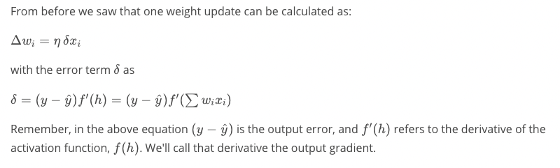

# Udacity Deep Learning Nanodegree: Introduction

These are my personal notes taken while following the [Udacity Deep Learning Nanodegree](https://www.udacity.com/course/deep-learning-nanodegree--nd101).

The nanodegree is composed of six modules:

1. Introduction to Deep Learning
2. Neural Networks
3. Convolutonal Neural Networks (CNN)
4. Recurrent Neural Networks (RNN)
5. Generative Adversarial Networks (GAN)
6. Deploying a Model

Each module has a folder with its respective notes. This folder is the one of the **second module**: Neural Networks.

Additionally, note that:
- I made many hand-written nortes, which I will scan and push to this repostory.
- I forked the Udacity repository for the exercisesl [deep-learning-v2-pytorch](https://github.com/mxagar/deep-learning-v2-pytorch); all the material and  notebooks are there.

## Overview of Contents

2. Neural Networks
	- Lesson 1: Introduction to Neural Networks
		- List of concepts
		- Notebook: `GradientsDescend.ipynb`	
		- Notebook: `StudentAdmissions.ipynb`
	- Lesson 2: Implementing Gradient Descend
	- Lesson 3: Training Neural Networks
	- Lesson 4: GPU Workspaces Demo
	- Lesson 5: Sentiment Analysis
	- Project: Predicting Bike Sharing Patterns


# 2. Neural Networks

## Lesson 1: Introduction to Neural Networks

The content is mostly recorded in the hand-written notes.
There is overlap with the CVND = Udacity Computer Vision Nanodegree (overlap in videos, notebooks, etc.).

List of concepts:

- Classification
- Perceptron
- Perceptron as Logical Operators
- Perceptron model optimization: Perceptron algorithm (mis-classified points added to the model parameters after scaling with learning rate)
- Error
- Discrete vs Continuous Outputs: We need to hava a continuous differentiable error
- Sigmoid Function: continuous output compressed to `(0,1)`
- Softmax Function: multi-class sigmoid
- One-hot encoding
- Maximum Likelyood: the best model has the highest maximum likelihood: products of the predicted data-point probabilities of the correct value; however, in practice the `log` is used to avoid products of small numbers!
- Cross Entropy: a way of interpreting the cross-entropy loss is the maximum likelihood product computed as sums of `logs`.
	- That way, the maximum likelihood is the probability of all the classes, and the cross-entropy is the error. The higher the probability, the lower the error!
	- Another way of interpreting the cross-entropy is the distance error from a discrete vector to our continuous probabilities: `CE([1,1,0],[0.8,0.7,0.1]) = 0.69`
- Error Function
- Gradient Descend
- Comparison: Perceptron Algorithm vs Gradient descend
- Nonlinear Models: Multi-layer Perceptrons = Neural Networks
- Feedforward
- Backpropagation

Interesting Jupyter Notebooks: [deep-learning-v2-pytorch](https://github.com/mxagar/deep-learning-v2-pytorch)

- `intro-neural-networks/GradientsDescend.ipynb`: Gradient descend implemented with `numpy` to a 2D pointcloud with two classes. The line defined by the weights is plotted along the time/training epochs. The code is below.
- `intro-neural-networks/StudentAdmissions.ipynb`: Gradient descent implemented with `numpy` to a linear model. The code is below.
	- Dataset: student admission data: 3D data (test result, GPA grades, class rank quantile), converted to one-hot 6D.
	- One-hot encoding is done in pandas using `get_dummies()`: Rank 0-4 -> rank_i 0/1 for i 1-4.
	- Variables are scaled.
	- Train/Test split done with `np.random.choice`

### Notebook: `GradientsDescend.ipynb`

```python
# Imports
import matplotlib.pyplot as plt
import numpy as np
import pandas as pd

# Some helper functions for plotting and drawing lines
def plot_points(X, y):
    admitted = X[np.argwhere(y==1)]
    rejected = X[np.argwhere(y==0)]
    plt.scatter([s[0][0] for s in rejected], [s[0][1] for s in rejected], s = 25, color = 'blue', edgecolor = 'k')
    plt.scatter([s[0][0] for s in admitted], [s[0][1] for s in admitted], s = 25, color = 'red', edgecolor = 'k')

def display(m, b, color='g--'):
    plt.xlim(-0.05,1.05)
    plt.ylim(-0.05,1.05)
    x = np.arange(-10, 10, 0.1)
    plt.plot(x, m*x+b, color)


# Load and visualize the data
data = pd.read_csv('data.csv', header=None)
X = np.array(data[[0,1]])
y = np.array(data[2])
plot_points(X,y)
plt.show()

# Activation (sigmoid) function
def sigmoid(x):
    return 1 / (1 + np.exp(-x))

# Output (prediction) formula
def output_formula(features, weights, bias):
    return sigmoid(np.dot(features, weights) + bias)

# Error (log-loss) formula
def error_formula(y, output):
    return - y*np.log(output) - (1 - y) * np.log(1-output)

# Gradient descent step
# x: 1 x n_features
# weights: 1 x n_features
# y: 1 x 1
def update_weights(x, y, weights, bias, learnrate):
    output = output_formula(x, weights, bias) # y_hat
    d_error = y - output
    weights += learnrate * d_error * x # watch out: dE/dw = - ...
    bias += learnrate * d_error
    return weights, bias

# Training Function
def train(features, targets, epochs, learnrate, graph_lines=False):
    errors = []
    n_records, n_features = features.shape
    last_loss = None
    weights = np.random.normal(scale=1 / n_features**.5, size=n_features)
    bias = 0
    for e in range(epochs):
        del_w = np.zeros(weights.shape)
        # Go through all samples, for each, update weights & bias with gradient descend
        for x, y in zip(features, targets):
            # That is not completely correct?
            # We should compute the complete batch gradient
            # and then update the weights?!
            weights, bias = update_weights(x, y, weights, bias, learnrate)
        # Printing out the log-loss error on the training set
        out = output_formula(features, weights, bias)
        #targets.shape
        #out.shape
        loss = np.mean(error_formula(targets, out))
        errors.append(loss)
        if e % (epochs / 10) == 0:
            print("\n========== Epoch", e,"==========")
            if last_loss and last_loss < loss:
                print("Train loss: ", loss, "  WARNING - Loss Increasing")
            else:
                print("Train loss: ", loss)
            last_loss = loss
            
            # Converting the output (float) to boolean as it is a binary classification
            # e.g. 0.95 --> True (= 1), 0.31 --> False (= 0)
            predictions = out > 0.5
            
            accuracy = np.mean(predictions == targets)
            print("Accuracy: ", accuracy)
        if graph_lines and e % (epochs / 100) == 0:
            display(-weights[0]/weights[1], -bias/weights[1])
    
    # Plotting the solution boundary
    plt.title("Solution boundary")
    display(-weights[0]/weights[1], -bias/weights[1], 'black')

    # Plotting the data
    plot_points(features, targets)
    plt.show()

    # Plotting the error
    plt.title("Error Plot")
    plt.xlabel('Number of epochs')
    plt.ylabel('Error')
    plt.plot(errors)
    plt.show()

# Apply all            
np.random.seed(44)
epochs = 100
learnrate = 0.01
train(X, y, epochs, learnrate, True)

```

### Notebook: `StudentAdmissions.ipynb`

Relevant pieces of code:

```python
# Dummy variables of rank: 1, 2, 3, 4 -> [1/0, 1/0, 1/0, 1/0]
one_hot_data = pd.concat([data, pd.get_dummies(data['rank'], prefix='rank')], axis=1)
one_hot_data = one_hot_data.drop('rank', axis=1)

# Manual Train/Test Split
sample = np.random.choice(processed_data.index,
						size=int(len(processed_data)*0.9),
						replace=False)
train_data, test_data = processed_data.iloc[sample], processed_data.drop(sample)
```

## Lesson 2: Implementing Gradient Descend

This lesson introduces very few new concepts; instead, the math behind the gradient descend is reviewed and implemented in code. Note that until now the cross-entropy loss has been used (classification). In this lesson, the *squared sums* are introduced, more suited for regression problems.

**Look at the handwritten nodes**. In them, backpropagation is derived. In the following, code examples are provided.

### Gradient Descend in Numpy

`w_k <- w_k + dw_k`  
`dw_k = learning_rate * error_term * x_k`



#### Example: One Perceptron, One Data-Point

```python
import numpy as np

def sigmoid(x):
    return 1/(1+np.exp(-x))

def sigmoid_prime(x):
    return sigmoid(x) * (1 - sigmoid(x))

learnrate = 0.5
x = np.array([1, 2, 3, 4])
y = np.array(0.5)

# Initial weights
w = np.array([0.5, -0.5, 0.3, 0.1])

# Calculate the node's linear combination of inputs and weights
h = np.dot(w,x)

# Calculate output of neural network
nn_output = sigmoid(h)

# Calculate error of neural network
error = (y-nn_output)

# Calculate the error term
error_term = (y-nn_output)*sigmoid_prime(h)

# Calculate change in weights
del_w = learnrate*error_term*x
```

#### Example: One Perceptron, Several Data Points

The dataset used is the one from `StudentAdmissions.ipynb`:

```
admit,gre,gpa,rank
0,380,3.61,3
1,660,3.67,3
...
```

The rank is encoded as a one-hot variable and the test result and the score are scaled.

```python
import numpy as np
import pandas as pd

admissions = pd.read_csv('binary.csv')

### -- Data Preparation

# Make dummy variables for rank
data = pd.concat([admissions, pd.get_dummies(admissions['rank'], prefix='rank')], axis=1)
data = data.drop('rank', axis=1)

# Standarize features
for field in ['gre', 'gpa']:
    mean, std = data[field].mean(), data[field].std()
    data.loc[:,field] = (data[field]-mean)/std
    
# Split off random 10% of the data for testing
np.random.seed(42)
sample = np.random.choice(data.index, size=int(len(data)*0.9), replace=False)
data, test_data = data.ix[sample], data.drop(sample)

# Split into features and targets
features, targets = data.drop('admit', axis=1), data['admit']
features_test, targets_test = test_data.drop('admit', axis=1), test_data['admit']

### -- Gradient Descend

def sigmoid(x):
    return 1 / (1 + np.exp(-x))

def sigmoid_prime(x):
    s = sigmoid(x)
    return s*(1-s)
    
# Use to same seed to make debugging easier
np.random.seed(42)

n_records, n_features = features.shape
last_loss = None

# Initialize weights
weights = np.random.normal(scale=1 / n_features**.5, size=n_features)

# Neural Network hyperparameters
epochs = 1000
learnrate = 0.5

for e in range(epochs):
    del_w = np.zeros(weights.shape)
    for x, y in zip(features.values, targets):
        # Loop through all records, x is the input, y is the target

        # Note: We haven't included the h variable from the previous
        #       lesson. You can add it if you want, or you can calculate
        #       the h together with the output

        # Calculate the output
        output = sigmoid(np.dot(weights, x))

        # Calculate the error
        error = y-output

        # Calculate the error term
        error_term = error*sigmoid_prime(x)

        # Calculate the change in weights for this sample
        # and add it to the total weight change
        del_w += (learnrate/n_records)*error_term*x

    # Update weights using the learning rate and the average change in weights
    weights += del_w

    # Printing out the mean square error on the training set
    if e % (epochs / 10) == 0:
        out = sigmoid(np.dot(features, weights))
        loss = np.mean((out - targets) ** 2)
        if last_loss and last_loss < loss:
            print("Train loss: ", loss, "  WARNING - Loss Increasing")
        else:
            print("Train loss: ", loss)
        last_loss = loss


# Calculate accuracy on test data
tes_out = sigmoid(np.dot(features_test, weights))
predictions = tes_out > 0.5
accuracy = np.mean(predictions == targets_test)
print("Prediction accuracy: {:.3f}".format(accuracy))

```

### Interesting Links

- [Why Momentum Really Works](https://distill.pub/2017/momentum/): Momentum is a possible solution to avoiding local minima.
- [Yes, you should understand backprop; by Andrej Karpathy](https://karpathy.medium.com/yes-you-should-understand-backprop-e2f06eab496b#.vt3ax2kg9)
- [Lecture on Backpropagation; by Andrej Karpathy](https://www.youtube.com/watch?v=59Hbtz7XgjM).
- My notes on backprop from the Andrew Ng course: [Neural Networks](https://github.com/mxagar/machine_learning_coursera)/`03_NeuralNetworks/ML_NeuralNetworks.md`


## Lesson 3: Training Neural Networks


## Lesson 4: GPU Workspaces Demo


## Lesson 5: Sentiment Analysis


## Project: Predicting Bike Sharing Patterns


