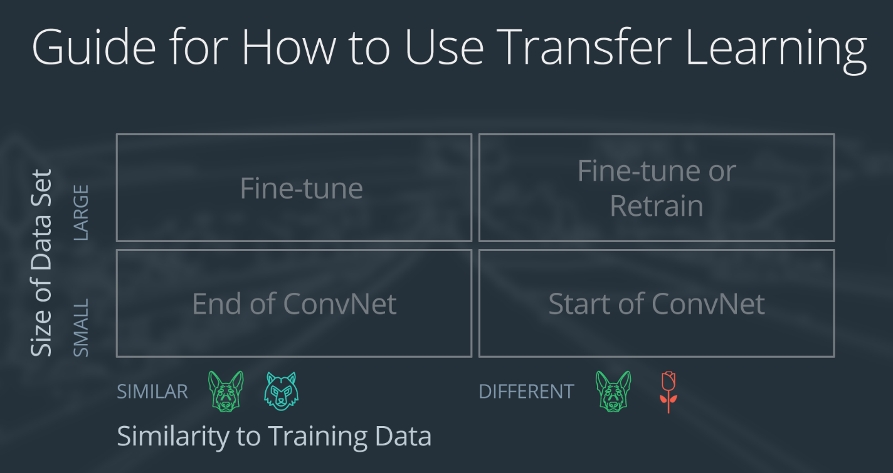
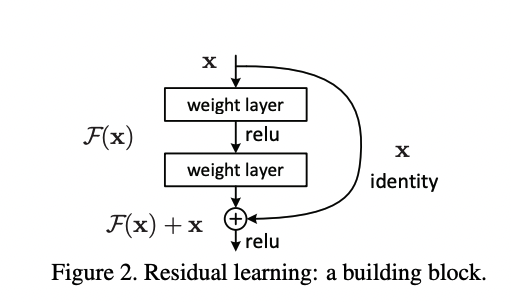
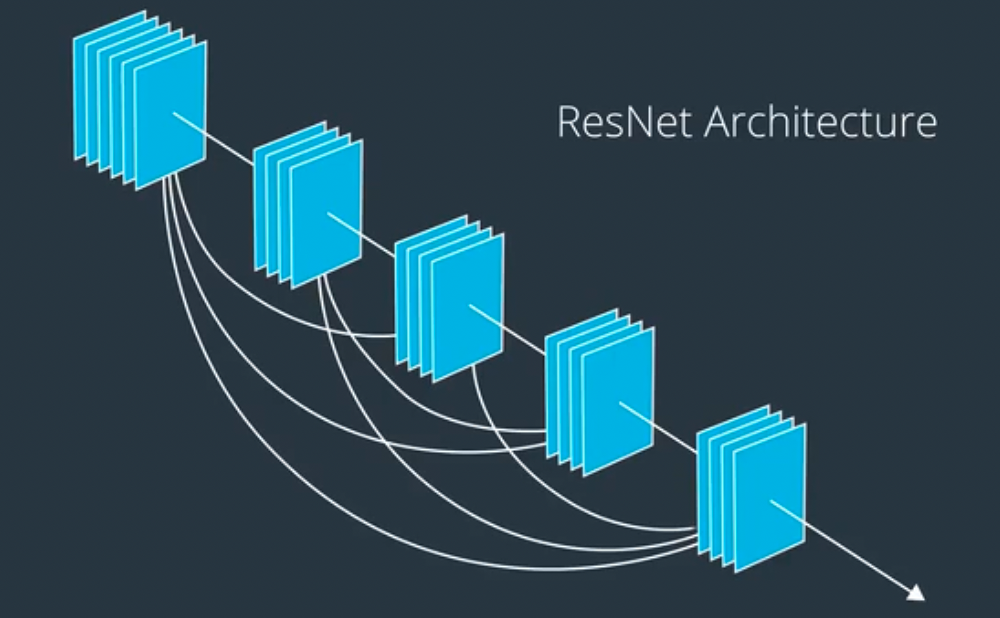
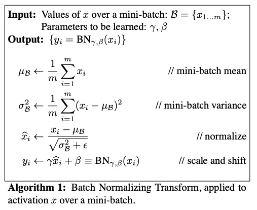
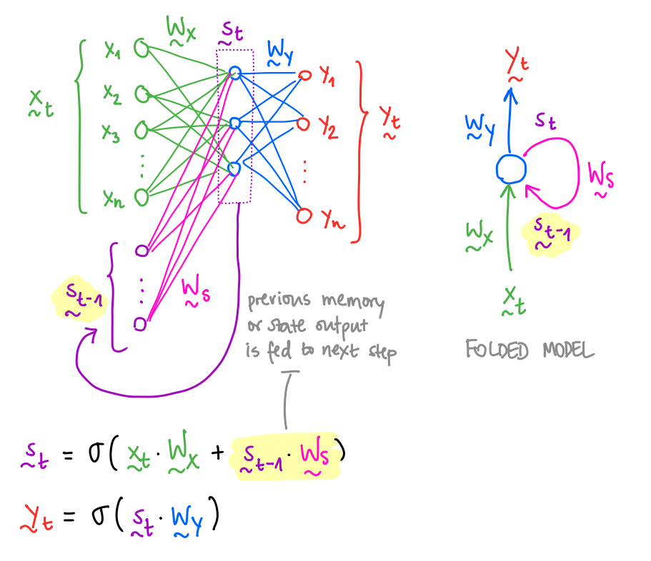
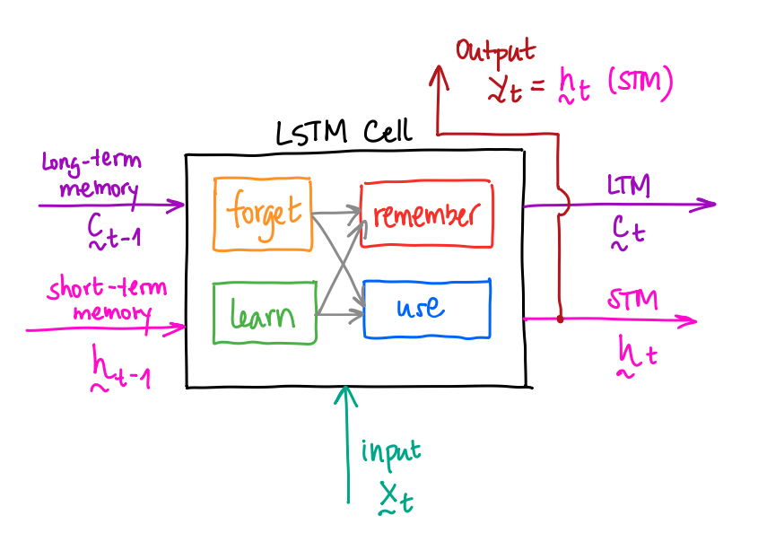
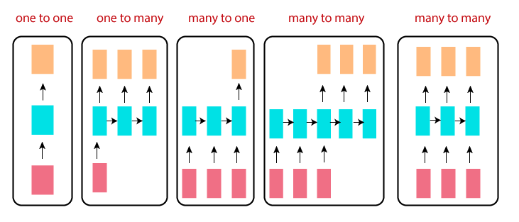

# Pytorch Guide

These are my personal notes taken while following the [Udacity Deep Learning Nanodegree](https://www.udacity.com/course/deep-learning-nanodegree--nd101).

The nanodegree is composed of six modules:

1. Introduction to Deep Learning
2. Neural Networks and Pytorch Guide
3. Convolutonal Neural Networks (CNN)
4. Recurrent Neural Networks (RNN)
5. Generative Adversarial Networks (GAN)
6. Deploying a Model with AWS SageMaker

Each module has a folder with its respective notes. This folder is the one of the **second module** and it contains a Pytorch guide.

Additionally, note that I made many hand-written notes, which I will scan and push to this repository.

Here, I reference notebooks that are present in two repositories (both updated, but the second more advanced):

- [DL_PyTorch](https://github.com/mxagar/DL_PyTorch), referenced in the CVND.
- [deep-learning-v2-pytorch](https://github.com/mxagar/deep-learning-v2-pytorch) `/intpo-to-pytorch/`, the one used in the DLND.

## Summary and More Applications

The following files in the current folder give a very nice overview/summary of how Pytorch is used for image classification:

- `fc_model.py`: complete pipeline of a fully connected notebook for image classification
- `helper.py`: visualization.
- `Part 7 - Loading Image Data.ipynb`: dealing with custom datasets.
- `Part 8 - Transfer Learning.ipynb`: transfer learning example with a CNN backbone for image classification.

However, many applications go beyond those use cases. To that end, I will collect in the folder `./lab` more blueprints/examples of different applications.

Please, go to the `./lab` folder are read the `README.md` there to get more information.

## Overview of Contents

- [Pytorch Guide](#pytorch-guide)
  - [Summary and More Applications](#summary-and-more-applications)
  - [Overview of Contents](#overview-of-contents)
  - [1. Introduction and Summary](#1-introduction-and-summary)
    - [Summary: `helper.py`, `fc_model.py`](#summary-helperpy-fc_modelpy)
      - [File: `helper.py`](#file-helperpy)
      - [File `fc_model.py`](#file-fc_modelpy)
  - [2. Tensors: `Part 1 - Tensors in Pytorch.ipynb`](#2-tensors-part-1---tensors-in-pytorchipynb)
  - [3. Neural Networks: `Part 2 - Neural Networks in PyTorch.ipynb`](#3-neural-networks-part-2---neural-networks-in-pytorchipynb)
  - [4. Training Neural Networks: `Part 3 - Training Neural Networks.ipynb`](#4-training-neural-networks-part-3---training-neural-networksipynb)
  - [5. Fashion-MNIST Example: `Part 4 - Fashion-MNIST.ipynb`](#5-fashion-mnist-example-part-4---fashion-mnistipynb)
  - [6. Inference and Validation: `Part 5 - Inference and Validation.ipynb`](#6-inference-and-validation-part-5---inference-and-validationipynb)
    - [6.1 Three Splits: Train, Validation, Test](#61-three-splits-train-validation-test)
  - [7. Saving and Loading Models: `Part 6 - Saving and Loading Models.ipynb`](#7-saving-and-loading-models-part-6---saving-and-loading-modelsipynb)
  - [8. Loading Image Data: `Part 7 - Loading Image Data.ipynb`](#8-loading-image-data-part-7---loading-image-dataipynb)
  - [9. Transfer Learning: `Part 8 - Transfer Learning.ipynb`](#9-transfer-learning-part-8---transfer-learningipynb)
    - [Notes on Fine Tuning](#notes-on-fine-tuning)
  - [10. Convolutional Neural Networks (CNNs)](#10-convolutional-neural-networks-cnns)
    - [`Conv2d`](#conv2d)
    - [`MaxPool2d`](#maxpool2d)
    - [Linear Layer and Flattening](#linear-layer-and-flattening)
    - [Example of a Simple Architecture](#example-of-a-simple-architecture)
    - [Summary of Guidelines for the Architecture Definition](#summary-of-guidelines-for-the-architecture-definition)
    - [Guidelines on Training and Hyperparameter Selection](#guidelines-on-training-and-hyperparameter-selection)
    - [Other Layers and Configurations: Strided Convolutions and Transpose Convolutions](#other-layers-and-configurations-strided-convolutions-and-transpose-convolutions)
    - [ReNets](#renets)
  - [11. Weight Initialization](#11-weight-initialization)
  - [12. Batch Normalization](#12-batch-normalization)
      - [Implementation](#implementation)
      - [Benefits of Batch Normalization](#benefits-of-batch-normalization)
      - [Notebook: Batch Normalization](#notebook-batch-normalization)
  - [13. Using the Jetson Nano (CUDA)](#13-using-the-jetson-nano-cuda)
      - [Summary of Installation Steps](#summary-of-installation-steps)
      - [How to Connect to Jetson via SSH](#how-to-connect-to-jetson-via-ssh)
      - [Connect to a Jupyter Notebook Run on the Jetson from Desktop](#connect-to-a-jupyter-notebook-run-on-the-jetson-from-desktop)
      - [SFTP Access](#sftp-access)
      - [SCP Access](#scp-access)
  - [14. Recursive Neural Networks (RNN)](#14-recursive-neural-networks-rnn)
    - [Introduction: Simple RNNs and LSTMs](#introduction-simple-rnns-and-lstms)
    - [Defining an LSTM cell in Pytorch](#defining-an-lstm-cell-in-pytorch)
    - [Important Notes on LSTMs and RNNs](#important-notes-on-lstms-and-rnns)
    - [Examples](#examples)
      - [Code / Notebooks](#code--notebooks)
  - [15. Recommendations for Hyperparameter Tuning](#15-recommendations-for-hyperparameter-tuning)
  - [16. Vanilla Inference Pipeline and Artifact](#16-vanilla-inference-pipeline-and-artifact)
  - [17. Cloud Computing with AWS](#17-cloud-computing-with-aws)
    - [17.1 Launch EC2 Instances](#171-launch-ec2-instances)
    - [17.2 Connect to an Instance](#172-connect-to-an-instance)
    - [17.3 Pricing](#173-pricing)
  - [18. Beyond Classification: Object Detection and Semantic Segmentation](#18-beyond-classification-object-detection-and-semantic-segmentation)
  - [19. Siamese Networks and Contrastive Learning](#19-siamese-networks-and-contrastive-learning)
  - [20. Pytorch Hooks](#20-pytorch-hooks)
  - [21. Pytorch Lightning](#21-pytorch-lightning)
  - [22. Pytorch with Tensorboard](#22-pytorch-with-tensorboard)
  - [Appendix: Tips and Tricks](#appendix-tips-and-tricks)
    - [Number of Model Parameters](#number-of-model-parameters)
    - [Torch Summary](#torch-summary)
    - [Running Average Loss](#running-average-loss)
    - [Export Conda and Pip Environments](#export-conda-and-pip-environments)
    - [Apply Good Code and Reproducibility Guidelines](#apply-good-code-and-reproducibility-guidelines)
    - [Imbalaced Datasets](#imbalaced-datasets)
    - [Use `Sequential` to Be Cleaner](#use-sequential-to-be-cleaner)
    - [Automatically Reload Modules](#automatically-reload-modules)
    - [Improving the Training: Learning Rate Scheduler and Optimization Algorithms](#improving-the-training-learning-rate-scheduler-and-optimization-algorithms)
    - [Print Memory Usage During Training](#print-memory-usage-during-training)
    - [Show / Plot Mini-Batch Image Grid](#show--plot-mini-batch-image-grid)
    - [Setting Up the NVIDIA GeForce RTX 3060 with the eGPU Razor Core X](#setting-up-the-nvidia-geforce-rtx-3060-with-the-egpu-razor-core-x)
    - [Windows: Run Pytorch with CUDA](#windows-run-pytorch-with-cuda)
    - [Single Image Inference](#single-image-inference)
  - [Appendix: Lab - Example Projects](#appendix-lab---example-projects)
  - [Appendix: Important Links](#appendix-important-links)


## 1. Introduction and Summary

- Primarily developed by Facebook AI Research (FAIR).  
- Released in 2017.  
- Open Source, BSD.  
- Very intuitive: similar to Numpy and DL concepts integrate din a more natural way; more intuitive than TensorFlow or Keras.  
- Caffe2 was integrated to PyTorch in 2018.  
- Main interface: Python - it's very Pythonic; C++ interface is available too.  
- Main class: Tensors = multidimensional arrays, similar to Numpy's, but they can be operated on CUDA GPUs.  
- Automatic differentiation used (autograd?): derivative used in backpropagation computed in feedforward pass.  

Very interesting Tutorial: [DEEP LEARNING WITH PYTORCH: A 60 MINUTE BLITZ](https://pytorch.org/tutorials/beginner/deep_learning_60min_blitz.html)

Installation:

```bash
conda install pytorch torchvision -c pytorch
```

The rest of the sections show how to perform image classification with Pytorch; the typical steps are covered: dataset loading, network architecture definition, training and inference. 

### Summary: `helper.py`, `fc_model.py`

There are two additional files in the repository folder which summarize the complete knowledge of the Udacity lesson on how to use Pytorch for deep learning:

- `fc_model.py`: the definition of a fully connected `Network` class, with a `train()` and `validation()` function. This is the definitive example we should use as blueprint; the content of the file is build step by step in the notebooks `Part 1 - Part 5`. In adition, I copied the functions `save_model()` and `load_checkpoint()` to the module.
- `helper.py`: a helper module mainly with visualization functionalities.

**Those two files and the last two notebooks are a very good summary of how to use Pytorch**:

- `Part 7 - Loading Image Data.ipynb`
- `Part 8 - Transfer Learning.ipynb`

However, they focus only on fully connected / linear networks; CNNs, RNNs, GANs & Co. are covered in dedicated modules and with example projects in Section 10: "Lab: Example Projects".

#### File: `helper.py`

```python
import matplotlib.pyplot as plt
import numpy as np
from torch import nn, optim
from torch.autograd import Variable


def test_network(net, trainloader):

    criterion = nn.MSELoss()
    optimizer = optim.Adam(net.parameters(), lr=0.001)

    dataiter = iter(trainloader)
    images, labels = dataiter.next() # use better next(dataiter)

    # Create Variables for the inputs and targets
    inputs = Variable(images)
    targets = Variable(images)

    # Clear the gradients from all Variables
    optimizer.zero_grad()

    # Forward pass, then backward pass, then update weights
    output = net.forward(inputs)
    loss = criterion(output, targets)
    loss.backward()
    optimizer.step()

    return True


def imshow(image, ax=None, title=None, normalize=True):
    """Imshow for Tensor."""
    if ax is None:
        fig, ax = plt.subplots()
    image = image.numpy().transpose((1, 2, 0))

    if normalize:
        mean = np.array([0.485, 0.456, 0.406])
        std = np.array([0.229, 0.224, 0.225])
        image = std * image + mean
        image = np.clip(image, 0, 1)

    ax.imshow(image)
    ax.spines['top'].set_visible(False)
    ax.spines['right'].set_visible(False)
    ax.spines['left'].set_visible(False)
    ax.spines['bottom'].set_visible(False)
    ax.tick_params(axis='both', length=0)
    ax.set_xticklabels('')
    ax.set_yticklabels('')

    return ax


def view_recon(img, recon):
    ''' Function for displaying an image (as a PyTorch Tensor) and its
        reconstruction also a PyTorch Tensor
    '''

    fig, axes = plt.subplots(ncols=2, sharex=True, sharey=True)
    axes[0].imshow(img.numpy().squeeze())
    axes[1].imshow(recon.data.numpy().squeeze())
    for ax in axes:
        ax.axis('off')
        ax.set_adjustable('box-forced')

def view_classify(img, ps, version="MNIST"):
    ''' Function for viewing an image and it's predicted classes.
    '''
    ps = ps.data.numpy().squeeze()

    fig, (ax1, ax2) = plt.subplots(figsize=(6,9), ncols=2)
    ax1.imshow(img.resize_(1, 28, 28).numpy().squeeze())
    ax1.axis('off')
    ax2.barh(np.arange(10), ps)
    ax2.set_aspect(0.1)
    ax2.set_yticks(np.arange(10))
    if version == "MNIST":
        ax2.set_yticklabels(np.arange(10))
    elif version == "Fashion":
        ax2.set_yticklabels(['T-shirt/top',
                            'Trouser',
                            'Pullover',
                            'Dress',
                            'Coat',
                            'Sandal',
                            'Shirt',
                            'Sneaker',
                            'Bag',
                            'Ankle Boot'], size='small');
    ax2.set_title('Class Probability')
    ax2.set_xlim(0, 1.1)

    plt.tight_layout()


```

#### File `fc_model.py`

```python
'''Example of use:

# IMPORTS
import matplotlib.pyplot as plt
import torch
from torch import nn
from torch import optim
import torch.nn.functional as F
from torchvision import datasets, transforms
import helper # visualization utils
import fc_model # model definition, traning, saving, loading

# LOAD DATASET: example, Fashion-MNIST (28x28 pixels, 1 channel, 10 classes)
transform = transforms.Compose([transforms.ToTensor(),
                                transforms.Normalize((0.5,), (0.5,))])
trainset = datasets.FashionMNIST('F_MNIST_data/', download=True, train=True, transform=transform)
trainloader = torch.utils.data.DataLoader(trainset, batch_size=64, shuffle=True)
testset = datasets.FashionMNIST('F_MNIST_data/', download=True, train=False, transform=transform)
testloader = torch.utils.data.DataLoader(testset, batch_size=64, shuffle=True)

# CHECK DATSET
image, label = next(iter(trainloader))
print(trainset.classes)
helper.imshow(image[0,:]);

# CREATE NETWORK
input_size = 1*28*28
output_size = 10
hidden_sizes = [512, 256, 128]
model = fc_model.Network(input_size, output_size, hidden_sizes)
criterion = nn.NLLLoss()
optimizer = optim.Adam(model.parameters(), lr=0.001)

# TRAIN (with cross-validation, but without early stopping)
fc_model.train(model, trainloader, testloader, criterion, optimizer, epochs=2)

# SAVE
filename = 'my_model_checkpoint.pth'
fc_model.save_model(filname, model, input_size, output_size, hidden_sizes)

# LOAD
model = fc_model.load_checkpoint('checkpoint.pth')
print(model)

# INFER & VISUALIZE
model.eval()
images, labels = next(iter(testloader))
img = images[0]
img = img.view(1, 28*28)
with torch.no_grad():
    output = model.forward(img)
ps = torch.exp(output)
helper.view_classify(img.view(1, 28, 28), ps, version='Fashion')

'''


import torch
from torch import nn
import torch.nn.functional as F


class Network(nn.Module):
    def __init__(self, input_size, output_size, hidden_layers, drop_p=0.5):
        ''' Builds a feedforward network with arbitrary hidden layers.
        
            Arguments
            ---------
            input_size: integer, size of the input layer
            output_size: integer, size of the output layer
            hidden_layers: list of integers, the sizes of the hidden layers
        
        '''
        super().__init__()
        # Input to a hidden layer
        self.hidden_layers = nn.ModuleList([nn.Linear(input_size, hidden_layers[0])])
        
        # Add a variable number of more hidden layers
        layer_sizes = zip(hidden_layers[:-1], hidden_layers[1:])
        self.hidden_layers.extend([nn.Linear(h1, h2) for h1, h2 in layer_sizes])
        
        self.output = nn.Linear(hidden_layers[-1], output_size)
        
        self.dropout = nn.Dropout(p=drop_p)
        
    def forward(self, x):
        ''' Forward pass through the network, returns the output logits '''
        
        for each in self.hidden_layers:
            x = F.relu(each(x))
            x = self.dropout(x)
        x = self.output(x)
        
        return F.log_softmax(x, dim=1)


def validation(model, testloader, criterion):
    accuracy = 0
    test_loss = 0
    for images, labels in testloader:

        images = images.resize_(images.size()[0], 784)

        output = model.forward(images)
        test_loss += criterion(output, labels).item()

        ## Calculating the accuracy 
        # Model's output is log-softmax, take exponential to get the probabilities
        ps = torch.exp(output)
        # Class with highest probability is our predicted class, compare with true label
        equality = (labels.data == ps.max(1)[1])
        # Accuracy is number of correct predictions divided by all predictions, just take the mean
        accuracy += equality.type_as(torch.FloatTensor()).mean()

    return test_loss, accuracy


def train(model, trainloader, testloader, criterion, optimizer, epochs=5, print_every=40):

    # Check if CUDA GPU available
    #device = torch.device("cuda:0" if torch.cuda.is_available() else "cpu")
    #model.to(device, dtype=torch.float)
    
    steps = 0
    running_loss = 0
    for e in range(epochs):
        # Model in training mode, dropout is on
        model.train()
        for images, labels in trainloader:
            steps += 1
            
            # Transfer to CUDA device if available
            #images, labels = images.to(device, dtype=torch.float), labels.to(device, dtype=torch.float)

            # Flatten images into a channelsxrowsxcols long vector (784 in MNIST 28x28 case)
            pixels = images.size()[1]*images.size()[2]*images.size()[3]
            images.resize_(images.size()[0], pixels)
            
            optimizer.zero_grad()
            
            output = model.forward(images)
            loss = criterion(output, labels)
            loss.backward()
            optimizer.step()
            
            running_loss += loss.item()

            if steps % print_every == 0:
                # Model in inference mode, dropout is off
                model.eval()
                
                # Turn off gradients for validation, will speed up inference
                with torch.no_grad():
                    test_loss, accuracy = validation(model, testloader, criterion)
                
                print("Epoch: {}/{}.. ".format(e+1, epochs),
                      "Training Loss: {:.3f}.. ".format(running_loss/print_every),
                      "Test Loss: {:.3f}.. ".format(test_loss/len(testloader)),
                      "Test Accuracy: {:.3f}".format(accuracy/len(testloader)))
                
                running_loss = 0
                
                # Make sure dropout and grads are on for training
                model.train()

                
def save_model(filepath, model, input_size, output_size, hidden_sizes):
    # Convert model into a dict: architecture params (layer sizes) + state (weight & bias values)
    checkpoint = {'input_size': input_size,
                  'output_size': output_size,
                  'hidden_layers': hidden_sizes,
                  'state_dict': model.state_dict()}
    torch.save(checkpoint, filepath)

    
def load_checkpoint(filepath):
    checkpoint = torch.load(filepath)
    # If we saved the model in a CUDA device, we need to map it to CPU
    # checkpoint = torch.load(filepath, map_location=torch.device('cpu')), or
    # checkpoint = torch.load(filepath, map_location='cpu')
    # Create a model with given architecture params (layer sizes) + model state (weight & bias values)
    model = Network(checkpoint['input_size'],
                    checkpoint['output_size'],
                    checkpoint['hidden_layers'])
    model.load_state_dict(checkpoint['state_dict'])
    return model
```

## 2. Tensors: `Part 1 - Tensors in Pytorch.ipynb`

Tensors are a generalization of arrays or matrices; 1D: column vector, 2D row-col matrix, etc.

```python
%matplotlib inline
import numpy as np
import torch

torch.manual_seed(7)

# Create some tensors
# Torch can take tuples for shapes, numpy doesn't
x = torch.randn((5, 1)) # 5 rows, 1 cols
b = torch.ones((1,1))
w1 = torch.randn_like(x) # rand with same shape as x
w2 = torch.randn(x.size()) # rand with same shape as x

# Check size/shape
# Resizing and checking the current size
# is very common/necesssary
x.shape
x.size()
# To resize:
# .view() (just a view), .reshape(), .resize_()

# Expected operations are possible, as in numpy
z = torch.sum(w1*x) + b
a = 1/(1+torch.exp(-z)) # sigmoid activation

# Dot and matrix multiplications: matmul
# But size must conincide: change with either
# `view` (just a view), reshape, resize_
# prefer .view() if the new shape is only for the current operation
z = torch.matmul(w1.view(1,5),x) + b
# If the matrices are batched, multiplication is done for each batch
# >>> tensor1 = torch.randn(10, 3, 4)
# >>> tensor2 = torch.randn(10, 4, 5)
# >>> torch.matmul(tensor1, tensor2).size()
# torch.Size([10, 3, 5])

# Transpose: x.t(), or:
# >>> x = torch.randn(2, 3)
# >>> x
# tensor([[ 1.0028, -0.9893,  0.5809],
#         [-0.1669,  0.7299,  0.4942]])
# >>> torch.transpose(x, 0, 1) # dimension 0 and 1 swapped
# tensor([[ 1.0028, -0.1669],
#         [-0.9893,  0.7299],
#         [ 0.5809,  0.4942]])

# More operations
x = torch.rand((3, 2))
y = torch.ones(x.size())
z = x + y
# First row
z[0]
# Slicing works as usual
z[:, 1:]
# Methods return new object
z_new = z.add(1) # z + 1, elementwise
# Except when followed by _ == inplace
z.add_(1) # z+1 elementwise, inplace
z.mul_(2) # z*2 elementwise, inplace

# Transform torch <-> numpy
np.set_printoptions(precision=8)
torch.set_printoptions(precision=8)
a = np.random.rand(4,3) # Note: no tuple passed...
b = torch.from_numpy(a)
# BUT: memory is shared between numpy a and pytorch b: 
# changing one affects the other!
```

Example of a simple forward pass in a MLP:

```python
import numpy as np
import torch

torch.manual_seed(7)

# Features are 3 random normal variables
features = torch.randn((1, 3))

# Define the size of each layer in our network
n_input = features.shape[1]     # Number of input units, must match number of input features
n_hidden = 2                    # Number of hidden units 
n_output = 1                    # Number of output units

# Weights for inputs to hidden layer
# Note: here (and in all Udacity ND) the weight matrices are defined
# as the transpose of the Andrew Ng's: W = (input,output)
# Andrew Ng defines them as W = (output,input)
# Probably the Udacity approach is more intuitive
W1 = torch.randn(n_input, n_hidden)
# Weights for hidden layer to output layer
W2 = torch.randn(n_hidden, n_output)

# Bias terms for hidden and output layers
# Note: Andrew Ng extends the weight matrices to contain the bias
# In Udacity, the bias is simply summed after the matrix multiplication
# and it has always the size (batch_size,output)
# Probably the Udacity approach is more intuitive
B1 = torch.randn((1, n_hidden))
B2 = torch.randn((1, n_output))

# Forward pass
z_1 = torch.matmul(features,W1) # (1,3)x(3,2) = (1,2)
z_1 += B1
a_1 = activation(z_1)
z_2 = torch.matmul(a_1,W2) # (1,2)x(2,1) = (1,1)
z_2 += B2
a_2 = activation(z_2) # output: h
```

## 3. Neural Networks: `Part 2 - Neural Networks in PyTorch.ipynb`

Very important notebook.  
A fully connected neural network is built and trained with the MNIST dataset.

The following steps are followed:

1. Download the MNIST Dataset
2. Inspect the images
3. Manual definition of a forward pass
4. Neural Network definition with `torch.nn.Module` in a class
5. Access and modify weights and biases of a network
6. Forward pass
7. Neural Network definition with `torch.nn.Sequential`


```python

import numpy as np
import torch
import helper
import matplotlib.pyplot as plt

### -- 1. Download the MNIST Dataset

# Issue: https://github.com/pytorch/vision/issues/1938
from six.moves import urllib
opener = urllib.request.build_opener()
opener.addheaders = [('User-agent', 'Mozilla/5.0')]
urllib.request.install_opener(opener)

from torchvision import datasets, transforms

# Define a transform to normalize the data
# First: convert images to tensors
# Second: normalize them to contain vaues [-1,1]; original data contains [0,1]
transform = transforms.Compose([transforms.ToTensor(),
                              transforms.Normalize((0.5,), (0.5,)),
                              ])

# Download and load the training data
# batch_size=64 -> trainloader will give us 64 images at a time!
# train=True -> it's going to be used for training!
trainset = datasets.MNIST('~/.pytorch/MNIST_data/', download=True, train=True, transform=transform)
trainloader = torch.utils.data.DataLoader(trainset, batch_size=64, shuffle=True)

### -- 2. Inspect the images

dataiter = iter(trainloader) # create an interator that yields next batch of images+labels
images, labels = dataiter.next() # use better next(dataiter)
print(type(images)) # <class 'torch.Tensor'> 
print(images.shape) # torch.Size([64, 1, 28, 28]): batch_size, channels, rows, columns
print(labels.shape) # torch.Size([64])

# Display image with index 1 from batch
# For that, transform it to Numpy and squeeze it (remove single-dimensional entries)
plt.imshow(images[1].numpy().squeeze(), cmap='Greys_r')

### -- 3. Manual definition of a forward pass

# Sigmoid: Map to [0,1]
def sigmoid(x):
    return 1.0 / (1.0 + torch.exp(-x))

# Softmax: Multi-class probabilities (multi-class sigmoid)
def softmax(x):
    e = torch.exp(x) # (64,10)
    # Tensor divisions: columns are divided element-wise!
    # Thus: we need to sum across columns (dim=1) and reshape to column size
    return e / torch.sum(e,dim=1).view(x.shape[0],-1) # (64,10) / (64,1) = (64,10)
    # Also:
    # return torch.exp(x)/torch.sum(torch.exp(x), dim=1).view(-1, 1)

# Flatten images: (64,1,28,28) -> (64,28*28)
# Watch out: resize_ is inplace, but can work
# images.resize_(images.shape[0], images.shape[2]*images.shape[2])
# Anothe option
inputs = images.view(images.shape[0],-1) # -1: infer the rest: 1*28*28 = 784

n_input = 28*28
n_hidden = 256
n_output = 10

W1 = torch.randn((n_input,n_hidden)) # 784x256
W2 = torch.randn((n_hidden,n_output)) # 256x10
B1 = torch.randn((64,n_hidden)) # 64x256
B2 = torch.randn((64,n_output)) # 64x10

z_1 = torch.matmul(inputs,W1) # (64,784) x (784x256) = (64,256)
z_1 += B1
a_1 = sigmoid(z_1)
z_2 = torch.matmul(a_1,W2) # (64,256) x (256,10) = (64,10)
z_2 += B2
a_2 = softmax(z_2)

probabilities = a_2 # (64,10)

### -- 4. Neural Network definition with `torch.nn.Module` in a class

# Here a neural network is defined in a class
# The architecture is:
# fully connected layers with dimensions 28*28 -> 128 -> 64 -> 10

# First layer has as inputs rows x columns of input images: 28x28 = 784
# Last layer must have as outputs number of predicted classes: 10 (0-9)
# Hidden layers defined arbitrarily, but they must match first and last
# Usually, the higher the number of layers and nodes in them, the better
# BUT: most of the times, DL consists in finding the best number of layers, nodes, etc.
# Note: layers have in_features and out_features; instead of unit/neuron layers,
# they are the representation of the weight matrix that connects two layers;
# as such the units are represented by the outputs.
# Activation functions: use ReLU, bacause it's the fastest,
# except in output: softmax / log_softmax (because we want probability of classes)
# Loss function: cross-entropy, if multi-class classification;
# however, better to use log_softmax as last activation and NLLLoss as loss
# (equivalent to cross-entropy)

# Inherit network class from nn.Module
# NOTE: I imporved the accuracy from 72%->93% with two changes:
# - add nn.Dropout(0.2) after fc2
# - increase hidden nodes: 784->512->256->10
class Network(nn.Module):
    def __init__(self):
        # Call init of upper class: nn.Module
        super().__init__()
        
        # First hidden layer: linear transformation = fully connected
        # 784 -> 128
        # Linear: W(input,output), B(1,output) -> x*W + B
        # W: model.fc1.weight
        # B: model.fc1.bias        
        self.fc1 = nn.Linear(784, 128)
        
        # Second hidden layer
        # 128 -> 64
        self.fc2 = nn.Linear(128, 64)

        # Output layer: units = number of classes
        # 64 -> 10
        self.fc3 = nn.Linear(64, 10)
        
        # We can define activation functions as class objects 
        # but usually, they are used as F functions
        # self.sigmoid = nn.Sigmoid()
        # self.softmax = nn.Softmax(dim=1) # dim=1: sum across columns for softmax
        
    def forward(self, x):
        # Pass the input tensor through each of our operations
        x = self.fc1(x)
        x = F.relu(x)
        x = self.fc2(x)
        x = F.relu(x)
        x = self.fc3(x)
        # Final tensor should have a size batch_size x units: 64 x 10
        # dim=1: sum across columns for softmax
        x = F.softmax(x, dim=1) # alternative: x = self.softmax(x)
                
        return x

# Instantiate network and get architecture summary
model = Network()
model
# Network(
#   (fc1): Linear(in_features=784, out_features=128, bias=True)
#   (fc2): Linear(in_features=128, out_features=64, bias=True)
#   (fc3): Linear(in_features=64, out_features=10, bias=True)
# )

### -- 5. Access and modify weights and biases of a network

print(model.fc1.weight)
print(model.fc1.bias)
# Set biases to all zeros
model.fc1.bias.data.fill_(0)
# Sample from random normal with standard dev = 0.01
model.fc1.weight.data.normal_(std=0.01)

### -- 6. Forward pass

# Grab data 
dataiter = iter(trainloader)
images, labels = dataiter.next() # use better next(dataiter)

# Resize images into a 1D vector, new shape is:
# (batch size, color channels, image pixels) 
images.resize_(64, 1, 784)
# or images.resize_(images.shape[0], 1, 784)
# to automatically get batch size

# Forward pass through the network
img_idx = 0
ps = model.forward(images[img_idx,:])

img = images[img_idx]
helper.view_classify(img.view(1, 28, 28), ps)

### -- 7. Neural Network definition with `torch.nn.Sequential`

# With `torch.nn.Sequential`, we don't need to define a class
# we simple need to define the forward pass in a sequence

# Hyperparameters for our network
input_size = 784
hidden_sizes = [128, 64]
output_size = 10

# Build a feed-forward network
from collections import OrderedDict
model = nn.Sequential(OrderedDict([
                      ('fc1', nn.Linear(input_size, hidden_sizes[0])),
                      ('relu1', nn.ReLU()),
                      ('fc2', nn.Linear(hidden_sizes[0], hidden_sizes[1])),
                      ('relu2', nn.ReLU()),
                      ('output', nn.Linear(hidden_sizes[1], output_size)),
                      ('softmax', nn.Softmax(dim=1))]))
print(model) # print model summary
print(model.fc1) # print layer named as 'fc1'

# Forward pass through the network and display output
images, labels = next(iter(trainloader))
images.resize_(images.shape[0], 1, 784)
ps = model.forward(images[0,:])
helper.view_classify(images[0].view(1, 28, 28), ps)

```

## 4. Training Neural Networks: `Part 3 - Training Neural Networks.ipynb`

Pytorch has the **autograd** module with which the operations on the tensors are tracked so that the gradient of a tensor `x` can be computed with `x.backward()`.

Thanks to that, we can simply compute the `loss` function after a `forward()` pass and compute its gradient with `loss.backward()`.


```python
# Set the gradient computation of `x` explicitly to false
# at creation
x = torch.zeros(1, requires_grad=False)
# Set the gradient computation of `x` to True
x.requires_grad_(True)
# De-activate gradient in context
with torch.no_grad():
	y = x * 2
# De/Activate gradient computation globally
torch.set_grad_enabled(True)
# Compute and get gradient
z = x ** 2
z.backward()
x.grad # note we get the gradient of x!
```

Then, this gradient can be passed to an optimization function (e.g., gradient descend).

This concepts are applied to implement the training of the network.

Additionally, some improvements are suggested in the last activation and the loss function.

Steps in the notebook:

1. Load data
2. Define network
3. Training
4. Inference

```python
### -- 1. Load data

# Issue: https://github.com/pytorch/vision/issues/1938
from six.moves import urllib
opener = urllib.request.build_opener()
opener.addheaders = [('User-agent', 'Mozilla/5.0')]
urllib.request.install_opener(opener)

import torch
from torch import nn
import torch.nn.functional as F
from torch import optim
from torchvision import datasets, transforms

# Define a transform to normalize the data
transform = transforms.Compose([transforms.ToTensor(),
                                transforms.Normalize((0.5,), (0.5,)),
                              ])
# Download and load the training data
trainset = datasets.MNIST('~/.pytorch/MNIST_data/', download=True, train=True, transform=transform)
trainloader = torch.utils.data.DataLoader(trainset, batch_size=64, shuffle=True)

### -- 2. Define network

# If we wan to use the cross-entropy loss (nn.CrossEntropyLoss),
# the outputs must be the raw outputs (because of how it is defined inside),
# i.e., without activation! These are also called scores.
# Applying nn.CrossEntropyLoss that way is equivalent to using nn.LogSoftmax:
# LogSoftmax = log(softmax())
# It is better to work with LogSoftmax than with probabilities (very small)
# However, note that an output activated with LogSoftmax
# requires the negative log likelihood loss: nn.NLLLoss
# CONCLUSION:
# - use nn.LogSoftmax as last activation: we get logits = model(inputs)
# - use nn.NLLLoss as loss
# - to get probabilities of classes: predictions = torch.exp(logits)

Build a feed-forward network
model = nn.Sequential(nn.Linear(784, 128),
                      nn.ReLU(),
                      nn.Linear(128, 64),
                      nn.ReLU(),
                      nn.Linear(64, 10),
                      nn.LogSoftmax(dim=1)) # the index where the classes are: 1


# Define the loss
criterion = nn.NLLLoss()

### -- 3. Training

# Optimizers require the parameters to optimize and a learning rate
# SGD: Stochastic gradient descend
optimizer = optim.SGD(model.parameters(), lr=0.01)

# Training
epochs = 5
for e in range(epochs):
    running_loss = 0
    for images, labels in trainloader:
        
        # Flatten MNIST images into a 784 long vector
        images = images.view(images.shape[0], -1)
    
        # Gradients are accumulated pass after pass
        # Reset them always before a pass!
        optimizer.zero_grad()
        
        # Forward pass
        output = model(images)
        
        # Compute loss
        loss = criterion(output, labels)
        
        # Compute gradients
        # Even though we apply it to loss,
        # the gradients of the weights are computed,
        # because they are used to compute the output and the loss
        loss.backward()
        
        # Optimization: update weights
        optimizer.step()
        
        # Accumulated loss for printing after each epoch
        running_loss += loss.item()
    
    # Print the loss after each epoch
    print(f"Epoch {e+1} / {epochs}: Training loss: {running_loss/len(trainloader)}")

# Epoch 1 / 5: Training loss: 1.9347652730657094
# Epoch 2 / 5: Training loss: 0.8835022319862837
# Epoch 3 / 5: Training loss: 0.5357787555405326
# Epoch 4 / 5: Training loss: 0.42882247761622677
# Epoch 5 / 5: Training loss: 0.3812579528641091

### -- 4. Inference

%matplotlib inline
import helper

# Create iterator
dataiter = iter(trainloader)
# Get a batch
images, labels = next(dataiter)

# Set in eval mode! (turn off dropout, etc.)
model.eval()

# Flatten first image of the batch
img = images[0].view(1, 784)
# Turn off gradients to speed up this part
with torch.no_grad():
    logps = model(img)

# Output of the network are log-probabilities (LogSoftmax),
# need to take exponential for probabilities
ps = torch.exp(logps)
# Visualize with helper module
helper.view_classify(img.view(1, 28, 28), ps)

```

## 5. Fashion-MNIST Example: `Part 4 - Fashion-MNIST.ipynb`

In this notebook, the implementation of the previous one is applied to the [Fashion-MNIST](https://github.com/zalandoresearch/fashion-mnist) dataset from Zalando. This dataset is more realistic than then MNIST.

Almost no new things are introduced here, but it is a nice example; yet to be completed with validation.

The following steps are covered (the same as in notebook 3)

1. Load data
2. Define network
3. Training
4. Inference

```python

### -- 1. Load data

import torch
from torch import nn
import torch.nn.functional as F
from torchvision import datasets, transforms
import helper

# Define a transform to normalize the data
transform = transforms.Compose([transforms.ToTensor(),
                                transforms.Normalize((0.5,), (0.5,))])
# Download and load the training data
trainset = datasets.FashionMNIST('~/.pytorch/F_MNIST_data/', download=True, train=True, transform=transform)
trainloader = torch.utils.data.DataLoader(trainset, batch_size=64, shuffle=True)

# Download and load the test data
testset = datasets.FashionMNIST('~/.pytorch/F_MNIST_data/', download=True, train=False, transform=transform)
testloader = torch.utils.data.DataLoader(testset, batch_size=64, shuffle=True)

# Visualize one image
image, label = next(iter(trainloader))
helper.imshow(image[0,:]);

### -- 2. Define network

# Fast method: Sequential
model = nn.Sequential(nn.Linear(784, 128),
                      nn.ReLU(),
                      nn.Linear(128, 64),
                      nn.ReLU(),
                      nn.Linear(64, 10),
                      nn.LogSoftmax(dim=1))

# Alternative: network class definition
class Classifier(nn.Module):
    def __init__(self):
        super().__init__()
        self.fc1 = nn.Linear(784, 256)
        self.fc2 = nn.Linear(256, 128)
        self.fc3 = nn.Linear(128, 64)
        self.fc4 = nn.Linear(64, 10)
        
    def forward(self, x):
        # make sure input tensor is flattened
        x = x.view(x.shape[0], -1)
        
        x = F.relu(self.fc1(x))
        x = F.relu(self.fc2(x))
        x = F.relu(self.fc3(x))
        x = F.log_softmax(self.fc4(x), dim=1)
        
        return x

model = Classifier()

### -- 3. Training

from torch import optim

# Criterion = Loss
criterion = nn.NLLLoss()

# Optimizers require the parameters to optimize and a learning rate
# Adam: https://pytorch.org/docs/master/generated/torch.optim.Adam.html#torch.optim.Adam
optimizer = optim.Adam(model.parameters(), lr=0.01)
#optimizer = optim.SGD(model.parameters(), lr=0.01)

# Training
epochs = 10
for e in range(epochs):
    running_loss = 0
    for images, labels in trainloader:
        
        # Flatten MNIST images into a 784 long vector
        images = images.view(images.shape[0], -1)
    
        # Gradients are accumulated pass after pass
        # Reset them always before a pass!
        optimizer.zero_grad()
        
        # Forward pass
        output = model(images)
        
        # Compute loss
        loss = criterion(output, labels)
        
        # Compute gradients
        # Even though we apply it to loss,
        # the gradients of the weights are computed,
        # because they are used to compute the output and the loss
        loss.backward()
        
        # Optimization: update weights
        optimizer.step()
        
        # Accumulated loss for printing after each epoch
        running_loss += loss.item()
    
    # Print the loss after each epoch
    print(f"Epoch {e+1} / {epochs}: Training loss: {running_loss/len(trainloader)}")

# Epoch 1 / 10: Training loss: 0.3848758656650718
# Epoch 2 / 10: Training loss: 0.37357360132531064
# Epoch 3 / 10: Training loss: 0.3789872529981995
# Epoch 4 / 10: Training loss: 0.3728540780574782
# Epoch 5 / 10: Training loss: 0.36859081310631114
# Epoch 6 / 10: Training loss: 0.35351983534057
# Epoch 7 / 10: Training loss: 0.35748081701174217
# Epoch 8 / 10: Training loss: 0.35502494146018776
# Epoch 9 / 10: Training loss: 0.3526441021038017
# Epoch 10 / 10: Training loss: 0.3492871415036828

### -- 4. Inference

%matplotlib inline
%config InlineBackend.figure_format = 'retina'

import helper

# Create iterator
dataiter = iter(trainloader)
# Get a batch
images, labels = next(dataiter)

# Set in eval mode! (turn off dropout, etc.)
model.eval()

# Flatten first image of the batch
img = images[0].view(1, 784)
# Turn off gradients to speed up this part
with torch.no_grad():
    logps = model(img)

# Output of the network are log-probabilities (LogSoftmax),
# need to take exponential for probabilities
ps = torch.exp(logps)
# Visualize with helper module: image and probabilities
helper.view_classify(img.resize_(1, 28, 28), ps, version='Fashion')

```

## 6. Inference and Validation: `Part 5 - Inference and Validation.ipynb`

This notebook introduces two important concepts to the network define in the previous notebook, using the Fashion-MNIST dataset:

- A cross-validation split is tested after every epoch
- Dropout is added after every layer in order to prevent overfitting

The cross-validation test allows to check whether the model is overfitting: when the training split loss decreases while the test split losss increases, we are overfitting.

Note that when dropout is added it needs to be turned off for the cross-validation test or the final inference; that is done with `model.eval() - model.train()`:

- `model.eval()`: evaluation or inference mode, dropout off
- `model.train()`: training mode, dropout on

Another method to prevent overfitting is regularization.

Usual metrics to see how the model performs (to be checked with the test split) are: accuracy, precission, recall, F1, top-5 error rate.

In the following, the notebook is summarized in these steps:

1. Load datasets: train and test split (set correct flag)
2. Model definition with dropout
3. Model training with dropout and cross-validation pass after each epoch
4. Inference (turn-off autograd & dropout) 

```python

### -- 1. Load datasets: train and test split (set correct flag)

import torch
from torchvision import datasets, transforms

# Define a transform to normalize the data
transform = transforms.Compose([transforms.ToTensor(),
                                transforms.Normalize((0.5,), (0.5,))])
# Download and load the training data
trainset = datasets.FashionMNIST('~/.pytorch/F_MNIST_data/', download=True, train=True, transform=transform)
trainloader = torch.utils.data.DataLoader(trainset, batch_size=64, shuffle=True)

# Download and load the test data: Set train=False
testset = datasets.FashionMNIST('~/.pytorch/F_MNIST_data/', download=True, train=False, transform=transform)
testloader = torch.utils.data.DataLoader(testset, batch_size=64, shuffle=True)

### -- 2. Model definition with dropout

from torch import nn, optim
import torch.nn.functional as F

class Classifier(nn.Module):
    def __init__(self):
        super().__init__()
        self.fc1 = nn.Linear(784, 256)
        self.fc2 = nn.Linear(256, 128)
        self.fc3 = nn.Linear(128, 64)
        self.fc4 = nn.Linear(64, 10)

        # Dropout module with 0.2 drop probability
        # Watch out: deactivate/activate it for cross-validation with
        # model.eval() & model.train
        self.dropout = nn.Dropout(p=0.2)

    def forward(self, x):
        # make sure input tensor is flattened
        x = x.view(x.shape[0], -1)

        # Now with dropout
        x = self.dropout(F.relu(self.fc1(x)))
        x = self.dropout(F.relu(self.fc2(x)))
        x = self.dropout(F.relu(self.fc3(x)))

        # output so no dropout here
        x = F.log_softmax(self.fc4(x), dim=1)

        return x


### -- 3. Model training with dropout and cross-validation pass after each epoch

model = Classifier()
criterion = nn.NLLLoss(reduction='sum')
optimizer = optim.Adam(model.parameters(), lr=0.003)

epochs = 30

train_losses, test_losses = [], []
for e in range(epochs):
    tot_train_loss = 0
    for images, labels in trainloader:
        optimizer.zero_grad()
        
        log_ps = model(images)
        loss = criterion(log_ps, labels)
        tot_train_loss += loss.item()
        
        loss.backward()
        optimizer.step()
    else:
        tot_test_loss = 0
        test_correct = 0  # Number of correct predictions on the test set
        # Turn off dropout
        model.eval()
        # Turn off gradients for validation, saves memory and computations
        with torch.no_grad():
            for images, labels in testloader:
                log_ps = model(images)
                loss = criterion(log_ps, labels)
                tot_test_loss += loss.item()

                ps = torch.exp(log_ps)
                top_p, top_class = ps.topk(1, dim=1)
                equals = top_class == labels.view(*top_class.shape)
                test_correct += equals.sum().item()
                # Mean computation could also work like this:
                # accuracy = torch.mean(equals.type(torch.FloatTensor))

        # Turn on dropout back
        model.train()
        
        # Get mean loss to enable comparison between train and test sets
        # Filter the loss after each epoch taking the mean, else very noisy!
        train_loss = tot_train_loss / len(trainloader.dataset)
        test_loss = tot_test_loss / len(testloader.dataset)

        # At completion of epoch
        train_losses.append(train_loss)
        test_losses.append(test_loss)

        print("Epoch: {}/{}.. ".format(e+1, epochs),
              "Training Loss: {:.3f}.. ".format(train_loss),
              "Test Loss: {:.3f}.. ".format(test_loss),
              "Test Accuracy: {:.3f}".format(test_correct / len(testloader.dataset)))

# Plot the evolution of the training & test/cross-validation losses

from matplotlib import pyplot as plt
import numpy as np

plt.plot(train_losses, label='Training loss')
plt.plot(test_losses, label='Validation loss')
plt.legend(frameon=False)

### -- 4. Inference (turn-off autograd & dropout)

# Import helper module
import helper

# Turn-off dropout!
model.eval()

dataiter = iter(testloader)
images, labels = dataiter.next() # use better next(dataiter)
img = images[0]
# Flatten: Convert 2D image to 1D vector
img = img.view(1, 784)

# Calculate the class probabilities (softmax) for img
# Turn off autograd for faster inference
with torch.no_grad():
    output = model.forward(img)

ps = torch.exp(output)

# Plot the image and probabilities
helper.view_classify(img.view(1, 28, 28), ps, version='Fashion')

```

### 6.1 Three Splits: Train, Validation, Test

In reality, we should split out dataset in 3 exclusive groups:

1. Training split: to train.
2. Validation split: to test how well the model generalizes and to choose between hyperparameters.
3. Test split: to evaluate the final model performance.

The training is performed with the training split, while we continuously (e.g., after each epoch) check the validation loss of the model so far. If the model starts overfitting, the training loss will decrease while the validation loss will start increasing. The idea is to save the weights that yield the smallest validation loss. We can do it with early stopping or just saving the weights of the best epoch.

Additionally, we can test different hyperparameters and architectures; in that case, we choose the architecture and set hyperparameters that yield the lowest validation loss.

As we see, the final choice is influenced by teh validation split; thus, the model is balanced in favor of the validation split. That is why we need the last split, the test split: the real performance of our model needs to be validated by a dataset which has never been seen.

I understand that the 3 splits start making sense when we try different hyperparameters and architectures; otherwise, 2 splits are quite common.

Usually, the validation split is taken from the train split; especially, if we have already train and test splits. To that end, the `SubsetRandomSampler` can be used.

```python
from torchvision import datasets
import torchvision.transforms as transforms
from torch.utils.data.sampler import SubsetRandomSampler

# number of subprocesses to use for data loading
num_workers = 0
# how many samples per batch to load
batch_size = 20
# percentage of training set to use as validation
valid_size = 0.2

# convert data to torch.FloatTensor
transform = transforms.ToTensor()

# choose the training and test datasets
train_data = datasets.MNIST(root='data', train=True,
                                   download=True, transform=transform)
test_data = datasets.MNIST(root='data', train=False,
                                  download=True, transform=transform)

# obtain training indices that will be used for validation
num_train = len(train_data)
indices = list(range(num_train))
np.random.shuffle(indices)
split = int(np.floor(valid_size * num_train))
train_idx, valid_idx = indices[split:], indices[:split]

# define samplers for obtaining training and validation batches
train_sampler = SubsetRandomSampler(train_idx)
valid_sampler = SubsetRandomSampler(valid_idx)

# prepare data loaders
train_loader = torch.utils.data.DataLoader(train_data, batch_size=batch_size,
    sampler=train_sampler, num_workers=num_workers)
valid_loader = torch.utils.data.DataLoader(train_data, batch_size=batch_size, 
    sampler=valid_sampler, num_workers=num_workers)
test_loader = torch.utils.data.DataLoader(test_data, batch_size=batch_size, 
    num_workers=num_workers)
```


## 7. Saving and Loading Models: `Part 6 - Saving and Loading Models.ipynb`

This notebook makes use of the model definition module in `fc_model.py`.

In the model class we have been working on, we can distinguish:

- model architecture params: layer sizes: input, output, hidden
- model state: weight and bias values after training

We need to save all of these, because loading weights to a netwrok of another size won't work.

We can play around to see whats' actually inside a model

```python
print("Our model: \n\n", model, '\n')
print("The state dict keys: \n\n", model.state_dict().keys())
```

In practice, saving/loading can be summarized to two functions, defined below.

```python

%matplotlib inline
%config InlineBackend.figure_format = 'retina'

import matplotlib.pyplot as plt

import torch
from torch import nn
from torch import optim
import torch.nn.functional as F
from torchvision import datasets, transforms

import helper
import fc_model # fully connected classifier

### -- Load the dataset

# Define a transform to normalize the data
transform = transforms.Compose([transforms.ToTensor(),
                                transforms.Normalize((0.5,), (0.5,))])
# Download and load the training data
trainset = datasets.FashionMNIST('~/.pytorch/F_MNIST_data/', download=True, train=True, transform=transform)
trainloader = torch.utils.data.DataLoader(trainset, batch_size=64, shuffle=True)

# Download and load the test data
testset = datasets.FashionMNIST('~/.pytorch/F_MNIST_data/', download=True, train=False, transform=transform)
testloader = torch.utils.data.DataLoader(testset, batch_size=64, shuffle=True)

### -- Create model

input_size = 784
output_size = 10
hidden_sizes = [512, 256, 128]
model = fc_model.Network(input_size, output_size, hidden_sizes)

### -- Train

criterion = nn.NLLLoss()
optimizer = optim.Adam(model.parameters(), lr=0.001)

fc_model.train(model, trainloader, testloader, criterion, optimizer, epochs=2)

### -- Save & Load

# The model is saved in a dictionary that contains
# (1) the model architecture definition
# (2) the weights and biases

def save_model(filepath, model, input_size, output_size, hidden_sizes):
    # Convert model into a dict: architecture params (layer sizes) + state (weight & bias values)
    checkpoint = {'input_size': input_size,
                  'output_size': output_size,
                  'hidden_layers': hidden_sizes,
                  'state_dict': model.state_dict()}
    torch.save(checkpoint, filepath)

filepath = 'checkpoint.pth'
save_model(filepath, model, input_size, output_size, hidden_sizes)

def load_checkpoint(filepath):
    checkpoint = torch.load(filepath)
    # If we saved the model in a CUDA device, we need to map it to CPU
    # checkpoint = torch.load(filepath, map_location=torch.device('cpu')), or
    # checkpoint = torch.load(filepath, map_location='cpu')    
    model = fc_model.Network(checkpoint['input_size'],
                             checkpoint['output_size'],
                             checkpoint['hidden_layers'])
    model.load_state_dict(checkpoint['state_dict'])
    return model

model = load_checkpoint('checkpoint.pth')
print(model)
```

## 8. Loading Image Data: `Part 7 - Loading Image Data.ipynb`

In this notebook a classification example is implemented using the [Dogs-vs-Cats](https://www.kaggle.com/c/dogs-vs-cats) dataset from Kaggle. We needd to create an account at Kaggle and download the dataset.

The notebook shows how to structure a dataset of our own with `torchvision.datasets.ImageFolder`.

First, the kaggle stuff:

```
Create account in kaggle
    mxagar@gmail.com

Kaggle API instructions
    https://github.com/Kaggle/kaggle-api

Short version
    pip install kaggle
    log in to Kaggle > account > create API key -> downloaded kaggle.json
    mv ~/Downloads/kaggle.json ~/.kaggle/
    chmod 600 ~/.kaggle/kaggle.json

Go to dataset page: https://www.kaggle.com/c/dogs-vs-cats
Data: Download command; download to 
    kaggle competitions download -c dogs-vs-cats

Unzip dogs-vs-cats.zip and its content.

```

The module `torchvision.datasets.ImageFolder` can be used to load our own datasets; however, the module requires the images to be in class folders:

```
.../root/class-1
    pic1-1.jpg
    pic1-2.jpg
    ...
.../root/class-2
    pic2-1.jpg
    pic2-2.jpg
    ...
.../root/class-3
    ...
```

Unfortunately, the kaggle images are not sorted in class folders and inside the `train/` folder we need to make a train and test split. This could be one with a simple python script. However, Udacity provides an already sorted dataset located in `Cat_Dog_data/`, with the following structure:

```
Cat_Dog_data/
    test/
        cat/
            cat16.jpg
            cat22.jpg
            ...
        dog/
            dog17.jpg
            dog23.jpg
            ...
    train/
        cat/
            cat1.jpg
            cat2.jpg
            ...
        dog/
            dog1.jpg
            dog2.jpg
            ...   
```

Together with the dataset definition we need to pass the `transform` operations to the dataset images: [Pytorch Transforms](https://pytorch.org/vision/stable/transforms.html)

The transforms have several goals:

- Standardize all images: same size, all tensors, etc.
- Normalize the images: the network efficiency improves if the pixel values are in `[-1,1]`
- **Data augmentation**: we can add random rotations or similar, which generalize the network

Another very nice application of the [DataLoader](https://pytorch.org/docs/stable/data.html#torch.utils.data.DataLoader) is in the [CVND Face keypopint detection project](https://github.com/mxagar/P1_Facial_Keypoints).

All in all, everything is summarized in the following:

```python
# Define image folder: inside data_dir, each class should have a subfolder, eg
# path/train/dog, path/train/cat...
data_dir = 'Cat_Dog_data'

# Compose transforms: Select transformations to apply to dataset in a pipeline
# ToTensor: convert into a pytorch tensor
# Normalize: it consists in converting the pixel values to the range [-1,1] to improve
# the network efficiency: input[channel] = (input[channel] - mean[channel]) / std[channel]
# Notes on the normalization:
# - Two tuples are passed: one is the mean, the second the std
# - The elements of the tuple are the channels
# - Note that transforms.ToTensor() maps the pixel values to [0,1]!
# - If the original pixel values are in [0,1], the normalization with mean=0.5 and std=0.5 maps them to [-1,1]
# - Thus, a single channeled image with pixel values [0,1] has: transforms.Normalize((0.5,), (0.5,))
# - Note that the pixel values are often in [0,255]
# - Thus, a single channeled image with pixel values [0,255] would have: transforms.Normalize((0.5*255,), (0.5*255,))
# - When we do transfer learning, we need to use the same normalization as in the trained network!
# - Also, when we do transfer learning the size of the image must match with the size of the input layer!

# Define transforms for the training data and testing data
train_transforms = transforms.Compose([transforms.RandomRotation(30),
                                       transforms.RandomResizedCrop(224),
                                       transforms.RandomHorizontalFlip(),
                                       transforms.ToTensor()]) 
                                       #transforms.Normalize((0.5, 0.5, 0.5), 
                                       #                     (0.5, 0.5, 0.5)])


test_transforms = transforms.Compose([transforms.Resize(255),
                                      transforms.CenterCrop(224),
                                      transforms.ToTensor()])
                                      #transforms.Normalize((0.5, 0.5, 0.5), 
                                      #                     (0.5, 0.5, 0.5)])


# Pass transforms in here, then run the next cell to see how the transforms look
train_data = datasets.ImageFolder(data_dir + '/train', transform=train_transforms)
test_data = datasets.ImageFolder(data_dir + '/test', transform=test_transforms)

# Access class names
train_data.classes

trainloader = torch.utils.data.DataLoader(train_data, batch_size=32, shuffle = True)
testloader = torch.utils.data.DataLoader(test_data, batch_size=32, shuffle = True)


# Visualize
data_iter = iter(testloader)

images, labels = next(data_iter)
fig, axes = plt.subplots(figsize=(10,4), ncols=4)
for ii in range(4):
    ax = axes[ii]
    helper.imshow(images[ii], ax=ax, normalize=False)
```

## 9. Transfer Learning: `Part 8 - Transfer Learning.ipynb`

This notebook shows how to perform transfer learning with state-of-the-art pre-trained models and how to leverage GPUs for faster trainings.

We can use [Torchvision models](https://pytorch.org/docs/0.3.0/torchvision/models.html) for **transfer learning**. These models are usually trained with [Imagenet](https://image-net.org): 1 million labeled images in 1000 categories; however, they can generalize well to our applications.

For each chosen model, we need to take into account:

- The size of the input image, usuall `224x224`.
- The normalization used in the trained model.
- We need to replace the last layer of the model (the classifier) with our classifier and train it with the images of our application. The weights of the pre-trained network (the backbone) are frozen, not changed; only the weights of th elast classifier we add are optimized.

Available networks:

- AlexNet
- VGG
- ResNet
- SqueezeNet
- Densenet
- Inception v3

This notebook shows how to use the pre-trained [DenseNet](https://arxiv.org/pdf/1608.06993.pdf) model with transfer learning. Basically, we need to: change its final layer with our own classifier that maps the last outputs to our class outputs.

However, note that these pre-trained models are huge; training on CPUs takes forever. Due to that, we can use the workspace GPUs or our own GPUs.

GPU usage: the training can speed up 500x! To that end, we need to transfer all the tensors to the GPU device, or vice versa. The following lines summarize how to use the GPU if we have a CUDA device and we can write a device agnostic model with it.

```python
# Check if we have a CUDA device
device = torch.device("cuda" if torch.cuda.is_available() else "cpu")

# Move images and labels to CUDA GPU - if already there, nothing happens
device = 'cuda'
model.to(device, dtype=torch.float) # the model needs to be transferred once
inputs, labels = inputs.to(device, dtype=torch.float), labels.to(device, dtype=torch.float) # each new batch needs to be transferred

# Move images and labels back to CPU - if already there, nothing happens
device = 'cpu'
model.to(device, dtype=torch.float)
inputs, labels = inputs.to(device, dtype=torch.float), labels.to(device, dtype=torch.float)
```

If we get `RuntimeError: Expected object of type torch.FloatTensor but found type torch.cuda.FloatTensor`, then we are mixing tensors that are on different devices.

See Section 12 or check the following file to see how to run python/jupyter via SSH on a Jetson Nano (with a CUDA GPU):

`~/Dropbox/Documentation/howtos/jetson_nano_howto.txt`

The following steps are carried out in the notebook:

1. Load the dataset and define the transforms
2. Load the pre-trained network (DenseNet)
3. Change the classifier of the pre-trained network
4. Train the new classifier with the own dataset
5. Check the accuracy with the test split
6. Inference

```python
%matplotlib inline
%config InlineBackend.figure_format = 'retina'

import matplotlib.pyplot as plt
import numpy as np

import torch
from torch import nn
from torch import optim
import torch.nn.functional as F
from torchvision import datasets, transforms, models

### -- 1. Load the dataset andd define the transforms

data_dir = 'Cat_Dog_data'

# TODO: Define transforms for the training data and testing data
train_transforms = transforms.Compose([transforms.RandomRotation(30),
                                       transforms.RandomResizedCrop(224),
                                       transforms.RandomHorizontalFlip(),
                                       transforms.ToTensor(),
                                       transforms.Normalize([0.485, 0.456, 0.406],
                                                            [0.229, 0.224, 0.225])])

test_transforms = transforms.Compose([transforms.Resize(255),
                                      transforms.CenterCrop(224),
                                      transforms.ToTensor(),
                                      transforms.Normalize([0.485, 0.456, 0.406],
                                                           [0.229, 0.224, 0.225])])

# Pass transforms in here, then run the next cell to see how the transforms look
train_data = datasets.ImageFolder(data_dir + '/train', transform=train_transforms)
test_data = datasets.ImageFolder(data_dir + '/test', transform=test_transforms)

trainloader = torch.utils.data.DataLoader(train_data, batch_size=64, shuffle=True)
testloader = torch.utils.data.DataLoader(test_data, batch_size=64)

### -- 2. Load the pre-trained network (DenseNet)

# Load pre-trained model
# Check the sizes of the last classifier layer
# Note that we can access the layers and layer groups: model.classifier ...
model = models.densenet121(pretrained=True)
print(model)
# It is important to print the model and to take the name of the last layer
# In the case of DenseNet, that's 'classifier'; for ResNet50 it's 'fc'
# We need to replace that last layer with a Sequential that maps the nodes to our desired outputs

### -- 3. Change the classifier of the pre-trained network

# Freeze parameters of the pre-trained network
# so we don't backprop through them
for param in model.parameters():
    param.requires_grad = False

# Define our own last classifier layers
# Our inputs must match with the ones
# in the pre-trained network (in_features)
# and REPLACE the model.classifier
from collections import OrderedDict
model.classifier = nn.Sequential(OrderedDict([
                          ('fc1', nn.Linear(1024, 256)),
                          ('relu1', nn.ReLU()),
                          ('drop1', nn.Dropout(0.2)),
                          ('fc2', nn.Linear(500, 2)),
                          ('output', nn.LogSoftmax(dim=1))
                          ]))

# This should be superfluous, but just in case
for param in model.classifier.parameters():
    param.requires_grad = True

# Loss: Classification + LogSoftmax -> NLLLoss
criterion = nn.NLLLoss()

# Optimization: Only train the classifier parameters,
# feature parameters are frozen
optimizer = optim.Adam(model.classifier.parameters(), lr=0.003)

### -- 4. Train the new classifier with the own dataset

# Training loop params
epochs = 2
steps = 0
running_loss = 0
print_every = 5

# Use GPU if it's available: define device
device = torch.device("cuda" if torch.cuda.is_available() else "cpu")

# Transfer all tensors to device:
# model, images, labels
model.to(device, dtype=torch.float)

# We can modularize this in a function: train()
for epoch in range(epochs):
    for inputs, labels in trainloader:
        steps += 1
        # Move input and label tensors to the default device
        # NOTE: no resizing done, because the architecture does not require it
        # Always check the input size of the architecture (particularly in transfer learning)
        inputs, labels = inputs.to(device, dtype=torch.float), labels.to(device, dtype=torch.float)
        
        logps = model.forward(inputs) # forward pass
        loss = criterion(logps, labels) # cmopute loss
        
        optimizer.zero_grad() # reset gradients
        loss.backward() # compute gradient / backpropagation
        optimizer.step() # update weights

        running_loss += loss.item()
        
        if steps % print_every == 0:
            # VALIDATION: test cros-validation split
            # We can modularize this in a function: validate()
            test_loss = 0
            accuracy = 0
            model.eval()
            with torch.no_grad():
                for inputs, labels in testloader:
                    inputs, labels = inputs.to(device, dtype=torch.float), labels.to(device, dtype=torch.float)
                    logps = model.forward(inputs)
                    batch_loss = criterion(logps, labels)
                    
                    test_loss += batch_loss.item()
                    
                    # Calculate accuracy
                    ps = torch.exp(logps)
                    top_p, top_class = ps.topk(1, dim=1)
                    equals = top_class == labels.view(*top_class.shape)
                    accuracy += torch.mean(equals.type(torch.FloatTensor)).item()
                    
            print(f"Epoch {epoch+1}/{epochs}.. "
                  f"Train loss: {running_loss/print_every:.3f}.. "
                  f"Test loss: {test_loss/len(testloader):.3f}.. "
                  f"Test accuracy: {accuracy/len(testloader):.3f}")
            running_loss = 0
            model.train()

### -- 5. Check the accuracy with the test split

def check_accuracy_on_test(model, testloader, device):    
    correct = 0
    total = 0
    # Change model to device - cuda if available
    model.to(device, dtype=torch.float)
    with torch.no_grad():
        for data in testloader:
            images, labels = data
            # Change images & labels to device - cuda if available
            # NOTE: no resizing done, because the architecture does not require it
            # Always check the input size of the architecture (particularly in transfer learning)
            images, labels = images.to(device, dtype=torch.float), labels.to(device, dtype=torch.float)
            outputs = model(images)
            _, predicted = torch.max(outputs.data, 1)
            total += labels.size(0)
            correct += (predicted == labels).sum().item()
    print('Accuracy of the network on the 10000 test images: %d %%' % (100 * correct / total))

check_accuracy_on_test(model, testloader, device)
# Accuracy of the network on the 10000 test images: 97 %

### -- 6. Inference

import numpy as np

model.to(device, dtype=torch.float)
model.eval() # set evaluation/inference mode (no dropout, etc.)

# Get next batch aand transfer it to device
dataiter = iter(testloader)
images, labels = dataiter.next() # use better next(dataiter)
images, labels = images.to(device, dtype=torch.float), labels.to(device, dtype=torch.float)

# Calculate the class probabilities (log softmax)
with torch.no_grad():
    output = model(images)

# Get an image from batch
img = images[2]
out = output[2]
# Probabilities
ps = torch.exp(out)

# Plot the image and probabilities
# Note: due to the normalization transform
# the pixel values are not nice to visualize,
# we would need to undo the normalization
ps = ps.data.numpy().squeeze() # convert to numpy
fig, (ax1, ax2) = plt.subplots(figsize=(6,9), ncols=2)
img = img.numpy().squeeze() # convert to numpy
img = np.moveaxis(img, 0, -1) # move axes: (C,W,H) -> (W,H,C)
ax1.imshow(img)
ax1.axis('off')
ax2.barh(np.arange(2), ps)
ax2.set_aspect(0.2)
ax2.set_yticks(np.arange(2))
ax2.set_yticklabels(['cat',
                    'dog'], size='small');
ax2.set_title('Class Probability')
ax2.set_xlim(0, 1.1)
plt.tight_layout()

```

### Notes on Fine Tuning

Transfer learning with a frozed backbone pre-trained network can generalize to our applications well if

- we have few classes (size)
- and the features of our classes are similar to those in the images of ImageNet (similarity).

In general, depending on how the **size** and **similarity** factors are, we should follow different approaches, sketched in this matrix:



Note that Small datasets (approx. 2k images) risk overfitting; the solution consists in freezing the pre-trained weights, no matter at which depth we cut the backbone network.

Summary of approaches:

1. Small dataset, similar features: Transfer learning with complete backbone
    - Remove last classification linear layers
    - Freeze pre-trained weights
    - Add new linear layers with random weights for classification, which end up in the desired class nodes
    - Train new classification layers
2. Small dataset, different features: Transfer learning with initial part of the backbone
    - Slice off near the begining of the pre-trained network
    - Freeze pre-trained weights
    - Add new linear layers with random weights for classification, which end up in the desired class nodes; do not add convolutional layers, instead use the low level features!
    - Train new classification layers
3. Large dataset, similar features: Fine tune
    - Like case 1, but we don't freeze the backbone weights, but start training from their pre-trained state.
4. Large dataset, different features: Fine tune or Re-train
    - Remove the last fully connected layer and replace with a layer matching the number of classes in the new data set.
    - Re-train the network from the scratch with random weights.
    - Or: perform as in case 3.

## 10. Convolutional Neural Networks (CNNs)

The two most important layers in CNNs are [Conv2d](https://pytorch.org/docs/stable/generated/torch.nn.Conv2d.html) and [MaxPool2d](https://pytorch.org/docs/stable/generated/torch.nn.MaxPool2d.html). When we instantiate them, we need to take into account their default parameters!

```python
import torch.nn as nn

# Sizes, padding, stride can be tuples!
# Look at default values!
nn.Conv2d(in_channels=1,
          out_channels=32,
          kernel_size=5)
          #stride=1,
          #padding=0,
          #dilation=1,
          #bias=True,
          #padding_mode='zeros',
          #...

# Sizes, padding, stride can be tuples!
# Look at default values!
nn.MaxPool2d(kernel_size=2,
             stride=2)
             #passing=0,
             #...
```

### `Conv2d`

The **channels** refer to the depth of the filter. Notes:

- A grayscale image will have `in_channel = 1` in the first `Conv2d`.
- A color image will have `in_channel = 3` in the first `Conv2d`.
- **The filter depths usually increase in sequence like this: 16 -> 32 -> 64**.

**Padding** is a very important argument in `Conv2d`, because with it we can control the size (WxH) of the output feature maps. Padding consists in adding a border of pixels around an image. In PyTorch, you specify the size of this border.

The simplified formula for the output size is (`dilation=1`):

`W_out = (W_in + 2P - F)/S + 1`

- `W_in`:
- `P`: padding width, **default is 0**
- `F`: kernel/filter size, usually odd numbers; twice 3 is better than once 5, because less parameters and same result!
- `S`: stride, usually left in the **default 1**

Usually, **preserving the sizes leads to better results**! That way, we don't loose information that we would have lost without padding. Thus, we need to:

- Use an odd kernel size: 3, 5, etc.; better 3 than 5.
- Define the padding as the border around the anchor pixel of the kernel: 3->1, 5->2

Since the default padding method is `'zeros'`, the added border is just zeros.

Additionally, after a `Conv2d`, a `relu()` activation is applied!

Which is the number of parameters in a convolutional layer?

`W_out*F*F*W_in + W_out`

- The last term `W_out` is active when we have biases: we have a bias for each output feature map.
- The first term is the pixel area of a filter x `in_channels` x `out_channels`; basically, we apply a convolution `out_channels` times.

### `MaxPool2d`

Usually a `MaxPool2d` that halvens the size is chosen, i.e.:

- `kernel_size = 2`
- `stride = 2`

A `MaxPool2d` can be defined once and used several times; it comes after the `relu(Conv2d(x))`.


### Linear Layer and Flattening

After the convolutional layers, the 3D feature maps need to be reshaped to a 1D feature vector to enter into a linear layer. If padding has been applied so that the size of the feature maps is preserved after each `Conv2d`, we only need to compute the final size taking into account the effects of the applied `MaxPool2d` reductions and the final depth; otherwise, the convolution resizing formmula needs to be applied carefully step by step.

Once we have the size, we compute the number of pixels in the final set of feature maps:

`N = W x H x D`

The linear layer after the last convolutional layer is defined as follows:

```python
nn.Linear(N, linear_out)
# linear_out is the number of nodes we want after the linear layer
# it could be the number of classes
# if this is the last linear layer
```

In the `forward()` function, the flattening is simpler, because we can query the size of the vector:

```python
x = x.view(x.size(0), -1)
# x.size(0): batch size
# -1: deduce how many pixels after dividing all items by the batch size, ie.: W x H x D
```

### Example of a Simple Architecture

```python
import torch.nn as nn
import torch.nn.functional as F

# One convolutional layer applied an 12x12 image for a regression
# - input_size = 12
# - grayscale image: in_channles = 1
# - regression of variable n_classes

# Note: x has this shape: batch_size x n_channels x width x height
# Usually, the batch_size is ignored in the comments, but it is x.size(0)!

class Net(nn.Module):

    def __init__(self, n_classes):
        super(Net, self).__init__()

        # 1 input image channel (grayscale)
        # 32 output channels/feature maps
        # 5x5 square convolution kernel
        # W_out = (W_in + 2P - F)/S + 1
        # W_out: (input_size + 2*0 - 5)/1 + 1 = 8
        # WATCH OUT: default padding = 0!
        self.conv1 = nn.Conv2d(1, 32, 5)

        # maxpool layer
        # pool with kernel_size=2, stride=2
        # output size: 4
        # Note: there is no relu after MaxPool2d!
        self.pool = nn.MaxPool2d(2, 2)

        # fully-connected layer
        # 32*4 input size to account for the downsampled image size after pooling
        # num_classes outputs (for n_classes of image data)
        self.fc1 = nn.Linear(32*4, n_classes)

    # define the feedforward behavior
    def forward(self, x):
        # one conv/relu + pool layers
        x = self.pool(F.relu(self.conv1(x)))

        # prep for linear layer by flattening the feature maps into feature vectors
        x = x.view(x.size(0), -1)
        # linear layer 
        x = F.relu(self.fc1(x))

        # final output
        return x

# instantiate and print your Net
n_classes = 20 # example number of classes
net = Net(n_classes)
print(net)

```

### Summary of Guidelines for the Architecture Definition

- Usual architecture: 2-4 `Conv2d` with `MaxPool2d`in-between so that the size is halved; at the end 1-3 fully connected layers with dropout in-between to avoid overfitting.
- Recall that an image has the shape `B x W x H x D`. The bacth size `B` is usually not used during the network programming, but it's there, even though we feed one image per batch!
- In the convolutions:
    - Prefer small 3x3 filters; use odd numbers in any case.
    - Use padding so that the size of the image is preserved! That means taking `padding=floor(F/2)`.
    - Recall the size change formula: `W_out = (W_in + 2P - F)/S + 1`.
- Use `relu()` activation after each convolution, but not after max-pooling.
- If we use a unique decreasing factor in `MaxPool2d`, it's enough defining a unique `MaxPool2d`.
- The typical max-pooling is the one which halvens the size: `MaxPool2d(2,2)`.
- Before entering the fully connected or linear layer, we need to flatten the feature map:
    - In the definition of `Linear()`: we need to compute the final volume of the last feature map set. If we preserved the sized with padding it's easy; if not, we need to apply the formula above step by step.
    - In the `forward()` method: `x = x.view(x.size(0), -1)`; `x.size(0)`is the batch size, `-1` is the rest. 
- If we use `CrossEntropyLoss()`, we need to return the `relu()`/non-activated output; if we return the `log_softmax()`, we need to use the `NLLLoss()`. `CrossEntropy() == log_softmax() + NLLLoss()`.

### Guidelines on Training and Hyperparameter Selection

This section is a summary of the Andrew Ng's notes on **Machine Learning System Design**. All the notes can be found here:

[machine_learning_coursera](https://github.com/mxagar/machine_learning_coursera) `/ 04_MLSystemDesign`

Hyperparameters we can tune:

- batch size: larger values accelerate the computation, but they yield coarser results
- regularization (equivalently, dropout): we can use it to reduce overfitting
- model parameters (equivalently, layers and nodes in the network): we increase them if the model is too simplistic
- learning rate
    - small values lead to slower decrease of the loss
    - too large values lead to oscillation of the loss
    - values to consider `[0.0001, 0.0003, 0.001, 0.003, 0.01, 0.03, 0.1]`; we can also use schedule decaying learning rates, because the closer we are to the solution the smaller should be the steps
- number of data samples: if the model is complex enough, more samples improve the result
- number of epochs: same as with the samples: if the model is complex enough, more epochs improve the result, except when we start overfitting (see case 3 below)

Metrics we should observe:

- Training and (cross-) validation loss
- Training and (cross-) validation accuracy

A central point is to detect whether we have:

1. High Bias = We are underfitting, the model is too simplistic to model the data
2. High Variance = We are overfitting, the model is too complex and learns noise from the data
3. Correct trade-off bias-variance = the model correctly learns how to model the data

Depending on each case, we should act differently

**CASE 3**: Correct trade-off bias-variance

- That is the case we should land in.
- We have the correct trade-off when both loss (train & val) decrease with an exponential decay.
- In some cases, when the number of samples/epochs increases, the validation loss might start increasing. That means we are overfitting; several solutions are possible:
    - Save the model with the lowest validation loss
    - Apply **early stopping**
    - Re-define the model with added dropout (i.e., regularization)

**CASE 1: High Bias**: We are underfitting

- Loss curves decay and converge fast to a high value and remain there
- The model is too simplistic to learn the targets
- We need to add more features (i.e., more nodes and layers); **nothing else will help**

**CASE 2: High Variance**: We are overfitting

- Loss curves change (decrease) slowly
- Possible solutions:
    - Decrease complexity of model
    - Increase regularization: dropout in the final linear layers
    - Getting more epochs or more data is likely to help; but before doing that, we should use the samples we have and make sure that the learning curves decrease over time.

### Other Layers and Configurations: Strided Convolutions and Transpose Convolutions

There are other two important architectures that can use convolutional layers in a particular way:

- [Convolutional Autoencoders](../03_CNN/DLND_CNN.md): Section `5.2 Autoencoders with CNNs: Upsampling for the Decoder`
- [Deep Convolutional Generative Adversarial Networks](../05_GAN/DLND_GANs.md): Section `2. Deep Convolutional GANs: DCGANs`

Both use **transpose convolutions** and DCGANs, additionally, replace pooling with **strided convolutions**.

A **strided convolution** can halven the size of the image; given the size conversion formula

`W_out = (W_in + 2P - F)/S + 1`

and with

- `padding, P = 1`
- `kernel, F = 4 x 4`
- `stride, S = 2`

we have

`W_out = (W_in + 2 - 4)/2 + 1 = W_in/2`

Thus, the appropriate combination of stride, kernel size and padding makes the max-pooling unnecessary. There are other combinations of `F, S, P` parameters.

A **transpose convolution** is also called a *deconvolution*, although it doesn't de-convolute; rather, it applies a convolution that upsamples the image or feature map. The link above explains how that works. 

The layer which achieves transpose convolutions is `nn.ConvTranspose2d`:

```python
import torch.nn as nn

# This is a transpose convolution of 2x2 swith stride 2
# which upsamples the image to the double size without overlapping.
# We need to manually specify stride=2,
# otherwise, default is stride=1!
# Similarly, note that channels start decreasing by the end,
# since we are trying to go back to the original image shape!
#
# W_out = (W_in-1)*S - 2P + (F-1) + 1
# with dilation=1 and output_padding = 0
# and:
# W: width/height
# S: stride
# P: padding
# F: filter/kernel size
#
# Thus: F=2x2, S=2
# W_out = (W_in-1)*2 - 0 + (2-1) + 1 = 2W_in
nn.ConvTranspose2d(in_channels=16, 
				   out_channels=4,
				   kernel_size=2,
				   stride=2)
				   #stride=1,
				   #padding=0,
				   #output_padding=0,
				   #groups=1,
				   #bias=True,
				   #dilation=1,
				   #padding_mode='zeros'
				   #...
```

As we see, in practice, it is like a convolutional layer that increases the image size; if the parameters are correctly set, the size can be doubled, following the transformation formula

`W_out = (W_in-1)*S - 2P + (F-1) + 1`.

Note that in the case of the Autoencoders `ConvTranspose2d` sometimes artifacts in the generated images. It has been shown that using `F.upsample(nn.Conv2d())` alleviates that issue; an example with MNIST is here:

[deep-learning-v2-pytorch](https://github.com/mxagar/deep-learning-v2-pytorch) `/ autoencoders / convolutional-autoencoder / Upsampling_Solution.ipynb`

In short, the equivalent of applying one `ConvTranspose2d` in the `forwad()` pass would be the following:

```python
# Upsample, followed by a conv layer, with relu activation function.
# This function is called `interpolate` in some PyTorch versions.
# The convolution does not change the image size,
# but it modifies the depth (i.e., the number of channels).
x = F.upsample(x, scale_factor=2, mode='nearest')
x = F.relu(self.conv4(x))
```

### ReNets

A very important CNN architecture is the ResNet, introduced in the following paper:

[Deep Residual Learning for Image Recognition](https://arxiv.org/abs/1512.03385)  
Kaiming He, Xiangyu Zhang, Shaoqing Ren, Jian Sun

The section [Popular CNN Networks](../03_CNN/DLND_CNN.md) from the CNN module introduces ResNets along with other common architectures. However, I have decided to include this section here, too, because the ResNet is one of the most typical backbones.

Deep learning neural networks have the **vanishing/exploding gradient problem**: since the error is backpropagated with chain multiplications, large or small values are magnified, thus, loosing information. This problem is more accute when the number of layers increases.

ResNets, in contrast, can have many layers but they avoid the vanishing/exploding gradient problem. They achieve that with skip/shortcut connections: inputs from previous layers are taken without any modifications.



Therefore, the network learns the residual between two layers. When the gradient is backpropagated, the shortcut connections prevent it from increasing/decreasing exponentially. The result is that we can add many layers without decreasing the performance; more layers mean more training time, but also the ability to learn more complex patterns. ResNets achieve super-human accuracy.

The equations of the residual block are the following:

    M(x) = y          regular mapping
    F(x) = M(x) - x   residual function
    M(x) = F(x) + x   mapping in residual block
    y = F(x) + x      F(x) is 2x conv + batchnorm

It is easier to optimize the residual function `F(x)` than it is to optimize the mapping `M(x)`. Note that in order to be able to sum `F(x) + x`, the layers in the residual block cannot change the size of the signal, i.e., the shape is unchanged in the residual block.

Apart from these shortcuts, ResNets have similar building elements as, e.g., VGG nets: convolutions of 3x3 and max-pooling.



In the following the code of a possible residual block implementation is provided (note that parameters might change depending on the application):

```python
import torch.nn as nn
import torch.nn.functional as F

# Helper conv function
def conv(in_channels, out_channels, kernel_size, stride=2, padding=1, batch_norm=True):
    """Creates a convolutional layer, with optional batch normalization.
    """
    layers = []
    conv_layer = nn.Conv2d(in_channels=in_channels, out_channels=out_channels, 
                           kernel_size=kernel_size, stride=stride, padding=padding, bias=False)
    
    layers.append(conv_layer)

    if batch_norm:
        layers.append(nn.BatchNorm2d(out_channels))
    return nn.Sequential(*layers)

# Residual block class
class ResidualBlock(nn.Module):
    """Defines a residual block.
       This adds an input x to a convolutional layer (applied to x) with the same size input and output.
       These blocks allow a model to learn an effective transformation from one domain to another.
    """
    def __init__(self, conv_dim):
        super(ResidualBlock, self).__init__()
        # conv_dim = number of inputs
        
        # define two convolutional layers + batch normalization that will act as our residual function, F(x)
        # layers should have the same shape input as output; I suggest a kernel_size of 3
        
        self.conv_layer1 = conv(in_channels=conv_dim, out_channels=conv_dim, 
                                kernel_size=3, stride=1, padding=1, batch_norm=True)
        
        self.conv_layer2 = conv(in_channels=conv_dim, out_channels=conv_dim, 
                               kernel_size=3, stride=1, padding=1, batch_norm=True)
        
    def forward(self, x):
        # apply a ReLu activation the outputs of the first layer
        # return a summed output, x + resnet_block(x)
        out_1 = F.relu(self.conv_layer1(x))
        out_2 = x + self.conv_layer2(out_1)
        return out_2
```

All in all, ResNets applied of these important features:

1. **Skip/shortcut connections**: even with vanishing/exploding gradients the information is not lost, because the inputs from previous layers are preserved. However, the weights are optimized with the residual mapping (removing the previous input). These connections can link layers that are very far ways from each other in the network, and they have been shown to be very important in segmentation tasks, which require preserving spatial information; see for instance this paper: [The Importance of Skip Connections in Biomedical Image Segmentation](https://arxiv.org/abs/1608.04117).

2. **Bottleneck design with 1x1 convolutions**: 1x1 convolutions preserve the WxH size of the feature map but can reduce its depth. Therefore, they can reduce complexity. With them, it is possible to ad more layers!

The result is that:

- Deeper networks with less parameters: faster to train and use.
- Increased accuracy.
- No training degradation occurs; training degradation is the phenomenon that happens when the network stops improving from a point on.

As we increase the layers, the accuracy increases, but the speed decreases; **ResNet-50 is a good trade-off**.

More information:

- Medium article: [Review: ResNet, by Sik-Ho Tsang](https://towardsdatascience.com/review-resnet-winner-of-ilsvrc-2015-image-classification-localization-detection-e39402bfa5d8).
- Medium article: [An Intuitive Guide to Deep Network Architectures](https://towardsdatascience.com/an-intuitive-guide-to-deep-network-architectures-65fdc477db41).
- Medium article: [Understanding ResNet and its Variants](https://towardsdatascience.com/understanding-resnet-and-its-variants-719e5b8d2298).
- Look at the paper in the `literature/` folder.

## 11. Weight Initialization

Weight initialization can affect dramatically the performance of the training.

If we initialize to 0 all the weights, the backpropagation will have a very hard time to discern in which direction the weights should be optimized. Something similar happens if we initialize the weights with a constant value, say 1.

There are two approaches in weight initialization:

- Xavier Glorot initialization: initialize weights to `Uniform(-n,n)`, with `n = 1 / sqrt(in_nodes)`; i.e., a uniform distirbution in the range given by the number of input nodes in the layer (inverse square root).

- Normal initialization: `Normal(mean=0, std=n)`, with `n = 1 / sqrt(in_nodes)`.

The normal distribution tends to be more performant. We can leave the bias values to 0.

Any time we instantiate a layer in Pytorch, a default Xavier Glorot initialization is applied in the background (we can check that in the code); bias values are also set to a unirform random value.

If we want to train large models, we are encouraged to manually initialize the weights with a normal distribution. To that end, we should use the `apply()` method and loop every layer type to initialize their weights:

```python
# Xavier Glorot Initialization
def weights_init_uniform(m):
    classname = m.__class__.__name__
    # For every Linear layer in a model..
    # We would need to extend that to any type of layer!
    if classname.find('Linear') != -1:
        # get the number of the inputs
        n = m.in_features
        y = 1.0/np.sqrt(n)
        m.weight.data.uniform_(-y, y)
        m.bias.data.fill_(0)

# Use
model_unirform = Net()
model_uniform.apply(weights_init_uniform)

# Normal Initialization
def weights_init_normal(m):
    '''Takes in a module and initializes all linear layers with weight
       values taken from a normal distribution.'''    
    classname = m.__class__.__name__
    # For every Linear layer in a model..
    # We would need to extend that to any type of layer!
    if classname.find('Linear') != -1:
        # get the number of the inputs
        n = m.in_features
        s = 1.0/np.sqrt(n)
        m.weight.data.normal_(0,std=s)
        m.bias.data.fill_(0)    

# Use
model_normal = Net()
model_normal.apply(weights_init_normal)
```

The notebooks in 

[deep-learning-v2-pytorch](https://github.com/mxagar/deep-learning-v2-pytorch/) `/weight-initialization`

show how to apply that on a simple MLP that classfies the Fashion-MNIST dataset. There is a helper script which compares models initialized in different ways. Small datasets like the Fashion-MNIST are often used because they are easy and fast to train; thus, we can quickly see how the models behave in few epochs.

## 12. Batch Normalization

Batch normalization was introduced by Ioffe et al. in 

[Batch Normalization: Accelerating Deep Network Training by Reducing Internal Covariate Shift](https://arxiv.org/abs/1502.03167). Sergey Ioffe, Christian Szegedy, 2015.

> Batch normalization normalizes the output of a previous layer by subtracting the batch mean and dividing by the batch standard deviation.

As a result, the batch mean becomes 0 and the variance/std. dev. 1.

The **goal of batch normalization is to improve training (make it faster) and make possible deeper networks; the accuracy of the inference might be improved a little bit.**

**Intuition**: Normalizing the inputs to a network helps the network learn a converge to a solution; we can imagine that batch normalization is like doing that between layers, i.e., it is as if a network were composed by many mini sub-networks, and we scale the input for each of them. So we'd have a series of networks feeding to each other.

Apart from that intuitive explanation, the authors prove in the paper that batch normalization decreases what they call the **internal covariate shift**:

> Internal covariate shift refers to the change in the distribution of the inputs to different layers. It turns out that training a network is most efficient when the distribution of inputs to each layer is similar!

Also, check Goodfellow's text book on Deep Learning: Chapter 8, Optimization.

#### Implementation

We compute the mean and the variance of all the values `x_i` in the batch `B` that come out from a layer **before the activation**:

`mu_B, sigma_B^2`

Then, the `x_i` values are scaled:

`x_i_scaled <- (x_i - mu_B) / sqrt(sigma_B^2 + epsilon)`

with `epsilon -> 0.001`; we add that small coefficient because

- we want to avoid division by 0,
- and because we are really trying to estimate the population variance; that variance is usually larger than the variance of the sample (the batch, in our case).

Then, we apply a scaling (`gamma`) and a shift (`beta`) to those scaled values:

`y_i <- gamma*x_i_scaled + beta`

The parameters `gamma` and `beta` are **learnable**!

Note that we usually don't use the bias term when applying batch normalization because

> since we normalize `Wx+b`, the bias `b` can be ignored given that its effect will be canceled by the subsequent mean subtraction (the role of the bias is subsumed by `beta`).

The following image/algorithm from Ioffe et al. summarizes the batch normalization algorithm:



So in summary:

- We standardize the signals with batch sample statistics: mean and variance.
- The normalization happens after the layer and before the activation.
- If we apply batch normalization, the bias term can be switched off.
- Apart from the normalization, there is a scaling and a shifting with learnable parameters. That means we need to have unique batch normalization layers for each layer.

Practical notes for Pytorch:

- In MLPs: We use [`BatchNorm1d`](https://pytorch.org/docs/stable/generated/torch.nn.BatchNorm1d.html#torch.nn.BatchNorm1d) if the layers we normalize are linear. The normalization is applied to every node signal.
- In CNNs: We use [`BatchNorm2d`](https://pytorch.org/docs/stable/generated/torch.nn.BatchNorm2d.html#torch.nn.BatchNorm2d) if the layers we normalize are convolutional. The normalization is applied to every feature map.
- In RNNs: The implementation is more complex and there is not Pytorch class ready to use; in the paper [Recurrent Batch Normalization](https://arxiv.org/abs/1603.09025), Cooijmans et al. showed how to do it; here is an exemplary [implementation code in Pytorch](https://github.com/jihunchoi/recurrent-batch-normalization-pytorch).
- We need to use `.eval()` for testing in order to apply the **population** batch normalization instead of the **batch/sample** batch normalization employed with `.train()`. Population refers to the entire dataset fed so far, while sample/batch refers to the batch.

#### Benefits of Batch Normalization

The main motivation of batch normalization is to improve the training; we can get overall better results, but the idea is to speed up the learning process so that we can try different hyperparameters in a shorter time.

- By normalizing the inputs to the next layer, we reduce the oscillations, which **improves training speed and convergence**.
- We **can use much higher learning rates**; therefore, we can train faster.
- **Weight initialization is easier**, we can be much less careful.
- **Activation functions work better**, because we input centered and scaled distributions.
- **We can create deeper networks because of the previous 4 points**, and deeper networks learn more complex features.
- **A little bit of regularization is added**, as shown experimentally; thus, we can reduce some dropout.
- **We can obtain small inference improvements**; although the main motivation is to enhance the training to try different sets of hyperparameters.

#### Notebook: Batch Normalization

This notebook shows how to use batch normalization in a classification network which uses the MNIST dataset:

[deep-learning-v2-pytorch](https://github.com/mxagar/deep-learning-v2-pytorch) `/ batch-norm`

The implementation is done using MLPs. Two networks are instantiated:

- one without batch normalization
- and one with batch normalization.

Apart from that difference, the training and testing is the same for both, i.e., the batch normalization appears only in the network layer definition and the `forward()` function.

Both networks are compared and the one with batch normalization shows better learning curves (faster, lower loss) and accuracy on the test split.

In the following, the definition of the networks, which is the most important part of the notebook:

```python
import torch.nn as nn
import torch.nn.functional as F

class NeuralNet(nn.Module):
    def __init__(self, use_batch_norm, input_size=784, hidden_dim=256, output_size=10):
        """
        Creates a PyTorch net using the given parameters.
        
        :param use_batch_norm: bool
            Pass True to create a network that uses batch normalization; False otherwise
            Note: this network will not use batch normalization on layers that do not have an
            activation function.
        """
        super(NeuralNet, self).__init__() # init super
        
        # Default layer sizes
        self.input_size = input_size # (28*28 images)
        self.hidden_dim = hidden_dim
        self.output_size = output_size # (number of classes)
        # Keep track of whether or not this network uses batch normalization.
        self.use_batch_norm = use_batch_norm
        
        # define hidden linear layers, with optional batch norm on their outputs
        # layers with batch_norm applied have no bias term
        # Ioffe et al. explain that 
        # "the bias b can be ignored since 
        # its effect will be canceled by the subsequent mean subtraction 
        # (the role of the bias is subsumed by beta)"
        if use_batch_norm:
            self.fc1 = nn.Linear(input_size, hidden_dim*2, bias=False)
            self.batch_norm1 = nn.BatchNorm1d(hidden_dim*2)
        else:
            self.fc1 = nn.Linear(input_size, hidden_dim*2)
            
        # define *second* hidden linear layers, with optional batch norm on their outputs
        if use_batch_norm:
            self.fc2 = nn.Linear(hidden_dim*2, hidden_dim, bias=False)
            self.batch_norm2 = nn.BatchNorm1d(hidden_dim)
        else:
            self.fc2 = nn.Linear(hidden_dim*2, hidden_dim)
        
        # third and final, fully-connected layer
        self.fc3 = nn.Linear(hidden_dim, output_size)
        
        
    def forward(self, x):
        # flatten image
        x = x.view(-1, 28*28)
        # all hidden layers + optional batch norm + relu activation
        x = self.fc1(x)
        if self.use_batch_norm:
            x = self.batch_norm1(x)
        x = F.relu(x)
        # second layer
        x = self.fc2(x)
        if self.use_batch_norm:
            x = self.batch_norm2(x)
        x = F.relu(x)
        # third layer, no batch norm or activation
        x = self.fc3(x)
        return x
```


## 13. Using the Jetson Nano (CUDA)

Notebooks can be executed on a CUDA device via SSH, e.g., on a Jetson Nano. In order to set up the Jetson Nano, we need to follow the steps in 

    ~/Dropbox/Documentation/howtos/jetson_nano_howto.txt

I created the guide following experimenting myself two very important links:

- [Getting Started with Jetson Nano, Medium](https://medium.com/@heldenkombinat/getting-started-with-the-jetson-nano-37af65a07aab)
- [Getting Started with Jetson Nano, NVIDIA](https://developer.nvidia.com/embedded/learn/get-started-jetson-nano-devkit#intro)

In the following, a basic usage guide is provided; for setup, look at the howto file above.

####  Summary of Installation Steps

- Flash SD image
- Create account in Jetson Ubuntu (18): mxagar, pw
- Install basic software
- Create python environment: `env`
- Install DL packages in python environment: Pytorch, Torchvision, PIL, OpenCV, etc.

####  How to Connect to Jetson via SSH

    ssh mxagar@jetson-nano.local

#### Connect to a Jupyter Notebook Run on the Jetson from Desktop

Open new Terminal on Mac: start SSH tunneling and leave it open
    
    ssh -L 8000:localhost:8888 mxagar@jetson-nano.local

Open new Terminal on Mac (or the same works also): connect to jetson-nano & start jupyter
        
    ssh mxagar@jetson-nano.local
    source ~/python-envs/env/bin/activate
    cd /your/path
    jupyter notebook
        or jupyter-lab
        in both cases, look for token
            http://localhost:8888/?token=XXX
                
Open new browser on Mac, go to
     
    http://localhost:8000
    insert token XXX

#### SFTP Access

Currently, I cannot access via SFTP the Jetson Nano. Some configuration is needed, which I didn't have time to go through. As a workaround, I clone and pull/push the repositories to the Jetson directly after connecting via SSH.

#### SCP Access

Copy / Transfer file or folder with SCP:

```bash
# Jetson -> Desktop
scp mxagar@jetson-nano.local:/path/to/file/on/jetson /folder/on/desktop

# Desktop -> Jetson         
scp file.txt mxagar@jetson-nano.local:/path/to/folder/on/jetson
scp -r /local/directory mxagar@jetson-nano.local:/remote/directory
```

## 14. Recursive Neural Networks (RNN)

There is a complete module in my notes on the Udacity Deep Learning Nanodegree dedicated to Recursive Neural Networks; additionally, the Computer Vision Nanodegree has also a module which covers the topic extensively:

- [computer_vision_udacity](https://github.com/mxagar/computer_vision_udacity) `/ 03_Advanced_CV_and_DL`
- [deep_learning_udacity](https://github.com/mxagar/deep_learning_udacity) ` / 04_RNN`


### Introduction: Simple RNNs and LSTMs

While CNNs capture spatial relationships, RNNs capture sequential information. The basic way of generating RNNs is using **Simple Recurrent Neurons** or **Elman Networks**, which re-use their previous memory state as input in the next state, as shown in the image:



Note that the folded model of the simple RNN neuron is basically like a layer which has three vectors and three mapping matrices:

- `x_t`: input vector at time step `t`.
- `y_t`: output vector at time step `t`.
- `s_t`: memory state at time `t`.
- `W_x`: weight matrix connecting the inputs to the state layer.
- `W_y`: weight matrix connecting the state to the output.
- `W_s`: weight matrix connecting the state from the previous timestep to the state in the following timestep.

Note that we can stack several of such RNN cells or layers; the output of the previous becomes the input for the next. When we define an RNN cell in Pytorch, we specify

- the sizes of the input and hidden/output vectors
- and the number of layers that make up the RNN, i.e., the number of RNN cells that are stacked (typically 1-3).

If we unfold the model and compute the gradients propagating the error in the network, we see that the error derivatives with respect to `W_x` and `W_s` are the summation of the current derivative and all the previous ones.

However, not all previous derivates are considered due to the **vanishing gradient** problem; in practice, the 8-10 previous steps are used. Similarly, to avoid the **exploding gradient** issue, **gradient clipping** is applied: if the gradient exceeds a threshold, it is normalized.

In fact, simple RNNs are not that used because they fall in the **vanishing gradient** problem. Instead, **Long Short-Term Memory (LSTM) units** are usually employed, which were invented by Schmidhuber et al. in 1997 to target specifically the vanishing gradient issue.

The LSTM cells are able to keep for longer periods of time past events: +1000 steps backwards can be considered, not only 8-10. Additionally, with the use of sigmoid and `tanh` activations, LSTM cells can control

- which information to remove
- which to store and
- when to use it
- and when to pass the information to the next stage.

In the following, I will briefly explain the intuition of the LSTM cell without going into details. If interested, Christopher Olah has a great post which explains what's happening inside an LSTM unit: [Understanding LSTM Networks](http://colah.github.io/posts/2015-08-Understanding-LSTMs/). 

LSTM cells segregate the memory input/output into two types: 

- short-term memory, which captures recent inputs and outputs.
- and long-term memory, which captures the context.
 
Therefore, in practice we have:

- Three inputs:
  - signal/event: `x_t`
  - previous short-term memory: `h_(t-1)`
  - previous long-term memory : `C_(t-1)`
- Three outputs: 
  - transformed signal or output: `y_t = h_t`
  - current/updated short-term memory: `h_t`
  - current/updated long-term memory: `C_t`

Note that the updated short-term memory is the signal output, too!

All 3 inputs are used in the cell in **4 different and interconnected gates** to generate the 3 outputs; these internal gates are:

- Forget gate: useless parts of previous long-term memory are forgotten, creating a lighter long-term memory.
- Learn gate: previous short-term memory and current event are learned.
- Remember gate: we mix the light long-term memory with forgotten parts and the learned information to form the new long-term memory.
- Use gate: similarly, we mix the light long-term memory with forgotten parts and the learned information to form the new short-term memory.



In summary, the LSTM cell is able to capture the context and the recent items in the fed sequences applying several mappings via four gates internally. A key aspect of the cell is that **it is differentiable**, so we can apply backpropagation and optimize the parameters to minimize the error.

An alternative to LSTMs are the **Gated Recurrent Units (GRUs)**, which appeared later. They simplify the recurrent cell while achieving similar performances.

For more information, see: [Gated Recurrent Units (GRU)](http://www.cs.toronto.edu/~guerzhoy/321/lec/W09/rnn_gated.pdf).

### Defining an LSTM cell in Pytorch

In the following example, the basic usage of an LSTM cell in Pytorch is shown. Input vectors of 4 items map to output vectors of 3 items with one cell. We can pass sequences of vectors, i.e., several vectors arranged in a tensor. One vector can be a word after being transformed into an embedding.

See the [important notes on LSTMs and RNNs](#important-notes-on-lstms-and-rnns) section below.

```python
import torch
import torch.nn as nn
from torch.autograd import Variable

# input_dim: number of inputs, length of the input vector, number of units in the input vector
# hidden_dim: number of ouputs, length of the output vector, number of units in the output vector
# n_layers: number of hidden layers used; 1 == the LSTM cell has 1 hidden state
# Note that we pass a SEQUENCE of vectors of dimension input_dim;
# The length of the sequence appears later
input_dim = 4 # example: dimensions of the input word embedding
hidden_dim = 3 # example: number output class categories, if we directly have the output after the LSTM
n_layers = 1 # usually 1 (default) to 3
lstm = nn.LSTM(input_size=input_dim, hidden_size=hidden_dim, num_layers=n_layers)
# We can add dropout layers on the outputs of each LSTM layer if we add the argument dropout=drop_p
# drop_p needs to be non-zero; dropout layer is added in all layers except the last one.
# Default: 0
# Also, we can use argument batch_first=True (especially relevant when DataLoaders are used).
# Then, we expect the input size:
# (batch, seq, feature) instead of (seq, batch, feature)
# Similarly, the output size will be
# (batch, seq, out) instead of (seq, batch, out)

# Make a sequence of 5 input vectors of 4 random values each
# Ie., each vector is of dimension 4 (=input_dim)
inputs_list = [torch.randn(1, input_dim) for _ in range(5)]

# Turn input vectors into a tensor with 5 rows of data.
# This is our SEQUENCE.
# Note that the LENGTH of the SEQUENCE is ARBITRARY!
# Add the extra 2nd dimension (1) for batch_size.
# We can also pass each of the 5 vectors one after the other,
# but packing them together is more efficient.
# This seems to be a batch -- but a batch is an additional grouping
# on top of it. IT IS A SEQUENCE.
# Batch size != sequence length.
batch_size = 1
inputs = torch.cat(inputs_list).view(len(inputs_list), batch_size, -1) 

# Size: (number of sequences, batch size, input_dim)
print('inputs size: \n', inputs.size()) # [5, 1, 4]

# Initialize the hidden states: short- and long-term memories
# We have so many as layers we have defined.
# h0: (n_layers, batch_size, hidden_dim)
# c0: (n_layers, batch_size, hidden_dim)
h0 = torch.randn(n_layers, batch_size, hidden_dim)
c0 = torch.randn(n_layers, batch_size, hidden_dim)

# Wrap everything in torch Variable
# Torch Variables are a wrapper around tensors; they represent a node in a graph,
# and they have almost the same operations as tensors.
# To obtain a tensro from a Variable: var.data
# To obtain the gradient tensor of a Variable: var.grad.data
inputs = Variable(inputs)
h0 = Variable(h0)
c0 = Variable(c0)
# get the outputs and hidden state
#output, hidden = lstm(inputs, (h0, c0))
output, (h1, c1) = lstm(inputs, (h0, c0))
# hidden = (h, c)

# output size: [5, 1, 3]: one output of 3 elements for each of the 5 sequences of 4 elements
# hidden size: hidden = (h1, c1): we get the last hidden state; INPUT for the next LSTM
# h1: [1, 1, 3] 
# c1: [1, 1, 3]
```

### Important Notes on LSTMs and RNNs

Working with sequences and RNNs can seem non-straighforward. In this section I collect some remarks that can be helpful. They are useful only if the reader knows already how LSTMs are used in general; if that's not the case [my blog post on text generation](https://mikelsagardia.io/blog/text-generation-rnn.html) provides many introductory explanations.

- LSTM units are defined with `nn.LSTM` in Pytorch, and although they are called *units*, they are more like a layer than a neuron, akin to `nn.RNN`; its equivalent would be `nn.Linear`. Additionally, `nn.LSTM` can have several stacked layers inside; if they are more than 1, we can even add dropout in their definition.
- Note that the `batch_size` and the `sequence_length` are really **not LSTM model attributes**; that means we can dynamically change these sizes every time we perform `forward()`, in other words, we can simply pass an input vector 
- We can pass one vector after the another in a loop. However, it's more efficient to pass a sequence of vectors together in a tensor. On top of a sequence, we can define batches of sequences. While sequences are usually defined by the application programmer, I'd advise to create batches automatically with the [Pytorch `DataLoader`](https://pytorch.org/docs/stable/data.html) API, as shown in the projects [text_generator](https://github.com/mxagar/text_generator) or [image_captioning](https://github.com/mxagar/image_captioning).
- When we pass a sequence to the `LSTM` unit:
  - the returned hidden state tuple `hidden = (h, c)` refers to the one obtained after passing the last vector in the sequence; `h` and `c` have the same size `hidden_size`, `h` is the output or short-term memory and `c` is the cell state or long-term memory
  - we get as output a sequence of the same length; the output sequence is composed of hidden memory state vectors `h` obtained after each input sequence element. The size of a hidden state vector doesn't need to be the same as the size of an input vector. This can be seen in the project [text_generator](https://github.com/mxagar/text_generator), too; if you'd like more explanations, I encourage you to read [my blog post on that project](https://mikelsagardia.io/blog/text-generation-rnn.html).
- In some cases we may want to pass input vectors in a loop; for instance, that's the case when the input sequence would be composed by the subsequent outputs of the previous vector inputs, like in machine translation or [image caption generation](https://github.com/mxagar/image_captioning).
- We decide whether to pass the `hidden` tuple or not depending on the application:
  - If we don't pass `hidden`, the hidden states are initializes to zero according to the [Pytorch LSTM documentation](https://pytorch.org/docs/stable/generated/torch.nn.LSTM.html).
  - I understand that if we define `hidden = None` and then do `output, hidden = lstm(inputs, hidden)`, that's like passing nothing.
  - If we write an `init_hidden()` function to manually reset/initialize the hidden state tuple, we need to take into account that it requires the parameters `batch_size` and `sequence_length`, which should be able to modify any time.
  - When we input a sequence, the `h` vector is passed between element processings automatically, independently from the fact whether we pass the `hidden` tuple or not.
  - If we want to re-use the previous `hidden` tuple, you need to consider the following:
    - The sequence inputs that reuse `hidden` *need* to be related in each loop step.
    - In the training loop, we might want to create a new copy `hidden` to prevent backpropagating the entire training history: `hidden = tuple([each.data for each in hidden])`
    - Important links on resetting hidden states:
      - [In LSTM, why should I reset hidden variables?](https://discuss.pytorch.org/t/in-lstm-why-should-i-reset-hidden-variables/94016)
      - [Shall I pass hidden states to LSTM or not?](https://discuss.pytorch.org/t/shall-i-pass-hidden-states-to-lstm-or-not/72426)
- Observation I've done from several NLP projects: when the LSTM output is mapped to a vocabulary vector (in theory a sparse one-hot encoded vector) with a linear layer, the model output is not activated with `softmax`; instead, it is left as a non-activated (regression) output and it is passed to the regular `CrossEntropyLoss` criterion/loss function (yes, `CrossEntropyLoss`). Then, that loss function compares integer-encoded tokens with regressed vocabulary values -- it doesn't make much sense, but there seems to be some magic implemented under the hood that makes the models learn more efficiently.
- RNNs have many hyperparameters and it can be overwhelming to select the correct starting set.
  - [Andrej Karpathy](http://karpathy.github.io/2015/05/21/rnn-effectiveness/) gives a great collection of hints in his project [char-rnn](https://github.com/karpathy/char-rnn); these are implemented in my [text generator project](https://github.com/mxagar/text_generator).
  - Also, related research papers give good starting points.

### Examples

We distinguish different [types of RNN](https://www.javatpoint.com/tensorflow-types-of-rnn), depending on the sequence length for input/output, and example applications:

- One to one: vanilla neural network.
- One to many: image captioning.
- Many to one: sentiment analysis, time series.
- Many to many: part-of-speech tagging, machine translation.



See also [Andrej Karpathy's blog post](http://karpathy.github.io/2015/05/21/rnn-effectiveness/).

Note: in RNNs, "one" might be one sequence of fixed size.

#### Code / Notebooks

- Simple RNN to forecast time series: [Simple_RNN.ipynb](https://github.com/mxagar/deep-learning-v2-pytorch/blob/master/recurrent-neural-networks/time-series/Simple_RNN.ipynb)
  - A simple RNN is defined which takes one input sequence of 20 values sampled from the `sin()` function and and delivers one sequence of 20 values.
  - The target sequence is defined as the input shifted one step.
  - Therefore, only the last element from the target/output sequence would be really used.

- LSTM RNN with Embeddings to tag Part-of-Speech type of sequences of words: [LSTM_Part-of-Speech_Tagging.ipynb](https://github.com/mxagar/CVND_Exercises/blob/master/2_4_LSTMs/2.%20LSTM%20Training%2C%20Part%20of%20Speech%20Tagging.ipynb)
  - The notebook is very interesting, but the example is very simple: we use a vocabulary of less than 15 words and 3 possible parts-of-speech (noun, verb, determinant).
  - A sequence of arbitrary length (words) is transformed into a sequence of the same length (parts-of-speech).
  - Embeddings are used.
  - Steps:
    - At the beginning, a vocabulary is built: each word gets an index and vice versa.
    - We take a sentence: a sequence of arbitrary length composed of words.
    - The words are converted to indices.
    - The sequence of indices is converted to a sequence of vectors using the embedding; we have a tensor of this size: `[sequence_length, embedding_vector_size]`.
    - The sequence is passed to the LSTM. We need to specify the batch size too, e.g., 1; thus, the tensor is reshaped to `[sequence_length, batch_size=1, embedding_vector_size]`.
    - The output is of size `[sequence_length, batch_size=1, hidden_dimension]`, which is mapped to `[sequence_length, output_classes]` with a linear layer.

- Character-level LSTM to generate text: [Character_Level_RNN_Exercise.ipynb](https://github.com/mxagar/CVND_Exercises/blob/master/2_4_LSTMs/3_1.Chararacter-Level%20RNN%2C%20Exercise.ipynb)
  - It is based on a post by [Andrej Karpathy](http://karpathy.github.io/2015/05/21/rnn-effectiveness/).
  - A network is defined to be trained with sequences of characters such that the network is able to predict the next most likely character given the character sequence fed so far. In consequence, the network is able to generate a text character by character.
  - Very interesting example where many topics are touched; could be a blueprint for word-level text generation.
  - Steps:
    - Encoding of text is done: vocabulary (`int2char`, `char2int`) is built and one-hot encoding of text or character sequences is done.
    - Text is properly segmented in mini-batches of a fixed sequence length.
    - Network is defined with LSTMs.
    - Initial memory priming is discussed.
    - Training and text prediction.
    - Hyperparameter tuning is discussed.

- Semantic Embeddings after Word2Vec by Mikolov et al.: [Skip_Grams_Exercise.ipynb](https://github.com/mxagar/deep-learning-v2-pytorch/blob/master/word2vec-embeddings/Skip_Grams_Exercise.ipynb)
  - A semantic embedding is created following the Skip-gram approach by Mikolov et al.
  - This is not an RNN, but embeddings are common in RNNs.
  - A version with optimized training speed which uses negative sampling: [Negative_Sampling_Exercise.ipynb](https://github.com/mxagar/deep-learning-v2-pytorch/blob/master/word2vec-embeddings/Negative_Sampling_Exercise.ipynb)
  - Steps:
    - Text pre-processing: a vocabulary is built with all the unique words in the text and some symbols are replaced by symbol names (`. ->  <PERIOD>`). Additionally, subsampling of the words is done based on their occurrence: a probability of removing a word is defined based on its frequency in the text.
    - Batch generation: we write a generator of batches which receives the text with integer-encoded words and produces sequences of input-target word pairs (encoded as integers).
    - Similarity function
    - SkipGram Model Definition and Training. Note that the training takes very long. This is optimized in the other mentioned notebook.
    - Embedding vector visualization with t-SNE
    - Save the embedding matrix as a dataframe.

- Sentiment analysis RNN with LSTMs: [Sentiment_RNN_Exercise.ipynb](https://github.com/mxagar/deep-learning-v2-pytorch/blob/master/sentiment-rnn/Sentiment_RNN_Exercise.ipynb)
  - This notebook improves the basic sentiment analysis model network without RNNs: [Sentiment Analysis Neural Network with Numpy](https://github.com/mxagar/deep-learning-v2-pytorch/tree/master/sentiment-analysis-network).
  - The network receives a batch of reviews. Reviews are tokenized and encoded as integers. The sequence length (number of words per review) is fixed: 200; thus, we either truncate the texts if longer or pad them with 0s on the left.
  - The trained network is able to yield a value 0-1 which denotes the positive (1) or negative (0) sentiment of any text.
  - The efficiency I got with the test split was 96.8%; that's very high!
  - Steps:
    - Load data and pre-process it:
    	- punctuation is removed,
    	- words are tokenized with `split()`
    	- a vocabulary dictionary is built
    	- tokens are encoded as integers
    	- outliers are removed (reviews with length 0)
    	- encoded reviews are converted to a fixed sequence length with truncation or left zero padding
    - Training, validation and test splits are created
    - Data loaders
    - Model definition: Embedding, LSTM, Linear, Dropout, Sigmoid
    - Training
    - Saving and loading model
    - Testing
    - Inference / Prediction function

- [Text Generator Project](https://github.com/mxagar/text_generator)
  - This is a very nice example in which the typical NLP process with RNNs is implemented.
  - My [blog post](https://mikelsagardia.io/blog/text-generation-rnn.html) explains many concepts.

- [Image Captioning Project](https://github.com/mxagar/image_captioning)
  - This is also a very nice example in which a CNN-RNN encoder-decoder is implemented to predict image captions.
  - Installation and usage of the [MS COCO](https://cocodataset.org/#home) dataset is shown.
  - Creation of custom data loaders.
  - Basic text processing (i.e., tokenization and vectorization) to create vocabularies.
  - Usage of pre-trained Convolutional Neuronal Networks.
  - Usage of Recurrent Neural Networks to learn sequences of vectors.
  - Links to many resources, e.g.:
    - How to compute the [BLEU metric](https://en.wikipedia.org/wiki/BLEU): theory and tools.
    - How to implement [beam search](https://en.wikipedia.org/wiki/Beam_search).
  - Links to many papers.

## 15. Recommendations for Hyperparameter Tuning

See the module `03_Advanced_CV_and_DL` of my notes on the Udacity Deep Learning Nanodegree: [computer_vision_udacity](https://github.com/mxagar/computer_vision_udacity/blob/main/03_Advanced_CV_and_DL/CVND_Advanced_CV_and_DL.md), Section 6: Hyperparameters.

Also, check [Skorch: A Scikit-Learn Wrapper for Pytorch](https://github.com/skorch-dev/skorch); it should be possible to use Pytorch classifiers in `Pipeline` or `GridSearchCV`.

## 16. Vanilla Inference Pipeline and Artifact

Inference pipelines and artifacts are possible with pytorch.

The folder `./lab/pytorch_inference_pipeline` contains an example of how pipelines work, following these steps:

- A pre-trained ResNet18 is loaded.
- A `Sequential` pipeline is created and `transforms` + model + `Softmax` are packed into it.
- The pipeline is saved as an inference artifact with `torch.jit.script`.
- The inference artifact is loaded.
- An image is loaded, prepared and passed to the pipeline for inference.

To use the example:

```bash
cd  .../lab/pytorch_inference_pipeline
conda activate cvnd
python transforms.py
# ResNet18 is downloaded
# Inference pipeline is saved to disk
# Inference artifact is loaded as well as a test image
# Inference of the image is done
```

The whole inference script `transforms.py` is the following:

```python
import torch
from torchvision import transforms
from torch.nn import Sequential, Softmax
from PIL import Image
import numpy as np

# Get a pre-trained model
model = torch.hub.load('pytorch/vision:v0.9.0', 'resnet18', pretrained=True)
model.eval()

# Define the inference pipeline
pipe = Sequential(
    # NOTE: for the pipeline to be scriptable with script,
    # you must use a list [256, 256] instead of just one number (256)
    transforms.Resize([256, 256]),
    transforms.CenterCrop([224, 224]),
    transforms.Normalize(mean=[0.485, 0.456, 0.406], std=[0.229, 0.224, 0.225]),
    model,
    Softmax(1)
)

# Save inference artifact using torch.script
scripted = torch.jit.script(pipe)
scripted.save("inference_artifact.pt")

# NOTE: normally we would upload it to the artifact store

# Load inference artifact
pipe_reload = torch.jit.load("inference_artifact.pt")

# Load one example
# NOTE: these operations are usually taken care by the inference
# engine
img = Image.open("dog.jpg")
img.load()
# Make into a batch of 1 element
data = transforms.ToTensor()(np.asarray(img, dtype="uint8").copy()).unsqueeze(0)

# Perform inference
with torch.no_grad():
    logits = pipe_reload(data).detach()

proba = logits[0]

# Transform to class and print answer
with open("imagenet_classes.txt", "r") as f:
    classes = [s.strip() for s in f.readlines()]
print(f"Classification: {classes[proba.argmax()]}")
```

## 17. Cloud Computing with AWS

### 17.1 Launch EC2 Instances

EC2 = Elastic Compute Cloud. We can launch VM instances.

Create an AWS account, log in to the AWS console & search for "EC2" in the services.

Select region on menu, top-right: Ireland, `eu-west-1`. Selecting a region **very important**, since everything is server region specific. Take into account that won't see the instances you have in different regions than the one you select in the menu! Additionally, we should select the region which is closest to us. Not also that not all regions have the same services and the service prices vary between regions!

Press: **Launch Instance**.

Follow these steps:

1. Choose an Amazon Machine Image (AMI) - An AMI is a template that contains the software configuration (operating system, application server, and applications) required to launch your instance. I looked for specific AMIs on the search bar (keyword "deep learning") and selected `Deep Learning AMI (Amazon Linux 2) Version 61.3` and `Deep Learning AMI (Amazon Linux 2) Version 61.3` for different instances. Depending on which we use, we need to install different dependencies.

2. Choose an Instance Type - Instance Type offers varying combinations of CPUs, memory (GB), storage (GB), types of network performance, and availability of IPv6 support. AWS offers a variety of Instance Types, broadly categorized in 5 categories. You can choose an Instance Type that fits our use case. The specific type of GPU instance you should launch for this tutorial is called `p2.xlarge` (P2 family). I asked to increase the limit for EC2 in the support/EC2-Limits menu option to select `p2.xlarge`, but they did not grant it to me; meanwhile, I chose `t2.micro`, elegible for the free tier.

3. Configure Instance Details - Provide the instance count and configuration details, such as, network, subnet, behavior, monitoring, etc.

4. Add Storage - You can choose to attach either SSD or Standard Magnetic drive to your instance. Each instance type has its own minimum storage requirement.

5. Add Tags - A tag serves as a label that you can attach to multiple AWS resources, such as volumes, instances or both.

6. Configure Security Group - Attach a set of firewall rules to your instance(s) that controls the incoming traffic to your instance(s). You can select or create a new security group; when you create one:
    - Select: Allow SSH traffic from anywhere
    - Then, when you launch the instance, **you edit the security group later**
    - We can also select an existing security group

7. Review - Review your instance launch details before the launch.

8. I was asked to create a key-pair; I created one with the name `face-keypoints` using RSA. You can use a key pair to securely connect to your instance. Ensure that you have access to the selected key pair before you launch the instance. A file `face-keypoints.pem` was automatically downloaded.

More on [P2 instances](https://aws.amazon.com/ec2/instance-types/p2/)

Important: Edittting the security group: left menu, `Network & Security` > `Security Groups`:

- Select the security group associated with the created instance (look in EC2 dashboard table)
- Inbound rules (manage/create/add rule):
    - SSH, 0.0.0.0/0, Port 22
    - Jupyter, 0.0.0.0/0, Port 8888
    - HTTPS (Github), 0.0.0.0/0, Port 443
- Outbound rules (manage/create/add rule):
    - SSH, 0.0.0.0/0, Port 22
    - Jupyter, 0.0.0.0/0, Port 8888
    - HTTPS (Github), 0.0.0.0/0, Port 443

If we don't edit the security group, we won't be able to communicate with the instance in the required ports!

**Important: Always shut down / stop all instances if not in use to avoid costs! We can re-start afterwards!**. AWS charges primarily for running instances, so most of the charges will cease once you stop the instance. However, there are smaller storage charges that continue to accrue until you **terminate** (i.e. delete) the instance.

We can also set billing alarms.

### 17.2 Connect to an Instance

Once the instance is created, 

1. We `start` it: 

    - EC2 dashboard
    - Instances
    - Select instance
    - Instance state > Start

2. We connect to it from our local shell

```bash
# Go to the folder where the instance key pem file is located
cd .../project
# Make sure the pem file is only readable by me
chmod 400 face-keypoints.pem
# Connect to instance
# user: 'ec2-user' if Amazon Image, 'ubuntu' if Ubuntu image
# Public IP: DNS or IP number specified in AWS EC2 instance properties
# ssh -i <pem-filename>.pem <user>@<public-IP>
ssh -i face-keypoints.pem ec2-user@3.248.188.159
# We need to generate a jupyter config file
jupyter notebook --generate-config
# Make sure that
# ~/.jupyter/jupyter_notebook_config.py
# contains 
# c.NotebookApp.ip = '*'
# Or, alternatively, directly change it:
sed -ie "s/#c.NotebookApp.ip = 'localhost'/#c.NotebookApp.ip = '*'/g" ~/.jupyter/jupyter_notebook_config.py
# Clone or download the code
# Note that the SSH version of the repo URL cannot be downloaded;
# I understand that's because the SSH version is user-bound 
git clone https://github.com/mxagar/P1_Facial_Keypoints.git
# Go to downloaded repo
cd P1_Facial_Keypoints
# When I tried to install the repo dependencies
# I got some version errors, so I stopped and
# I did not install the dependencies.
# However, in a regular situation, we would need to install them.
# Also, maybe:
# pip install --upgrade setuptools.
sudo python3 -m pip install -r requirements.txt
# Launch the Jupyter notebook without a browser
jupyter notebook --ip=0.0.0.0 --no-browser
# IMPORTANT: catch/copy the token string value displayed:
# http://127.0.0.1:8888/?token=<token-string>
```

3. Open our local browser on this URL, composed by the public IP of the EC2 instance we have running and the Jupyter token:

```
http://<public-IP>:8888/?token=<token-string>
```

### 17.3 Pricing

Always stop & terminate instances that we don't need! Terminates erases any data we have on the instance!

[Amazon EC2 On-Demand Pricing](https://aws.amazon.com/ec2/pricing/on-demand/)

## 18. Beyond Classification: Object Detection and Semantic Segmentation

The Udacity Computer Vision Nanodegree covers in the 3rd module the topics of Object Detection and Semantic Segmentation, among others.

See also [detection_segmentation_pytorch](https://github.com/mxagar/detection_segmentation_pytorch).

## 19. Siamese Networks and Contrastive Learning

See my compilation in [pyimagesearch_tutorials/siamese_networks](https://github.com/mxagar/pyimagesearch_tutorials/tree/main/siamese_networks) and the [SimCLR](https://arxiv.org/abs/2002.05709) implementation in [simclr_pytorch_flowers](https://github.com/mxagar/simclr_pytorch_flowers).

## 20. Pytorch Hooks

- [Hooks: the one PyTorch trick you must know](https://www.tivadardanka.com/blog/hooks-the-one-pytorch-trick-you-must-know)
  - [Hooks](https://github.com/cosmic-cortex/pytorch-hooks-tutorial/blob/master/hooks.ipynb)
- [Understanding Pytorch hooks](https://www.kaggle.com/code/sironghuang/understanding-pytorch-hooks)
- [How to Use PyTorch Hooks](https://medium.com/the-dl/how-to-use-pytorch-hooks-5041d777f904)

## 21. Pytorch Lightning

See my guide in [tool_guides/pytorch_lightning](https://github.com/mxagar/tool_guides/tree/master/pytorch_lightning).

## 22. Pytorch with Tensorboard

See my guide in [tool_guides/tensorboard](https://github.com/mxagar/tool_guides/tree/master/tensorboard).

## Appendix: Tips and Tricks

### Number of Model Parameters

```python
# Get number of model parameters
def get_num_parameters(net):
    model_parameters = filter(lambda p: p.requires_grad, net.parameters())
    params = sum([np.prod(p.size()) for p in model_parameters])
    return params
```

### Torch Summary

The library [torchsummary](https://pypi.org/project/torchsummary/) provides a very nice summary of the network, similar to what Keras does:

```python
from torchsummary import summary
model = Net()
summary(model)
```

Other approaches: [How to get Model Summary in PyTorch](https://medium.com/the-owl/how-to-get-model-summary-in-pytorch-57db7824d1e3).

### Running Average Loss

We can either sum the loss and the divide it by the number of batches or compute the running average:

```python
# Running Average
avg_loss = 0

for e in range(epochs):
    # ...
    avg_loss += (1.0 / (batch_id + 1)) * (loss.item() - avg_loss)

```

### Export Conda and Pip Environments

```bash
conda env export -f environment.yaml
pip freeze > requirements. txt
```

### Apply Good Code and Reproducibility Guidelines

- Use randomness seeds and controlled weight initialization to allow reproducibility.
- Embed code in classes and create scripts.
- Logging.
- Follow PEP8 guidelines.
- [Ultimate Guide to Python Debugging](https://towardsdatascience.com/ultimate-guide-to-python-debugging-854dea731e1b)
- Try [Pytorch profiling](https://pytorch.org/tutorials/recipes/recipes/profiler_recipe.html)

### Imbalaced Datasets

Imbalanced datasets are those classification datasets that contain significantly different numbers of instances for each class. Over- or under-sampling techniques need to be applied if we want to avoid introducing class bias.

Check, for instance: [imbalanced-dataset-sampler](https://github.com/ufoym/imbalanced-dataset-sampler).

### Use `Sequential` to Be Cleaner

```python
class Net(nn.Module):

    def __init__(self):
        super(Net, self).__init__()

        self.layer1 = nn.Sequential(
            nn.Conv2d(3, 16, kernel_size=3, padding=1),
            nn.ReLU(),
            nn.MaxPool2d(kernel_size=2, stride=2))

        self.layer2 = nn.Sequential(
            nn.Conv2d(16, 32, kernel_size=3, padding=1),
            nn.ReLU(),
            nn.MaxPool2d(kernel_size=2, stride=2))

        self.fc1 = nn.Linear(56*56*32, 133)
        self.fc2 = nn.Linear(1024, 133)

    def forward(self, x):

        x = self.layer1(x)
        x = self.layer2(x)

        x = x.view(x.size(0), -1)
        x = self.fc1(x)

        return x
```
### Automatically Reload Modules

It is a best practice to define the network/model in an external file, e.g., `model.py`, and to import it to the notebooks we're working on the application. However, the kernel needs to be re-started if the module is to be reloaded after the changes.

To avoid that, we can use the following magic commands in a cell; we need to re-run it in order to reload the module without restarting the kernel.

```python
# Watch for any changes in model.py, and re-load it automatically
%load_ext autoreload
%autoreload 2

# Import Network 
from model import Net
```

### Improving the Training: Learning Rate Scheduler and Optimization Algorithms

The section [Guidelines on Training and Hyperparameter Selection](#Guidelines-on-Training-and-Hyperparameter-Selection) provides some tips on how to determine whether the network is training properly or not.

One additional way of improving the training is by using a learning scheduler, as explained in the [docu of optim](https://pytorch.org/docs/stable/optim.html). An example scheduler could be:

```python
scheduler = optim.lr_scheduler.StepLR(optimizer_scratch, step_size=100, gamma=0.9)
```

Finally, check also:

- [Optimization algorithms by Sebastian Ruder](https://ruder.io/optimizing-gradient-descent/)
- [Understanding Categorical Cross-Entropy Loss, Binary Cross-Entropy Loss, Softmax Loss, Logistic Loss, Focal Loss and all those confusing names](https://gombru.github.io/2018/05/23/cross_entropy_loss/)

### Print Memory Usage During Training

```python
print("use_cuda: ",use_cuda," -> ", torch.cuda.get_device_name(0))
print('Memory Usage:')
print('\tAllocated:', round(torch.cuda.memory_allocated(0)/1024**3,1), 'GB')
print('\tCached:   ', round(torch.cuda.memory_reserved(0)/1024**3,1), 'GB')
```

### Show / Plot Mini-Batch Image Grid

```python
import torchvision

# helper imshow function
def imshow(img):
    npimg = img.numpy()
    plt.imshow(np.transpose(npimg, (1, 2, 0)))

# get some images from the data loader
dataiter = iter(dataloader)
# the "_" is a placeholder for no labels
images, _ = dataiter.next() # use better next(dataiter)

# show images
fig = plt.figure(figsize=(12, 10))
imshow(torchvision.utils.make_grid(images, nrow=4))
# remove all ticks & labels
plt.tick_params(left = False, right = False , labelleft = False ,
                labelbottom = False, bottom = False)
```

### Setting Up the NVIDIA GeForce RTX 3060 with the eGPU Razor Core X

Source: [Set up the Razer Core X with an NVIDIA GeForce RTX 3036](https://mysupport.razer.com/app/answers/detail/a_id/1873/~/how-to-set-up-the-razer-core)

1. Mount GPU on Razer correctly
2. Download and install the software drivers for the graphics card you installed in the Razer Core. Depending on the model, you may have an NVIDIA or AMD graphics card.

    [https://www.nvidia.com/Download/index.aspx](https://www.nvidia.com/Download/index.aspx)

3. Ensure that the Razer Core and the graphics card are properly connected to your computer before installing the drivers.
4. Launch Razer Synapse on your laptop and log in with your account. Wait until Razer Synapse has finished downloading the drivers for the Razer Core.
5. Restart your system if prompted.

Force Windows to use eGPU for specific applications

	Settings > Display > Graphics
		Select app: browse and choose bin/exe
		Options: Specific GPU: NVIDIA GeForce RTX 3036

	List of apps

		HDevelop
		MVTec Deep Learning Tool

Check the GPU usage: RAM and GPU processors
	
	Shell:
		(once)
		nvidia-smi.exe
		(everz 10 seconds)
		nvidia-smi.exe -l 10

	Notebook:
		!nvidia-smi

### Windows: Run Pytorch with CUDA

Sources:

- [Torch compiled with CUDA](https://stackoverflow.com/questions/57814535/assertionerror-torch-not-compiled-with-cuda-enabled-in-spite-upgrading-to-cud)
- [Selecting GPUs in PyTorch](https://amytabb.com/til/2021/04/14/selecting-gpus-pytorch/)

Important steps:

- Check your CUDA version: `nvidia-smi.exe`
- Install the matching version to the desired environment: [https://pytorch.org/get-started/locally/](https://pytorch.org/get-started/locally/); usually, a CUDA version higher than the supported by Pytorch should have backward compatibility. For instance, installed CUDA 12.1 and Pytorch CUDA 11.7.
- Select device in application and check everthing works.

Installation of Pytorch with CUDA:

```bash
# Crate env: requirements in conda.yaml, co-located
conda env create -f conda.yaml
conda activate cv

# Pytorch: Windows + CUDA 11.7
# Update your NVIDIA drivers: https://www.nvidia.com/Download/index.aspx
# I have version 12.1, but it works with older versions, e.g. 11.7
# Check your CUDA version with: nvidia-smi.exe
# In case of any runtime errors, check vrsion compatibility tables:
# https://github.com/pytorch/vision#installation
# The default conda installation command DID NOT WORK
conda install pytorch=1.12 torchvision=0.13 torchtext=0.13 torchaudio pytorch-cuda=11.7 -c pytorch -c nvidia
# But the following pip install comman DID WORK
python -m pip install torch==1.13+cu117 torchvision==0.14+cu117 torchaudio torchtext==0.14 --index-url https://download.pytorch.org/whl/cu117

# Pytorch: Mac / Windows CPU (not tested)
python -m pip install torch torchvision torchaudio

# Dump installed libraries in pip format
python -m pip list --format=freeze > requirements.txt
```

Selecting device and testing everything in a notebook:

```python
import os
import torch
import torchvision

torch.__version__
# '1.13.0+cu117'

# Get info of all GPU devices
!nvidia-smi

# Set environment variable with possible device ids
os.environ["CUDA_VISIBLE_DEVICES"] = "0,1"
print(os.environ["CUDA_VISIBLE_DEVICES"])
# Set device: 0 or 1
# NOTE: indices are not necessarily the ones shown by nvidia-smi
# We need to try them with the cell below
torch.cuda.set_device("cuda:0")

# Check that the selected device is the desired one
print("Torch version?", torch.__version__)
print("Torchvision version?", torchvision.__version__)
print("Is cuda available?", torch.cuda.is_available())
print("Is cuDNN version:", torch.backends.cudnn.version())
print("cuDNN enabled? ", torch.backends.cudnn.enabled)
print("Device count?", torch.cuda.device_count())
print("Current device?", torch.cuda.current_device())
print("Device name? ", torch.cuda.get_device_name(torch.cuda.current_device()))
x = torch.rand(5, 3)
print(x)
# Torch version? 1.13.0+cu117
# Torchvision version? 0.14.0+cu117
# Is cuda available? True
# Is cuDNN version: 8500
# cuDNN enabled?  True
# Device count? 2
# Current device? 0
# Device name?  NVIDIA GeForce RTX 3060
# tensor([[0.2121, 0.7982, 0.6093],
#         [0.3610, 0.8549, 0.1980],
#         [0.4176, 0.3557, 0.2099],
#         [0.1893, 0.4797, 0.3056],
#         [0.6929, 0.5847, 0.8372]])
```

### Single Image Inference

```python
# Load one example
image_filename = "my_image.jpg"
image_org = cv2.imread(image_filename)
image_rgb = cv2.cvtColor(image_org, cv2.COLOR_BGR2RGB)
plt.imshow(image_rgb)

# Inference function
def infer_image(model, image_filename, class_names, device):
    model.to(device)
    image_org = cv2.imread(image_filename)
    image_rgb = cv2.cvtColor(image_org, cv2.COLOR_BGR2RGB)
    # Convert to PIL, because Pytorch expects it so!
    image = Image.fromarray(image_rgb)
    with torch.no_grad():
        # Use the transformations required in the test split
        transform = transforms.Compose([transforms.Resize(66),
                                        transforms.CenterCrop(64),
                                        transforms.ToTensor(), 
                                        transforms.Normalize((0.5,), (0.5,))])
        image_tensor = transform(image).unsqueeze(0)
        image_tensor = image_tensor.to(image_tensor)
        output = model(image_tensor)
        _, predicted = torch.max(output.data, dim=1)

# Single predicted value
pred = predicted.cpu().numpy()[0]

    return class_names[pred]
```

## Appendix: Lab - Example Projects

The following files give a very nice overview of how Pytorch is used for image classification:

- `fc_model.py`: complete pipeline of a fully connected notebook for image classification
- `helper.py`: visualization.
- `Part 7 - Loading Image Data.ipynb`: dealing with custom datasets.
- `Part 8 - Transfer Learning.ipynb`: transfer learning example with a CNN backbone for image classification.

However, many applications go beyond those use cases. To that end, I will collect in the folder `./lab` more blueprints/examples of different applications.

Please, go to the `./lab` folder are read the `README.md` there to get more information.

## Appendix: Important Links

- [Deep Tutorials for PyTorch](https://github.com/sgrvinod/Deep-Tutorials-for-PyTorch)
- [Understanding LSTM Networks, by Chris Olah](http://colah.github.io/posts/2015-08-Understanding-LSTMs/)
- [Exploring LSTMs, by Edwin Chen](http://blog.echen.me/2017/05/30/exploring-lstms/)
- [Karpathy's Lecture: Recurrent Neural Networks, Image Captioning, LSTM](https://www.youtube.com/watch?v=iX5V1WpxxkY)
- [Skorch: A Scikit-Learn Wrapper for Pytorch](https://github.com/skorch-dev/skorch): Use Pytorch classifiers in `Pipeline` or `GridSearchCV`.