# Convolutional Neural Networks (CNNs)

These are my personal notes taken while following the [Udacity Deep Learning Nanodegree](https://www.udacity.com/course/deep-learning-nanodegree--nd101).

The nanodegree is composed of six modules:

1. Introduction to Deep Learning
2. Neural Networks and Pytorch Guide
3. Convolutonal Neural Networks (CNN)
4. Recurrent Neural Networks (RNN)
5. Generative Adversarial Networks (GAN)
6. Deploying a Model

Each module has a folder with its respective notes. This folder is the one of the **third module**: Convolutional Neural Networks.

Additionally, note that:

- I made many hand-written notes; check the PDFs.
- I forked the Udacity repository for the exercises [deep-learning-v2-pytorch](https://github.com/mxagar/deep-learning-v2-pytorch); all the material and notebooks are there.

## Overview of Contents

- [Convolutional Neural Networks (CNNs)](#convolutional-neural-networks-cnns)
  - [Overview of Contents](#overview-of-contents)
  - [1. Convolutional Neural Networks](#1-convolutional-neural-networks)
    - [1.1 Applications of CNNs](#11-applications-of-cnns)
    - [1.2 CNNs: Introductory Concepts](#12-cnns-introductory-concepts)
    - [1.3 MNIST MLP Exercise](#13-mnist-mlp-exercise)
    - [1.4 Validation](#14-validation)
    - [1.5 MLPs vs CNNs](#15-mlps-vs-cnns)
    - [1.6 Frequency in Images, Filters](#16-frequency-in-images-filters)
    - [1.7 Convolutional Layers](#17-convolutional-layers)
    - [1.8 Capsule Networks](#18-capsule-networks)
    - [1.9 Convolutional Layers in Pytorch](#19-convolutional-layers-in-pytorch)
      - [`Conv2d`](#conv2d)
      - [`MaxPool2d`](#maxpool2d)
      - [Linear Layer and Flattening](#linear-layer-and-flattening)
      - [Example of a Simple Architecture](#example-of-a-simple-architecture)
      - [Summary of Guidelines](#summary-of-guidelines)
    - [1.10 CIFAR CNN Example](#110-cifar-cnn-example)
    - [1.11 Data Augmentation](#111-data-augmentation)
    - [1.12 Popular Networks](#112-popular-networks)
      - [LeNet (1989-1998)](#lenet-1989-1998)
      - [AlexNet (2012)](#alexnet-2012)
      - [VGG-16 (2014)](#vgg-16-2014)
      - [ResNet (2015)](#resnet-2015)
      - [Inception v3 (2015)](#inception-v3-2015)
      - [DenseNet (2018)](#densenet-2018)
    - [1.13 Visualization of CNN Feature Maps and Filters](#113-visualization-of-cnn-feature-maps-and-filters)
  - [2. Cloud Computing and Edge Devices](#2-cloud-computing-and-edge-devices)
    - [2.1 Excurs: Jetson Nano](#21-excurs-jetson-nano)
      - [Summary of Installation Steps](#summary-of-installation-steps)
      - [How to Connect to Jetson via SSH](#how-to-connect-to-jetson-via-ssh)
      - [Connect to a Jupyter Notebook Run on the Jetson from Desktop](#connect-to-a-jupyter-notebook-run-on-the-jetson-from-desktop)
      - [SFTP Access](#sftp-access)
      - [SCP Access](#scp-access)
  - [3. Transfer Learning](#3-transfer-learning)
    - [3.1 Transfer Leearning vs. Fine-Tuning](#31-transfer-leearning-vs-fine-tuning)
    - [3.2 Flower Classification Example](#32-flower-classification-example)
  - [4. Weight Initialization](#4-weight-initialization)
  - [5. Autoencoders](#5-autoencoders)
    - [5.1 Simple Linear Autoencoder with MNIST - `Simple_Autoencoder_Exercise.ipynb`](#51-simple-linear-autoencoder-with-mnist---simple_autoencoder_exerciseipynb)
    - [5.2 Autoencoders with CNNs: Upsampling for the Decoder](#52-autoencoders-with-cnns-upsampling-for-the-decoder)
      - [Transpose Convolutional Layers](#transpose-convolutional-layers)
    - [5.3 CNN Autoencoder with MNIST](#53-cnn-autoencoder-with-mnist)
    - [5.4 CNN Denoising Autoencoder with MNIST](#54-cnn-denoising-autoencoder-with-mnist)
  - [6. Style Transfer](#6-style-transfer)
    - [6.1 VGG19 and Content Loss](#61-vgg19-and-content-loss)
    - [6.2 Style of an Image: The Gram Matrix](#62-style-of-an-image-the-gram-matrix)
      - [Total Loss](#total-loss)
    - [6.3 Style Transfer in Pytorch: Notebook](#63-style-transfer-in-pytorch-notebook)
  - [7. Project: Dog-Breed Classifier](#7-project-dog-breed-classifier)
  - [8. Deep Learning for Cancer Detection](#8-deep-learning-for-cancer-detection)
    - [8.1 Skin Cancer Details, Dataset and Model](#81-skin-cancer-details-dataset-and-model)
      - [Skin Cancer Detection Problem](#skin-cancer-detection-problem)
      - [Dataset](#dataset)
      - [Network and Training](#network-and-training)
      - [Validation](#validation)
    - [8.2 Evaluation of Classification Models](#82-evaluation-of-classification-models)
      - [Precision, Recall, Accuracy, Sensitivity, Specificity](#precision-recall-accuracy-sensitivity-specificity)
      - [Detection Score Threshold](#detection-score-threshold)
      - [ROC Curve = Receiver Operating Characteristic](#roc-curve--receiver-operating-characteristic)
      - [Visualization](#visualization)
      - [Confusion Matrix](#confusion-matrix)
    - [8.3 Additional Resources](#83-additional-resources)
    - [8.4 Mini-Project](#84-mini-project)
  - [9. Jobs in Deep Learning](#9-jobs-in-deep-learning)
  - [10. Project: Optimize Your GitHub Profile](#10-project-optimize-your-github-profile)

## 1. Convolutional Neural Networks

Many of the concepts in this module are covered in the [Udacity Computer Vision Nanodegree](https://www.udacity.com/course/computer-vision-nanodegree--nd891). See my notes on it, especially the module 1: [Introduction to Computer Vision](https://github.com/mxagar/computer_vision_udacity).

In the following, I very briefly collect the terms of known concepts and extend only in new material.

### 1.1 Applications of CNNs

Some applications and links:

- [WaveNet](https://www.deepmind.com/blog/wavenet-a-generative-model-for-raw-audio): convolutions on the sound stream are applied to synthesize speech. It can be used to generate music, too.
- Text classification; RNNs are more typical for text, though. Example repo: [CNN_Text_Classification](https://github.com/cezannec/CNN_Text_Classification).
- Image classification.
- Reinforcement learning for playing games: Games can be learned from images.
- AlphaGo also used CNNs underneath.
- Traffic sign classification: [German Traffic Sign dataset in this project](https://benchmark.ini.rub.de/?section=gtsrb&subsection=dataset); check out this [Github repo](https://github.com/udacity/CarND-Traffic-Sign-Classifier-Project)
- [Depth map prediction from a single image](https://cs.nyu.edu/~deigen/depth/).
- [Convert images into 3D maps for blind people](https://www.businessinsider.com/3d-printed-works-of-art-for-the-blind-2016-1).
- [Breast cancer detection](https://ai.googleblog.com/2017/03/assisting-pathologists-in-detecting.html).
- [FaceApp](https://www.digitaltrends.com/photography/faceapp-neural-net-image-editing/): change your face expression.

### 1.2 CNNs: Introductory Concepts

Many of the concepts in this module are covered in the [Udacity Computer Vision Nanodegree](https://www.udacity.com/course/computer-vision-nanodegree--nd891). See my notes on it, especially the module 1: [Introduction to Computer Vision](https://github.com/mxagar/computer_vision_udacity). Here, I very briefly list the concepts discussed in this section:

- MNIST dataset: what it is, sizes, etc.
- Image normalization: from 255 to 1; it improves backpropagation.
- Flattening of a 2D matrix to feed patches into fully connected networks that end up predicting class scores.
- Hidden layers: google for papers that suggest concrete numbers.
- Loss functions: Cross-Entropy loss for classification.
- Softmax function: multi-class classification.
- ReLU activation.
- Train/Test split.
- Pytorch: `CrossEntropy() == log_softmax() + NLLLoss()`.

### 1.3 MNIST MLP Exercise

The exercise notebooks are in here:

[deep-learning-v2-pytorch/tree/master/convolutional-neural-networks/mnist-mlp](https://github.com/mxagar/deep-learning-v2-pytorch/tree/master/convolutional-neural-networks/mnist-mlp)

Basically, an MLP is defined to classify MNIST digits; the code is very similar to the Section 3 in the `02_Pytorch_Guide` module of this repository.

```python

import torch.nn as nn
import torch.nn.functional as F

## Define the NN architecture
class Net(nn.Module):
    def __init__(self):
        super(Net, self).__init__()
        # Definition of hidden nodes
        hidden_1 = 512
        hidden_2 = 256

        # Linear: W(input,output), B(1,output) -> x*W + B
        # W: model.fc1.weight
        # B: model.fc1.bias        
        # First layer: input
        # 28*28 -> hidden_1 hidden nodes
        self.fc1 = nn.Linear(784, hidden_1)
        
        # Second layer: hidden
        # hidden_1 -> hidden_2
        self.fc2 = nn.Linear(hidden_1, hidden_2)

        # Output layer: units = number of classes
        # hidden_2 -> 10
        self.fc3 = nn.Linear(hidden_2, 10)
        
        # dropout layer (p=0.2)
        # dropout prevents overfitting of data
        self.dropout = nn.Dropout(0.2)
        
    def forward(self, x):
        # Pass the input tensor through each of our operations
        # Flatten image input
        x = x.view(-1, 28 * 28)
        # Add hidden layer, with relu activation function
        x = F.relu(self.fc1(x))
        x = F.relu(self.fc2(x))
        # add dropout layer
        x = self.dropout(x)
        x = self.fc3(x)
        # Final tensor should have a size batch_size x units: 64 x 10
        # dim=1: sum across columns for softmax
        x = F.softmax(x, dim=1) # alternative: x = self.softmax(x)
        
        return x

# initialize the NN
model = Net()
print(model)

## Specify loss and optimization functions
from torch import optim

# specify loss function
criterion = nn.NLLLoss()

# specify optimizer
optimizer = optim.SGD(model.parameters(), lr=0.01)
```

### 1.4 Validation

We should split out dataset in 3 exclusive groups:

1. Training split: to train.
2. Validation split: to test how well the model generalizes and to choose between hyperparameters.
3. Test split: to evaluate the final model performance.

The training is performed with the training split, while we continuously (e.g., after each epoch) check the validation loss of the model so far. If the model starts overfitting, the training loss will decrease while the validation loss will start increasing. The idea is to save the weights that yield the smallest validation loss. We can do it with early stopping or just saving the weights of the best epoch.

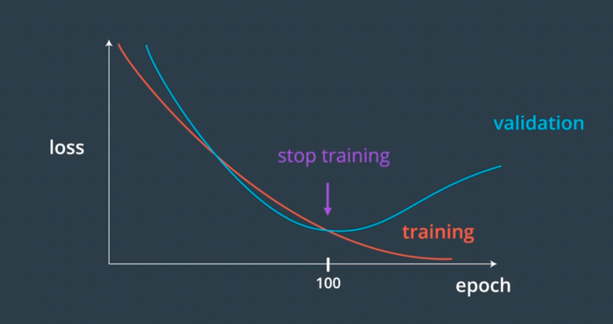

Additionally, we can test different hyperparameters and architectures; in that case, we choose the architecture and set hyperparameters that yield the lowest validation loss.

As we see, the final choice is influenced by teh validation split; thus, the model is balanced in favor of the validation split. That is why we need the last split, the test split: the real performance of our model needs to be validated by a dataset which has never been seen.

I understand that the 3 splits start making sense when we try different hyperparameters and architectures; otherwise, 2 splits are quite common.

Usually, the validation split is taken from the train split; especially, if we have already train and test splits. To that end, the `SubsetRandomSampler` can be used.

```python
from torchvision import datasets
import torchvision.transforms as transforms
from torch.utils.data.sampler import SubsetRandomSampler

# number of subprocesses to use for data loading
num_workers = 0
# how many samples per batch to load
batch_size = 20
# percentage of training set to use as validation
valid_size = 0.2

# convert data to torch.FloatTensor
transform = transforms.ToTensor()

# choose the training and test datasets
train_data = datasets.MNIST(root='data', train=True,
                                   download=True, transform=transform)
test_data = datasets.MNIST(root='data', train=False,
                                  download=True, transform=transform)

# obtain training indices that will be used for validation
num_train = len(train_data)
indices = list(range(num_train))
np.random.shuffle(indices)
split = int(np.floor(valid_size * num_train))
train_idx, valid_idx = indices[split:], indices[:split]

# define samplers for obtaining training and validation batches
train_sampler = SubsetRandomSampler(train_idx)
valid_sampler = SubsetRandomSampler(valid_idx)

# prepare data loaders
train_loader = torch.utils.data.DataLoader(train_data, batch_size=batch_size,
    sampler=train_sampler, num_workers=num_workers)
valid_loader = torch.utils.data.DataLoader(train_data, batch_size=batch_size, 
    sampler=valid_sampler, num_workers=num_workers)
test_loader = torch.utils.data.DataLoader(test_data, batch_size=batch_size, 
    num_workers=num_workers)
```

### 1.5 MLPs vs CNNs

CNNs are in general much better suited for data arranged in 2D. The main reasons are:

- MLPs need to flatten any 2D matrices and the 2D structural information is lost. Unlike MLPs, CNNs understand that pixels that are spatially close are more strongly related.
- CNNs are more sparesely connected, so they have much less parameters. They are locally connected, not fully connected; that makes possible adding more hidden layers. More hidden nodes means the ability of discovering more complex patterns.

CNNs work with **convolutional layers**, which process the image as a whole. See the notes in the [CVND](https://github.com/mxagar/computer_vision_udacity).

### 1.6 Frequency in Images, Filters

List of concepts covered:

- Frequency in images: intensity changes.
- Convolutions: kernels, weighted sums, edge ahndling: extending / padding / cropping.
- High-pass filters: edge highlighting; kernel weights must sum up to 0.
- Low-pass filters: edge supressing, blurring.
- Custom filters with OpenCV.

### 1.7 Convolutional Layers

List of concepts covered:

- Convolutional layers: a kernel has `K` filters; each filter generates a feature map, so that the output data has depth `K` or `K` channels. During learning, the weights of these kernels is optimized to obtain meaningful outputs. Note that if we start with a color image, each filter is 3 dimensional. Additionally, in successive layers, filters are usually 3D: they have the same depth as the output depth from the previous layer.
- Nodes = filters; parameters: size (WxH), depth (K), stride.
- Pooling layers: MaxPooling. They reduce the size (WxH) while maintaining the depth.

The notebooks from `~/git_repositories/deep-learning-v2-pytorch/convolutional-neural-networks` in the the repo [deep-learning-v2-pytorch](https://github.com/mxagar/deep-learning-v2-pytorch) are used.

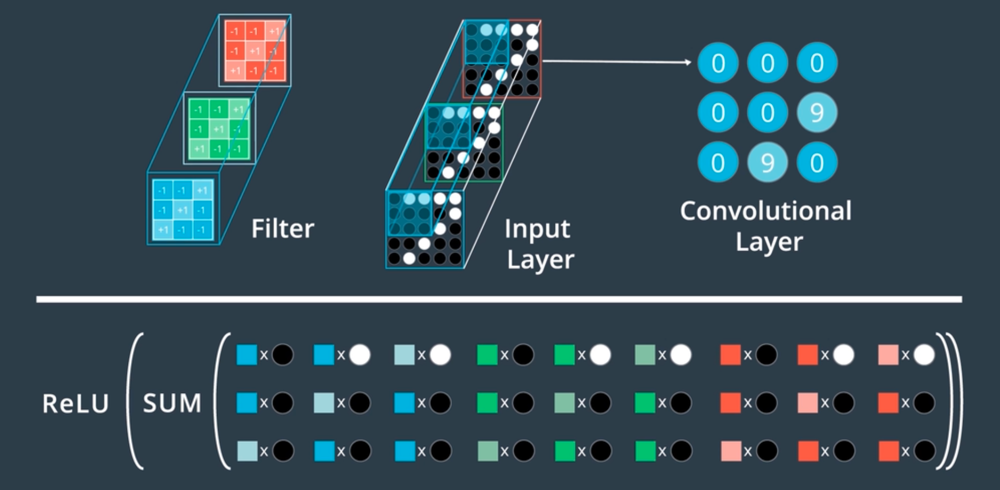


### 1.8 Capsule Networks

Max-Pooling decreases the dimensionality of the feature maps: their depth is maintained (number of channels), but their size is reduced by a factor.

This can be fine for image classification, but in some cases it can result counterproductive; fors instance: 

- Image parts might get lost when decreasing the resolution,
- Fake images, e.g., faces with 3 eyes, might get classified as real faces,
- etc.

Therefore, there are some approaches that don't discard spatial information. **Capsule networks** are an example.

Capsule networks works are hierarchically arranged networks in which image parts with known spatial relations between them are detected; for instance: a face can be broken down into eyes & mount-nose, the eyes can be broken down to left & right eye, etc.

[Capsule Networks: Hierarchical parts of a face](./pics/capsule_networks_hierarchy.png)

Capsule networks have the following properties:

- A parent capsule has children capsules.
- Each capsule has several nodes inside which detect specific characteristics: position, orientation, width, color, texture, etc.
- Based on the node outputs, each capsule returns a vector with (1) a magnitude `[0,1]` and a (2) orientation:
	- The magnitude is the probability of having identified a given part.
	- The orientation is a value associated to that detected part.
- The output of a capsule is passed to its parents scaled with learned weights.

[Capsule Networks: Nodes within a capsule and the output vector](./pics/capsule_networks_nodes.png)

A deeper explanation is given in [Capsule Networks, blogpost by Cezanne Camacho](https://cezannec.github.io/Capsule_Networks/).

That blogpost uses the code from the following repos:

- [Capsule_Networks](https://cezannec.github.io/Capsule_Networks/)
- [Capsule_Networks by the original author](https://github.com/cezannec/capsule_net_pytorch)

The original paper, by Hinton's group, is in the `literature/` folder.

### 1.9 Convolutional Layers in Pytorch

Official docu links:

- [Pytorch Conv2d](https://pytorch.org/docs/stable/generated/torch.nn.Conv2d.html)
- [Pytorch MaxPool2d](https://pytorch.org/docs/stable/generated/torch.nn.MaxPool2d.html)

Quick summary of how the two important elements of the convolutional layer are instantiated:

```python
import torch.nn as nn

# Sizes, padding, stride can be tuples!
# Look at default values!
nn.Conv2d(in_channels=1,
		  out_channels=32,
		  kernel_size=5)
		  #stride=1,
		  #padding=0,
		  #dilation=1,
		  #bias=True,
		  #padding_mode='zeros',
		  #...

# Sizes, padding, stride can be tuples!
# Look at default values!
nn.MaxPool2d(kernel_size=2,
			 stride=2)
			 #passing=0,
			 #...
```

#### `Conv2d`

The **channels** refer to the depth of the filter. Notes:

- A grayscale image will have `in_channel = 1` in the first `Conv2d`.
- A color image will have `in_channel = 3` in the first `Conv2d`.
- **The filter depths usually increase in sequence like this: 16 -> 32 -> 64**.

**Padding** is a very important argument in `Conv2d`, because with it we can control the size (WxH) of the output feature maps. Padding consists in adding a border of pixels around an image. In PyTorch, you specify the size of this border.

The simplified formula for the output size is (`dilation=1`):

`W_out = (W_in + 2P - F)/S + 1`

- `W_in`:
- `P`: padding width, **default is 0**
- `F`: kernel/filter size, usually odd numbers; twice 3 is better than once 5, because less parameters and same result!
- `S`: stride, usually left in the **default 1**

Usually, **preserving the sizes leads to better results**! That way, we don't loose information that we would have lost without padding. Thus, we need to:

- Use an odd kernel size: 3, 5, etc.; better 3 than 5.
- Define the padding as the border around the anchor pixel of the kernel: 3->1, 5->2

Since the default padding method is `'zeros'`, the added border is just zeros.

Additionally, after a `Conv2d`, a `relu()` activation is applied!

Which is the number of parameters in a convolutional layer?

`W_out*F*F*W_in + W_out`

- The last term `W_out` is active when we have biases: we have a bias for each output feature map.
- The first term is the pixel area of a filter x `in_channels` x `out_channels`; basically, we apply a convolution `out_channels` times.

#### `MaxPool2d`

Usually a `MaxPool2d` that halvens the size is chosen, i.e.:

- `kernel_size = 2`
- `stride = 2`

A `MaxPool2d` can be defined once and used several times; it comes after the `relu(Conv2d(x))`.

#### Linear Layer and Flattening

After the convolutional layers, the 3D feature maps need to be reshaped to a 1D feature vector to enter into a linear layer. If padding has been applied so that the size of the feature maps is preserved after each `Conv2d`, we only need to compute the final size taking into account the effects of the applied `MaxPool2d` reductions and the final depth; otherwise, the convolution resizing formmula needs to be applied carefully step by step.

Once we have the size, we compute the number of pixels in the final set of feature maps:

`N = W x H x D`

The linear layer after the last convolutional layer is defined as follows:

```python
nn.Linear(N, linear_out)
# linear_out is the number of nodes we want after the linear layer
# it could be the number of classes
# if this is the last linear layer
```

In the `forward()` function, the flattening is simpler, because we can query the size of the vector:

```python
x = x.view(x.size(0), -1)
# x.size(0): batch size
# -1: deduce how many pixels after dividing all items by the batch size, ie.: W x H x D
```

#### Example of a Simple Architecture

```python
import torch.nn as nn
import torch.nn.functional as F

# One convolutional layer applied an 12x12 image for a regression
# - input_size = 12
# - grayscale image: in_channles = 1
# - regression of variable n_classes

# Note: x has this shape: batch_size x n_channels x width x height
# Usually, the batch_size is ignored in the comments, but it is x.size(0)!

class Net(nn.Module):

    def __init__(self, n_classes):
        super(Net, self).__init__()

        # 1 input image channel (grayscale)
        # 32 output channels/feature maps
        # 5x5 square convolution kernel
        # W_out = (W_in + 2P - F)/S + 1
        # W_out: (input_size + 2*0 - 5)/1 + 1 = 8
        # WATCH OUT: default padding = 0!
        self.conv1 = nn.Conv2d(1, 32, 5)

        # maxpool layer
        # pool with kernel_size=2, stride=2
        # output size: 4
        # Note: there is no relu after MaxPool2d!
        self.pool = nn.MaxPool2d(2, 2)

        # fully-connected layer
        # 32*4 input size to account for the downsampled image size after pooling
        # num_classes outputs (for n_classes of image data)
        self.fc1 = nn.Linear(32*4, n_classes)

    # define the feedforward behavior
    def forward(self, x):
        # one conv/relu + pool layers
        x = self.pool(F.relu(self.conv1(x)))

        # prep for linear layer by flattening the feature maps into feature vectors
        x = x.view(x.size(0), -1)
        # linear layer 
        x = F.relu(self.fc1(x))

        # final output
        return x

# instantiate and print your Net
n_classes = 20 # example number of classes
net = Net(n_classes)
print(net)

```

#### Summary of Guidelines

- Usual architecture: 2-4 `Conv2d` with `MaxPool2d`in-between so that the size is halved; at the end 1-3 fully connected layers with dropout in-between to avoid overfitting.
- Recall that an image has the shape `B x W x H x D`. The bacth size `B` is usually not used during the network programming, but it's there, even though we feed one image per batch!
- In the convolutions:
    - Prefer small 3x3 filters; use odd numbers in any case.
    - Use padding so that the size of the image is preserved! That means taking `padding=floor(F/2)`.
    - Recall the size change formula: `W_out = (W_in + 2P - F)/S + 1`.
- Use `relu()` activation after each convolution, but not after max-pooling.
- If we use a unique decreasing factor in `MaxPool2d`, it's enough defining a unique `MaxPool2d`.
- The typical max-pooling is the one which halvens the size: `MaxPool2d(2,2)`.
- Before entering the fully connected or linear layer, we need to flatten the feature map:
    - In the definition of `Linear()`: we need to compute the final volume of the last feature map set. If we preserved the sized with padding it's easy; if not, we need to apply the formula above step by step.
    - In the `forward()` method: `x = x.view(x.size(0), -1)`; `x.size(0)`is the batch size, `-1` is the rest. 
- If we use `CrossEntropyLoss()`, we need to return the `relu()` output; if we return the `log_softmax()`, we need to use the `NLLLoss()`. `CrossEntropy() == log_softmax() + NLLLoss()`.

### 1.10 CIFAR CNN Example

The notebooks in 

[deep-learning-v2-pytorch](https://github.com/mxagar/deep-learning-v2-pytorch) `/convolutional-neural-networks/cifar-cnn`

contain an example of manually defined Convolutional Neural Network (CNN) which classifies images from the [CIFAR-10 dataset](https://www.cs.toronto.edu/~kriz/cifar.html). The CIFAR-10 dataset consists of 60000 32x32 colour images in 10 classes, with 6000 images per class. There are 50000 training images and 10000 test images.

Additionally, **data augmentation** and **3 splits** are applied.

In the following, the code of the notebook is added, divided in 6 sections:

1. Load the Data
2. Define the Network Architecture
3. Train the Network
4. Test the Trained Network
5. Visualize Some Results

```python
import torch
import numpy as np

# check if CUDA is available
train_on_gpu = torch.cuda.is_available()

if not train_on_gpu:
    print('CUDA is not available.  Training on CPU ...')
else:
    print('CUDA is available!  Training on GPU ...')

### -- 1. Load the Data

from torchvision import datasets
import torchvision.transforms as transforms
from torch.utils.data.sampler import SubsetRandomSampler

# number of subprocesses to use for data loading
num_workers = 0
# how many samples per batch to load
batch_size = 20
# percentage of training set to use as validation
valid_size = 0.2

# convert data to a normalized torch.FloatTensor
transform = transforms.Compose([
    transforms.RandomHorizontalFlip(), # randomly flip and rotate
    transforms.RandomRotation(10),
    transforms.ToTensor(),
    transforms.Normalize((0.5, 0.5, 0.5), (0.5, 0.5, 0.5))
    ])

# choose the training and test datasets
train_data = datasets.CIFAR10('data', train=True,
                              download=True, transform=transform)
test_data = datasets.CIFAR10('data', train=False,
                             download=True, transform=transform)

# obtain training indices that will be used for validation
num_train = len(train_data)
indices = list(range(num_train))
np.random.shuffle(indices)
split = int(np.floor(valid_size * num_train))
train_idx, valid_idx = indices[split:], indices[:split]

# define samplers for obtaining training and validation batches
train_sampler = SubsetRandomSampler(train_idx)
valid_sampler = SubsetRandomSampler(valid_idx)

# prepare data loaders (combine dataset and sampler)
train_loader = torch.utils.data.DataLoader(train_data, batch_size=batch_size,
    sampler=train_sampler, num_workers=num_workers)
valid_loader = torch.utils.data.DataLoader(train_data, batch_size=batch_size, 
    sampler=valid_sampler, num_workers=num_workers)
test_loader = torch.utils.data.DataLoader(test_data, batch_size=batch_size, 
    num_workers=num_workers)

# specify the image classes
classes = ['airplane', 'automobile', 'bird', 'cat', 'deer',
           'dog', 'frog', 'horse', 'ship', 'truck']


import matplotlib.pyplot as plt
%matplotlib inline

# helper function to un-normalize and display an image
def imshow(img):
    img = img / 2 + 0.5  # unnormalize
    plt.imshow(np.transpose(img, (1, 2, 0)))  # convert from Tensor image

# obtain one batch of training images
dataiter = iter(train_loader)
images, labels = dataiter.next()
images = images.numpy() # convert images to numpy for display

# plot the images in the batch, along with the corresponding labels
fig = plt.figure(figsize=(25, 4))
# display 20 images
for idx in np.arange(20):
    ax = fig.add_subplot(2, 20/2, idx+1, xticks=[], yticks=[])
    imshow(images[idx])
    ax.set_title(classes[labels[idx]])

### -- 2. Define the Network Architecture

import torch.nn as nn
import torch.nn.functional as F

# define the CNN architecture
class Net(nn.Module):
    def __init__(self, drop_p=0.5):
        super(Net, self).__init__()
        # convolutional layer 1: 32x32x3 -> 32x32x16 -> 16x16x16
        # W_out = (W_in−F+2P)/S + 1
        self.conv1 = nn.Conv2d(3, 16, 3, padding=1)
        # convolutional layer 2: 16x16x16 -> 16x16x32 -> 8x8x32
        self.conv2 = nn.Conv2d(16, 32, 3, padding=1)
        # dropout layer 1
        self.dropout1 = nn.Dropout(p=drop_p)
        # convolutional layer 3: 8x8x32 -> 8x8x64 -> 4x4x64
        self.conv3 = nn.Conv2d(32, 64, 3, padding=1)
        # dropout layer 2
        self.dropout2 = nn.Dropout(p=drop_p)
        # linear layer 1: 4x4x64 = 1024 -> 512
        self.linear1 = nn.Linear(1024,512)
        # dropout layer 3
        self.dropout3 = nn.Dropout(p=drop_p)
        # linear layer 2: 512 -> 10
        self.linear2 = nn.Linear(512,10)

       # max pooling layer
        self.pool = nn.MaxPool2d(2, 2)

    def forward(self, x):
        # add sequence of convolutional and max pooling layers
        x = self.pool(F.relu(self.conv1(x)))
        x = self.pool(F.relu(self.conv2(x)))
        x = self.dropout1(x)
        x = self.pool(F.relu(self.conv3(x)))
        x = self.dropout2(x)
        # flatten
        x = x.view(x.size(0),-1)
        x = F.relu(self.linear1(x))
        x = self.dropout3(x)
        x = F.relu(self.linear2(x))
        x = F.log_softmax(x,dim=1)
        return x

# create a complete CNN
model = Net()
print(model)

# Net(
#   (conv1): Conv2d(3, 16, kernel_size=(3, 3), stride=(1, 1), padding=(1, 1))
#   (conv2): Conv2d(16, 32, kernel_size=(3, 3), stride=(1, 1), padding=(1, 1))
#   (conv3): Conv2d(32, 64, kernel_size=(3, 3), stride=(1, 1), padding=(1, 1))
#   (pool): MaxPool2d(kernel_size=2, stride=2, padding=0, dilation=1, ceil_mode=False)
#   (fc1): Linear(in_features=1024, out_features=500, bias=True)
#   (fc2): Linear(in_features=500, out_features=10, bias=True)
#   (dropout): Dropout(p=0.25, inplace=False)
# )

# move tensors to GPU if CUDA is available
if train_on_gpu:
    model.cuda()

import torch.optim as optim

# specify loss function (categorical cross-entropy)
criterion = nn.CrossEntropyLoss()

# specify optimizer
optimizer = optim.SGD(model.parameters(), lr=0.01)

### -- 3. Train the Network

# number of epochs to train the model
n_epochs = 30

valid_loss_min = np.Inf # track change in validation loss

for epoch in range(1, n_epochs+1):

    # keep track of training and validation loss
    train_loss = 0.0
    valid_loss = 0.0
    
    ###################
    # train the model #
    ###################
    model.train()
    for batch_idx, (data, target) in enumerate(train_loader):
        # move tensors to GPU if CUDA is available
        if train_on_gpu:
            data, target = data.cuda(), target.cuda()
        # clear the gradients of all optimized variables
        optimizer.zero_grad()
        # forward pass: compute predicted outputs by passing inputs to the model
        output = model(data)
        # calculate the batch loss
        loss = criterion(output, target)
        # backward pass: compute gradient of the loss with respect to model parameters
        loss.backward()
        # perform a single optimization step (parameter update)
        optimizer.step()
        # update training loss
        train_loss += loss.item()*data.size(0)
        
    ######################    
    # validate the model #
    ######################
    model.eval()
    for batch_idx, (data, target) in enumerate(valid_loader):
        # move tensors to GPU if CUDA is available
        if train_on_gpu:
            data, target = data.cuda(), target.cuda()
        # forward pass: compute predicted outputs by passing inputs to the model
        output = model(data)
        # calculate the batch loss
        loss = criterion(output, target)
        # update average validation loss 
        valid_loss += loss.item()*data.size(0)
    
    # calculate average losses
    train_loss = train_loss/len(train_loader.sampler)
    valid_loss = valid_loss/len(valid_loader.sampler)
        
    # print training/validation statistics 
    print('Epoch: {} \tTraining Loss: {:.6f} \tValidation Loss: {:.6f}'.format(
        epoch, train_loss, valid_loss))
    
    # save model if validation loss has decreased
    if valid_loss <= valid_loss_min:
        print('Validation loss decreased ({:.6f} --> {:.6f}).  Saving model ...'.format(
        valid_loss_min,
        valid_loss))
        torch.save(model.state_dict(), 'model_augmented.pt')
        valid_loss_min = valid_loss

# Load the best model
if train_on_gpu:
    model.load_state_dict(torch.load('model_augmented.pt'))
else:
    model.load_state_dict(torch.load('model_augmented.pt',map_location=torch.device('cpu')))

### -- 4. Test the Trained Network

# track test loss
test_loss = 0.0
class_correct = list(0. for i in range(10))
class_total = list(0. for i in range(10))

model.eval()
# iterate over test data
for batch_idx, (data, target) in enumerate(test_loader):
    # move tensors to GPU if CUDA is available
    if train_on_gpu:
        data, target = data.cuda(), target.cuda()
    # forward pass: compute predicted outputs by passing inputs to the model
    output = model(data)
    # calculate the batch loss
    loss = criterion(output, target)
    # update test loss 
    test_loss += loss.item()*data.size(0)
    # convert output probabilities to predicted class
    _, pred = torch.max(output, 1)    
    # compare predictions to true label
    correct_tensor = pred.eq(target.data.view_as(pred))
    correct = np.squeeze(correct_tensor.numpy()) if not train_on_gpu else np.squeeze(correct_tensor.cpu().numpy())
    # calculate test accuracy for each object class
    for i in range(batch_size):
        label = target.data[i]
        class_correct[label] += correct[i].item()
        class_total[label] += 1

# average test loss
test_loss = test_loss/len(test_loader.dataset)
print('Test Loss: {:.6f}\n'.format(test_loss))

for i in range(10):
    if class_total[i] > 0:
        print('Test Accuracy of %5s: %2d%% (%2d/%2d)' % (
            classes[i], 100 * class_correct[i] / class_total[i],
            np.sum(class_correct[i]), np.sum(class_total[i])))
    else:
        print('Test Accuracy of %5s: N/A (no training examples)' % (classes[i]))

print('\nTest Accuracy (Overall): %2d%% (%2d/%2d)' % (
    100. * np.sum(class_correct) / np.sum(class_total),
    np.sum(class_correct), np.sum(class_total)))

### -- 5. Visualize Some Results

# obtain one batch of test images
dataiter = iter(test_loader)
images, labels = dataiter.next()
images.numpy()

# move model inputs to cuda, if GPU available
if train_on_gpu:
    images = images.cuda()

# get sample outputs
output = model(images)
# convert output probabilities to predicted class
_, preds_tensor = torch.max(output, 1)
preds = np.squeeze(preds_tensor.numpy()) if not train_on_gpu else np.squeeze(preds_tensor.cpu().numpy())

# plot the images in the batch, along with predicted and true labels
fig = plt.figure(figsize=(25, 4))
for idx in np.arange(20):
    ax = fig.add_subplot(2, 20/2, idx+1, xticks=[], yticks=[])
    imshow(images[idx] if not train_on_gpu else images[idx].cpu())
    ax.set_title("{} ({})".format(classes[preds[idx]], classes[labels[idx]]),
                 color=("green" if preds[idx]==labels[idx].item() else "red"))

```

### 1.11 Data Augmentation

We want to learn invariant representations of objects, in which these properties are irrelevant:

- Location of the object in the image: translation invariant
- Size of the object: scale invariante
- Orientation/rotatiin of the object: rotation invariant.

Max-pooling achieves some translation invariance: a summary pixel (max, mean) is chosen within a window, so the pixel could be anywhere translated in that window; additionally, if we apply several max-pooling layers sequentially, the invariance is more significant.

Another way to increase the invariance and, thus, improve the generalization, is to use data augmentation: we artificially move, scale and rotate the images in the dataset.

### 1.12 Popular Networks

See handwritten notes and [CVND repo](https://github.com/mxagar/computer_vision_udacity). Some of these notes are mine, after reading the papers.

Some very interesting links:

- [An Intuitive Guide to Deep Network Architectures](https://towardsdatascience.com/an-intuitive-guide-to-deep-network-architectures-65fdc477db41)
- [Vanishing Gradient - Why are deep neural networks hard to train? Michael Nielsen](http://neuralnetworksanddeeplearning.com/chap5.html)
- [CNN Benchmarks](https://github.com/jcjohnson/cnn-benchmarks)

#### LeNet (1989-1998)

[LeNet](https://en.wikipedia.org/wiki/LeNet) is the first CNN architecture, published by Yann LeCun in 1989.

There are several versions, the 5th is usually mentioned (1998).

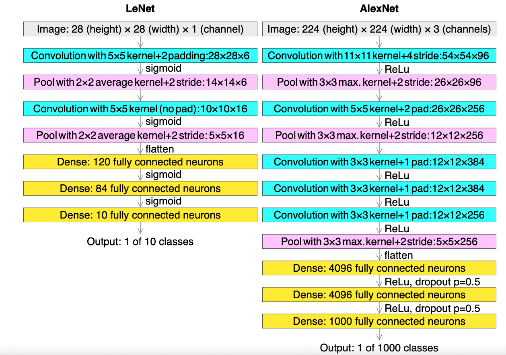

#### AlexNet (2012)

[ImageNet Classification with Deep Convolutional Neural Networks](https://papers.nips.cc/paper/2012/hash/c399862d3b9d6b76c8436e924a68c45b-Abstract.html)  
Alex Krizhevsky, Ilya Sutskever, Geoffrey Hinton (2012).  

They competed in the [ImageNet challenge](https://en.wikipedia.org/wiki/ImageNet) and achieved a remarkable result for the first time; that's when the deep learning hype started, or at least people started to pay attenton to deep learning.


Some features:

- 2 GPUs used, faster
- 1000 classes 
- **ReLU used for the first time**
- 8 layers and 3 max-pooling: 5 convolutional, 3 dense
- 60M parameters, 650k neurons
- Data augmentation used to prevent overfitting
- **Dropout (p=0.5) in the first two dense layers - used for the first time**
- Momentum = 0.9, weight decay = 0.0005

Look at the paper in the `literature/` folder.

#### VGG-16 (2014)

[Very Deep Convolutional Networks for Large-Scale Image Recognition](https://arxiv.org/abs/1409.1556)  
Simonyan, Zisserman (2014).  
Visual Geometry Group, Oxford.

Some features:

- Smaller filters used, 3x3, incontrast to 11x11 from AlexNet: less paramaters, faster. **They pioneered those smaller convolutional filters.**
- Elegant structure composed by convolutions followed by max-pooling.
- More layers than AlexNet; the optimum amount is 16.


Look at the paper in the `literature/` folder.

#### ResNet (2015)

[Deep Residual Learning for Image Recognition](https://arxiv.org/abs/1512.03385)  
Kaiming He, Xiangyu Zhang, Shaoqing Ren, Jian Sun

Deep learning neural networks have the **vanishing/exploding gradient problem**: since the error is backpropagated with chain multiplications, large or small values are magnified, thus, loosing information. This problem is more accute when the number of layers increases.

ResNets, in contrast, can have many layers but they avoid the vanishing/exploding gradient problem. They achieve that with skip/shortcut connections: inputs from previous layers are taken without any modifications.

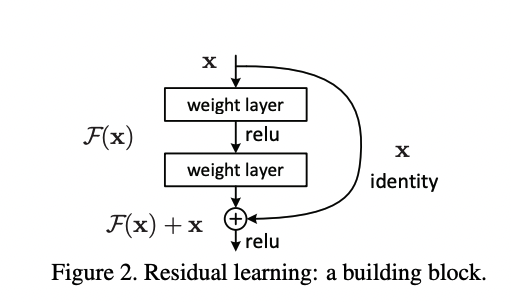

Therefore, the network learns the residual between two layers. When the gradient is backpropagated, the shortcut connections prevent it from increasing/decreasing exponentially. The result is that we can add many layers without decreasing the performance; more layers mean more training time, but also the ability to learn more complex patterns. ResNets achieve super-human accuracy.

The equations of the residual block are the following:

    M(x) = y          regular mapping
    F(x) = M(x) - x   residual function
    M(x) = F(x) + x   mapping in residual block
    y = F(x) + x      F(x) is 2x conv + batchnorm

It is easier to optimize the residual function `F(x)` than it is to optimize the mapping `M(x)`. Note that in order to be able to sum `F(x) + x`, the layers in the residual block cannot change the size of the signal, i.e., the shape is unchanged in the residual block.

Apart from these shortcuts, ResNets have similar building elements as, e.g., VGG nets: convolutions of 3x3 and max-pooling.

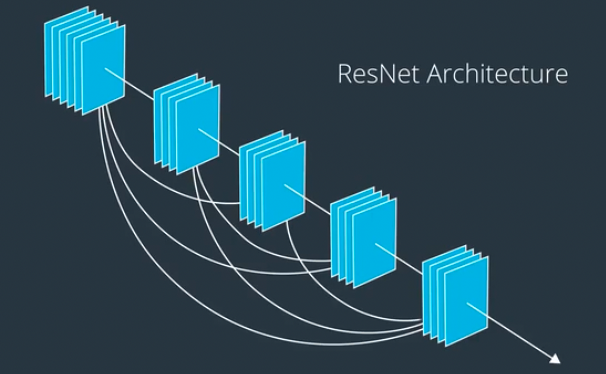

In the following the code of a possible residual block implementation is provided (note that parameters might change depending on the application):

```python
import torch.nn as nn
import torch.nn.functional as F

# Helper conv function
def conv(in_channels, out_channels, kernel_size, stride=2, padding=1, batch_norm=True):
    """Creates a convolutional layer, with optional batch normalization.
    """
    layers = []
    conv_layer = nn.Conv2d(in_channels=in_channels, out_channels=out_channels, 
                           kernel_size=kernel_size, stride=stride, padding=padding, bias=False)
    
    layers.append(conv_layer)

    if batch_norm:
        layers.append(nn.BatchNorm2d(out_channels))
    return nn.Sequential(*layers)

# Residual block class
class ResidualBlock(nn.Module):
    """Defines a residual block.
       This adds an input x to a convolutional layer (applied to x) with the same size input and output.
       These blocks allow a model to learn an effective transformation from one domain to another.
    """
    def __init__(self, conv_dim):
        super(ResidualBlock, self).__init__()
        # conv_dim = number of inputs
        
        # define two convolutional layers + batch normalization that will act as our residual function, F(x)
        # layers should have the same shape input as output; I suggest a kernel_size of 3
        
        self.conv_layer1 = conv(in_channels=conv_dim, out_channels=conv_dim, 
                                kernel_size=3, stride=1, padding=1, batch_norm=True)
        
        self.conv_layer2 = conv(in_channels=conv_dim, out_channels=conv_dim, 
                               kernel_size=3, stride=1, padding=1, batch_norm=True)
        
    def forward(self, x):
        # apply a ReLu activation the outputs of the first layer
        # return a summed output, x + resnet_block(x)
        out_1 = F.relu(self.conv_layer1(x))
        out_2 = x + self.conv_layer2(out_1)
        return out_2
```

All in all, ResNets applied of these important features:

1. **Skip/shortcut connections**: even with vanishing/exploding gradients the information is not lost, because the inputs from previous layers are preserved. However, the weights are optimized with the residual mapping (removing the previous input). These connections can link layers that are very far ways from each other in the network, and they have been shown to be very important in segmentation tasks, which require preserving spatial information; see for instance this paper: [The Importance of Skip Connections in Biomedical Image Segmentation](https://arxiv.org/abs/1608.04117).

2. **Bottleneck design with 1x1 convolutions**: 1x1 convolutions preserve the WxH size of the feature map but can reduce its depth. Therefore, they can reduce complexity. With them, it is possible to ad more layers!

The result is that:

- Deeper networks with less parameters: faster to train and use.
- Increased accuracy.
- No training degradation occurs; training degradation is the phenomenon that happens when the network stops improving from a point on.

As we increase the layers, the accuracy increases, but the speed decreases; **ResNet-50 is a good trade-off**.

More information:

- Medium article: [Review: ResNet, by Sik-Ho Tsang](https://towardsdatascience.com/review-resnet-winner-of-ilsvrc-2015-image-classification-localization-detection-e39402bfa5d8).
- Medium article: [An Intuitive Guide to Deep Network Architectures](https://towardsdatascience.com/an-intuitive-guide-to-deep-network-architectures-65fdc477db41).
- Medium article: [Understanding ResNet and its Variants](https://towardsdatascience.com/understanding-resnet-and-its-variants-719e5b8d2298).
- Look at the paper in the `literature/` folder.

#### Inception v3 (2015)

[Rethinking the Inception Architecture for Computer Vision](https://arxiv.org/abs/1512.00567)  
Christian Szegedy, Vincent Vanhoucke, Sergey Ioffe, Jonathon Shlens, Zbigniew Wojna (2015)

Look at this Medium article: [Review: Inception-v3, by Sik-Ho Tsang](https://sh-tsang.medium.com/review-inception-v3-1st-runner-up-image-classification-in-ilsvrc-2015-17915421f77c).

Also: [An Intuitive Guide to Deep Network Architectures](https://towardsdatascience.com/an-intuitive-guide-to-deep-network-architectures-65fdc477db41).

They achieved a deep network (42 layers) with much less parameters. If ResNets try to go deep, Inception networks try to go wide.

The key concepts that made that possible are:

1. Batch normalization: the output of each batch is normalized (-mean, /std) to avoiddd the shifting of weights.

2. **Factorization**: they introduced this approach. Larger filters (eg., 5x5) are replaced by smaller ones (eg., 3x3) that work in parallel; then, result is concatenated. This reduces the number of parameters without decreasing the network efficiency.

#### DenseNet (2018)

[Densely Connected Convolutional Networks](https://arxiv.org/abs/1608.06993).  
Gao Huang, Zhuang Liu, Laurens van der Maaten, Kilian Q. Weinberger (2016/8)  

[Review: DenseNet, by Mukul Khanna](https://medium.com/towards-data-science/paper-review-densenet-densely-connected-convolutional-networks-acf9065dfefb)

The network targets the vanishing/exploding gradiengt problem, too.

The architecture is composed of dense blocks of layers. Each layer from a dense block receives feature maps from all preceding layers and these are fused through concatenation, not summation (in constrast to ResNets).

In consequence, the vanishing gradient is alleviated, while having deep networks with reduced number of parameters.

DenseNets have much less parameters than ResNets but achieve the same accuracy. See comparison diagram in the paper.

Reference DenseNet: DenseNet-121.

### 1.13 Visualization of CNN Feature Maps and Filters

See the related section in my notes on the [CVND](https://github.com/mxagar/computer_vision_udacity).


## 2. Cloud Computing and Edge Devices

See the repository of the [Udacity Computer Vision Nanodegree](https://www.udacity.com/course/computer-vision-nanodegree--nd891):

[computer_vision_udacity(https://github.com/mxagar/computer_vision_udacity) / `02_Cloud_Computing`.

### 2.1 Excurs: Jetson Nano

The code in this notebook is ready to be executed on a CUDA device, like a Jetson Nano. In order to set up the Jetson Nano, we need to follow the steps in 

    ~/Dropbox/Documentation/howtos/jetson_nano_howto.txt

I created the guide following experimenting myself two very important links:

- [Getting Started with Jetson Nano, Medium](https://medium.com/@heldenkombinat/getting-started-with-the-jetson-nano-37af65a07aab)
- [Getting Started with Jetson Nano, NVIDIA](https://developer.nvidia.com/embedded/learn/get-started-jetson-nano-devkit#intro)

In the following, a basic usage guide is provided; for setup, look at the howto file above.

####  Summary of Installation Steps

- Flash SD image
- Create account in Jetson Ubuntu (18): mxagar, pw
- Install basic software
- Create python environment: `env`
- Install DL packages in python environment: Pytorch, Torchvision, PIL, OpenCV, etc.

####  How to Connect to Jetson via SSH

    ssh mxagar@jetson-nano.com

#### Connect to a Jupyter Notebook Run on the Jetson from Desktop


Open new Terminal on Mac: start SSH tunneling and leave it open
    
    ssh -L 8000:localhost:8888 mxagar@jetson-nano.local

Open new Terminal on Mac (or the same works also): connect to jetson-nano & start jupyter
        
    ssh mxagar@jetson-nano.local
    source ~/python-envs/env/bin/activate
    cd /your/path
    jupyter notebook
        or jupyter-lab
        in both cases, look for token
            http://localhost:8888/?token=XXX
                
Open new browser on Mac, go to
     
    http://localhost:8000
    insert token XXX

#### SFTP Access

Currently, I cannot access via SFTP the Jetson Nano. Some configuration is needed, which I didn't have time to go through. As a workaround, I clone and pull/push the repositories to the Jetson directly after connecting via SSH.

#### SCP Access

Copy / Transfer file or folder with SCP:

```bash
# Jetson -> Desktop
scp mxagar@jetson-nano.local:/path/to/file/on/jetson /folder/on/desktop

# Desktop -> Jetson			
scp file.txt mxagar@jetson-nano.local:/path/to/folder/on/jetson
scp -r /local/directory mxagar@jetson-nano.local:/remote/directory
```

## 3. Transfer Learning

Transfer learning consists in using a pre-trained network to which we add a 1-2 linear layers which are trained to classify given the input feature vectors generated by the pre-trained network. This way, we can use state-of-the-art pre-trained models for faster trainings.

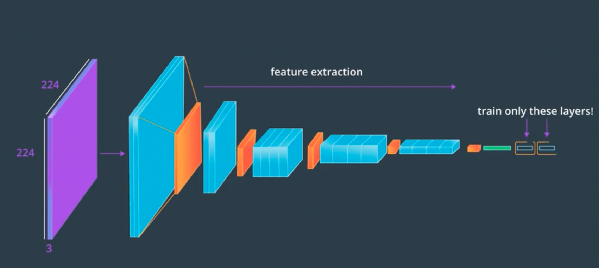

We can use [Torchvision models](https://pytorch.org/docs/0.3.0/torchvision/models.html) for **transfer learning**. These models are usually trained with [Imagenet](https://image-net.org): 1 million labeled images in 1000 categories. The pre-trained network can generalize to our applications well if

- we have few classes (size)
- and the features of our classes are similar to those in the images of ImageNet (similarity).

If that is not the case, we should **fine-tune** or re-train the pre-trained network (see below). For instance, the Skin Cancer detection paper by Thrun et al. fine-tuned the Inception v3 network for classifyig the malign & bening cancer images. They basically took the pre-trained weights are started the training from that state.

For each backbone model, we need to take into account:

- The size of the input image, usually `224x224`.
- The normalization used in the trained model.
- We need to replace the last layer of the model (the classifier) with our classifier and train it with the images of our application. The weights of the pre-trained network (the backbone) are frozen, not changed; only the weights of th elast classifier we add are optimized.

Available networks in Pytorch:

- AlexNet
- VGG
- ResNet
- SqueezeNet
- Densenet
- Inception v3

### 3.1 Transfer Leearning vs. Fine-Tuning

Transfer learning with a frozed backbone pre-trained network can generalize to our applications well if

- we have few classes (size)
- and the features of our classes are similar to those in the images of ImageNet (similarity).

In general, depending on how the **size** and **similarity** factors are, we should follow different approaches, sketched in this matrix:


Note that Small datasets (approx. 2k images) risk overfitting; the solution consists in freezing the pre-trained weights, no matter at which depth we cut the backbone network.

Summary of approaches:

1. Small dataset, similar features: Transfer learning with complete backbone
	- Remove last classification linear layers
	- Freeze pre-trained weights
	- Add new linear layers with random weights for classification, which end up in the desired class nodes
	- Train new classification layers
2. Small dataset, different features: Transfer learning with initial part of the backbone
	- Slice off near the begining of the pre-trained network
	- Freeze pre-trained weights
	- Add new linear layers with random weights for classification, which end up in the desired class nodes; do not add convolutional layers, instead use the low level features!
	- Train new classification layers
3. Large dataset, similar features: Fine tune
	- Like case 1, but we don't freeze the backbone weights, but start training from their pre-trained state.
4. Large dataset, different features: Fine tune or Re-train
	- Remove the last fully connected layer and replace with a layer matching the number of classes in the new data set.
	- Re-train the network from the scratch with random weights.
	- Or: perform as in case 3.

More notes on transfer learning: [CS231n Stanford course notes](https://cs231n.github.io/transfer-learning/)

### 3.2 Flower Classification Example

The notebooks in 

[deep-learning-v2-pytorch](https://github.com/mxagar/deep-learning-v2-pytorch) `/transfer-learning`

contain an example of transfer learning in which the last layer of the VGG architecture is modified to classify 5 flower species.


The dataset must be dowloaded and copied to the notebook folder:

[Download flower dataset](https://s3.amazonaws.com/video.udacity-data.com/topher/2018/September/5baa60a0_flower-photos/flower-photos.zip).

In the following, the code of the notebook is added, divided in 6 sections:

1. Load and Transform our Data
2. Data Loaders and Visualization
3. **Define and Modify the Model**
4. Training
5. Testing
6. Visualize Sample Test Results


```python
import os
import numpy as np
import torch

import torchvision
from torchvision import datasets, models, transforms
import matplotlib.pyplot as plt

%matplotlib inline

# check if CUDA is available
train_on_gpu = torch.cuda.is_available()

if not train_on_gpu:
    print('CUDA is not available.  Training on CPU ...')
else:
    print('CUDA is available!  Training on GPU ...')

### -- 1. Load and Transform our Data

# Download from:
# https://s3.amazonaws.com/video.udacity-data.com/topher/2018/September/5baa60a0_flower-photos/flower-photos.zip
# 
# Copy the unzipped folder to the notebook folder: flower_photos
# and make sure that inside there are train and test folders
# each with 5 class subfolders:

# root/class_1/xxx.png
# root/class_1/xxy.png
# root/class_1/xxz.png

# root/class_2/123.png
# root/class_2/nsdf3.png
# root/class_2/asd932_.png

# define training and test data directories
data_dir = 'flower_photos/'
train_dir = os.path.join(data_dir, 'train/')
test_dir = os.path.join(data_dir, 'test/')

# classes are folders in each directory with these names
classes = ['daisy', 'dandelion', 'roses', 'sunflowers', 'tulips']

# load and transform data using ImageFolder

# VGG-16 Takes 224x224 images as input, so we resize all of them
data_transform = transforms.Compose([transforms.RandomResizedCrop(224), 
                                      transforms.ToTensor()])

train_data = datasets.ImageFolder(train_dir, transform=data_transform)
test_data = datasets.ImageFolder(test_dir, transform=data_transform)

# print out some data stats
print('Num training images: ', len(train_data))
print('Num test images: ', len(test_data))

### -- 2. Data Loaders and Visualization

# define dataloader parameters
batch_size = 20
num_workers=0

# prepare data loaders
train_loader = torch.utils.data.DataLoader(train_data, batch_size=batch_size, 
                                           num_workers=num_workers, shuffle=True)
test_loader = torch.utils.data.DataLoader(test_data, batch_size=batch_size, 
                                          num_workers=num_workers, shuffle=True)

# Visualize some sample data

# obtain one batch of training images
dataiter = iter(train_loader)
images, labels = dataiter.next()
images = images.numpy() # convert images to numpy for display

# plot the images in the batch, along with the corresponding labels
fig = plt.figure(figsize=(25, 4))
for idx in np.arange(20):
    ax = fig.add_subplot(2, 20/2, idx+1, xticks=[], yticks=[])
    plt.imshow(np.transpose(images[idx], (1, 2, 0)))
    ax.set_title(classes[labels[idx]])

### -- 3. Define and Modify the Model

# Load the pretrained model from pytorch
vgg16 = models.vgg16(pretrained=True)

# print out the model structure
print(vgg16)

print(vgg16.classifier[6].in_features) # 4096
print(vgg16.classifier[6].out_features) # 1000

# Freeze training for all "features" layers
for param in vgg16.features.parameters():
    param.requires_grad = False

# Modify only last layer
# Map to the number of classes we want to predict
import torch.nn as nn

n_inputs = vgg16.classifier[6].in_features

# add last linear layer (n_inputs -> 5 flower classes)
# new layers automatically have requires_grad = True
last_layer = nn.Linear(n_inputs, len(classes))

vgg16.classifier[6] = last_layer

# if GPU is available, move the model to GPU
if train_on_gpu:
    vgg16.cuda()

# check to see that your last layer produces the expected number of outputs
print(vgg16.classifier[6].out_features)
#print(vgg16)

import torch.optim as optim

# specify loss function: categorical cross-entropy
# CrossEntropyLoss because the last layer has no activation
criterion = nn.CrossEntropyLoss()

# specify optimizer (stochastic gradient descent) and learning rate = 0.001
# ONLY vgg16.classifier.parameters()
optimizer = optim.SGD(vgg16.classifier.parameters(), lr=0.001)

### -- 4. Training

# Since we have the pre-trained model and we are training only the classifier,
# probably not that much epochs are necessary.
# However, these are a lot of parameters; thus, try to train on a CUDA.

# number of epochs to train the model
n_epochs = 2

for epoch in range(1, n_epochs+1):

    # keep track of training and validation loss
    train_loss = 0.0
    
    ###################
    # train the model #
    ###################
    # model by default is set to train
    for batch_i, (data, target) in enumerate(train_loader):
        # move tensors to GPU if CUDA is available
        if train_on_gpu:
            data, target = data.cuda(), target.cuda()
        # clear the gradients of all optimized variables
        optimizer.zero_grad()
        # forward pass: compute predicted outputs by passing inputs to the model
        output = vgg16(data)
        # calculate the batch loss
        loss = criterion(output, target)
        # backward pass: compute gradient of the loss with respect to model parameters
        loss.backward()
        # perform a single optimization step (parameter update)
        optimizer.step()
        # update training loss 
        train_loss += loss.item()
        
        if batch_i % 20 == 19:    # print training loss every specified number of mini-batches
            print('Epoch %d, Batch %d loss: %.16f' %
                  (epoch, batch_i + 1, train_loss / 20))
            train_loss = 0.0

### -- 5. Testing

# track test loss 
# over 5 flower classes
test_loss = 0.0
class_correct = list(0. for i in range(5))
class_total = list(0. for i in range(5))

vgg16.eval() # eval mode

# iterate over test data
for data, target in test_loader:
    # move tensors to GPU if CUDA is available
    if train_on_gpu:
        data, target = data.cuda(), target.cuda()
    # forward pass: compute predicted outputs by passing inputs to the model
    output = vgg16(data)
    # calculate the batch loss
    loss = criterion(output, target)
    # update  test loss 
    test_loss += loss.item()*data.size(0)
    # convert output probabilities to predicted class
    _, pred = torch.max(output, 1)    
    # compare predictions to true label
    correct_tensor = pred.eq(target.data.view_as(pred))
    correct = np.squeeze(correct_tensor.numpy()) if not train_on_gpu else np.squeeze(correct_tensor.cpu().numpy())
    # calculate test accuracy for each object class
    for i in range(batch_size):
        label = target.data[i]
        class_correct[label] += correct[i].item()
        class_total[label] += 1

# calculate avg test loss
test_loss = test_loss/len(test_loader.dataset)
print('Test Loss: {:.6f}\n'.format(test_loss))

for i in range(5):
    if class_total[i] > 0:
        print('Test Accuracy of %5s: %2d%% (%2d/%2d)' % (
            classes[i], 100 * class_correct[i] / class_total[i],
            np.sum(class_correct[i]), np.sum(class_total[i])))
    else:
        print('Test Accuracy of %5s: N/A (no training examples)' % (classes[i]))

print('\nTest Accuracy (Overall): %2d%% (%2d/%2d)' % (
    100. * np.sum(class_correct) / np.sum(class_total),
    np.sum(class_correct), np.sum(class_total)))

# 74% overall accuracy

### -- 6. Visualize Sample Test Results

# obtain one batch of test images
dataiter = iter(test_loader)
images, labels = dataiter.next()
images.numpy()

# move model inputs to cuda, if GPU available
if train_on_gpu:
    images = images.cuda()

# get sample outputs
output = vgg16(images)
# convert output probabilities to predicted class
_, preds_tensor = torch.max(output, 1)
preds = np.squeeze(preds_tensor.numpy()) if not train_on_gpu else np.squeeze(preds_tensor.cpu().numpy())

# plot the images in the batch, along with predicted and true labels
fig = plt.figure(figsize=(25, 4))
for idx in np.arange(20):
    ax = fig.add_subplot(2, 20/2, idx+1, xticks=[], yticks=[])
    plt.imshow(np.transpose(images[idx], (1, 2, 0)))
    ax.set_title("{} ({})".format(classes[preds[idx]], classes[labels[idx]]),
                 color=("green" if preds[idx]==labels[idx].item() else "red"))

```

## 4. Weight Initialization

Weight initialization can affect dramatically the performance of the training.

If we initialize to 0 all the weights, the backpropagation will have a very hard time to discern in which direction the weights should be optimized. Something similar happens if we initialize the weights with a constant value, say 1.

There are two approachs in weight initialization:

- Xavier Glorot initialization: initialize weights to `Uniform(-n,n)`, with `n = 1 / sqrt(in_nodes)`; i.e., a uniform distirbution in the range given by the number of input nodes in the layer (inverse square root).

- Normal initialization: `Normal(mean=0, std=n)`, with `n = 1 / sqrt(in_nodes)`.

The normal distribution tends to be more performant. We can leave the bias values to 0.

Any time we instantiate a layer in Pytorch, a default Xavier Glorot initialization is applied in the background (we can check that in the code); bias values are also set to a unirform random value.

If we want to train large models, we are encouraged to manually initialize the weights with a normal distribution. To that end, we should use the `apply()` method and loop every layer type to initialize their weights:

```python
# Xavier Glorot Initialization
def weights_init_uniform(m):
    classname = m.__class__.__name__
    # For every Linear layer in a model..
    # We would need to extend that to any type of layer!
    if classname.find('Linear') != -1:
        # get the number of the inputs
        n = m.in_features
        y = 1.0/np.sqrt(n)
        m.weight.data.uniform_(-y, y)
        m.bias.data.fill_(0)

# Use
model_unirform = Net()
model_uniform.apply(weights_init_uniform)

# Normal Initialization
def weights_init_normal(m):
    '''Takes in a module and initializes all linear layers with weight
       values taken from a normal distribution.'''    
    classname = m.__class__.__name__
    # For every Linear layer in a model..
    # We would need to extend that to any type of layer!
    if classname.find('Linear') != -1:
        # get the number of the inputs
        n = m.in_features
        s = 1.0/np.sqrt(n)
        m.weight.data.normal_(0,std=s)
        m.bias.data.fill_(0)    

# Use
model_normal = Net()
model_normal.apply(weights_init_normal)
```

The notebooks in 

[deep-learning-v2-pytorch](https://github.com/mxagar/deep-learning-v2-pytorch/) `/weight-initialization`

show how to apply that on a simple MLP that classfies the Fashion-MNIST dataset. There is a helper script which compares models initialized in different ways. Small datasets like the Fashion-MNIST are often used because they are easy and fast to train; thus, we can quickly see how the models behave in few epochs.


## 5. Autoencoders

One could think of a neural network of any kind (e.g., a CNN) as a compressor: the input signal (e.g., an image) is compressed to a feature vector with with a final layer infers a value.

Autoencoders do this also, but instead of inferring directly from the feature vector, they expand it to the size of the original image. Thus, they have two parts:

- an **encoder** which generates the compressed representation of the input, 
- and a **decoder**, which inflates the compressed representation to the size of the input.

In the middle, whe have the compressed representation layer.

Autoencoders are trained so that the difference between the input and the output is minimized.

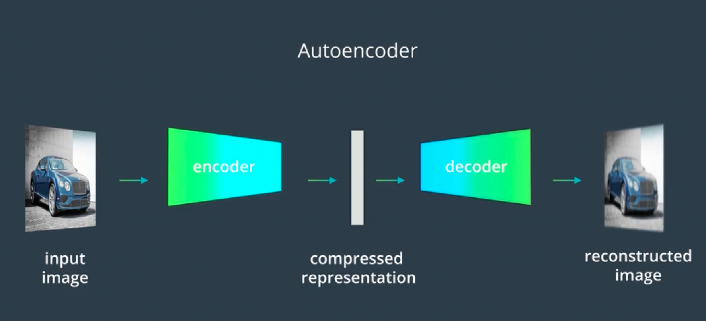

They have many applications, such as:

- Denoising: since the network learns to menaingfully compress the input, we remain only with the relevant representative information, i.e., the noise is filtered out. Thus, when decoding, we can get the denoised input.
- We can generate compressed representations and save them instead of the large raw inputs. Usually, if we want to compress to store, other approaches are used, though.
- We can encode the inputs and map them to larger spaces, such as color images from grayscale ones, large resolution images from low resolution ones, etc.
- ... and may more!

### 5.1 Simple Linear Autoencoder with MNIST - `Simple_Autoencoder_Exercise.ipynb`

This section is carried out in a notebook from

[deep-learning-v2-pytorch](https://github.com/mxagar/deep-learning-v2-pytorch) `/ autoencoders / linear-autoencoder`

An autoencoder which compresses images from the MNIST dataset is created. The key part of the notebook is the definition of the architecture: nothing special needs to be done, just the layers are arranged so that they form an autoencoder: encode image to obtain a compressed representation and the decode it.

The results seem astonishingly good: images are reconstructed very nicely! However, using CNNs with images should get even better results, at least not that blurry -- see next section.

Basic steps in the notebook:

1. Load the Dataset and Visualize Some Images
2. Define a Very Simple Autoencoder with Linear Layers
3. Training
4. Check and Visualize the Results

In the following, a summary of the notebook code:

```python
# The MNIST datasets are hosted on yann.lecun.com that has moved under CloudFlare protection
# Run this script to enable the datasets download
# Reference: https://github.com/pytorch/vision/issues/1938
from six.moves import urllib
opener = urllib.request.build_opener()
opener.addheaders = [('User-agent', 'Mozilla/5.0')]
urllib.request.install_opener(opener)

### -- 1. Load the Dataset and Visualize Some Images

import torch
import numpy as np
from torchvision import datasets
import torchvision.transforms as transforms

# convert data to torch.FloatTensor
transform = transforms.ToTensor()

# load the training and test datasets
train_data = datasets.MNIST(root='~/.pytorch/MNIST_data/', train=True,
                                   download=True, transform=transform)
test_data = datasets.MNIST(root='~/.pytorch/MNIST_data/', train=False,
                                  download=True, transform=transform)

# Create training and test dataloaders

# number of subprocesses to use for data loading
num_workers = 0
# how many samples per batch to load
batch_size = 20

# prepare data loaders
train_loader = torch.utils.data.DataLoader(train_data, batch_size=batch_size, num_workers=num_workers)
test_loader = torch.utils.data.DataLoader(test_data, batch_size=batch_size, num_workers=num_workers)

import matplotlib.pyplot as plt
%matplotlib inline
    
# obtain one batch of training images
dataiter = iter(train_loader)
images, labels = dataiter.next()
images = images.numpy()

# get one image from the batch
img = np.squeeze(images[0])

fig = plt.figure(figsize = (5,5)) 
ax = fig.add_subplot(111)
ax.imshow(img, cmap='gray')

### -- 2. Define a Very Simple Autoencoder with Linear Layers

import torch.nn as nn
import torch.nn.functional as F

# define the NN architecture
class Autoencoder(nn.Module):
    def __init__(self, encoding_dim):
        super(Autoencoder, self).__init__()
        ## encoder ##
        # 784 -> encoding_dim
        # The output of this layer of size endoding_dim
        # will be the middle comprressed representation
        self.fc1 = nn.Linear(28*28, encoding_dim)
        
        ## decoder ##
        # encoding_dim -> 784
        # We expand teh compressed representation
        self.fc2 = nn.Linear(encoding_dim, 28*28)        

    def forward(self, x):
        # define feedforward behavior 
        # and scale the *output* layer with a sigmoid activation function
        x = self.fc1(x)
        x = F.relu(x)
        x = self.fc2(x)
        # The last activation needs to be a sigmoid
        # to get values in [0,1]
        x = torch.sigmoid(x)
        
        return x

# initialize the NN
encoding_dim = 32
model = Autoencoder(encoding_dim)
print(model)
# Autoencoder(
#   (fc1): Linear(in_features=784, out_features=32, bias=True)
#   (fc2): Linear(in_features=32, out_features=784, bias=True)
# )

### -- 3. Training

# Specify loss function
# MSE: difference of both images done, sum of squared differences, averaged
criterion = nn.MSELoss()

# specify loss function
optimizer = torch.optim.Adam(model.parameters(), lr=0.001)

# number of epochs to train the model
n_epochs = 20

# The training loss decreases fast and stops decreasing after around 5 epochs
for epoch in range(1, n_epochs+1):
    # monitor training loss
    train_loss = 0.0
    
    ###################
    # train the model #
    ###################
    for data in train_loader:
        # _ stands in for labels, here
        images, _ = data
        # flatten images
        images = images.view(images.size(0), -1)
        # clear the gradients of all optimized variables
        optimizer.zero_grad()
        # forward pass: compute predicted outputs by passing inputs to the model
        outputs = model(images)
        # calculate the loss: in this case, it's not the labels which are checked
        # but the images!
        loss = criterion(outputs, images)
        # backward pass: compute gradient of the loss with respect to model parameters
        loss.backward()
        # perform a single optimization step (parameter update)
        optimizer.step()
        # update running training loss
        train_loss += loss.item()*images.size(0)
            
    # print avg training statistics 
    train_loss = train_loss/len(train_loader)
    print('Epoch: {} \tTraining Loss: {:.6f}'.format(
        epoch, 
        train_loss
        ))

### -- 4. Check and Visualize the Results

# obtain one batch of test images
dataiter = iter(test_loader)
images, labels = dataiter.next()

images_flatten = images.view(images.size(0), -1)
# get sample outputs
output = model(images_flatten)
# prep images for display
images = images.numpy()

# output is resized into a batch of images
output = output.view(batch_size, 1, 28, 28)
# use detach when it's an output that requires_grad
output = output.detach().numpy()

# plot the first ten input images and then reconstructed images
fig, axes = plt.subplots(nrows=2, ncols=10, sharex=True, sharey=True, figsize=(25,4))

# input images on top row, reconstructions on bottom
for images, row in zip([images, output], axes):
    for img, ax in zip(images, row):
        ax.imshow(np.squeeze(img), cmap='gray')
        ax.get_xaxis().set_visible(False)
        ax.get_yaxis().set_visible(False)

```

### 5.2 Autoencoders with CNNs: Upsampling for the Decoder

In order to build an Autoencoder for images, we should use CNNs, since they capture the spatial relationships much better. The **encoder** is built by a sequence of `Conv2d` and `MaxPool2d` layers. After several layers, we obtain the compressed representation of the image, which is downsampled.

Then, we need to expand that compressed vector to the size of the image with the **decoder**. To that end, we need to perform some kind of **upsampling**.

One way to achieve upsampling consists in using linear interpolation, such as nearest neighbors (i.e., nearest pixel values are copied); the result sometimes is not that good, because we loose variety in pixel values. Upsampling with linear interpolation is often combined with convolutions that do not decrease the image size (with proper padding) to modify the depth of the image.

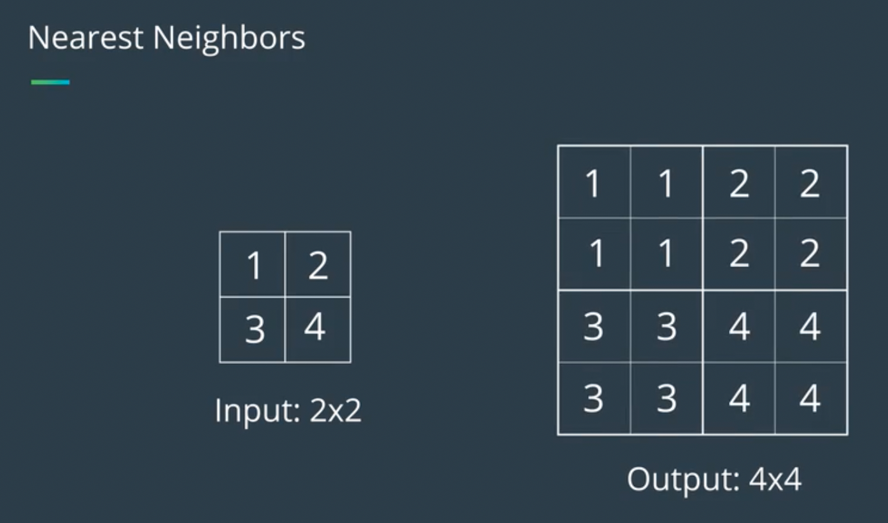

Another way for getting upsampled images consists in **transpose convolutions**, which have filters with weights that are learned. These are sometimes called *deconvolutions*; but they are not inverse convelutions! They instead expand the image.

#### Transpose Convolutional Layers

With transose convolutions, the filter is set on the target pixel and multiplied by the weights; instead of summing them, the products are the output pixel values. Thus, we get a patch of pixels from one pixel. Then, we move the stride step in the new image and apply the same to the contiguous pixel in the old image. Depending on the stride, patches might overlap; in that case, the outputs are summed. Then, we can add or substract padding.

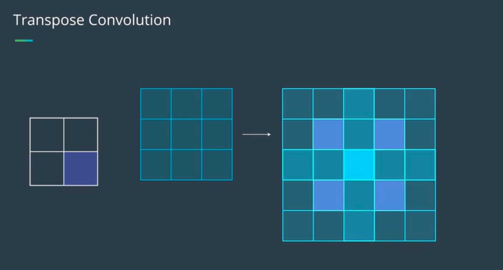

Typically, transpose convolutions have filters that are 2x2 and a stride of 2: that accomplishes doubling the size of the image without overlapping patches.

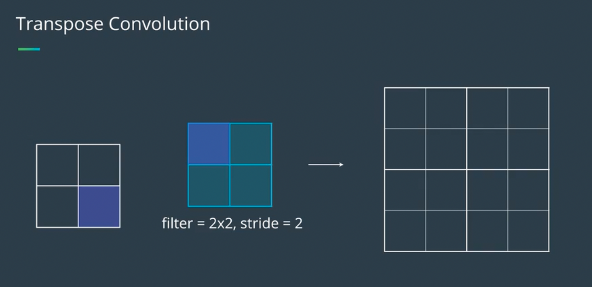

In summary, the weights of the transpose convolution layer are learned to expand from one pixel to a patch and using 2x2 filters with a stride of 2 doubles the image.

In Pytorch, transpose convolutions are defined with `ConvTranspose2d`:

```python
import torch.nn as nn

# This is a transpose convolution of 2x2 swith stride 2
# which upsamples the image to the double size without overlapping.
# We need to manually specify stride=2,
# otherwise, default is stride=1!
# Similarly, note that channels start decreasing by the end,
# since we are trying to go back to the original image shape!
#
# W_out = (W_in-1)*S - 2P + (F-1) + 1
# with dilation=1 and output_padding = 0
# and:
# W: width/height
# S: stride
# P: padding
# F: filter/kernel size
#
# Thus: F=2x2, S=2
# W_out = (W_in-1)*2 - 0 + (2-1) + 1 = 2W_in
nn.ConvTranspose2d(in_channels=16, 
				   out_channels=4,
				   kernel_size=2,
				   stride=2)
				   #stride=1,
				   #padding=0,
				   #output_padding=0,
				   #groups=1,
				   #bias=True,
				   #dilation=1,
				   #padding_mode='zeros'
				   #...
```

### 5.3 CNN Autoencoder with MNIST

This section is carried out in notebooks from

[deep-learning-v2-pytorch](https://github.com/mxagar/deep-learning-v2-pytorch) `/ autoencoders / convolutional-autoencoder`:

- `Convolutional_Autoencoder_Exercise.ipynb`
- `Upsampling_Solution.ipynb`

The notebook is basically the same as the previous one, but this time a **convolutional autoencoder** needs to be implemented.

First, the following the given architecture is used, applying **transpose convolutions**; then **upsampling** is applied.

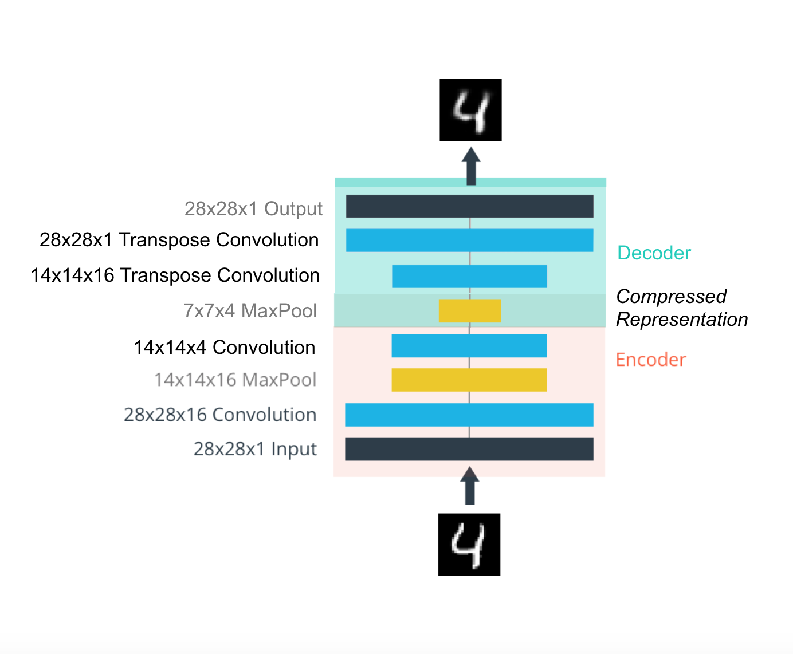

In both cases, the differential significant new part is the architecture definition, shown below.

**Solution with CNN + Transpose Convolutions**:

```python
import torch.nn as nn
import torch.nn.functional as F

# define the NN architecture
class ConvAutoencoder(nn.Module):
    def __init__(self):
        super(ConvAutoencoder, self).__init__()
        ## encoder layers ##

        # 1 input image channel (grayscale)
        # 16 output channels/feature maps
        # 3x3 square convolution kernel
        # W_out = (W_in + 2P - F)/S + 1
        # W_out: (input_size + 2*1 - 3)/1 + 1 = input_size = 28
        self.conv1 = nn.Conv2d(in_channels=1, out_channels=16, stride=1, kernel_size=3, padding=1)

        # maxpool layer
        # pool with kernel_size=2, stride=2
        # output size: W_in / 2 = 14
        # Note: there is no relu after MaxPool2d!
        self.pool = nn.MaxPool2d(2, 2)

        # 16 input image channel (grayscale)
        # 4 output channels/feature maps
        # 3x3 square convolution kernel
        # W_out = (W_in + 2P - F)/S + 1
        # W_out: (W_in + 2*1 - 3)/1 + 1 = W_in = 14
        self.conv2 = nn.Conv2d(in_channels=16, out_channels=4, stride=1, kernel_size=3, padding=1)
        
        ## decoder layers ##
        # This is a transpose convolution of 2x2 swith stride 2
        # which upsamples the image to the double size without overlapping.
        # We need to manually specify stride=2,
        # otherwise, default is stride=1!
        # Similarly, note that channels start decreasing by the end,
        # since we are trying to go back to the original image shape!
        self.t_conv1 = nn.ConvTranspose2d(in_channels=4,
                                          out_channels=16,
                                          kernel_size=2,
                                          stride=2)

        self.t_conv2 = nn.ConvTranspose2d(in_channels=16,
                                          out_channels=1,
                                          kernel_size=2,
                                          stride=2)

    def forward(self, x):
        ## encode ##
        
        # conv 1 with relu + pool layer
        x = self.pool(F.relu(self.conv1(x)))
        # conv 2 with relu + pool layer
        x = self.pool(F.relu(self.conv2(x))) # compressed representation
        
        ## decode ##

        x = F.relu(self.t_conv1(x))
        # output layer (with sigmoid for scaling from 0 to 1)
        x = torch.sigmoid(self.t_conv2(x))
                
        return x

# initialize the NN
model = ConvAutoencoder()
print(model)
# ConvAutoencoder(
#   (conv1): Conv2d(1, 16, kernel_size=(3, 3), stride=(1, 1), padding=(1, 1))
#   (pool): MaxPool2d(kernel_size=2, stride=2, padding=0, dilation=1, ceil_mode=False)
#   (conv2): Conv2d(16, 4, kernel_size=(3, 3), stride=(1, 1), padding=(1, 1))
#   (t_conv1): ConvTranspose2d(4, 16, kernel_size=(2, 2), stride=(2, 2))
#   (t_conv2): ConvTranspose2d(16, 1, kernel_size=(2, 2), stride=(2, 2))
# )
```

The result is better than the one of MLPs, but there are some small artifacts in some images. These artifacts are solved in this case using **upsampling**. Note that `upsample` is a function, hence, we don't need to define it as a layer. However, we do need to add a `Conv2d` for each `upsample` in order to modify the depth of the imges/feature maps.

```python
import torch.nn as nn
import torch.nn.functional as F

# define the NN architecture
class ConvAutoencoder(nn.Module):
    def __init__(self):
        super(ConvAutoencoder, self).__init__()
        ## encoder layers ##
        # conv layer (depth from 1 --> 16), 3x3 kernels
        self.conv1 = nn.Conv2d(1, 16, 3, padding=1)  
        # conv layer (depth from 16 --> 8), 3x3 kernels
        self.conv2 = nn.Conv2d(16, 4, 3, padding=1)
        # pooling layer to reduce x-y dims by two; kernel and stride of 2
        self.pool = nn.MaxPool2d(2, 2)
        
        ## decoder layers ##
        # Upsampling with interpolation is applied with a function,
        # but we need to apply convolutions on top in order to
        # modify the number of channels.
        self.conv4 = nn.Conv2d(4, 16, 3, padding=1)
        self.conv5 = nn.Conv2d(16, 1, 3, padding=1)
        

    def forward(self, x):
        # add layer, with relu activation function
        # and maxpooling after
        x = F.relu(self.conv1(x))
        x = self.pool(x)
        # add hidden layer, with relu activation function
        x = F.relu(self.conv2(x))
        x = self.pool(x)  # compressed representation
        
        ## decoder 
        # Upsample, followed by a conv layer, with relu activation function.
        # This function is called `interpolate` in some PyTorch versions.
        # The convolution does not change the image size,
        # but it modifies the depth (i.e., the number of channels).
        x = F.upsample(x, scale_factor=2, mode='nearest')
        x = F.relu(self.conv4(x))
        # Upsample again, output should have a sigmoid applied.
        x = F.upsample(x, scale_factor=2, mode='nearest')
        x = F.sigmoid(self.conv5(x))
        
        return x

# initialize the NN
model = ConvAutoencoder()
print(model)
# ConvAutoencoder(
#   (conv1): Conv2d(1, 16, kernel_size=(3, 3), stride=(1, 1), padding=(1, 1))
#   (conv2): Conv2d(16, 4, kernel_size=(3, 3), stride=(1, 1), padding=(1, 1))
#   (pool): MaxPool2d(kernel_size=2, stride=2, padding=0, dilation=1, ceil_mode=False)
#   (conv4): Conv2d(4, 16, kernel_size=(3, 3), stride=(1, 1), padding=(1, 1))
#   (conv5): Conv2d(16, 1, kernel_size=(3, 3), stride=(1, 1), padding=(1, 1))
# )
```

### 5.4 CNN Denoising Autoencoder with MNIST

This section uses a notebook from 

[deep-learning-v2-pytorch](https://github.com/mxagar/deep-learning-v2-pytorch) `/ autoencoders / denoising-autoencoder`.

The code is very similar to the previous MNIST notebooks; however, this time we train the network to remove noise from MNSIT images. To achieve that a complex convolutional autoencoder is defined: 

- Three convolutional layers starting witha peth of 32 are defined in the encoder
- Three transpose convolutions are defined for the ddecoder.

Additionally, during training, noise is added to the images fed to the network; then, the output is compared to the original noise-free images in the loss computation. Thus, we optimize the network to remove noise.

```python
noisy_imgs = images + noise_factor * torch.randn(*images.shape)
outputs = model(noisy_imgs)
loss = criterion(outputs, images)
```

In the following, the three most important parts of the notebook are collected:

1. Network Definition
2. Training
3. Check Results

The rest of the parts is similar (if not identical) to the rest of the notebooks in the section.

```python

### -- Network Definition

import torch.nn as nn
import torch.nn.functional as F

# define the NN architecture
# we should use at least 3 convolutions in the encoder and similarly 3 steps in the decoder
# we should directly generate a depth of 32 in the first encoder convolution
class ConvDenoiser(nn.Module):
    def __init__(self):
        super(ConvDenoiser, self).__init__()
        ## encoder layers ##
        # conv layer (depth from 1 --> 32), 3x3 kernels
        self.conv1 = nn.Conv2d(1, 32, 3, padding=1)  
        # conv layer (depth from 32 --> 16), 3x3 kernels
        self.conv2 = nn.Conv2d(32, 16, 3, padding=1)
        # conv layer (depth from 16 --> 8), 3x3 kernels
        self.conv3 = nn.Conv2d(16, 8, 3, padding=1)
        # pooling layer to reduce x-y dims by two; kernel and stride of 2
        self.pool = nn.MaxPool2d(2, 2)
        
        ## decoder layers ##
        # transpose layer, a kernel of 2 and a stride of 2 will increase the spatial dims by 2
        self.t_conv1 = nn.ConvTranspose2d(8, 8, 3, stride=2)  # kernel_size=3 to get to a 7x7 image output
        # two more transpose layers with a kernel of 2
        self.t_conv2 = nn.ConvTranspose2d(8, 16, 2, stride=2)
        self.t_conv3 = nn.ConvTranspose2d(16, 32, 2, stride=2)
        # one, final, normal conv layer to decrease the depth
        self.conv_out = nn.Conv2d(32, 1, 3, padding=1)


    def forward(self, x):
        ## encode ##
        # add hidden layers with relu activation function
        # and maxpooling after
        x = F.relu(self.conv1(x))
        x = self.pool(x)
        # add second hidden layer
        x = F.relu(self.conv2(x))
        x = self.pool(x)
        # add third hidden layer
        x = F.relu(self.conv3(x))
        x = self.pool(x)  # compressed representation
        
        ## decode ##
        # add transpose conv layers, with relu activation function
        x = F.relu(self.t_conv1(x))
        x = F.relu(self.t_conv2(x))
        x = F.relu(self.t_conv3(x))
        # transpose again, output should have a sigmoid applied
        x = torch.sigmoid(self.conv_out(x))
                
        return x

# initialize the NN
model = ConvDenoiser()
print(model)
# ConvDenoiser(
#   (conv1): Conv2d(1, 32, kernel_size=(3, 3), stride=(1, 1), padding=(1, 1))
#   (conv2): Conv2d(32, 16, kernel_size=(3, 3), stride=(1, 1), padding=(1, 1))
#   (conv3): Conv2d(16, 8, kernel_size=(3, 3), stride=(1, 1), padding=(1, 1))
#   (pool): MaxPool2d(kernel_size=2, stride=2, padding=0, dilation=1, ceil_mode=False)
#   (t_conv1): ConvTranspose2d(8, 8, kernel_size=(3, 3), stride=(2, 2))
#   (t_conv2): ConvTranspose2d(8, 16, kernel_size=(2, 2), stride=(2, 2))
#   (t_conv3): ConvTranspose2d(16, 32, kernel_size=(2, 2), stride=(2, 2))
#   (conv_out): Conv2d(32, 1, kernel_size=(3, 3), stride=(1, 1), padding=(1, 1))
# )

### -- Training

# specify loss function
criterion = nn.MSELoss()

# specify loss function
optimizer = torch.optim.Adam(model.parameters(), lr=0.001)

# number of epochs to train the model
n_epochs = 20

# for adding noise to images
noise_factor=0.5

for epoch in range(1, n_epochs+1):
    # monitor training loss
    train_loss = 0.0
    
    ###################
    # train the model #
    ###################
    for data in train_loader:
        # _ stands in for labels, here
        # no need to flatten images
        images, _ = data
        
        ## add random noise to the input images
        noisy_imgs = images + noise_factor * torch.randn(*images.shape)
        # Clip the images to be between 0 and 1
        noisy_imgs = np.clip(noisy_imgs, 0., 1.)
                
        # clear the gradients of all optimized variables
        optimizer.zero_grad()
        ## forward pass: compute predicted outputs by passing *noisy* images to the model
        outputs = model(noisy_imgs)
        # calculate the loss
        # the "target" is still the original, not-noisy images
        loss = criterion(outputs, images)
        # backward pass: compute gradient of the loss with respect to model parameters
        loss.backward()
        # perform a single optimization step (parameter update)
        optimizer.step()
        # update running training loss
        train_loss += loss.item()*images.size(0)
            
    # print avg training statistics 
    train_loss = train_loss/len(train_loader)
    print('Epoch: {} \tTraining Loss: {:.6f}'.format(
        epoch, 
        train_loss
        ))

### -- Check Results

# obtain one batch of test images
dataiter = iter(test_loader)
images, labels = dataiter.next()

# add noise to the test images
noisy_imgs = images + noise_factor * torch.randn(*images.shape)
noisy_imgs = np.clip(noisy_imgs, 0., 1.)

# get sample outputs
output = model(noisy_imgs)
# prep images for display
noisy_imgs = noisy_imgs.numpy()

# output is resized into a batch of iages
output = output.view(batch_size, 1, 28, 28)
# use detach when it's an output that requires_grad
output = output.detach().numpy()

# plot the first ten input images and then reconstructed images
fig, axes = plt.subplots(nrows=2, ncols=10, sharex=True, sharey=True, figsize=(25,4))

# input images on top row, reconstructions on bottom
for noisy_imgs, row in zip([noisy_imgs, output], axes):
    for img, ax in zip(noisy_imgs, row):
        ax.imshow(np.squeeze(img), cmap='gray')
        ax.get_xaxis().set_visible(False)
        ax.get_yaxis().set_visible(False)

```


## 6. Style Transfer

The key of style transfer consists in separating the content and the style of an image. When we achieve this, we can merge the content from an image with the style of another one.

With CNNs, the deeper we go in the layers, the more relevant becomes the **content** in the feature maps. Max pooling layers play a fundamental role in discarding irrelevant information for classification. In style transfer, the deep feature maps are often called **content representations**.

**Style**, on the other hand, can be understood as the brush strokes of a painting: texture, colors, curvatures, etc. Thus, in order to detect style, a feature space designed to capture such features (texture, colors, curvatures) is used; concretely, this space looks for **correlations between the feature maps**. In other words, we see which features in one map are related with another map in the same layer. If there are common features (i.e., high correlations), then, these feature can be understood as part of the image style.

In style transfer we have three images: 

1. The **content image**: object shape and arrangement are taken.
2. The **style image**: colors and textures are taken.
3. The **target image**: the content of one and the style of the other are merged.

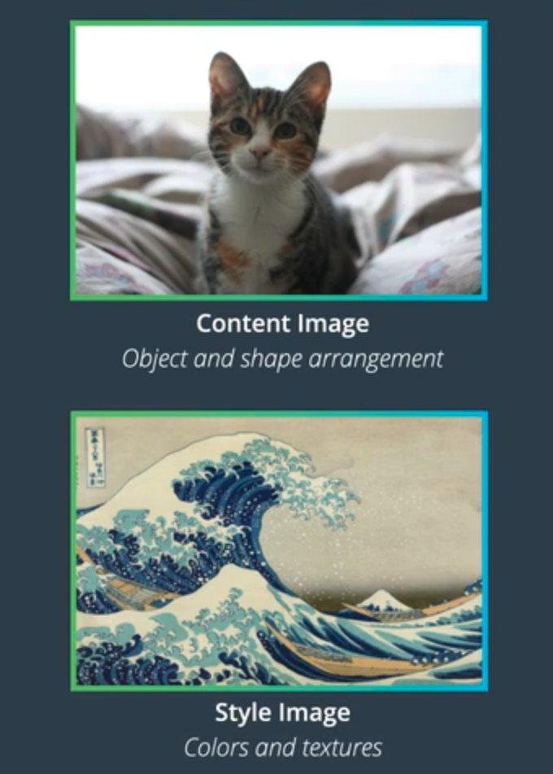

The rest of the section is based on the paper by Gatys et al. that can be found in the `literature/` forlder. The notebooks in 

[deep-learning-v2-pytorch](https://github.com/mxagar/deep-learning-v2-pytorch) `/ autoencoders / style-transfer`

apply the insights of the paper to perform style transfer using the VGG19 network.

### 6.1 VGG19 and Content Loss

We are going to use the VGG19 network to extract style and content from images. The VGG19 is composed of 19 layers; layers are grouped in stacks which contain several convolutions followed by max-pooling.


The feature layer stacks are: `conv1`, `conv2`, `conv3`, `conv4`, `conv5`. Recall: the deeper we go, the closer we are to the image content.

In particular, Gatys et al. take the layer `conv4_2` from the 4th stack to be the **content representation** layer.

The idea is that the content representation of the **content image** and the **target image** should be similar, no matter the style of both. For that the **content loss** is defined as the MSE of the content representation maps of both images. Our aim is to minimize this loss. However, we do not update the weights to that end, but we change the target image so that the content loss is minimized!

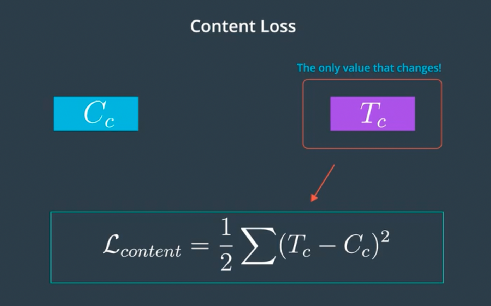


### 6.2 Style of an Image: The Gram Matrix

Similarly as we compare the content representation of the target and the content image, we need to compare the style representation of the style and the target image. Gatys et al. found that the visually most appealing results emerged observing the layers `conv1_1`, `conv2_1`, `conv3_1`, `conv4_1`, `conv5_1`.

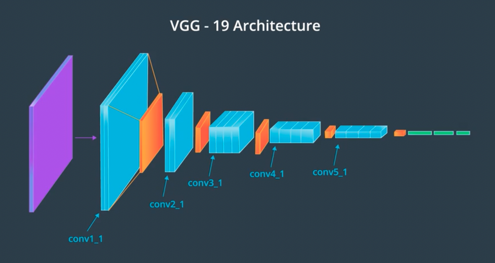

Note that these layers have different sizes, thus, we obtain multi-scale style features.

In order to capture style, the image is passed, the feature maps are computed and the correlations between them are calculated; high correlations indicate style. In order to compute the correlations, the **Gram matrix** is formed for each of the feature maps.

Let's say a selected layer has the shape `w x h x d`; we have `d` feature maps in it (depth of channels). To compute ther Gram matrix of that set of feature maps, we flatten or vectorize them, so that each map is a row in a matrix `M`. The flattening is done in row-major order:

```
M = [[m_111, m_121, ..., m_wh1],
	 [m_112, m_122, ..., m_wh2],
	 ...	
	 [m_11d, m_12d, ..., m_whd]]

M: d x (w*h)

[m_111, m_121, ..., m_wh1] : 1 x (w*h), vectorized feature map
```

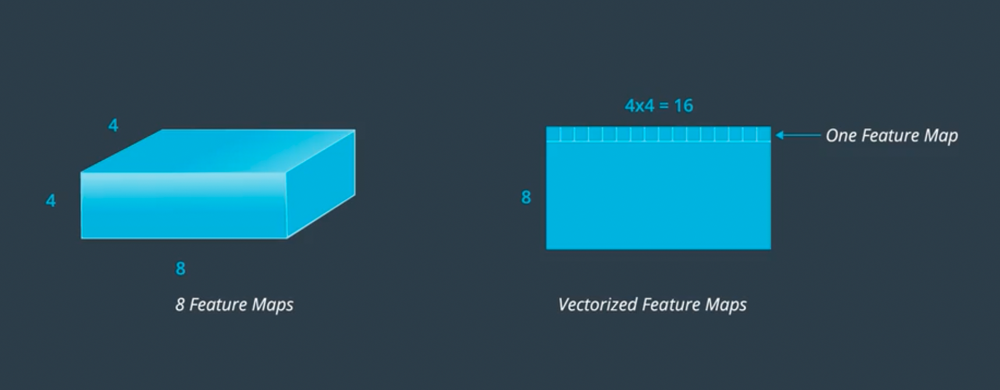

Then, the Gram matrix is:


```
G = M * M^T

G: d x d
```

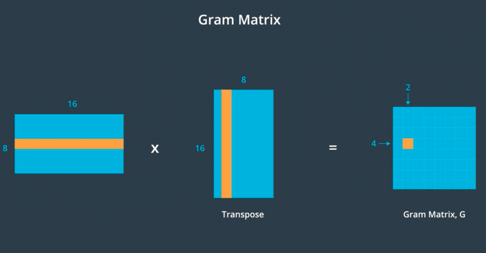

Notes:

- The Gram matrix is always square and its size is the number of channels / depth of the layer, i.e., the number of feature maps in a layer.
- Each value of the Gram matrix measures the similarity between two different feature maps in the same layer, beacuse its the dot product of their flattened vectors.
- The matrix M contains non-localized information of the feature maps, i.e., information that would be there even if we shuffled the image content in the space! Thus, that is related to the style.
- The Gram matrix is a popular way of capturing style, but there are other ways, too.

Now, similarly as with the content, we pass the target and the stlye image, compute their Gram matrices, and calculate the style loss with the difference between them, using the MSE metric. Note that in the case of the style, each of the selected feature maps gets a weighting factor. 

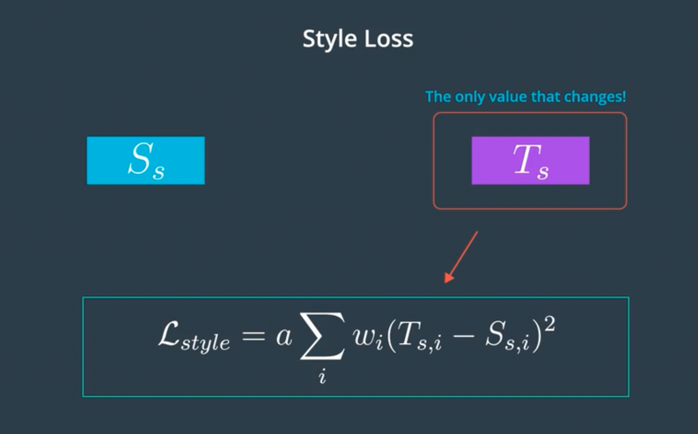

This loss is used to change the target image so that the style loss is minimized.

#### Total Loss

In summary, we have two losses and the total loss is the sum of both:

- the content loss is obtained passing the target and the content image throgh VGG19
- the style loss in obtained passing the target and the style image through VGG19

We compute the total loss and use backpropagation & optimization to obtain the changes necessary in the target image so that the total loss is minimized.

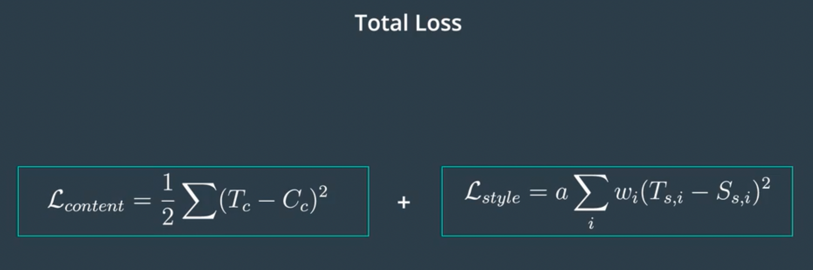

However, note that both losses are weighted, too: `alpha` for the content weight, `beta` for the style weight. In practice, a ratio of `alpha/beta = 0.1` leads to nice visual results. That is: the loss of the style has 10x more weight than that of the content. Larger `beta` values lead to images that have more style and less traces of the content.

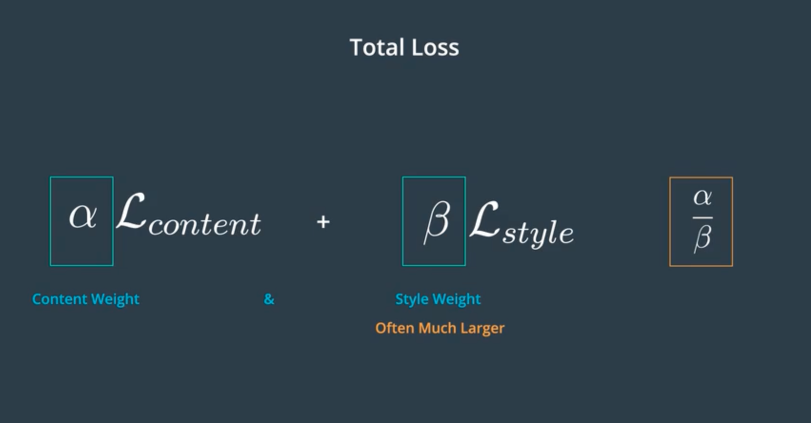

### 6.3 Style Transfer in Pytorch: Notebook

Very interesting: implementation of the whole Section 6.

[deep-learning-v2-pytorch](https://github.com/mxagar/deep-learning-v2-pytorch/) `/ style-transfer`

In this notebook, the paper by Gatys et al. that was introduced in this section so far is implemented / replicated.

The VGG19 network is used to extract style and content from images. The VGG19 is composed of 19 layers; layers are grouped in stacks which contain several convolutions followed by max-pooling.


The **style** feature layers are: `conv1_1`, `conv2_1`, `conv3_1`, `conv4_1`, `conv5_1`. Recall: the deeper we go, the closer we are to the image content.

In particular, Gatys et al. take the layer `conv4_2` from the 4th stack to be the **content representation** layer.

In summary, the notebook performs the following steps:

1. Load Pre-Trained VGG19
2. Load Content and Style Images
3. Extract Content and Style Feature Maps and Generate Gramm Matrices
4. Target Update Loop: Merging of the Images
5. Display the Final Target Image

I carried out the optimization in the Jetson Nano:


```python
# import resources
%matplotlib inline

from PIL import Image
from io import BytesIO
import matplotlib.pyplot as plt
import numpy as np

import torch
import torch.optim as optim
import requests
from torchvision import transforms, models

### -- 1. Load Pre-Trained VGG19

# The style and the content are captured only in the convolutional and pooling layers
# so we use the VGG19 as a feature extractor.
# Get the "features" portion of VGG19 (we will not need the "classifier" portion)
vgg = models.vgg19(pretrained=True).features

# Freeze all VGG parameters since we're only optimizing the target image
for param in vgg.parameters():
    param.requires_grad_(False)

# move the model to GPU, if available
device = torch.device("cuda" if torch.cuda.is_available() else "cpu")
vgg.to(device)

### -- 2. Load Content and Style Images

def load_image(img_path, max_size=400, shape=None):
    ''' Load in and transform an image, making sure the image
       is <= 400 pixels in the x-y dims.'''
    if "http" in img_path:
        response = requests.get(img_path)
        image = Image.open(BytesIO(response.content)).convert('RGB')
    else:
        image = Image.open(img_path).convert('RGB')
    
    # large images will slow down processing
    if max(image.size) > max_size:
        size = max_size
    else:
        size = max(image.size)
    
    if shape is not None:
        size = shape
        
    in_transform = transforms.Compose([
                        transforms.Resize(size),
                        transforms.ToTensor(),
                        transforms.Normalize((0.485, 0.456, 0.406), 
                                             (0.229, 0.224, 0.225))])

    # discard the transparent, alpha channel (that's the :3) and add the batch dimension
    image = in_transform(image)[:3,:,:].unsqueeze(0)
    
    return image

# load in content and style image
content = load_image('images/octopus.jpg').to(device)
# Resize style to match content, makes code easier
style = load_image('images/hockney.jpg', shape=content.shape[-2:]).to(device)

# helper function for un-normalizing an image 
# and converting it from a Tensor image to a NumPy image for display
def im_convert(tensor):
    """ Display a tensor as an image. """
    
    image = tensor.to("cpu").clone().detach()
    image = image.numpy().squeeze()
    image = image.transpose(1,2,0)
    image = image * np.array((0.229, 0.224, 0.225)) + np.array((0.485, 0.456, 0.406))
    image = image.clip(0, 1)

    return image

# display the images
fig, (ax1, ax2) = plt.subplots(1, 2, figsize=(20, 10))
# content and style ims side-by-side
ax1.imshow(im_convert(content))
ax2.imshow(im_convert(style))

### -- 3. Extract Content and Style Feature Maps and Generate Gramm Matrices

# Print out VGG19 structure so you can see the names of various layers
print(vgg)

# Define a function which extracts feature maps given a model and an image
def get_features(image, model, layers=None):
    """ Run an image forward through a model and get the features for 
        a set of layers. Default layers are for VGGNet matching Gatys et al (2016)
    """
    
    ## Complete mapping layer names of PyTorch's VGGNet to names from the paper
    ## Need the layers for the content and style representations of an image
    if layers is None:
        layers = {'0': 'conv1_1',
                  '5': 'conv2_1',
                  '10': 'conv3_1',
                  '19': 'conv4_1',
                  '21': 'conv4_2', # content representation
                  '28': 'conv5_1'}
        
        
    features = {}
    x = image
    # model._modules is a dictionary holding each module in the model
    # We pass the image sequentially through all modules/layers
    # If a layer is a selectd one, we take the feature maps
    for name, layer in model._modules.items():
        x = layer(x)
        if name in layers:
            features[layers[name]] = x
            
    return features

# Define a function which computes the Gramm matrix of a feature map
def gram_matrix(tensor):
    """ Calculate the Gram Matrix of a given tensor 
        Gram Matrix: https://en.wikipedia.org/wiki/Gramian_matrix
    """
    # Get the batch_size, depth, height, and width of the Tensor
    batch_size, d, h, w = tensor.size()
    # Reshape it, so we're multiplying the features for each channel
    # We can ignore the batch size, because we are passing a single image!
    # However, if batched images were passed, we could still apply matrix multiplication
    #tensor = tensor.view(batch_size, d, h*w)
    tensor = tensor.view(d, h*w)
    # Calculate the Gram matrix
    # Batched matrices: multiplication is done for each batch
    # However, we ignore the batch, because we have removed it
    gram = torch.matmul(tensor,tensor.t())
    
    return gram 

# Generate content and style features as well as style Gramm matrices

# Get content and style features only once before forming the target image
# features_style_conv1_1 <- style_features['conv1_1']
# is the corresponding feature map of the style image
content_features = get_features(content, vgg)
style_features = get_features(style, vgg)

# Calculate the gram matrices for each layer of our style representation
# gramm_style_conv1_1 <- style_grams['conv1_1']
# is the Gramm matrix of the style images corresponding feature map
# Note that we compute the Gramm matrix of of the conv4_2,
# but we won't use it, because it's the content representation
style_grams = {layer: gram_matrix(style_features[layer]) for layer in style_features}

# Create a third "target" image and prepare it for change
# It is a good idea to start off with the target as a copy of our *content* image,
# then iteratively change its style.
target = content.clone().requires_grad_(True).to(device)

### -- 4. Target Update Loop: Merging of the Images

# Weights for each style layer 
# Weighting earlier layers more will result in *larger* style artifacts
# Notice we are excluding `conv4_2` our content representation
style_weights = {'conv1_1': 1.,
                 'conv2_1': 0.8, #0.75
                 'conv3_1': 0.5, #0.2
                 'conv4_1': 0.3, #0.2
                 'conv5_1': 0.1} #0.2

# You may choose to leave these as is
content_weight = 1  # alpha
style_weight = 1e6  # beta

# for displaying the target image, intermittently
show_every = 400

# iteration hyperparameters
optimizer = optim.Adam([target], lr=0.003)
steps = 2000  # decide how many iterations to update your image (5000)

for ii in range(1, steps+1):
    
    # The Content Loss
    # Get the features from your target image    
    target_features = get_features(target, vgg)
    # Then calculate the content loss
    content_loss = torch.mean((target_features['conv4_2'] - content_features['conv4_2'])**2)
    
    # The Style Loss
    # Initialize the style loss to 0
    style_loss = 0
    # Iterate through each style layer and add to the style loss
    for layer in style_weights:
        # Get the "target" style representation for the layer
        target_feature = target_features[layer]
        _, d, h, w = target_feature.shape
        
        # Calculate the target gram matrix
        target_gram = gram_matrix(target_feature)
        
        # Get the "style" style representation
        style_gram = style_grams[layer]
        # Calculate the style loss for one layer, weighted appropriately
        layer_style_loss = style_weights[layer]*torch.mean((target_gram - style_gram)**2)
        
        # Add to the style loss
        style_loss += layer_style_loss / (d * h * w)
        
        
    # Calculate the *total* loss
    total_loss = content_weight*content_loss + style_weight*style_loss
    
    ## -- do not need to change code, below -- ##
    # update your target image
    optimizer.zero_grad()
    total_loss.backward()
    optimizer.step()
    
    # display intermediate images and print the loss
    if  ii % show_every == 0:
        print('Total loss: ', total_loss.item())
        plt.imshow(im_convert(target))
        plt.show()

### -- 5. Display the Final Target Image

# display content and final, target image
fig, (ax1, ax2) = plt.subplots(1, 2, figsize=(20, 10))
ax1.imshow(im_convert(content))
ax2.imshow(im_convert(target))

```

## 7. Project: Dog-Breed Classifier

The project repository is:

[deep-learning-v2-pytorch](https://github.com/mxagar/deep-learning-v2-pytorch) `/ project-dog-classification`

There, the instructions as well as a summary of the work can be found.

## 8. Deep Learning for Cancer Detection

This section has a mini-project associated, which is developed in the repository [dermatologist-ai](https://github.com/mxagar/dermatologist-ai).

### 8.1 Skin Cancer Details, Dataset and Model

#### Skin Cancer Detection Problem

	Melanoma causes 10.000 deaths/year in USA
		Traffic accident 40.000
	Four stages
		0. In-situ (localized spot)
		1. Superficial
		4. It has reached blood vessels (it can happen within a year)
	Survival 5 years
		Stages 0,1: 98.4%-100%
		Stage 4: 20%
		Therefore, early detection is very important!
	Very hard to distinguish a melanoma from a mole (lunar)
		dermatologists are very trained

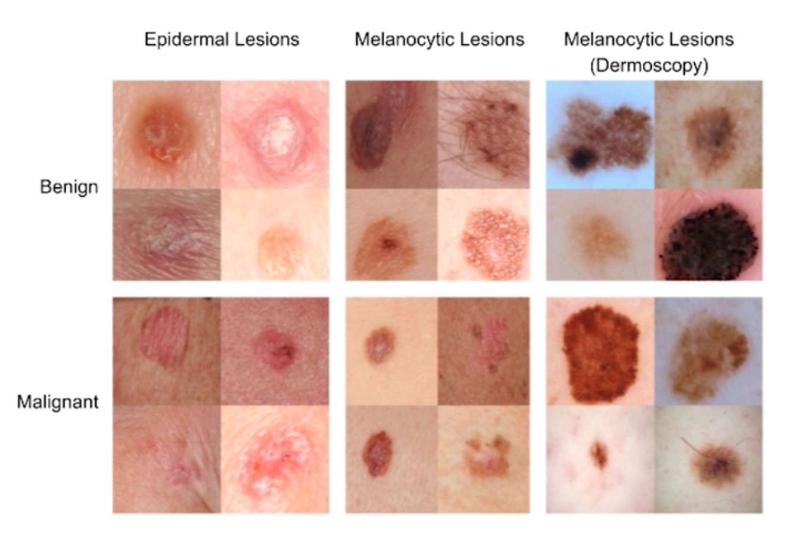

#### Dataset

	More than 20.000 labelled images collected
	The general term is skin disease
		which is broken down to benign / malign / ...
		there is a classification tree which comes from medicine
	There are more than 2.000 of disease classes...
		they were distilled to 757 classes
		many of the 2000 were duplicates, had missspellings, etc
	Melanoma, the worst and most lethal, is one of them
	Very challenging classification
	Additional difficulty: some images contain markers for size reference

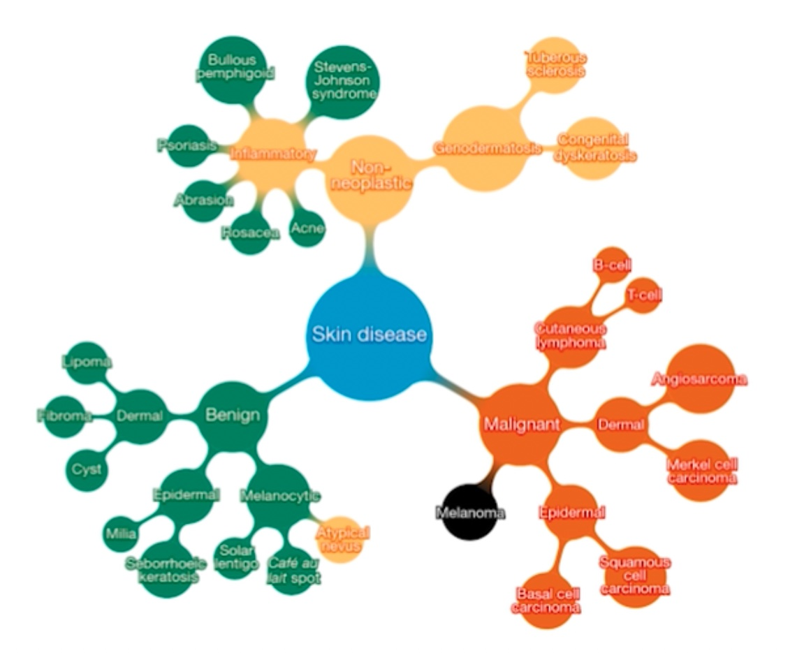


#### Network and Training
	
	Inception-v3, from Google
	They trained it 2x
		once with randomly initialized weights
		once with previoulsy trained weights - network pretrained with regular images, cats & dogs, etc.
			surprisingly, it led to better results!
			although the training images are different from the skin images,
			apparently significant features and structures are learned when observing the world

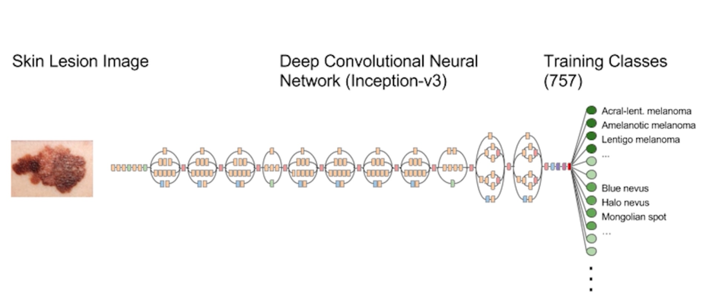


#### Validation

	Dataset was carefully cleaned
	They wanted to remove duplicates, remove yellow scaling markers, etc
	They wanted/needed to have clean and correct training and validation/test sets, independent

	After training, they achieved a better accuracy than a dermatologist
		CNN accuracy: 72%
		Dermatologist 1 accuracy: 65.6%
		Dermatologist 2 accuracy: 66.0%

	Note that they needed to classify between melanoma, benign and another lession (carcinoma)
	With the achieved results, they decided to do real experiments, larger.

### 8.2 Evaluation of Classification Models

#### Precision, Recall, Accuracy, Sensitivity, Specificity

See handwritten notes.

	Confusion matrix with
		actual truth: +, -
		predicted: +, -
		quadrants:
			true positive, TP
			false positive, FP -> type I error: conservative error
			TN
			FN -> type II error: AVOID!

	Ratios
		precision = TP / (TP + FP)
		recall = true positive rate = TP / (TP + FN)
		accuracy = (TP + TN) / All
		true negative rate = TN / (TN + FP)
		false positive rate = FP / (TN + FP)

	Sensitivity = Recall
		of all sick people, how many did we diagnose sick?
	Specificity = true negative rate
		of all healthy people, how many did we diagnose healthy?


#### Detection Score Threshold

See handwritten notes.
	
	Network output: P = probability of malignant
	Where should we put the threshold?
	Set both distributions on same axis
		bening
		malignant
	In the medical context, we should take a conservative threshold (type I error) that eliminates all FN (type II error)

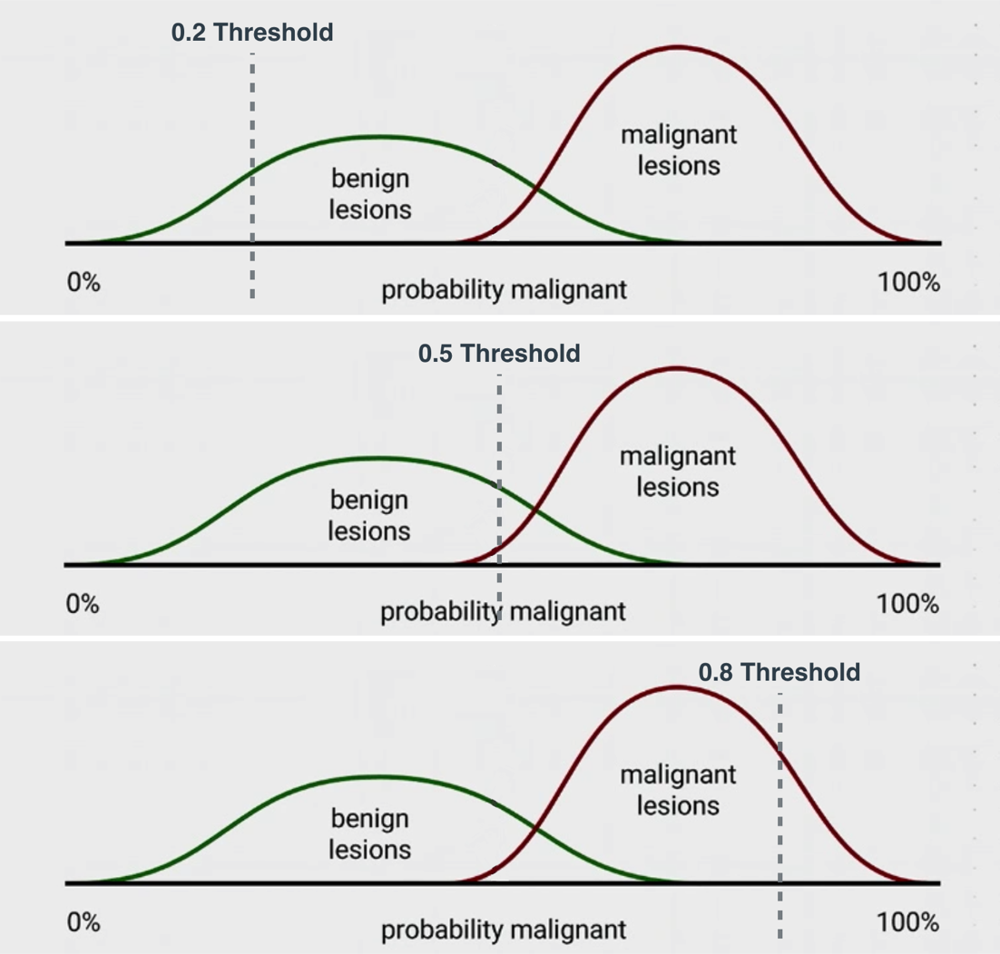


#### ROC Curve = Receiver Operating Characteristic
	
See handwritten notes.
	
	Plot that illustrates the diagnostic ability of a binary classifier.
	There are several ROC curves
		false positive rate vs true positive rate
		sesitivity vs specificity -> common in medical context

	Computed this way
		P = probability of malignant
		Set both distributions of malignant and bening on this axis
		Sweep from left to right threshold and compute the pair
			false positive rate vs true positive rate
			sesitivity vs specificity
		and plot

	Area Under the Curve (AUC) should be as close as possible to 1.0
	Important takeaway: the area NOT under the curve represents the miss-classifications.

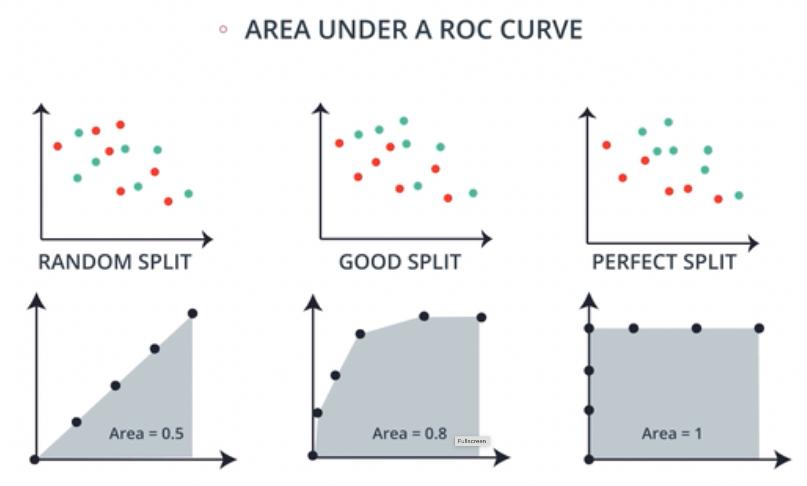

Several cases analyzed in the handwritten notes.

	Interpretation
		Specificity: high values make the overall cost more efficient
			-> related to type I error
		Sensitivity: it's critical and should be as high as possible 
			-> related to type II error

	Most of the tested 25 dermatologists were below the ROC curve
		the spread is quite large
		it seems some have a lower sensitivity: is it because it is costly for the insurance companies to run more tests?

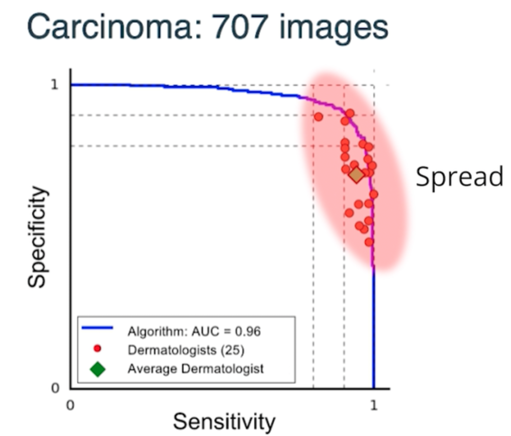

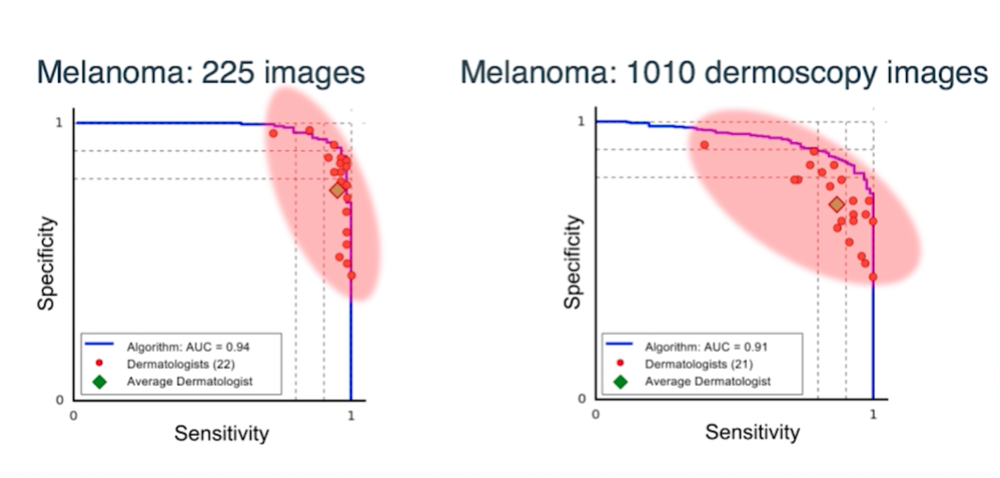

#### Visualization

See handwritten notes.
	
	t-SNE
	Sesibility analysis
		change samples and observe change in class output to understand what is the net looking at
		-> heatmaps, saliency maps

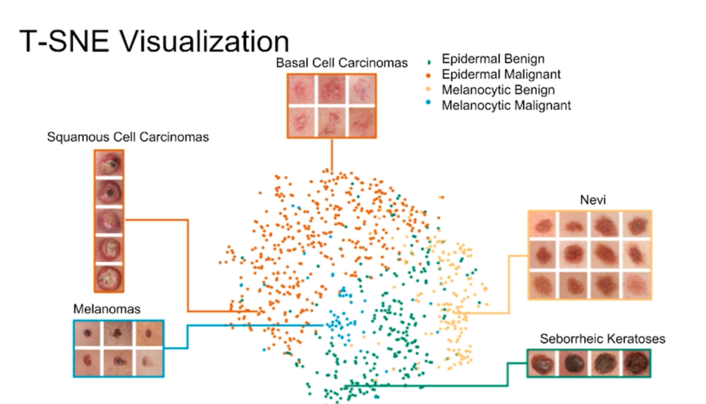

#### Confusion Matrix	

See handwritten notes.
	
	If we have several classes, they tell as the probability of patients having A while they're diagnosed with B

	The confusion matrix should as close as possible to the identity, and in any case the less sparse possible

	The two tested dermatologists had a more sparse confusion matrix than the network 

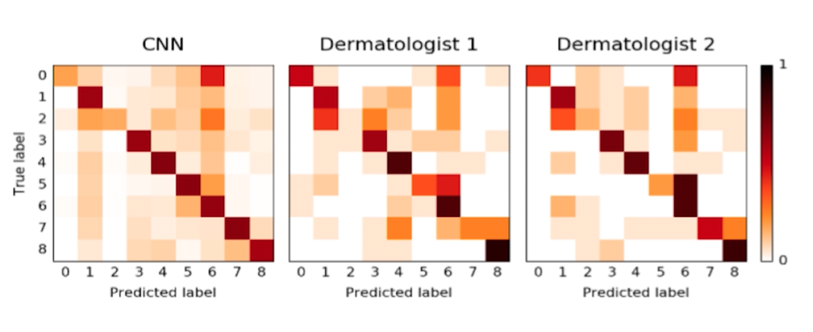

### 8.3 Additional Resources

The Nature paper by Sebastian Thrun et al. is in the folder `literature/`:

`EstevaThrun_SkinCancerDetectionNN_Nature_2017.pdf`

Additional links provided by Udacity:

- [Nature Paper: Dermatologist-level classification of skin cancer with deep neural networks](https://www.nature.com/articles/nature21056.epdf?author_access_token=8oxIcYWf5UNrNpHsUHd2StRgN0jAjWel9jnR3ZoTv0NXpMHRAJy8Qn10ys2O4tuPakXos4UhQAFZ750CsBNMMsISFHIKinKDMKjShCpHIlYPYUHhNzkn6pSnOCt0Ftf6)
- [Fortune: Stanford’s Artificial Intelligence Is Nearly as Good as Your Dermatologist](https://fortune.com/2017/01/26/stanford-ai-skin-cancer/)
- [Bloomberg: Diagnosing Skin Cancer With Google Images](https://www.bloomberg.com/news/articles/2017-06-29/diagnosing-skin-cancer-with-google-images)
- [BBC: Artificial intelligence 'as good as cancer doctors'](https://www.bbc.com/news/health-38717928)
- [Wall Street Journal: Computers Turn Medical Sleuths and Identify Skin Cancer](https://www.wsj.com/articles/computers-turn-medical-sleuths-and-identify-skin-cancer-1486740634?emailToken=JRrzcPt+aXiegNA9bcw301gwc7UFEfTMWk7NKjXPN0TNv3XR5Pmlyrgph8DyqGWjAEd26tYY7mAuACbSgWwvV8aXkLNl1A74KycC8smailE=)
- [Forbes: What Can Computer Vision Do In The Palm Of Your Hand?](https://www.forbes.com/sites/forbestechcouncil/2017/09/27/what-can-computer-vision-do-in-the-palm-of-your-hand/?sh=7652637547a7)
- [Scientific American: Deep-Learning Networks Rival Human Vision](https://www.scientificamerican.com/article/deep-learning-networks-rival-human-vision1/)


### 8.4 Mini-Project

See repository: [dermatologist-ai](https://github.com/mxagar/dermatologist-ai).

## 9. Jobs in Deep Learning

Done; uninteresting to me.

## 10. Project: Optimize Your GitHub Profile

Done; uninteresting to me.

