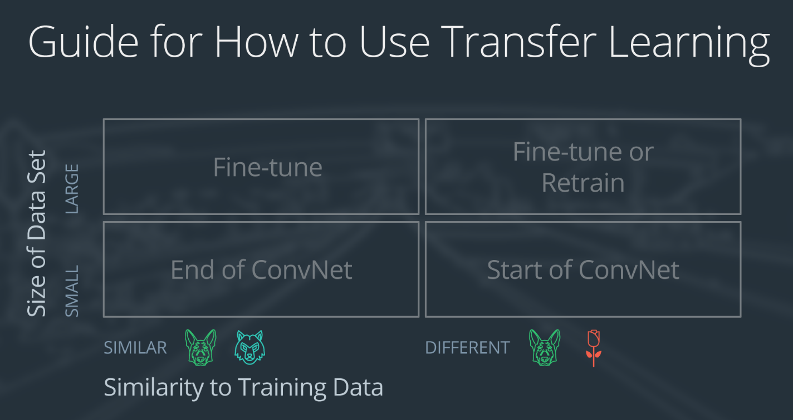

# Pytorch Guide

These are my personal notes taken while following the [Udacity Deep Learning Nanodegree](https://www.udacity.com/course/deep-learning-nanodegree--nd101).

The nanodegree is composed of six modules:

1. Introduction to Deep Learning
2. Neural Networks and Pytorch Guide
3. Convolutonal Neural Networks (CNN)
4. Recurrent Neural Networks (RNN)
5. Generative Adversarial Networks (GAN)
6. Deploying a Model

Each module has a folder with its respective notes. This folder is the one of the **third module**: Convolutional Neural Networks.

Additionally, note that:

- I made many hand-written nortes, which I will scan and push to this repostory.
- I forked the Udacity repository for the exercisesl [deep-learning-v2-pytorch](https://github.com/mxagar/deep-learning-v2-pytorch); all the material and  notebooks are there.


## Overview of Contents

1. Convolutional Neural Networks
2. Cloud Computing (and GPU Workspaces): See the CVND
3. Transfer Learning
4. Weight Initialization
5. Autoencoders
6. Style Transfer
7. Project: Dog-Breed Classifier
8. Deep Learning for Cander Detection
9. Jobs in Deep Learning
10. Project: Optimize Your GitHub Profile

## 1. Convolutional Neural Networks

Many of the concepts in this module are covered in the [Udacity Computer Vision Nanodegree](https://www.udacity.com/course/computer-vision-nanodegree--nd891). See my notes on it, especially the module 1: [Introduction to Computer Vision](https://github.com/mxagar/computer_vision_udacity).

In the following, I very briefly collect the terms of known concepts and extend only in new material.

### 1.1 Applications of CNNs

Some applications and links:

- [WaveNet](https://www.deepmind.com/blog/wavenet-a-generative-model-for-raw-audio): convolutions on the sound stream are applied to synthesize speech. It can be used to generate music, too.
- Text classification; RNNs are more typical for text, though. Example repo: [CNN_Text_Classification](https://github.com/cezannec/CNN_Text_Classification).
- Image classification.
- Reinforcement learning for playing games: Games can be learned from images.
- AlphaGo also used CNNs underneath.
- Traffic sign classification: [German Traffic Sign dataset in this project](https://benchmark.ini.rub.de/?section=gtsrb&subsection=dataset); check out this [Github repo](https://github.com/udacity/CarND-Traffic-Sign-Classifier-Project)
- [Depth map prediction from a single image](https://cs.nyu.edu/~deigen/depth/).
- [Convert images into 3D maps for blind people](https://www.businessinsider.com/3d-printed-works-of-art-for-the-blind-2016-1).
- [Breast cancer detection](https://ai.googleblog.com/2017/03/assisting-pathologists-in-detecting.html).
- [FaceApp](https://www.digitaltrends.com/photography/faceapp-neural-net-image-editing/): change your face expression.

### 1.2 CNNs: Introductory Concepts

Many of the concepts in this module are covered in the [Udacity Computer Vision Nanodegree](https://www.udacity.com/course/computer-vision-nanodegree--nd891). See my notes on it, especially the module 1: [Introduction to Computer Vision](https://github.com/mxagar/computer_vision_udacity). Here, I very briefly list the concepts discussed in this section:

- MNIST dataset: what it is, sizes, etc.
- Image normalization: from 255 to 1; it improves backpropagation.
- Flattening of a 2D matrix to feed patches into fully connected networks that end up predicting class scores.
- Hidden layers: google for papers that suggest concrete numbers.
- Loss functions: Cross-Entropy loss for classification.
- Softmax function: multi-class classification.
- ReLU activation.
- Train/Test split.
- Pytorch: `CrossEntropy() == log_softmax() + NLLLoss()`.

### 1.3 MNIST MLP Exercise

The exercise notebooks are in here:

[deep-learning-v2-pytorch/tree/master/convolutional-neural-networks/mnist-mlp](https://github.com/mxagar/deep-learning-v2-pytorch/tree/master/convolutional-neural-networks/mnist-mlp)

Basically, an MLP is defined to classify MNIST digits; the code is very similar to the Section 3 in the `02_Pytorch_Guide` module of this repository.

```python

import torch.nn as nn
import torch.nn.functional as F

## Define the NN architecture
class Net(nn.Module):
    def __init__(self):
        super(Net, self).__init__()
        # Definition of hidden nodes
        hidden_1 = 512
        hidden_2 = 256

        # Linear: W(input,output), B(1,output) -> x*W + B
        # W: model.fc1.weight
        # B: model.fc1.bias        
        # First layer: input
        # 28*28 -> hidden_1 hidden nodes
        self.fc1 = nn.Linear(784, hidden_1)
        
        # Second layer: hidden
        # hidden_1 -> hidden_2
        self.fc2 = nn.Linear(hidden_1, hidden_2)

        # Output layer: units = number of classes
        # hidden_2 -> 10
        self.fc3 = nn.Linear(hidden_2, 10)
        
        # dropout layer (p=0.2)
        # dropout prevents overfitting of data
        self.dropout = nn.Dropout(0.2)
        
    def forward(self, x):
        # Pass the input tensor through each of our operations
        # Flatten image input
        x = x.view(-1, 28 * 28)
        # Add hidden layer, with relu activation function
        x = F.relu(self.fc1(x))
        x = F.relu(self.fc2(x))
        # add dropout layer
        x = self.dropout(x)
        x = self.fc3(x)
        # Final tensor should have a size batch_size x units: 64 x 10
        # dim=1: sum across columns for softmax
        x = F.softmax(x, dim=1) # alternative: x = self.softmax(x)
        
        return x

# initialize the NN
model = Net()
print(model)

## Specify loss and optimization functions
from torch import optim

# specify loss function
criterion = nn.NLLLoss()

# specify optimizer
optimizer = optim.SGD(model.parameters(), lr=0.01)
```

### 1.4 Validation

We should split out dataset in 3 exclusive groups:

1. Training split: to train.
2. Validation split: to test how well the model generalizes and to choose between hyperparameters.
3. Test split: to evaluate the final model performance.

The training is performed with the training split, while we continuously (e.g., after each epoch) check the validation loss of the model so far. If the model starts overfitting, the training loss will decrease while the validation loss will start increasing. The idea is to save the weights that yield the smallest validation loss. We can do it with early stopping or just saving the weights of the best epoch.


Additionally, we can test different hyperparameters and architectures; in that case, we choose the architecture and set hyperparameters that yield the lowest validation loss.

As we see, the final choice is influenced by teh validation split; thus, the model is balanced in favor of the validation split. That is why we need the last split, the test split: the real performance of our model needs to be validated by a dataset which has never been seen.

I understand that the 3 splits start making sense when we try different hyperparameters and architectures; otherwise, 2 splits are quite common.

Usually, the validation split is taken from the train split; especially, if we have already train and test splits. To that end, the `SubsetRandomSampler` can be used.

```python
from torchvision import datasets
import torchvision.transforms as transforms
from torch.utils.data.sampler import SubsetRandomSampler

# number of subprocesses to use for data loading
num_workers = 0
# how many samples per batch to load
batch_size = 20
# percentage of training set to use as validation
valid_size = 0.2

# convert data to torch.FloatTensor
transform = transforms.ToTensor()

# choose the training and test datasets
train_data = datasets.MNIST(root='data', train=True,
                                   download=True, transform=transform)
test_data = datasets.MNIST(root='data', train=False,
                                  download=True, transform=transform)

# obtain training indices that will be used for validation
num_train = len(train_data)
indices = list(range(num_train))
np.random.shuffle(indices)
split = int(np.floor(valid_size * num_train))
train_idx, valid_idx = indices[split:], indices[:split]

# define samplers for obtaining training and validation batches
train_sampler = SubsetRandomSampler(train_idx)
valid_sampler = SubsetRandomSampler(valid_idx)

# prepare data loaders
train_loader = torch.utils.data.DataLoader(train_data, batch_size=batch_size,
    sampler=train_sampler, num_workers=num_workers)
valid_loader = torch.utils.data.DataLoader(train_data, batch_size=batch_size, 
    sampler=valid_sampler, num_workers=num_workers)
test_loader = torch.utils.data.DataLoader(test_data, batch_size=batch_size, 
    num_workers=num_workers)
```

### 1.5 MLPs vs CNNs

CNNs are in general much better suited for data arranged in 2D. The main reasons are:

- MLPs need to flatten any 2D matrices and the 2D structural information is lost. Unlike MLPs, CNNs understand that pixels that are spatially close are more strongly related.
- CNNs are more sparesely connected, so they have much less parameters. They are locally connected, not fully connected; that makes possible adding more hidden layers. More hidden nodes means the ability of discovering more complex patterns.

CNNs work with **convolutional layers**, which process the image as a whole. See the notes in the [CVND](https://github.com/mxagar/computer_vision_udacity).

### 1.6 Frequency in Images, Filters

List of concepts covered:

- Frequency in images: intensity changes.
- Convolutions: kernels, weighted sums, edge ahndling: extending / padding / cropping.
- High-pass filters: edge highlighting; kernel weights must sum up to 0.
- Low-pass filters: edge supressing, blurring.
- Custom filters with OpenCV.

### 1.7 Convolutional Layers

List of concepts covered:

- Convolutional layers: a kernel has `K` filters; each filter generates a feature map, so that the output data has depth `K` or `K` channels. During learning, the weights of these kernels is optimized to obtain meaningful outputs. Note that if we start with a color image, each filter is 3 dimensional. Additionally, in successive layers, filters are usually 3D: they have the same depth as the output depth from the previous layer.
- Nodes = filters; parameters: size (WxH), depth (K), stride.
- Pooling layers: MaxPooling. They reduce the size (WxH) while maintaining the depth.

The notebooks from `~/git_repositories/deep-learning-v2-pytorch/convolutional-neural-networks` in the the repo [deep-learning-v2-pytorch](https://github.com/mxagar/deep-learning-v2-pytorch) are used.


### 1.8 Capsule Networks

Max-Pooling decreases the dimensionality of the feature maps: their depth is maintained (number of channels), but their size is reduced by a factor.

This can be fine for image classification, but in some cases it can result counterproductive; fors instance: 

- Image parts might get lost when decreasing the resolution,
- Fake images, e.g., faces with 3 eyes, might get classified as real faces,
- etc.

Therefore, there are some approaches that don't discard spatial information. **Capsule networks** are an example.

Capsule networks works are hierarchically arranged networks in which image parts with known spatial relations between them are detected; for instance: a face can be broken down into eyes & mount-nose, the eyes can be broken down to left & right eye, etc.

[Capsule Networks: Hierarchical parts of a face](./pics/capsule_networks_hierarchy.png)

Capsule networks have the following properties:

- A parent capsule has children capsules.
- Each capsule has several nodes inside which detect specific characteristics: position, orientation, width, color, texture, etc.
- Based on the node outputs, each capsule returns a vector with (1) a magnitude `[0,1]` and a (2) orientation:
	- The magnitude is the probability of having identified a given part.
	- The orientation is a value associated to that detected part.
- The output of a capsule is passed to its parents scaled with learned weights.

[Capsule Networks: Nodes within a capsule and the output vector](./pics/capsule_networks_nodes.png)

A deeper explanation is given in [Capsule Networks, blogpost by Cezanne Camacho](https://cezannec.github.io/Capsule_Networks/).

That blogpost uses the code from the following repos:

- [Capsule_Networks](https://cezannec.github.io/Capsule_Networks/)
- [Capsule_Networks by the original author](https://github.com/cezannec/capsule_net_pytorch)

The original paper, by Hinton's group, is in the `literature/` folder.

### 1.9 Convolutional Layers in Pytorch

Official docu links:

- [Pytorch Conv2d](https://pytorch.org/docs/stable/generated/torch.nn.Conv2d.html)
- [Pytorch MaxPool2d](https://pytorch.org/docs/stable/generated/torch.nn.MaxPool2d.html)

Quick summary of how the two important elements of the convolutional layer are instantiated:

```python
import torch.nn as nn

# Sizes, padding, stride can be tuples!
# Look at default values!
nn.Conv2d(in_channels=1,
		  out_channels=32,
		  kernel_size=5)
		  #stride=1,
		  #padding=0,
		  #dilation=1,
		  #bias=True,
		  #padding_mode='zeros',
		  #...

# Sizes, padding, stride can be tuples!
# Look at default values!
nn.MaxPool2d(kernel_size=2,
			 stride=2)
			 #passing=0,
			 #...
```

#### `Conv2d`

The **channels** refer to the depth of the filter. Notes:

- A grayscale image will have `in_channel = 1` in the first `Conv2d`.
- A color image will have `in_channel = 3` in the first `Conv2d`.
- **The filter depths usually increase in sequence like this: 16 -> 32 -> 64**.

**Padding** is a very important argument in `Conv2d`, because with it we can control the size (WxH) of the output feature maps. Padding consists in adding a border of pixels around an image. In PyTorch, you specify the size of this border.

The simplified formula for the output size is (`dilation=1`):

`W_out = (W_in + 2P - F)/S + 1`

- `W_in`:
- `P`: padding width, **default is 0**
- `F`: kernel/filter size, usually odd numbers; twice 3 is better than once 5, because less parameters and same result!
- `S`: stride, usually left in the **default 1**

Usually, **preserving the sizes leads to better results**! That way, we don't loose information that we would have lost without padding. Thus, we need to:

- Use an odd kernel size: 3, 5, etc.; better 3 than 5.
- Define the padding as the border around the anchor pixel of the kernel: 3->1, 5->2

Since the default padding method is `'zeros'`, the added border is just zeros.

Additionally, after a `Conv2d`, a `relu()` activation is applied!

Which is the number of parameters in a convolutional layer?

`W_out*F*F*W_in + W_out`

- The last term `W_out` is active when we have biases: we have a bias for each output feature map.
- The first term is the pixel area of a filter x `in_channels` x `out_channels`; basically, we apply a convolution `out_channels` times.

#### `MaxPool2d`

Usually a `MaxPool2d` that halvens the size is chosen, i.e.:

- `kernel_size = 2`
- `stride = 2`

A `MaxPool2d` can be defined once and used several times; it comes after the `relu(Conv2d(x))`.

#### Linear Layer and Flattening

After the convolutional layers, the 3D feature maps need to be reshaped to a 1D feature vector to enter into a linear layer. If padding has been applied so that the size of the feature maps is preserved after each `Conv2d`, we only need to compute the final size taking into account the effects of the applied `MaxPool2d` reductions and the final depth; otherwise, the convolution resizing formmula needs to be applied carefully step by step.

Once we have the size, we compute the number of pixels in the final set of feature maps:

`N = W x H x D`

The linear layer after the last convolutional layer is defined as follows:

```python
nn.Linear(N, linear_out)
# linear_out is the number of nodes we want after the linear layer
# it could be the number of classes
# if this is the last linear layer
```

In the `forward()` function, the flattening is simpler, because we can query the size of the vector:

```python
x = x.view(x.size(0), -1)
# x.size(0): batch size
# -1: deduce how many pixels after dividing all items by the batch size, ie.: W x H x D
```

#### Example of a Simple Architecture

```python
import torch.nn as nn
import torch.nn.functional as F

# One convolutional layer applied an 12x12 image for a regression
# - input_size = 12
# - grayscale image: in_channles = 1
# - regression of variable n_classes

# Note: x has this shape: batch_size x n_channels x width x height
# Usually, the batch_size is ignored in the comments, but it is x.size(0)!

class Net(nn.Module):

    def __init__(self, n_classes):
        super(Net, self).__init__()

        # 1 input image channel (grayscale)
        # 32 output channels/feature maps
        # 5x5 square convolution kernel
        # W_out = (W_in + 2P - F)/S + 1
        # W_out: (input_size + 2*0 - 5)/1 + 1 = 8
        # WATCH OUT: default padding = 0!
        self.conv1 = nn.Conv2d(1, 32, 5)

        # maxpool layer
        # pool with kernel_size=2, stride=2
        # output size: 4
        # Note: there is no relu after MaxPool2d!
        self.pool = nn.MaxPool2d(2, 2)

        # fully-connected layer
        # 32*4 input size to account for the downsampled image size after pooling
        # num_classes outputs (for n_classes of image data)
        self.fc1 = nn.Linear(32*4, n_classes)

    # define the feedforward behavior
    def forward(self, x):
        # one conv/relu + pool layers
        x = self.pool(F.relu(self.conv1(x)))

        # prep for linear layer by flattening the feature maps into feature vectors
        x = x.view(x.size(0), -1)
        # linear layer 
        x = F.relu(self.fc1(x))

        # final output
        return x

# instantiate and print your Net
n_classes = 20 # example number of classes
net = Net(n_classes)
print(net)

```

#### Summary of Guidelines

- Usual architecture: 2-4 `Conv2d` with `MaxPool2d`in-between so that the size is halved; at the end 1-3 fully connected layers with dropout in-between to avoid overfitting.
- Recall that an image has the shape `B x W x H x D`. The bacth size `B` is usually not used during the network programming, but it's there, even though we feed one image per batch!
- In the convolutions:
    - Prefer small 3x3 filters; use odd numbers in any case.
    - Use padding so that the size of the image is preserved! That means taking `padding=floor(F/2)`.
    - Recall the size change formula: `W_out = (W_in + 2P - F)/S + 1`.
- Use `relu()` activation after each convolution, but not after max-pooling.
- If we use a unique decreasing factor in `MaxPool2d`, it's enough defining a unique `MaxPool2d`.
- The typical max-pooling is the one which halvens the size: `MaxPool2d(2,2)`.
- Before entering the fully connected or linear layer, we need to flatten the feature map:
    - In the definition of `Linear()`: we need to compute the final volume of the last feature map set. If we preserved the sized with padding it's easy; if not, we need to apply the formula above step by step.
    - In the `forward()` method: `x = x.view(x.size(0), -1)`; `x.size(0)`is the batch size, `-1` is the rest. 
- If we use `CrossEntropyLoss()`, we need to return the `relu()` output; if we return the `log_softmax()`, we need to use the `NLLLoss()`. `CrossEntropy() == log_softmax() + NLLLoss()`.

### 1.10 CIFAR CNN Example


### 1.11 Data Augmentation

We want to learn invariant representations of objects, in which these properties are irrelevant:

- Location of the object in the image: translation invariant
- Size of the object: scale invariante
- Orientation/rotatiin of the object: rotation invariant.

Max-pooling achieves some translation invariance: a summary pixel (max, mean) is chosen within a window, so the pixel could be anywhere translated in that window; addditionally, if we apply several max-pooling layers sequentially, the invariance is more significant.

Another way to increase the invariance and, thus, improve the generalization, is to use data augmentation: we artificially move, scale and rotate the images in the dataset.

### 1.12 Popular Networks

See handwritten notes and [CVND repo](https://github.com/mxagar/computer_vision_udacity). Some of these notes are mine, after reading the papers.

Some very interesting links:

- [An Intuitive Guide to Deep Network Architectures](https://towardsdatascience.com/an-intuitive-guide-to-deep-network-architectures-65fdc477db41)
- [Vanishing Gradient - Why are deep neural networks hard to train? Michael Nielsen](http://neuralnetworksanddeeplearning.com/chap5.html)
- [CNN Benchmarks](https://github.com/jcjohnson/cnn-benchmarks)

#### LeNet (1989-1998)

[LeNet](https://en.wikipedia.org/wiki/LeNet) is the first CNN architecture, published by Yann LeCun in 1989.

There are several versions, the 5th is usually mentioned (1998).


#### AlexNet (2012)

[ImageNet Classification with Deep Convolutional Neural Networks](https://papers.nips.cc/paper/2012/hash/c399862d3b9d6b76c8436e924a68c45b-Abstract.html)  
Alex Krizhevsky, Ilya Sutskever, Geoffrey Hinton (2012).  

They competed in the [ImageNet challenge](https://en.wikipedia.org/wiki/ImageNet) and achieved a remarkable result for the first time; that's when the deep learning hype started, or at least people started to pay attenton to deep learning.


Some features:

- 2 GPUs used, faster
- 1000 classes 
- **ReLU used for the first time**
- 8 layers and 3 max-pooling: 5 convolutional, 3 dense
- 60M parameters, 650k neurons
- Data augmentation used to prevent overfitting
- **Dropout (p=0.5) in the first two dense layers - used for the first time**
- Momentum = 0.9, weight decay = 0.0005

Look at the paper in the `literature/` folder.

#### VGG-16 (2014)

[Very Deep Convolutional Networks for Large-Scale Image Recognition](https://arxiv.org/abs/1409.1556)  
Simonyan, Zisserman (2014).  
Visual Geometry Group, Oxford.

Some features:

- Smaller filters used, 3x3, incontrast to 11x11 from AlexNet: less paramaters, faster. **They pioneered those smaller convolutional filters.**
- Elegant structure composed by convolutions followed by max-pooling.
- More layers than AlexNet; the optimum amount is 16.


Look at the paper in the `literature/` folder.

#### ResNet (2015)

[Deep Residual Learning for Image Recognition](https://arxiv.org/abs/1512.03385)  
Kaiming He, Xiangyu Zhang, Shaoqing Ren, Jian Sun

Look at this Medium article: [Review: ResNet, by Sik-Ho Tsang](https://towardsdatascience.com/review-resnet-winner-of-ilsvrc-2015-image-classification-localization-detection-e39402bfa5d8).

Also: [An Intuitive Guide to Deep Network Architectures](https://towardsdatascience.com/an-intuitive-guide-to-deep-network-architectures-65fdc477db41).

Deep learning neural networks have the **vanishing/exploding gradient problem**: since the error is backpropagated with chain multiplications, large or small values are magnified, thus, loosing information. This problem is more accute when the number of layers increases.

ResNets, in contrast, can have many layers but they avoid the vanishing/exploding gradient problem. They achieve that with skip/shortcut connections: inputs from previous layers are taken without any modifications.


Therefore, the network learns the residual between two layers. When the gradient is backpropagated, the shortcut connections prevent it from increasing/decreasing exponentially. The result is that we can add many layers without decreasing the performance; more layers mean more training time, but also the ability to learn more complex patterns. ResNets achieve super-human accuracy.

Apart from these shortcuts, ResNets have similar building elements as VGG nets: convolutions of 3x3 and max-pooling.


ResNets applied of these important features:

1. **Skip/shortcut connections**: even with vanishing/exploding gradients the information is not lost, because the inputs from previous layers are preserved. However, the weights are optimized with the residual mapping (removing the previous input).

2. **Bottleneck design with 1x1 convolutions**: 1x1 convolutions preserve the WxH size of the feature map but can reduce its depth. Therefore, they can reduce complexity. With them, it is possible to ad more layers!

The result is that:

- Deeper netorks with less parameters: faster to train and use.
- Increased accuracy.

As we increase the layers, the accuracy increases, but the speed decreases; **ResNet-50 is a good trade-off**.

Look at the paper in the `literature/` folder.

#### Inception v3 (2015)

[Rethinking the Inception Architecture for Computer Vision](https://arxiv.org/abs/1512.00567)  
Christian Szegedy, Vincent Vanhoucke, Sergey Ioffe, Jonathon Shlens, Zbigniew Wojna (2015)

Look at this Medium article: [Review: Inception-v3, by Sik-Ho Tsang](https://sh-tsang.medium.com/review-inception-v3-1st-runner-up-image-classification-in-ilsvrc-2015-17915421f77c).

Also: [An Intuitive Guide to Deep Network Architectures](https://towardsdatascience.com/an-intuitive-guide-to-deep-network-architectures-65fdc477db41).

They achieved a deep network (42 layers) with much less parameters. If ResNets try to go deep, Inception networks try to go wide.

The key concepts that made that possible are:

1. Batch normalization: the output of each batch is normalized (-mean, /std) to avoiddd the shifting of weights.

2. **Factorization**: they introduced this approach. Larger filters (eg., 5x5) are replaced by smaller ones (eg., 3x3) that work in parallel; then, result is concatenated. This reduces the number of parameters without decreasing the network efficiency.

#### DenseNet (2018)

[Densely Connected Convolutional Networks](https://arxiv.org/abs/1608.06993).  
Gao Huang, Zhuang Liu, Laurens van der Maaten, Kilian Q. Weinberger (2016/8)  

[Review: DenseNet, by Mukul Khanna](https://medium.com/towards-data-science/paper-review-densenet-densely-connected-convolutional-networks-acf9065dfefb)

The network targets the vanishing/exploding gradiengt problem, too.

The architecture is composed of dense blocks of layers. Each layer from a dense block receives feature maps from all preceding layers and these are fused through concatenation, not summation (in constrast to ResNets).

In consequence, the vanishing gradient is alleviated, while having deep networks with reduced number of parameters.

DenseNets have much less parameters than ResNets but achieve the same accuracy. See comparison diagram in the paper.

Reference DenseNet: DenseNet-121.

### 1.13 Visualization of CNN Feature Maps and Filters

See the related section in my notes on the [CVND](https://github.com/mxagar/computer_vision_udacity).


## 2. Cloud Computing (and GPU Workspaces)

See the repository of the [Udacity Computer Vision Nanodegree](https://www.udacity.com/course/computer-vision-nanodegree--nd891):

[computer_vision_udacity(https://github.com/mxagar/computer_vision_udacity) / `02_Cloud_Computing`.

## 3. Transfer Learning

Transfer learning consists in using a pre-trained network to which we add a 1-2 linear layers which are trained to classify given the input feature vectors generated by the pre-trained network. This way, we can use state-of-the-art pre-trained models for faster trainings.


We can use [Torchvision models](https://pytorch.org/docs/0.3.0/torchvision/models.html) for **transfer learning**. These models are usually trained with [Imagenet](https://image-net.org): 1 million labeled images in 1000 categories. The pre-trained network can generalize to our applications well if

- we have few classes (size)
- and the features of our classes are similar to those in the images of ImageNet (similarity).

If that is not the case, we should **fine-tune** or re-train the pre-trained network (see below). For instance, the Skin Cancer detection paper by Thrun et al. fine-tuned the Inception v3 network for classifyig the malign & bening cancer images. They basically took the pre-trained weights are started the training from that state.

For each backbone model, we need to take into account:

- The size of the input image, usually `224x224`.
- The normalization used in the trained model.
- We need to replace the last layer of the model (the classifier) with our classifier and train it with the images of our application. The weights of the pre-trained network (the backbone) are frozen, not changed; only the weights of th elast classifier we add are optimized.

Available networks in Pytorch:

- AlexNet
- VGG
- ResNet
- SqueezeNet
- Densenet
- Inception v3

### 3.1 Transfer Leearning vs. Fine-Tuning

Transfer learning with a frozed backbone pre-trained network can generalize to our applications well if

- we have few classes (size)
- and the features of our classes are similar to those in the images of ImageNet (similarity).

In general, depending on how the **size** and **similarity** factors are, we should follow different approaches, sketched in this matrix:



Note that Small datasets (approx. 2k images) risk overfitting; the solution consists in freezing the pre-trained weights, no matter at which depth we cut the backbone network.

Summary of approaches:

1. Small dataset, similar features: Transfer learning with complete backbone
	- Remove last classification linear layers
	- Freeze pre-trained weights
	- Add new linear layers with random weights for classification, which end up in the desired class nodes
	- Train new classification layers
2. Small dataset, different features: Transfer learning with initial part of the backbone
	- Slice off near the begining of the pre-trained network
	- Freeze pre-trained weights
	- Add new linear layers with random weights for classification, which end up in the desired class nodes; do not add convolutional layers, instead use the low level features!
	- Train new classification layers
3. Large dataset, similar features: Fine tune
	- Like case 1, but we don't freeze the backbone weights, but start training from their pre-trained state.
4. Large dataset, different features: Fine tune or Re-train
	- Remove the last fully connected layer and replace with a layer matching the number of classes in the new data set.
	- Re-train the network from the scratch with random weights.
	- Or: perform as in case 3.

### 3.2 Flower Classification Example


## 4. Weight Initialization


## 5. Autoencoders


## 6. Style Transfer


## 7. Project: Dog-Breed Classifier


## 8. Deep Learning for Cancer Detection

```
# Intro

	Melanoma cuases 10.000 deaths/year in USA
		Traffic accidetnt 40.000
	Four stages
		1. Superficial
		4. It has reached blood vessels (it can happen within a year)
	Survival 5 years
		Stage 1: 100%
		Stage 4: 20%
		Therefore, early detection is very important!
	Very hard to distinguish a melanoma from a mole (lunar)
		dermatologists are very trained

# Dataset

	more than 20.000 labelled images collected
	there are more than 2.000 of disease classes...
		they were distilled to 757 classes
		many of the 2000 were duplicates, had missspellings, etc
	melanoma, the worst and most lethal, is one of them
	very challenging classification

# Network & Training
	
	Inception-v3, from Google
	They traine dit 2x
		once with randomly initialized weights
		once with previoulsy trained weights - network pretrained with regular images, cats & dogs, etc
			surprisingly, it led to better results!
			although the training images are different from the skin images,
			apparently significant features and structures are learned when observing the world

# Validation

	Dataset was carefully cleaned
	They wanted to remove duplicates, remove yellow scaling markers, etc
	They wanted/needed to have clean and correct training and validation/test sets, independent

	After training, they achieved a better accuracy than a dermatologist
		CNN accuracy: 72%
		Dermatologist 1 accuracy: 65.6%
		Dermatologist 2 accuracy: 66.0%

# Precision, Recall, Accuracy

	See handwritten notes.

	Confusion matrix with
		actual truth: +, -
		predicted: +, -
		quadrants:
			true positive, TP
			false positive, FP -> type I error: conservative error
			TN
			FN -> type II error: AVOID!

	Ratios
		precision = TP / (TP + FP)
		recall = true positive rate = TP / (TP + FN)
		accuracy = (TP + TN) / All
		true negative rate = TN / (TN + FP)
		false positive rate = FP / (TN + FP)

	Sensitivity = Recall
		of all sick people, how many did we diagnose sick?
	Specificity = true negative rate
		of all healthy people, how many did we diagnose healthy?

# Detection Score Threshold

	See handwritten notes.
	
	Network output: P = probability of malignant
	Where should we put the threshold?
	Set both distributions on same axis
		bening
		malignant
	In the medical context, we should take a conservative threshold (type I error) that eliminates all FN (type II error)

# ROC Curve = Receiver Operating Characteristic
	
	See handwritten notes.
	
	Plot that illustrates the diagnostic ability of a binary classifier.
	There are several ROC curves
		false positive rate vs true positive rate
		sesitivity vs specificity -> common in medical context

	Computed this way
		P = probability of malignant
		Set both distributions of malignant and bening on this axis
		Sweep from left to right threshold and compute the pair
			false positive rate vs true positive rate
			sesitivity vs specificity
		and plot

	Area Under the Curve (AUC) should be as close as possible to 1.0

	Several cases analyzed in the handwritten notes

	Interpretation
		Specificity: high values make the overall cost more efficient
			-> related to type I error
		Sensitivity: it's critical and should be as high as possible 
			-> related to type II error

	Most of the tested 25 dermatologists were below the ROC curve
		the spread is quite large
		it seems some have a lower sensitivity: is it because it is costly for the insurance companies to run more tests?

# Visualization

	See handwritten notes.
	
	t-SNE
	Sesibility analysis
		change samples and observe change in class output to understand what is the net looking at
		-> heatmaps, saliency maps

# Confusion Matrix	

	See handwritten notes.
	
	If we have seveal classes, they tell as the probability of patients having A while they're diagnosed with B

	The confusion matrix should as close as possible to the identity, and in any case the less sparse possible

	The two tested dermatologists had a more sparse confusion matrix than teh network 

```


## 9. Jobs in Deep Learning


## 10. Project: Optimize Your GitHub Profile


