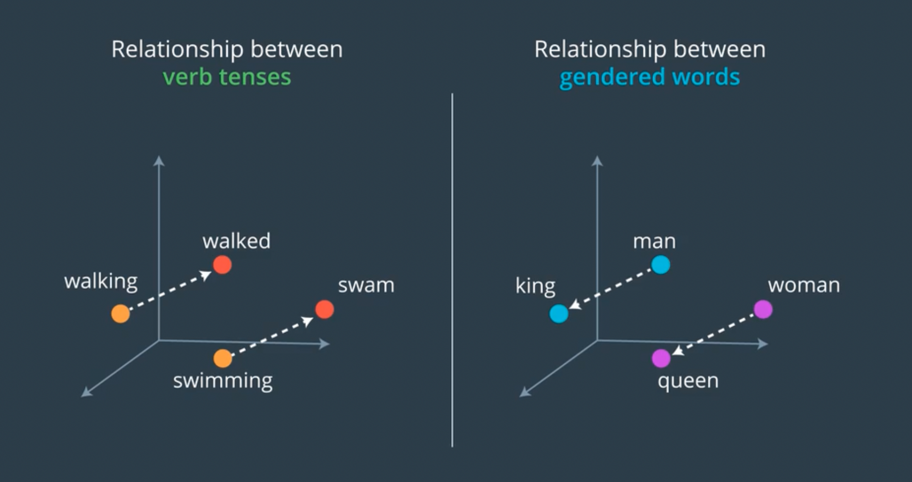
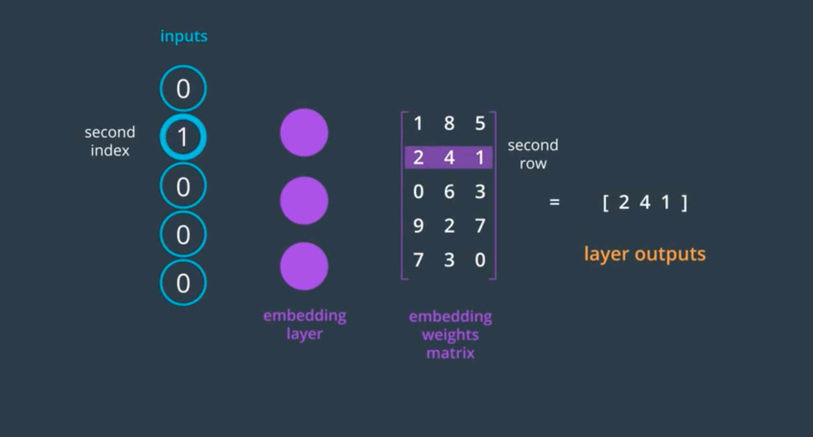
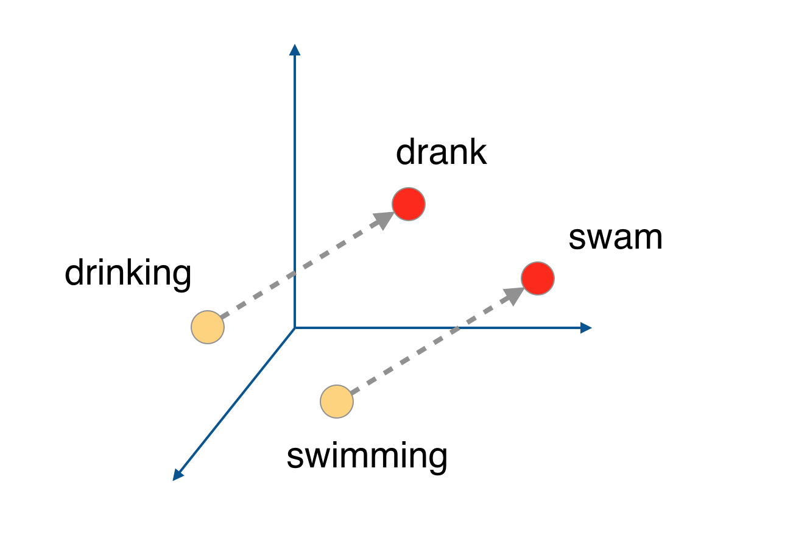
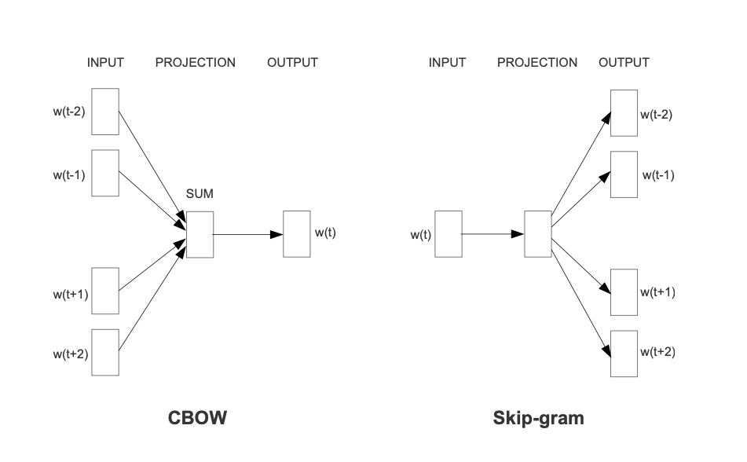

# Recurrent Neural Networks (RNN)

These are my personal notes taken while following the [Udacity Deep Learning Nanodegree](https://www.udacity.com/course/deep-learning-nanodegree--nd101).

The nanodegree is composed of six modules:

1. Introduction to Deep Learning
2. Neural Networks and Pytorch Guide
3. Convolutional Neural Networks (CNN)
4. Recurrent Neural Networks (RNN)
5. Generative Adversarial Networks (GAN)
6. Deploying a Model

Each module has a folder with its respective notes. This folder is the one of the **fourth module**: Recurrent Neural Networks.

Additionally, note that:

- I made many hand-written nortes, which I will scan and push to this repostory.
- I forked the Udacity repository for the exercisesl [deep-learning-v2-pytorch](https://github.com/mxagar/deep-learning-v2-pytorch); all the material and  notebooks are there.
- This module in particular is mostly covered in the [Udacity Computer Vision Nanodegree](https://www.udacity.com/course/computer-vision-nanodegree--nd891). I have a repository with notes on it: [computer_vision_udacity](https://github.com/mxagar/computer_vision_udacity), module `03_Advanced_CV_and_DL`.

## Overview of Contents

1. Recurrent Neural Networks (RNNs): Covered in [computer_vision_udacity](https://github.com/mxagar/computer_vision_udacity), module `03_Advanced_CV_and_DL`.
2. Long Short-Term Memory Networks (LSTM): Covered in [computer_vision_udacity](https://github.com/mxagar/computer_vision_udacity), module `03_Advanced_CV_and_DL`.
3. Implementation of RNNs and LSTMs: Covered in [computer_vision_udacity](https://github.com/mxagar/computer_vision_udacity), module `03_Advanced_CV_and_DL`.
4. Hyperparameters: Covered in [computer_vision_udacity](https://github.com/mxagar/computer_vision_udacity), module `03_Advanced_CV_and_DL`.
5. Attention Mechanisms: Covered in [computer_vision_udacity](https://github.com/mxagar/computer_vision_udacity), module `03_Advanced_CV_and_DL`.
6. [Embeddings and Word2Vec](#6.-Embeddings-and-Word2Vec)
	- 6.1 Dimensionality Reduction
	- 6.2 Word2Vec: Semantic Embeddings
	- 6.3 Word2Vec Notebook 1: Skip-Gram Model Training
	- 6.4 Word2Vec Notebook 2: Skip-Gram Model Training with Negative Sampling
7. [Sentiment Prediction RNN: Notebook](#7.-Sentiment-Prediction-RNN:-Notebook)
8. [Project: Generating TV Scripts](#8.-Project:-Generating-TV-Scripts)

## 6. Embeddings and Word2Vec

Word embeddings map a word or a sentence to a vector. We can use neural networks to learn to do word embedding.

Usually, embeddings reduce the dimensionality of the data: a vocabulary of N = 100k words is a dictionary of N elements; we represent all the words with N sparse vectors, each with N elements (all 0 except one 1). If we apply an embedding, we can compress each word to a vector of 200 float elements.

Semantic word embeddings are able to represent words with vectors that capture word meaning relationships as algebraic relationships; therefore, we can perform algebraic operations with words (i.e., sum, multiplication, etc.) to extract vectors of those relationships: verb tense, gender, etc.



However, note that an embedding doesn't need to be semantic! We can have a simple embedding which compresses sparse vectors or integer-encoded words. Compressed vectors are much more efficient than sparse one-hot representations. If we use a Pytorch `nn.Embedding` and train it, it will learn some word relationships.

### 6.1 Dimensionality Reduction

Using a word vector passed through an embedding layer is an advantage, because we reduce its dimensionality, avoiding issues related to high dimensions.

A vocabulary of N = 100k words is a dictionary of N elements; we represent all the words with N sparse vectors, each with N elements (all 0 except one 1). Operating with such sparse and large vectors is a waste of resources: we need large but unused memory chunks and we create sparse matrices when applying multiplications to the sparse vectors, which worsens the situation.

If we add an embedding layer, however, the sparse one-hot encoded word vectors are transformed into more compact word vector representations. The embedding layer is a fully connected layer which maps an `N`-dimensional one-hot encoded vector to an `m`-dimensional vector of floats, where `m << N`. The weights of the embedding layer are learnt so that the final application works better.

```
w_embedded = E * w_onehot
w_onehot: 1 x N, [0, 0, 1, 0, 0, 0, 0] (N = 7)
w_embedded: 1 x m, [0.1, 3.5] (m = 2)
E: N x m, embedding layer weight matrix
m: embedding dimension
N: vocabulary size
```



In a way, such an embedding layer is like a look-up table: the row of the embedding matrix with the index that equals to the position of the value 1 in the one-hot encoded word is taken. **Therefore: we don't need to one-hot encode the words really, it's enough if we create a dictionary which maps each word with an integer, which will be the look-up index in the embedding matrix. That saves a lot of memory**.


### 6.2 Word2Vec: Semantic Embeddings

In addition to dimensionality reduction, we can extend embeddings to capture semantic relationships between words, as presented by Mikolov et al. in their work **Word2Vec**. The concept originates from the notion that word vectors that belong to similar contexts should have similar representations.

When we achieve that, vector arithmetic operations are possible between word vectors to extract or apply semantic information represented as vectors. For instance, a distance vector can be applied to verbs which maps them from a tense to another.



In order to obtain such embedding representations, two ways were tried by Mikolov et al.:

- CBOW: Continuous Bags of Words. Given a word `w`, we input its previous and successor words to the model and try to predict `w`. 
- Skip-gram: It is the inverse of CBOW. We input the word `w` and try to predict the context words.



Skip-gram works usually better. In practice, we have:

- An input vector of `N` values (all 0 except one 1).
- An output vector of also `N` values (with values between 1 and 0)
- One hidden layer of `m` neurons; `m` is the embedding dimension. There is no activation after the hidden layer, but we apply softmax for the output vector.

That means we have two layer weight matrices:

- First, input to hidden: `N x m`. This is like a lookup table in which each row is the embedding representation of the word we're looking for.
- Second, hidden to output: `m x N`. We are computing the probabilities of a context word given an input word. If we take a row from the first matrix (this happens actually, because the one-hot vector acts like a lookup key) and multiply the second matrix, we obtain the probabilities of every word in the vocabulary to come up in the context.

**The intuition behind it is that similar words or words that belong to the same context are forced to have similar embedding vectors.**

Some interesting additional material:

- [Word2Vec Tutorial](http://mccormickml.com/2016/04/19/word2vec-tutorial-the-skip-gram-model/)
- `literature/Mikolov_Word2vec_2013.pdf`
- `literature/Mikolov_Word2vec_2_2013.pdf`

### 6.3 Word2Vec Notebook 1: Skip-Gram Model Training

The notebook can be found in

[deep-learning-v2-pytorch](https://github.com/mxagar/deep-learning-v2-pytorch) `/ word2vec-embeddings / Skip_Grams_Exercise.ipynb`

This notebook implements the first paper by Mikolov et al.: `literature/Mikolov_Word2vec_2013.pdf`.

A Skip-gram model is defined and trained to obtain a semantic embedding.

In order to train, a Wikipedia text from Matt Mahoney is used.

The  notebook has the following sections:

1. Text pre-processing: a vocabulary is built with all the unique words in the text and some symbols are replaced by symbol names (`. ->  <PERIOD>`). Additionally, subsampling of the words is done based on their occurrence: a probability of removing a word is defined based on its frequency in the text.
2. Batch generation: we write a generator of batches which receives the text with integer-encoded words and produces sequences of input-target word pairs (encoded as integers).
3. Similarity function
4. SkipGram Model Definition and Training. Note that the training takes very long. This is optimized in the next notebook.
5. Embedding vector visualization with t-SNE
6. Save the embedding matrix as a dataframe

Note that the training takes quite a long time. INstead off using this approach, we can try the next notebook, which is based in the second paper by Mikolov et al.; that paper improves the training speed.

In the next section, some word arithmetics are shown; these were not in the original Udacity notebook, I tested them.

```python
### -- 0. utils.py

import re
from collections import Counter

def preprocess(text):

    # Replace punctuation with tokens so we can use them in our model
    text = text.lower()
    text = text.replace('.', ' <PERIOD> ')
    text = text.replace(',', ' <COMMA> ')
    text = text.replace('"', ' <QUOTATION_MARK> ')
    text = text.replace(';', ' <SEMICOLON> ')
    text = text.replace('!', ' <EXCLAMATION_MARK> ')
    text = text.replace('?', ' <QUESTION_MARK> ')
    text = text.replace('(', ' <LEFT_PAREN> ')
    text = text.replace(')', ' <RIGHT_PAREN> ')
    text = text.replace('--', ' <HYPHENS> ')
    text = text.replace('?', ' <QUESTION_MARK> ')
    # text = text.replace('\n', ' <NEW_LINE> ')
    text = text.replace(':', ' <COLON> ')
    words = text.split()
    
    # Remove all words with  5 or fewer occurences
    word_counts = Counter(words)
    trimmed_words = [word for word in words if word_counts[word] > 5]

    return trimmed_words


def create_lookup_tables(words):
    """
    Create lookup tables for vocabulary
    :param words: Input list of words
    :return: Two dictionaries, vocab_to_int, int_to_vocab
    """
    word_counts = Counter(words)
    # sorting the words from most to least frequent in text occurrence
    sorted_vocab = sorted(word_counts, key=word_counts.get, reverse=True)
    # create int_to_vocab dictionaries
    int_to_vocab = {ii: word for ii, word in enumerate(sorted_vocab)}
    vocab_to_int = {word: ii for ii, word in int_to_vocab.items()}

    return vocab_to_int, int_to_vocab

### -- 1. Text pre-processing

# read in the extracted text file      
with open('data/text8') as f:
    text = f.read()

# print out the first 100 characters
print(text[:100])

import utils

# get list of words
words = utils.preprocess(text)
print(words[:30])

# print some stats about this word data
print("Total words in text: {}".format(len(words))) 
print("Unique words: {}".format(len(set(words)))) # `set` removes any duplicate words
# Total words in text: 16680599
# Unique words: 63641

vocab_to_int, int_to_vocab = utils.create_lookup_tables(words)
int_words = [vocab_to_int[word] for word in words]

print(int_words[:30])
# [5233, 3080, 11, 5, 194, 1, 3133, 45, 58, 155, 127, 741, 476, 10571, 133, 0, 27349, 1, 0, 102, 854, 2, 0, 15067, 58112, 1, 0, 150, 854, 3580]

from collections import Counter
import random
import numpy as np

threshold = 1e-5
word_counts = Counter(int_words)
print(list(word_counts.items())[0])  # dictionary of int_words, how many times they appear

# discard some frequent words, according to the subsampling equation
# create a new list of words for training
text_size = len(int_words)
def subsampling_probability(i):
    f = word_counts[i] / text_size
    return 1 - np.sqrt(threshold / f)

# Note: we do not remove a word above a threshold
# but we compute its removal probability with subsampling_probability
# and then remove it with that probability.
# That is achieved by generating a random value for each word
# and checking whether it is below the subsampling_probability;
# if so, we remove the integer, else we take it.
# Words that appear few times have a lower removal probablity.
# The effect is that we remove the bias of words that appear frequently.
train_words = [i for i in int_words if random.random() < 1 - subsampling_probability(i)]
# Equivalent:
# train_words = [i for i in int_words if subsampling_probability(i) < random.random()]

print("Number of words in text: ",text_size)
print("Reduced number of words in text",len(train_words))
print(int_words[:30]) # Many low integer values
print(train_words[:30]) # We see that most low integer values are gone
# Number of words in text:  16680599
# Reduced number of words in text 4628122
# [5233, 3080, 11, 5, 194, 1, 3133, 45, 58, 155, 127, 741, 476, 10571, 133, 0, 27349, 1, 0, 102, 854, 2, 0, 15067, 58112, 1, 0, 150, 854, 3580]
# [3080, 3133, 741, 10571, 27349, 15067, 58112, 854, 10712, 1324, 19, 362, 3672, 36, 1423, 7088, 247, 44611, 2877, 5233, 10, 8983, 279, 4147, 6437, 4186, 447, 4860, 6753, 7573]

### -- 2. Batch generation

# Given a window size C, a random range R = random([1,C]) is taken.
# Then, given an index idx, R words before and after it are taken.
# Example:
# [5233, 58, 741, 10571, 27349, 0, 15067, ... ] -> R=2, idx=2 -> [5233, 58, 10571, 27349]
def get_target(words, idx, window_size=5):
    ''' Get a list of words in a window around an index. '''
    R = random.randrange(1, window_size+1)
    left = []
    if idx < R:
        left = words[:idx]
    else:
        left = words[(idx-R):idx]
    right = []
    if idx+R > len(words)-1:
        right = words[:-1]
    else:
        right = words[(idx+1):(idx+1+R)]

    return left+right

# run this cell multiple times to check for random window selection
int_text = [i for i in range(10)]
print('Input: ', int_text)
idx=5 # word index of interest

target = get_target(int_text, idx=idx, window_size=5)
print('Target: ', target)  # you should get some indices around the idx
# Input:  [0, 1, 2, 3, 4, 5, 6, 7, 8, 9]
# Target:  [1, 2, 3, 4, 6, 7, 8, 9]

# Batch generator
# We pass a batch size: this will be the number of words for which we take R context words
# before and after them. Therefore, for each word in the batch we have a maximum of 2R targets.
# Thus, for each batch we get a maximum of batch_size*2*R input-target pairs.
def get_batches(words, batch_size, window_size=5):
    ''' Create a generator of word batches as a tuple (inputs, targets) '''
    
    n_batches = len(words)//batch_size
    
    # only full batches
    words = words[:n_batches*batch_size]
    
    for idx in range(0, len(words), batch_size):
        x, y = [], []
        batch = words[idx:idx+batch_size]
        for ii in range(len(batch)):
            batch_x = batch[ii]
            batch_y = get_target(batch, ii, window_size)
            y.extend(batch_y)
            x.extend([batch_x]*len(batch_y))
        yield x, y

int_text = [i for i in range(20)]
x,y = next(get_batches(int_text, batch_size=4, window_size=5))

print('x\n', x) # [0, 1, 1, 1, 1, 2, 2, 2, 2, 2, 3, 3, 3, 3]
print('y\n', y) # [1, 0, 0, 1, 2, 0, 1, 0, 1, 2, 2, 0, 1, 2]

### -- 3. Similarity function

# The cosine similarity will be used to find the most similar words in the embedding matrix.
# This is a human-understandable indicator of how good the clustering of similar words is working.
def cosine_similarity(embedding, valid_size=16, valid_window=100, device='cpu'):
    """ Returns the cosine similarity of validation words with words in the embedding matrix.
        Here, embedding should be a PyTorch embedding module.
    """
    
    # Here we're calculating the cosine similarity between some random words and 
    # our embedding vectors. With the similarities, we can look at what words are
    # close to our random words.
    
    # sim = (a . b) / |a||b|
    
    embed_vectors = embedding.weight
    
    # magnitude of embedding vectors, |b|
    magnitudes = embed_vectors.pow(2).sum(dim=1).sqrt().unsqueeze(0)
    
    # pick N words from our ranges (0,window) and (1000,1000+window). lower id implies more frequent 
    valid_examples = np.array(random.sample(range(valid_window), valid_size//2))
    valid_examples = np.append(valid_examples,
                               random.sample(range(1000,1000+valid_window), valid_size//2))
    valid_examples = torch.LongTensor(valid_examples).to(device)
    
    valid_vectors = embedding(valid_examples)
    similarities = torch.mm(valid_vectors, embed_vectors.t())/magnitudes
        
    return valid_examples, similarities

### -- 4. SkipGram Model Definition and Training

import torch
from torch import nn
import torch.optim as optim

class SkipGram(nn.Module):
    def __init__(self, n_vocab, n_embed):
        super().__init__()
        
        # Embedding matrix: one row for each word in vocab x embedding dimension
        self.embed = nn.Embedding(n_vocab, n_embed)
        # Map back from embedding dimension to number of words in vocab
        self.output = nn.Linear(n_embed, n_vocab)
        self.log_softmax = nn.LogSoftmax(dim=1)
    
    def forward(self, x):
        x = self.embed(x)
        scores = self.output(x)
        log_ps = self.log_softmax(scores)
        
        return log_ps

embedding_dim = 300
model = SkipGram(len(vocab_to_int), embedding_dim)

inputs, targets = next(get_batches(train_words, 2))
inputs, targets = torch.LongTensor(inputs), torch.LongTensor(targets)
log_ps = model(inputs)
print("inputs: ", inputs)
print("targets: ", targets)
print("log_ps: ", log_ps)
print(log_ps.shape) # torch.Size([3, 63641])
print(targets.shape) # torch.Size([3])

filepath = 'checkpoint_last.pth'
def save_model(filepath, model):
    torch.save(model.state_dict(), filepath)
    
def load_checkpoint(filepath, n_vocab, n_embed):
    device = 'cuda' if torch.cuda.is_available() else 'cpu'
    checkpoint = torch.load(filepath, map_location=torch.device(device))
    model = SkipGram(n_vocab, n_embed).to(device)
    model.load_state_dict(checkpoint)

    return model

#model = load_checkpoint(filepath, n_vocab, n_embed)

# check if GPU is available
device = 'cuda' if torch.cuda.is_available() else 'cpu'

embedding_dim=300 # you can change, if you want

model = SkipGram(len(vocab_to_int), embedding_dim).to(device)
criterion = nn.NLLLoss()
optimizer = optim.Adam(model.parameters(), lr=0.003)

print_every = 500 #5
steps = 0
epochs = 5

# Model saving parameters
min_loss = np.Inf
filepath = "checkpoint_last.pth"
# Test saving & loading
save_model(filepath, model)
model = load_checkpoint(filepath, len(vocab_to_int), embedding_dim)
print(model)
# SkipGram(
#  (embed): Embedding(63641, 300)
#  (output): Linear(in_features=300, out_features=63641, bias=True)
#  (log_softmax): LogSoftmax(dim=1)
#)

# train for some number of epochs
for e in range(epochs):
    
    # get input and target batches
    for inputs, targets in get_batches(train_words, 512):
    #for inputs, targets in get_batches(train_words, 2):
        steps += 1
        inputs, targets = torch.LongTensor(inputs), torch.LongTensor(targets)
        inputs, targets = inputs.to(device), targets.to(device)
        
        log_ps = model(inputs)
        loss = criterion(log_ps, targets)
        optimizer.zero_grad()
        loss.backward()
        optimizer.step()
        
        if steps % print_every == 0:                  
            # getting examples and similarities      
            valid_examples, valid_similarities = cosine_similarity(model.embed, device=device)
            _, closest_idxs = valid_similarities.topk(6) # topk highest similarities
            
            valid_examples, closest_idxs = valid_examples.to('cpu'), closest_idxs.to('cpu')
            for ii, valid_idx in enumerate(valid_examples):
                closest_words = [int_to_vocab[idx.item()] for idx in closest_idxs[ii]][1:]
                print(int_to_vocab[valid_idx.item()] + " | " + ', '.join(closest_words))
            print("...")
            
            # save checkpoint if loss smaller than ever
            if loss.item() < min_loss:
                min_loss = loss.item()
                save_model(filepath, model)

### -- 5. Embedding vector visualization with t-SNE

filepath = "checkpoint_last.pth"
model = load_checkpoint(filepath, len(vocab_to_int), embedding_dim)
print(model)

%matplotlib inline
%config InlineBackend.figure_format = 'retina'

import matplotlib.pyplot as plt
from sklearn.manifold import TSNE

# getting embeddings from the embedding layer of our model, by name
embeddings = model.embed.weight.to('cpu').data.numpy()

# We visualize the first viz_words from the embedding matrix in 2D
# i.e., vectors are projected on to a 2D plane: 300 -> 2
viz_words = 600
tsne = TSNE() # n_components = 2, by default
embed_tsne = tsne.fit_transform(embeddings[:viz_words, :])

# Similar words should be clustered together
fig, ax = plt.subplots(figsize=(16, 16))
for idx in range(viz_words):
    plt.scatter(*embed_tsne[idx, :], color='steelblue')
    plt.annotate(int_to_vocab[idx], (embed_tsne[idx, 0], embed_tsne[idx, 1]), alpha=0.7)

### -- 6. Save the embedding matrix as a dataframe

import pandas as pd

embeddings = model.in_embed.weight.to('cpu').data.numpy()

df = pd.DataFrame(embeddings)
words = [int_to_vocab[i] for i in range(len(vocab_to_int))]
df["words"] = words
df.to_csv('data/embedding.csv',sep=',', header=True, index=False) # The dataframe is around 208 MB
df = pd.read_csv('data/embedding.csv')

```
#### Question in the Forum

Hi,

In the Embeddings exercise with the Skip-Gram the model is trained with batches of input & target words encoded as integers. However, the model outputs one-hot encoded vectors. As explained in the videos and the notebook, the size of the sparse one-hot vector is the maximum number of the word integer (+1); that way, the word integer is the index in the one-hot encoded vector.

That is perfectly understandable for the programmer, and I can understand that the embedding layer uses the integer-encoded word as lookup index automatically. However, the loss function, which should be unaware of any encoding strategies, compares one-hot vectors with integer-encoded words:

	loss = criterion(log_ps, targets)

If one checks the sizes both tensors, they are different, as expected:

	log_ps: [n, m] (log probabilities)
	targets: [n] (integers)
	n: input word sequence number in batch
	m: vocabulary size

That is irritating, because the loss function seems to be inferring that in order to compare both vectors one is used as the index to look in the other. Where is described that behaviour? I would say that the loss function shouldn't make any assumptions, it should just compute the difference/similarity value between tensors of the same shape.

Or am I missing something?

Thank you,

Mikel

### 6.4 Word2Vec Notebook 2: Skip-Gram Model Training with Negative Sampling

The notebook can be found in

[deep-learning-v2-pytorch](https://github.com/mxagar/deep-learning-v2-pytorch) `/ word2vec-embeddings / Negative_Sampling_Exercise.ipynb`

This notebook implements the second paper by Mikolov et al.: `literature/Mikolov_Word2vec_2_2013.pdf`

The motivation behind is that the training of the Skip-gram model as defined above takes a very long time. Using sparse vectors from the output is indeed very inefficient. The solution proposed by Mikolov et al. consists in using **negative sampling**. To that end, the loss of the word we are trying to compress and the loss of some other hundred words are taken into account in each pass, not the loss of all the words in the vocabulary. This significantly speeds up the computation.

The concept is simple, but it requires to implement an apparently special model with several forward functions and a custom loss function class.

I haven't gone through the code thoroughly, but it seems a bit more complicated.

The final output is the same: the embedding matrix; this time the training is much faster and the t-SNE visualization looks nice.

The take-away is that I can use this notebook to generate my own semantic embeddings, which can be used later on! In particular, I have saved the embedding as a CSV after its visualization. I also tried some word arithmetics with the embedding matrix; these were not in the original Udacity notebook.

```python
### -- Saving the embedding matrix

import pandas as pd

embeddings = model.in_embed.weight.to('cpu').data.numpy()

df = pd.DataFrame(embeddings)
words = [int_to_vocab[i] for i in range(len(vocab_to_int))]
df["words"] = words
df.to_csv('data/embedding.csv',sep=',', header=True, index=False) # The dataframe is around 208 MB
df = pd.read_csv('data/embedding.csv')

### -- Tests with word arithmetics

# In this section I try to do some word arithmetics to check how well the semantics was captured by the embedding.
# Conclusion: it's not that good, but words are not completely unrelated. Maybe more training would help.

df = df.set_index("words")

def cosine(v1, v2):
    """Returns cosine of two vectors = a.b / |a|*|b|."""
    v1_length = np.sqrt(np.sum(v1**2,axis=0))
    v2_length = np.sqrt(np.sum(v2**2,axis=0))
    c = np.dot(v1,v2) / (v1_length*v2_length)
    
    return c

def compute_cosines(df, v):
    """Computes cosines of all vocabulary vectors against one input vector v."""
    E = np.array(df.values)
    v = np.array(v)
    E_lengths = np.sqrt(np.sum(E**2,axis=1))
    v_length = np.sqrt(np.sum(v**2,axis=0))
    cosines = np.dot(E,v) / (E_lengths*v_length)
    return cosines

def largest_indices(ary, n):
    """Returns the n largest indices from a numpy array."""
    flat = ary.flatten()
    indices = np.argpartition(flat, -n)[-n:]
    indices = indices[np.argsort(-flat[indices])]
    return np.unravel_index(indices, ary.shape)

v_queen = df.loc["king",:] - df.loc["man",:] + df.loc["woman",:]
cosine(np.array(df.loc["queen",:]),np.array(v_queen)) # 0.3289111913984208

cos = compute_cosines(df,v_queen)
[int_to_vocab[i] for i in list(largest_indices(cos, 5)[0])] 
# ['woman', 'king', 'her', 'elizabeth', 'born']

v_man = df.loc["boy",:] + df.loc["adult",:]
cos = compute_cosines(df,v_man)
[int_to_vocab[i] for i in list(largest_indices(cos, 5)[0])]
# ['adult', 'boy', 'children', 'girls', 'super']

v_girl = df.loc["boy",:] - df.loc["man",:]
cos = compute_cosines(df,v_girl)
[int_to_vocab[i] for i in list(largest_indices(cos, 5)[0])]
# ['boy', 'nintendo', 'gba', 'nes', 'spock']

```

## 7. Sentiment Prediction RNN: Notebook

In this section, the sentiment analysis network presented by [Andrew Trask](http://iamtrask.github.io) in the 1st module is improved by using a RNN.

The section is implemented in a notebook: [deep-learning-v2-pytorch](https://github.com/mxagar/deep-learning-v2-pytorch) `/ sentiment-rnn / Sentiment_RNN_Exercise.ipynb`.

Since we pass sequences of words to the RNN model based on LSTM cells, the performance is expected to be better than the fully connected network by Andrew Trask.


Basically, the network receives a batch of reviews. Reviews are tokenized and encoded as integers. The sequence length (number of words per review) is fixed: 200; thus, we either truncate the texts if longer or pad them with 0s on the left.

The trained network is able to yield a value 0-1 which denotes the positive (1) or negative (0) sentiment of any text.

This is a very interesting application model.

The efficiency I go with the test split was 96.8%; that's very high.

The summary of the most important steps:

1. Load data and pre-process it:
	- punctuation is removed,
	- words are tokenized with `split()`
	- a vocabulary dictionary is built
	- tokens are encoded as integers
	- outliers are removed (reviews with length 0)
	- encoded reviews are converted to a fixed sequence length with trucation or left zero padding
2. Training, validation and test splits are created, as well as data loaders
3. Model definition
4. Training
5. Saving and loading
6. Testing
7. Inference 


```python
### -- 1. Load data and pre-process it

import numpy as np

# read data from text files
with open('data/reviews.txt', 'r') as f:
    reviews = f.read()
with open('data/labels.txt', 'r') as f:
    labels = f.read()

### -- 1.1 punctuation is removed,

from string import punctuation

print(punctuation) # !"#$%&'()*+,-./:;<=>?@[\]^_`{|}~

# get rid of punctuation
reviews = reviews.lower() # lowercase, standardize
all_text = ''.join([c for c in reviews if c not in punctuation])

### -- 1.2 words are tokenized with `split()`

# split by new lines and spaces
reviews_split = all_text.split('\n')
all_text = ' '.join(reviews_split)

# create a list of words
words = all_text.split()

### -- 1.3 a vocabulary dictionary is built

# The embedding lookup requires that we pass in integers to our network.
# Counter is a dictionary that maps words into number of occurrences.
# We use it, order the words according to their counts and create 
# a dictionary which maps a word to an an integer (rank in appearances).
from collections import Counter

## Build a dictionary that maps words to integers
word_counts = Counter(words)
words_sorted = sorted(word_counts,key=word_counts.get,reverse=True)
vocab_to_int = {words_sorted[i]:(i+1) for i in range(len(words_sorted))}

### -- 1.4 tokens are encoded as integers

## use the dict to tokenize each review in reviews_split
## store the tokenized reviews in reviews_ints
reviews_ints = []
for review in reviews_split:
    review_int = [vocab_to_int[word] for word in review.split()]
    reviews_ints.append(review_int)


# stats about vocabulary
print('Unique words: ', len((vocab_to_int)))  # should ~ 74000+
print()

# print tokens in first review
print('Tokenized review: \n', reviews_ints[:1])

# 1=positive, 0=negative label conversion
encoded_labels = np.array([0 if p == 'negative' else 1 for p in labels.split('\n')])

### -- 1.5 outliers are removed (reviews with length 0)

# outlier review stats
review_lens = Counter([len(x) for x in reviews_ints])
print("Zero-length reviews: {}".format(review_lens[0]))
print("Maximum review length: {}".format(max(review_lens)))

print('Number of reviews before removing outliers: ', len(reviews_ints))

## remove any reviews/labels with zero length from the reviews_ints list.

# One method (my first approach)
# reviews_len = np.array([len(x) for x in reviews_ints])
# non_zero_len_reviews = np.arange(len(reviews_len))[reviews_len > 0]
# reviews_ints = np.array(reviews_ints,dtype=object)[non_zero_len_reviews]
# encoded_labels = encoded_labels[non_zero_len_reviews]

# Other method
# get indices of any reviews with length 0
non_zero_idx = [ii for ii, review in enumerate(reviews_ints) if len(review) != 0]
# remove 0-length reviews and their labels
reviews_ints = [reviews_ints[ii] for ii in non_zero_idx]
encoded_labels = np.array([encoded_labels[ii] for ii in non_zero_idx])

print('Number of reviews after removing outliers: ', len(reviews_ints))

# print tokens in first review
print('Tokenized review: \n', reviews_ints[:1])

### -- 1.6 encoded reviews are converted to a fixed sequence length with truncation or left zero padding

# We need to pass review sequences of the same length to the model.
# Thus, for a given fixed sequence length:
# (1) we truncate long reviews
# and (2) pad with 0s from the left short ones.
# Since our tokens started with the integer 1,
# we have introduced a new token with id/integer 0,
# which means padding space.
def pad_features(reviews_ints, seq_length):
    ''' Return features of review_ints, where each review is padded with 0's 
        or truncated to the input seq_length.
    '''
    # getting the correct rows x cols shape
    features = np.zeros((len(reviews_ints), seq_length), dtype=int)

    # for each review, I grab that review and 
    for i, row in enumerate(reviews_ints):
        features[i, -len(row):] = np.array(row)[:seq_length]
        
    return features

# Test your implementation!

seq_length = 200
features = pad_features(reviews_ints, seq_length=seq_length)
# print first 10 values of the first 30 batches 
print(features[:30,:10])

### -- 2. Training, validation and test splits are created, as well as data loaders

split_frac = 0.8
test_threshold = int(features.shape[0]*split_frac)
val_threshold = (features.shape[0] - test_threshold)//2

## split data into training, validation, and test data (features and labels, x and y)
train_x, test_x = features[:test_threshold,:], features[-test_threshold:,:]
test_x, val_x = test_x[:val_threshold,:], test_x[-val_threshold:,:]
train_y, test_y = encoded_labels[:test_threshold], encoded_labels[-test_threshold:]
test_y, val_y = test_y[:val_threshold], test_y[-val_threshold:]

## print out the shapes of your resultant feature data
print(train_x.shape)
print(test_x.shape)
print(val_x.shape)
print(train_y.shape)
print(test_y.shape)
print(val_y.shape)

import torch
from torch.utils.data import TensorDataset, DataLoader

# create Tensor datasets
train_data = TensorDataset(torch.from_numpy(train_x), torch.from_numpy(train_y))
valid_data = TensorDataset(torch.from_numpy(val_x), torch.from_numpy(val_y))
test_data = TensorDataset(torch.from_numpy(test_x), torch.from_numpy(test_y))

# dataloaders
batch_size = 50

# make sure to SHUFFLE your data
train_loader = DataLoader(train_data, shuffle=True, batch_size=batch_size)
valid_loader = DataLoader(valid_data, shuffle=True, batch_size=batch_size)
test_loader = DataLoader(test_data, shuffle=True, batch_size=batch_size)

# obtain one batch of training data
dataiter = iter(train_loader)
sample_x, sample_y = dataiter.next()

print('Sample input size: ', sample_x.size()) # batch_size, seq_length
print('Sample input: \n', sample_x)
print()
print('Sample label size: ', sample_y.size()) # batch_size
print('Sample label: \n', sample_y)

### -- 3. Model definition

# First checking if GPU is available
train_on_gpu=torch.cuda.is_available()

if(train_on_gpu):
    print('Training on GPU.')
else:
    print('No GPU available, training on CPU.')

import torch.nn as nn

class SentimentRNN(nn.Module):
    """
    The RNN model that will be used to perform Sentiment analysis.
    """

    def __init__(self, vocab_size, output_size, embedding_dim, hidden_dim, n_layers, drop_prob=0.5):
        """
        Initialize the model by setting up the layers.
        """
        super(SentimentRNN, self).__init__()

        self.output_size = output_size
        self.n_layers = n_layers
        self.hidden_dim = hidden_dim
        self.vocab_size = vocab_size
        self.embedding_dim = embedding_dim
        
        # embedding layer that turns words into a vector of a specified size
        self.word_embeddings = nn.Embedding(self.vocab_size, self.embedding_dim)

        # the LSTM takes embedded word vectors (of a specified size) as inputs 
        # and outputs hidden states of size hidden_dim
        # We use batch_first=True because we are using DataLoaders
        # to batch our data like that!
        # Because batch_first=True, we expect the input size:
        # (batch, seq, feature) instead of (seq, batch, feature)
        # Similarly, the output size will be
        # (batch, seq, out) instead of (seq, batch, out)
        self.lstm = nn.LSTM(self.embedding_dim, self.hidden_dim, self.n_layers,
                            dropout=drop_prob, batch_first=True)

        # the linear layer that maps the hidden state output dimension 
        # to the output, which is a sentiment value (expected to be 1)
        self.hidden2output = nn.Linear(hidden_dim, self.output_size)

        self.dropout = nn.Dropout(p=0.3)
        self.sigmoid = nn.Sigmoid()
        
    def forward(self, x, hidden):
        """
        Perform a forward pass of our model on some input and hidden state.
        """
        # Embedding
        x = x.long()
        embed = self.word_embeddings(x)
        lstm_out, hidden = self.lstm(embed, hidden)
        
        # lstm_out is of size (batch, seq, out)
        # we want the output of the last words in seq
        lstm_out = lstm_out[:, -1, :] # getting the last time step output
        
        # stack up lstm outputs
        lstm_out = lstm_out.contiguous().view(-1, self.hidden_dim)
        
        # Dropout
        out = self.dropout(lstm_out)
        
        # Linear
        lin_out = self.hidden2output(out)
        
        # Sigmoid
        sig_out = self.sigmoid(lin_out)
        
        # return last sigmoid output and hidden state
        return sig_out, hidden
    
    def init_hidden(self, batch_size):
        ''' Initializes hidden state '''
        # Create two tensors of 0s for the hidden state(s)
        # The axes dimensions are (n_layers, batch_size, hidden_dim)
        # Although we have batch_first=True, hidden states do not change order
        hidden = (torch.zeros(self.n_layers, batch_size, self.hidden_dim),
                  torch.zeros(self.n_layers, batch_size, self.hidden_dim))
        
        if (train_on_gpu):
            hidden = hidden.cuda()
            
        return hidden

# Instantiate the model w/ hyperparams
vocab_size = len(vocab_to_int)+1 # don't forget the padding!
output_size = 1
embedding_dim = 400 # usuaylly 200-500
hidden_dim = 256 # this is the dimension to input the linear layer
n_layers = 2

net = SentimentRNN(vocab_size, output_size, embedding_dim, hidden_dim, n_layers)

print(net)
# SentimentRNN(
#   (word_embeddings): Embedding(74073, 400)
#   (lstm): LSTM(400, 256, num_layers=2, batch_first=True, dropout=0.5)
#   (hidden2output): Linear(in_features=256, out_features=1, bias=True)
#   (dropout): Dropout(p=0.3, inplace=False)
#   (sigmoid): Sigmoid()
# )

### -- 4. Training

# loss and optimization functions
lr=0.001

criterion = nn.BCELoss()
optimizer = torch.optim.Adam(net.parameters(), lr=lr)

# training params

epochs = 4 # 3-4 is approx where I noticed the validation loss stop decreasing

counter = 0
print_every = 100
clip=5 # gradient clipping

# move model to GPU, if available
if(train_on_gpu):
    net.cuda()

net.train()
# train for some number of epochs
for e in range(epochs):
    # initialize hidden state
    h = net.init_hidden(batch_size)

    # batch loop
    for inputs, labels in train_loader:
        counter += 1

        if(train_on_gpu):
            inputs, labels = inputs.cuda(), labels.cuda()

        # Creating new variables for the hidden state, otherwise
        # we'd backprop through the entire training history
        h = tuple([each.data for each in h])

        # zero accumulated gradients
        net.zero_grad()

        # get the output from the model
        output, h = net(inputs, h)

        # calculate the loss and perform backprop
        # .squeeze(): remove empty dimensions
        # .float(): force 0s and 1s to be floats
        loss = criterion(output.squeeze(), labels.float())
        loss.backward()
        # `clip_grad_norm` helps prevent the exploding gradient problem in RNNs / LSTMs.
        nn.utils.clip_grad_norm_(net.parameters(), clip)
        optimizer.step()

        # loss stats
        if counter % print_every == 0:
            # Get validation loss
            val_h = net.init_hidden(batch_size)
            val_losses = []
            net.eval()
            for inputs, labels in valid_loader:

                # Creating new variables for the hidden state, otherwise
                # we'd backprop through the entire training history
                val_h = tuple([each.data for each in val_h])

                if(train_on_gpu):
                    inputs, labels = inputs.cuda(), labels.cuda()

                output, val_h = net(inputs, val_h)
                val_loss = criterion(output.squeeze(), labels.float())

                val_losses.append(val_loss.item())

            net.train()
            print("Epoch: {}/{}...".format(e+1, epochs),
                  "Step: {}...".format(counter),
                  "Loss: {:.6f}...".format(loss.item()),
                  "Val Loss: {:.6f}".format(np.mean(val_losses)))
### -- 5. Saving and loading

device = "cuda" if torch.cuda.is_available() else "cpu"

def save_model(filepath, model, vocab_size, output_size, embedding_dim, hidden_dim, n_layers):
    # Convert model into a dict: architecture params (layer sizes) + state (weight & bias values)
    checkpoint = {'vocab_size': vocab_size,
                  'output_size': output_size,
                  'embedding_dim': embedding_dim,
                  'hidden_dim': hidden_dim,
                  'n_layers': n_layers,
                  'state_dict': model.state_dict()}
    torch.save(checkpoint, filepath)

filepath = "lstm_sentiment_best.pth"
save_model(filepath, net, vocab_size, output_size, embedding_dim, hidden_dim, n_layers)

def load_checkpoint(filepath):
    checkpoint = torch.load(filepath, map_location=torch.device(device))
    model = SentimentRNN(checkpoint['vocab_size'],
                         checkpoint['output_size'],
                         checkpoint['embedding_dim'],
                         checkpoint['hidden_dim'],
                         checkpoint['n_layers'])
    model.load_state_dict(checkpoint['state_dict'])
    print(model)
    
    return model

net = load_checkpoint(filepath)

### -- 6. Testing

# Get test data loss and accuracy

test_losses = [] # track loss
num_correct = 0

# init hidden state
h = net.init_hidden(batch_size)

net.eval()
# iterate over test data
for inputs, labels in test_loader:

    # Creating new variables for the hidden state, otherwise
    # we'd backprop through the entire training history
    h = tuple([each.data for each in h])

    if(train_on_gpu):
        inputs, labels = inputs.cuda(), labels.cuda()
    
    # get predicted outputs
    output, h = net(inputs, h)
    
    # calculate loss
    test_loss = criterion(output.squeeze(), labels.float())
    test_losses.append(test_loss.item())
    
    # convert output probabilities to predicted class (0 or 1)
    pred = torch.round(output.squeeze())  # rounds to the nearest integer
    
    # compare predictions to true label
    correct_tensor = pred.eq(labels.float().view_as(pred))
    correct = np.squeeze(correct_tensor.numpy()) if not train_on_gpu else np.squeeze(correct_tensor.cpu().numpy())
    num_correct += np.sum(correct)


# -- stats! -- ##
# avg test loss
print("Test loss: {:.3f}".format(np.mean(test_losses)))

# accuracy over all test data
test_acc = num_correct/len(test_loader.dataset)
print("Test accuracy: {:.3f}".format(test_acc))

### -- 7. Inference 

def predict(net, test_review, sequence_length=200):
    ''' Prints out whether a give review is predicted to be 
        positive or negative in sentiment, using a trained model.
        
        params:
        net - A trained net 
        test_review - a review made of normal text and punctuation
        sequence_length - the padded length of a review
        '''
    
    # print custom response based on whether test_review is pos/neg
    net.eval()
    
    # Pre-process and encode text: tokenization
    test_review = test_review.lower() # lowercase, standardize
    test_review = ''.join([c for c in test_review if c not in punctuation])
    review_int = [vocab_to_int[word] for word in test_review.split()]
    features = pad_features([review_int], seq_length) # Mind the wrapping [], because we pass batches!
    
    print(features.shape)
    
    # Convert to torch tensor
    x = torch.from_numpy(features)
    
    if(train_on_gpu):
        x = x.cuda()
        net = net.cuda()
        
    # Initialize net
    batch_size = batch_size = x.size(0)
    h = net.init_hidden(batch_size)
    #h = tuple([each.data for each in h])
    
    # Forward pass
    output, h = net(x, h)
    
    # Round output and select sentiment
    if torch.round(output.squeeze()) > 0.5:
        print(output.squeeze())
        return "positive"
    else:
        print(output.squeeze())
        return "negative"


test_review_pos = 'This movie had the best acting and the dialogue was so good. I loved it.'
test_review_neg = 'This movie had the worst acting and the dialogue was so bad. What a waste of time!'
test_review_neu = 'This is a movie.'

# call function
# try negative and positive reviews!
seq_length=200
print(predict(net, test_review_pos, seq_length)) # 0.9128
print(predict(net, test_review_neg, seq_length)) # 0.0081
print(predict(net, test_review_neu, seq_length)) # 0.4309
```

## 8. Project: Generating TV Scripts


