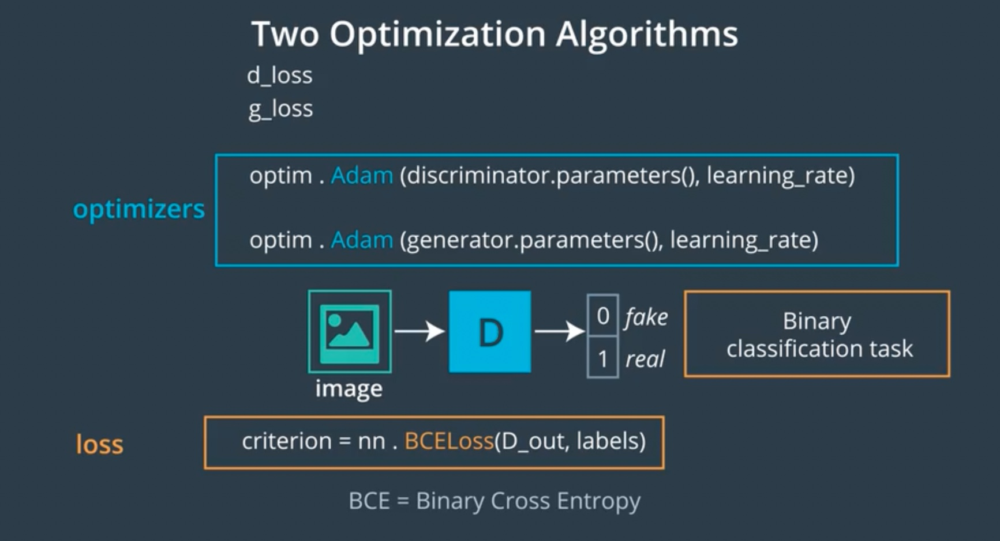
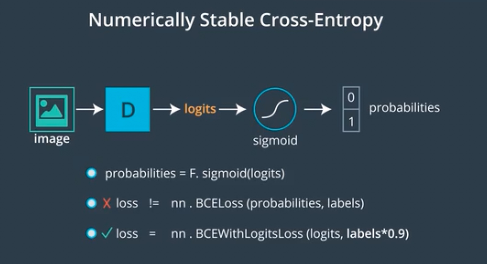
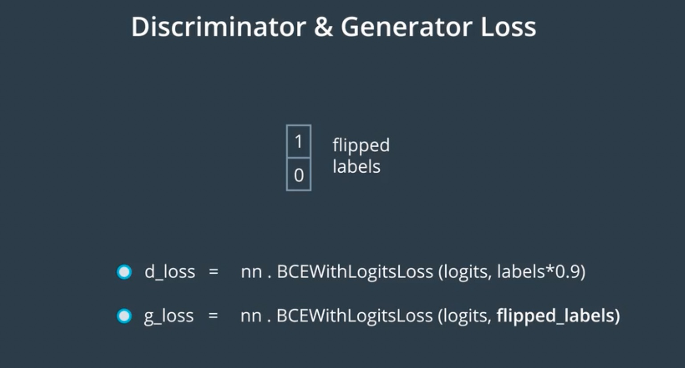
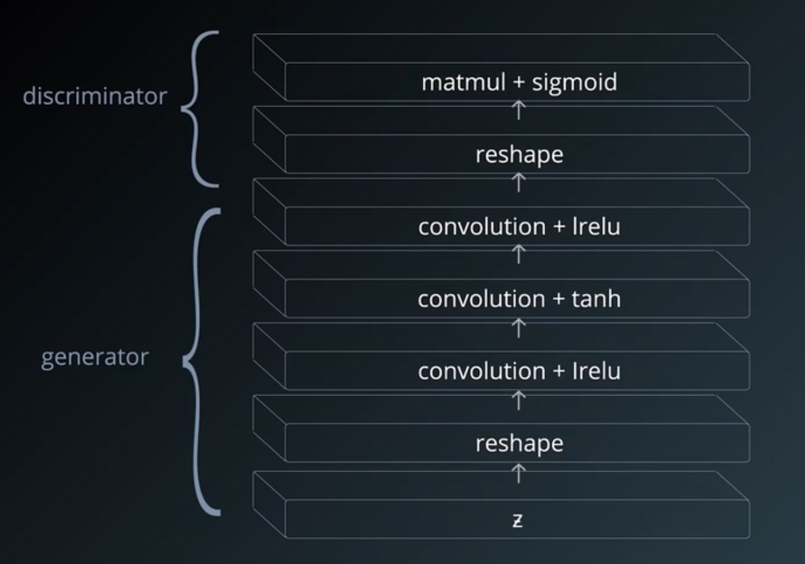
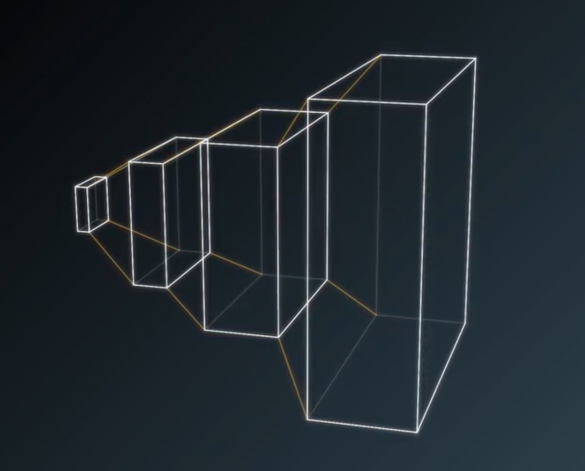
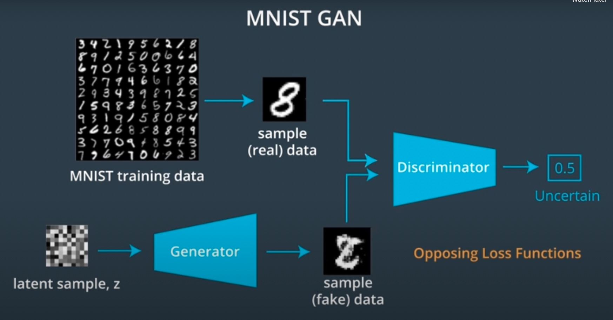

# Geneartive Adversarial Networks (GAN)

These are my personal notes taken while following the [Udacity Deep Learning Nanodegree](https://www.udacity.com/course/deep-learning-nanodegree--nd101).

The nanodegree is composed of six modules:

1. Introduction to Deep Learning
2. Neural Networks and Pytorch Guide
3. Convolutional Neural Networks (CNN)
4. Recurrent Neural Networks (RNN)
5. Generative Adversarial Networks (GAN)
6. Deploying a Model

Each module has a folder with its respective notes. This folder is the one of the **fifth module**: Generative Adversarial Networks.

Additionally, note that:

- I made many hand-written notes; check the PDFs.
- I forked the Udacity repository for the exercises [deep-learning-v2-pytorch](https://github.com/mxagar/deep-learning-v2-pytorch); all the material and notebooks are there.

## Overview of Contents

- [Geneartive Adversarial Networks (GAN)](#geneartive-adversarial-networks-gan)
  - [Overview of Contents](#overview-of-contents)
  - [1. Generative Adversarial Networks (GANs)](#1-generative-adversarial-networks-gans)
    - [1.1 Applications of GANs](#11-applications-of-gans)
    - [1.2 How GANs Work](#12-how-gans-work)
      - [Interpretation](#interpretation)
      - [Difficulties with GANs](#difficulties-with-gans)
    - [1.3 Tips for Training GANs](#13-tips-for-training-gans)
    - [1.4 MNIST GAN](#14-mnist-gan)
  - [X. Interesting Links](#x-interesting-links)
  - [X. Diffusion Models](#x-diffusion-models)
  - [X. NERFs](#x-nerfs)

## 1. Generative Adversarial Networks (GANs)

This section is taught by Ian Goodfellow himself! Goodfellow invented the Generative Adversarial Networks (GANs) with his seminal paper [Generative Adversarial Networks, 2014](https://arxiv.org/abs/1406.2661).

### 1.1 Applications of GANs

Some applications of GANs:

- Generate images from text: [StackGAN](https://arxiv.org/abs/1612.03242), [Dall-E](https://arxiv.org/pdf/2102.12092.pdf), [Stable Diffusion](https://arxiv.org/pdf/2112.10752.pdf), etc.
- Generate images sketches: [iGAN](https://github.com/junyanz/iGAN)
- Transform images into cartoons: [CartoonGAN](https://video.udacity-data.com/topher/2018/November/5bea23cd_cartoongan/cartoongan.pdf)

The first generates images that have been never seen by sampling in a distribution of all possible images.

The last two use a so called **Pix2Pix** approach in which an image in one domain is transformed into another domain; aka. *image translation*. It is possible to train those models in an unsupervised way, as Facebook researchers have shown with a model that transforms face photos into cartoons.

Another example is [CycleGAN](https://junyanz.github.io/CycleGAN/): unpaired image-to-image translation, i.e., they can transform an image from one domain to another in the absence of paired examples; for instance: a horse becomes a zebra. The training is unsupervised.

Some other applications of *Pix2Pix*:

- Building blueprints to finished building.
- Drawings to images.
- Photos to cartoons.
- Day images to night images.
- Adversarial examples that fool machines but not humans (captchas).
- Apple: eye image sketches to realistic eyes; then they trained a model to detect where the user is looking.

In the last example we see that GANs can be used to generate synthetic training sets.

GANs are not limited to the visual domain; we can use them to imitate anything:, e.g., Reinforcement Learning actions. 

### 1.2 How GANs Work

I made these notes following, in part, the video by Luis Serrano:

[A Friendly Introduction to Generative Adversarial Networks (GANs)](https://www.youtube.com/watch?v=8L11aMN5KY8).

Generative Adversarial Networks (GANs) were introduced by Ian Goodfellow and colleagues in 2014. They consist of two networks that compete with each other:

- The **Generator** `G()` network learns to generate fake but realistic/meaningful data from a `z` noise input. Its output is of the size of a data sample (often an image).
- The **Discriminator** `D()` network learns to distinguish between fake and real data. Its output is 1 (real) or 0 (fake).

Some notes on the notation:

- The noise is `z` (Gaussian). It is also known as the latent vector, i.e., we are taking a point in the latent space that contains all possible images.
- The Generator produces `x = G(z)`; `x` is an image.
- The discriminator takes that `x = G(z)` as fake input (as well as real samples) and produces `D(G(z))`, which should be real (1) even for fake (0) samples (e.g., images) at the end.

**Core idea**: The final goal of a GAN is to train both networks together as if they are competing, i.e., they have opposing objectives. Then, **the resulting Generator G() is able to create very realistic fake data (e.g., face images)**. Simultaneously, the D() is not able to distinguish between fake/generated and real, and it outputs values close to 0.5 for both.

To that end, the training works in two Phases (for each batch of real images):

- Phase 1: The Discriminator is trained to distinguish fake vs real
    - We generate a dataset of real images labelled as 1 and fake images generated by the Generator (with `z` noise inputs) labelled as 0.
    - The binary classification Discriminator is trained: first real samples can be used, then fake samples.
    - Backpropagation and weight update occurs on the Discriminator.
    - As a result, the Discriminator learns to distinguish fake vs real.
- Phase 2: The Generator is trained to fool the Discriminator
    - We produce more fake images with `G()` and feed them to the Discriminator `D()` **but labelled as 1 (real)**.
    - We have a fake sample labelled as real: `D(G(z))` will probably yield something close to 'fake' or `0`, but we expect `1` or 'real'; we compute our loss according to our expectation and use it to update the weights of the Generator.
    - Backpropagation and weight update occurs on the Generator.
    - As a result, the Generator is trained to produce realistic fake samples that are classified as real by the Discriminator after a successful training.

While training phases continue one after the other, both the Generator and Discriminator get better at their jobs. We alternate the phases for each batch and we train both networks for several epochs. Note that we need one optimizer and one loss for each network.

Note that **the Generator never sees a real image!** Instead it learns from the gradients of the discriminator; the more performant the discriminator, the more information it collects in its gradients.

**Figure 1: Discriminator D() fed by fake images by the Generator G()**: A noise input `z` is used to generate a fake sample; then, that fake sample is fed to a Discriminator. Credits by Luis Serrano (see link above).


**Figure 2: Discriminator D() fed with real images**: A real image is fed to Discriminator. Credits by Luis Serrano (see link above).


**Figure 3: Phase 2: Discriminator D() fed by fake images from the Generator G(), but fooled to expect real samples**: The loss function applied to the Generator is `-ln(D(G(z)))`. Credits by Luis Serrano (see link above).


#### Interpretation

- Over time, the generator is forced to produce more realistic outputs.
- Random noise `z` is mapped to an image `x = G(z)`.
- We have a distribution of images `x`, which is modeled by `G()`.
- Over time, the distribution modeled by `G()` matches the real distribution of `x`, the real images: we force the fake distribution to overlap the real one. Thus, the discriminator ends up yielding `0.5` for both real and fake images.
- The *adversarial* aspect of GANs is that we are training two networks with opposed targets: one is the police, the other is the counterfeiter. The idea is that with the training we reach an **equilibrium**, in **game-theoretical** terms.
- For the generator, the labels are flipped. In other words: the generator optimizes the wrong labels. The intuition is in line with the counterfeiter-police example: the counterfeiter presents to the police the fake money as it were real; the police then states: "that can't be true because the watermark is missing". The fact that the watermark is missing is the gradient: information that is propagated to the generator so that it improves.


#### Difficulties with GANs

- **Training resources**: GANs are often used for images; training on them requires powerful GPUs. We could use Google Colab, since it offers GPUs for free.

- **Mode collapse**: The Generator ends up producing a single image that always fools the Discriminator, independently of the noise input. See this [Quora link](https://www.quora.com/What-does-it-mean-if-all-produced-images-of-a-GAN-look-the-same). There are several approaches to overcome the issue:
  - Deep Convolutional GANs (DCGANs).
  - Mini-batch discrimination: generated batches that contain similar images are punished.

- **Instability**: It is sometimes difficult to evaluate performance and decide the necessary epochs, since all our images are fake. Additionally, since both `G()` and `D()` are competing, their performance score might start oscillating, which is not desired. Therefore, hyperparameter tuning is essential.

### 1.3 Tips for Training GANs

This section is summary of the paper

[Improved Techniques for Training GANs, 2016](https://arxiv.org/abs/1606.03498)
Tim Salimans, Ian Goodfellow, Wojciech Zaremba, Vicki Cheung, Alec Radford, Xi Chen

Let's consider the MNIST dataset with `28x28` grayscale images. For such small images, we can get away with fully connected networks, i.e., we end up having matrix multiplications: `matlmul`. Additionally, we would require the following:

- Both the generator `G` and the discriminator `D` need to have at least one hidden layer.
- For the hidden layers, any activation function will work, but the **leaky ReLU**, `lrelu` is specially popular. They work very well because they facilitate the propagation of the gradient in the entire network, since the gradient of `lrelu` is not 0 for negative values. This is good for every network, but it is specially important for GANs, since the generator needs to receive the gradients of the discriminator!
- A popular choice for the output of the generator is the hyperbolic tangent `tanh`, which yields values in `[0,1]`.
- The output of the discriminator is a `sigmoid`.

`LeakyReLU(x) = max(0,x) + negative_slope (default: 0.01) * min(0,x)`


In contrast to many other machine learning models, GANs require 2 losses, `g_loss` and `d_loss`, and 2 optimization algorithms running simultaneously. Additionally:

- Adam is a good choice.
- For the discriminator, we should use the **binary cross-entropy loss, but its stable version that uses logits**! The logits are the values produced by the discriminator, right before the sigmoid.
- For the discriminator, one GAN specific trick is to multiply the labels by 0.9 so that they are a little bit below their value. It regularizes the system and decreases extreme predictions.
- For the generator, we should use the same stable binary cross-entropy loss, but with the labels flipped. In other words: the generator optimizes the log-probability of the wrong labels.
- Some people take `g_loss = -d_loss`, but it doesn't work well in practice, because the gradient one is 0 when the other is winning. The intuition behind that choice is that both nets are adversarial, i.e., they are competing with each other, and we want to achieve an equilibrium.

 





Everything introduced so far applies to all GANs; however, if we want to scale up to large image sizes, we need to start using convolutional layers.

- Convolutional layers take 4D tensors: `(batch_size, channels, width, height)`; we need to `reshape` the noise input `z` for that.
- Classification CNNs apply convolutions and pooling to shrink the image size while enlarging the number of channels; however, for GANs, **it is recommended to increase the image size as we go deeper in the generator**! That is achieved with convolution transpose with stides larger than 1.
- We should use **batch normalization** (or equivalent) in all layers except the output layer of the generator and the input layer of the discriminator. The [DCGAN](https://arxiv.org/abs/1511.06434v2) authors also apply different batch normalizations to real and fake/generated images, and that seems to work nicely in practice.





### 1.4 MNIST GAN

**Core idea of GANs**: The final goal of a GAN is to train both networks together as if they are competing, i.e., they have opposing objectives. Then, **the resulting Generator G() is able to create very realistic fake data (e.g., face images)**. Simultaneously, the discriminator D() is not able to distinguish between fake/generated and real, and it outputs values close to 0.5 for both.

This section implements a GAN for the MNIST dataset. The notebook is in 

[deep-learning-v2-pytorch](https://github.com/mxagar/deep-learning-v2-pytorch) `/ gan-mnist`



The following steps are carried out:

1. Definition of the `Discriminator()` and the `Generator()`: fully connected layers are used.
2. Definition of the Losses & the Optimizers
3. Training Loop
4. Sample Visualization

In the second step, **Definition of the Losses & the Optimizer**, two functions are defined, which are used for both the `Discriminator()` and the `Generator()`:

- `real_loss()`: `BCEWithLogitsLoss()` if the target were 1, i.e., a real image. However, note that when training the `Generator()` (see below), we fool it pretending fake images to be real, thus we use this function with fake images, too!
- `fake_loss()`: `BCEWithLogitsLoss()` if the target were 0, i.e., a fake image.

Additionally, we require two optimizers, one for each network:

```python
d_optimizer = optim.Adam(D.parameters(), lr)
g_optimizer = optim.Adam(G.parameters(), lr)
```

The 3rd step, **Traning Loop** is very interesting; there we see that the training involves alternating between training the discriminator and the generator **in each batch**. We'll use our functions `real_loss` and `fake_loss` to help us calculate the discriminator losses in all of the following cases.

Discriminator training:

1. Compute the discriminator loss on real, training images.
2. Generate fake images with latent/noise vectors.
3. Compute the discriminator loss on fake, generated images.
4. Add up real and fake loss: `d_loss = d_real_loss + d_fake_loss`.
5. Perform backpropagation + an optimization step to update the discriminator's weights: 

  ```python
  d_loss.backward()
  d_optimizer.step()
  ```

Generator training:

1. Generate fake images with latent/noise vectors.
2. Compute the discriminator loss on fake images, using **flipped** labels! This is equivalent to using the `real_loss()` function.
3. Perform backpropagation + an optimization step to update the generator's weights:

  ```python
  g_loss.backward()
  g_optimizer.step()
  ```

In order to visualize the samples in the 4th step, **Sample Visualization**, we save 16 fake/generated images every epoch. Each time a fixed set of 16 random/latent vectors is used.

In the following, the code of the notebook is provided:

```python
%matplotlib inline

import numpy as np
import torch
import matplotlib.pyplot as plt

##
## 0. Data Loader
##

from torchvision import datasets
import torchvision.transforms as transforms

# number of subprocesses to use for data loading
num_workers = 0
# how many samples per batch to load
batch_size = 64

# convert data to torch.FloatTensor
transform = transforms.ToTensor()

# get the training datasets
train_data = datasets.MNIST(root='data', train=True,
                                   download=True, transform=transform)

# prepare data loader
# note that we have only train images,
# because this is not the typical supervised classification
train_loader = torch.utils.data.DataLoader(train_data, batch_size=batch_size,
                                           num_workers=num_workers)


# Visualize the data
# obtain one batch of training images
dataiter = iter(train_loader)
images, labels = dataiter.next()
print(images.size())
images = images.numpy()

# get one image from the batch
img = np.squeeze(images[0])

fig = plt.figure(figsize = (3,3)) 
ax = fig.add_subplot(111)
ax.imshow(img, cmap='gray')

##
## 1. Definition of the `Discriminator()` and the `Generator()`
##

import torch.nn as nn
import torch.nn.functional as F

class Discriminator(nn.Module):

    def __init__(self, input_size, hidden_dim, output_size):
        super(Discriminator, self).__init__()
        
        # define hidden linear layers
        self.fc1 = nn.Linear(input_size, hidden_dim*4)
        self.fc2 = nn.Linear(hidden_dim*4, hidden_dim*2)
        self.fc3 = nn.Linear(hidden_dim*2, hidden_dim)
        
        # final fully-connected layer
        self.fc4 = nn.Linear(hidden_dim, output_size)
        
        # dropout layer:
        # good practice to add in-between linear layers
        self.dropout = nn.Dropout(0.3)
        
    def forward(self, x):
        # flatten image
        # real images:
        # x: torch.Size([64, 1, 28, 28])
        # (batch_size, channels, width, height)
        # x = x.view(-1, x.size(2)*x.size(3)) # (batch, 784)
        # fake images:
        # x: torch.Size([64, 284])
        # Real and fake images have a different size,
        # we need to account for both cases...
        x = x.view(-1, 28*28)
        
        # pass x through all layers
        # apply leaky relu activation to all hidden layers
        x = F.leaky_relu(self.fc1(x), 0.2) # (input, negative_slope=0.2)
        x = self.dropout(x)
        x = F.leaky_relu(self.fc2(x), 0.2)
        x = self.dropout(x)
        x = F.leaky_relu(self.fc3(x), 0.2)
        x = self.dropout(x)
        # final layer
        # no sigmoid activation = logits!
        # then, we should use BCEWithLogitsLoss
        x = self.fc4(x)

        return x

class Generator(nn.Module):

    def __init__(self, input_size, hidden_dim, output_size):
        super(Generator, self).__init__()
        
        # define all layers
        # layer behaviour is reversed,
        # compared to the Discriminator
        self.fc1 = nn.Linear(input_size, hidden_dim)
        self.fc2 = nn.Linear(hidden_dim, hidden_dim*2)
        self.fc3 = nn.Linear(hidden_dim*2, hidden_dim*4)
        self.fc4 = nn.Linear(hidden_dim*4, output_size)
        
        self.dropout = nn.Dropout(0.3)
        
    def forward(self, x):
        # pass x through all layers
        x = F.leaky_relu(self.fc1(x), 0.2) # (input, negative_slope=0.2)
        x = self.dropout(x)
        x = F.leaky_relu(self.fc2(x), 0.2)
        x = self.dropout(x)
        x = F.leaky_relu(self.fc3(x), 0.2)
        x = self.dropout(x)

        # final layer should have tanh applied
        x = torch.tanh(self.fc4(x))

        return x

# Discriminator hyperparams

# Size of input image to discriminator (28*28)
input_size = 28*28 # 784
# Size of discriminator output (real or fake)
d_output_size = 1
# Size of *last* hidden layer in the discriminator
d_hidden_size = 32 # 784 -> 128 -> 64 -> 32 -> 1

# Generator hyperparams

# Size of latent vector to give to generator
z_size = 100
# Size of generator output (generated image)
g_output_size = input_size # 28*28 = 784
# Size of *first* hidden layer in the generator
g_hidden_size = 32 # 100 -> 32 -> 64 -> 128 ->  784

# instantiate discriminator and generator
D = Discriminator(input_size, d_hidden_size, d_output_size)
G = Generator(z_size, g_hidden_size, g_output_size)

# check that they are as you expect
print(D)
print()
print(G)

##
## 2. Definition of the Losses & the Optimizers
##

# The following loss functions are used for both the
# Discriminator and the Generator
# D_out: output of the Discriminator
# Case: real images passed
def real_loss(D_out, smooth=False):
    batch_size = D_out.size(0)
    # label smoothing for regularization
    if smooth:
        # smooth, real labels = 0.9
        labels = torch.ones(batch_size)*0.9
    else:
        labels = torch.ones(batch_size) # real labels = 1
        
    # numerically stable loss
    criterion = nn.BCEWithLogitsLoss()
    # calculate loss
    # squeeze any empty dimensions
    loss = criterion(D_out.squeeze(), labels)
    return loss

# Case: fake images passed
def fake_loss(D_out):
    batch_size = D_out.size(0)
    labels = torch.zeros(batch_size) # fake labels = 0
    criterion = nn.BCEWithLogitsLoss()
    # calculate loss
    loss = criterion(D_out.squeeze(), labels)
    return loss

import torch.optim as optim

# Learning rate
lr = 0.002

# Create two separate optimizers for the discriminator and generator
d_optimizer = optim.Adam(D.parameters(), lr)
g_optimizer = optim.Adam(G.parameters(), lr)

##
## 3. Training Loop
##

import pickle as pkl

# training hyperparams
num_epochs = 100

# keep track of loss and generated, "fake" samples
samples = []
losses = []

print_every = 400

# Get some fixed data for sampling. These are images that are held
# constant throughout training, and allow us to inspect the model's performance
# We save 16 fake/generated images every epoch.
# Each time a fixed set of 16 random/latent vectors is used.
# Here, we define those vectors.
sample_size=16
fixed_z = np.random.uniform(-1, 1, size=(sample_size, z_size))
fixed_z = torch.from_numpy(fixed_z).float()

# train the network
D.train()
G.train()
for epoch in range(num_epochs):
    
    for batch_i, (real_images, _) in enumerate(train_loader):
                
        batch_size = real_images.size(0)
        
        ## Important rescaling step ## 
        real_images = real_images*2 - 1  # rescale input images from [0,1) to [-1, 1)
        
        # ============================================
        #            TRAIN THE DISCRIMINATOR
        # ============================================
        
        d_optimizer.zero_grad()
        
        # 1. Train with real images

        # Compute the discriminator losses on real images 
        # smooth the real labels
        D_real = D(real_images)
        d_real_loss = real_loss(D_real, smooth=True)
        
        # 2. Train with fake images
        
        # Generate fake images
        # gradients don't have to flow during this step
        with torch.no_grad():
            z = np.random.uniform(-1, 1, size=(batch_size, z_size))
            z = torch.from_numpy(z).float()
            fake_images = G(z)
        
        # Compute the discriminator losses on fake images        
        D_fake = D(fake_images)
        d_fake_loss = fake_loss(D_fake)
        
        # add up loss and perform backprop
        d_loss = d_real_loss + d_fake_loss
        d_loss.backward()
        d_optimizer.step()
        
        
        # =========================================
        #            TRAIN THE GENERATOR
        # =========================================
        g_optimizer.zero_grad()
        
        # 1. Train with fake images and flipped labels
        
        # Generate fake images
        z = np.random.uniform(-1, 1, size=(batch_size, z_size))
        z = torch.from_numpy(z).float()
        fake_images = G(z)
        
        # Compute the discriminator losses on fake images 
        # using flipped labels!
        D_fake = D(fake_images)
        g_loss = real_loss(D_fake) # use real loss to flip labels
        
        # perform backprop
        g_loss.backward()
        g_optimizer.step()

        # Print some loss stats
        if batch_i % print_every == 0:
            # print discriminator and generator loss
            print('Epoch [{:5d}/{:5d}] | d_loss: {:6.4f} | g_loss: {:6.4f}'.format(
                    epoch+1, num_epochs, d_loss.item(), g_loss.item()))

    
    ## AFTER EACH EPOCH##
    # append discriminator loss and generator loss
    losses.append((d_loss.item(), g_loss.item()))
    
    # generate and save sample, fake images
    G.eval() # eval mode for generating samples, de-activate dropout
    samples_z = G(fixed_z)
    samples.append(samples_z)
    G.train() # back to train mode


# Save training generator samples
with open('train_samples.pkl', 'wb') as f:
    pkl.dump(samples, f)


# Note that these are not the typical learning curves
# because the Generator is trying to fool the Discriminator.
# With GANs, it's normal to see an initial decrease of the G loss
# followed by a fluctuation/oscillation around a value for both.
fig, ax = plt.subplots()
losses = np.array(losses)
plt.plot(losses.T[0], label='Discriminator')
plt.plot(losses.T[1], label='Generator')
plt.title("Training Losses")
plt.legend()


##
## 4. Sample Visualization
##

# helper function for viewing a list of passed in sample images
def view_samples(epoch, samples):
    fig, axes = plt.subplots(figsize=(7,7), nrows=4, ncols=4, sharey=True, sharex=True)
    for ax, img in zip(axes.flatten(), samples[epoch]):
        img = img.detach()
        ax.xaxis.set_visible(False)
        ax.yaxis.set_visible(False)
        im = ax.imshow(img.reshape((28,28)), cmap='Greys_r')

# Load samples from generator, taken while training
with open('train_samples.pkl', 'rb') as f:
    samples = pkl.load(f)

# -1 indicates final epoch's samples (the last in the list)
# Recall we have saved 16 images for each epoch
view_samples(-1, samples)

# We take 10 epochs and for each 6 samples, all equidistant
# We visualize those samples = fake images.
# Initially, they're noise; then, they become more realistic.
rows = 10 # split epochs into 10, so 100/10 = every 10 epochs
cols = 6
fig, axes = plt.subplots(figsize=(7,12), nrows=rows, ncols=cols, sharex=True, sharey=True)

for sample, ax_row in zip(samples[::int(len(samples)/rows)], axes):
    for img, ax in zip(sample[::int(len(sample)/cols)], ax_row):
        img = img.detach()
        ax.imshow(img.reshape((28,28)), cmap='Greys_r')
        ax.xaxis.set_visible(False)
        ax.yaxis.set_visible(False)

# Every time we run this cell we should get new 16 samples!
# randomly generated, new latent vectors
sample_size=16
rand_z = np.random.uniform(-1, 1, size=(sample_size, z_size))
rand_z = torch.from_numpy(rand_z).float()
G.eval() # eval mode
# generated samples
rand_images = G(rand_z)
# 0 indicates the first set of samples in the passed in list
# and we only have one batch of samples, here
view_samples(0, [rand_images])

```

### 1.5 Deep Convolutional GANs: DCGANs


## X. Interesting Links

- [DCGAN Tutorial, Pytorch](https://pytorch.org/tutorials/beginner/dcgan_faces_tutorial.html)
- [Cool GAN Applications](https://jonathan-hui.medium.com/gan-some-cool-applications-of-gans-4c9ecca35900)
- [Compilation of Cool GAN Projects](https://github.com/nashory/gans-awesome-applications).
- [Generative Adversarial Networks, 2014](https://arxiv.org/abs/1406.2661).
- [Improved Techniques for Training GANs, 2016](https://arxiv.org/abs/1606.03498).
- [DCGAN Paper, 2016](https://arxiv.org/abs/1511.06434v2).


## X. Diffusion Models

- [What are Diffusion Models?](https://www.youtube.com/watch?v=fbLgFrlTnGU&list=LL)
- [Introduction to Diffusion Models for Machine Learning](https://www.assemblyai.com/blog/diffusion-models-for-machine-learning-introduction/)
- [Understanding Diffusion Models: A Unified Perspective](https://arxiv.org/abs/2208.11970)


## X. NERFs

- [NeRFs: Neural Radiance Fields - Paper Explained](https://www.youtube.com/watch?v=WSfEfZ0ilw4)
- [NeRF: Representing Scenes as Neural Radiance Fields for View Synthesis](https://arxiv.org/abs/2003.08934)
- [Jon Barron - Understanding and Extending Neural Radiance Fields](https://www.youtube.com/watch?v=HfJpQCBTqZs)