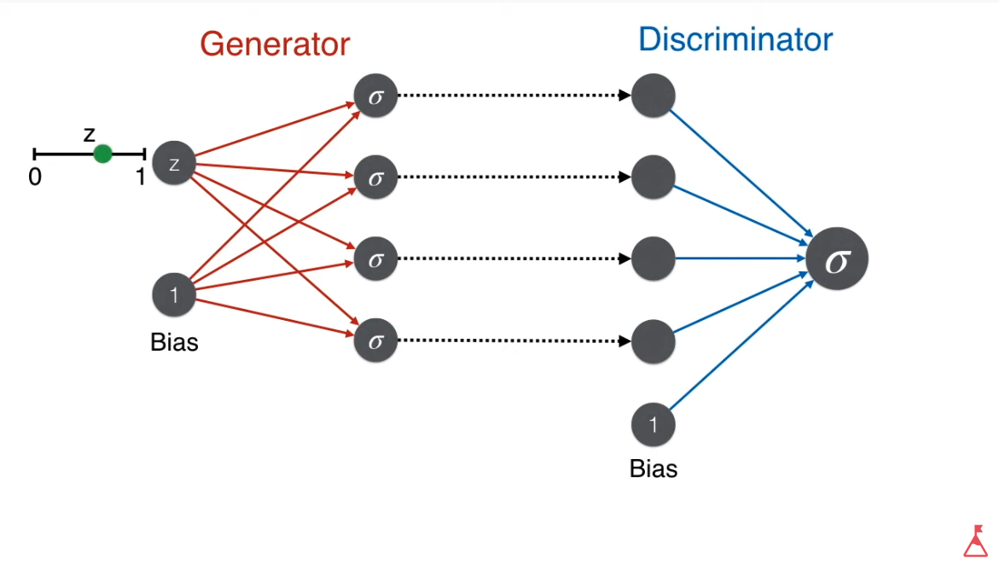
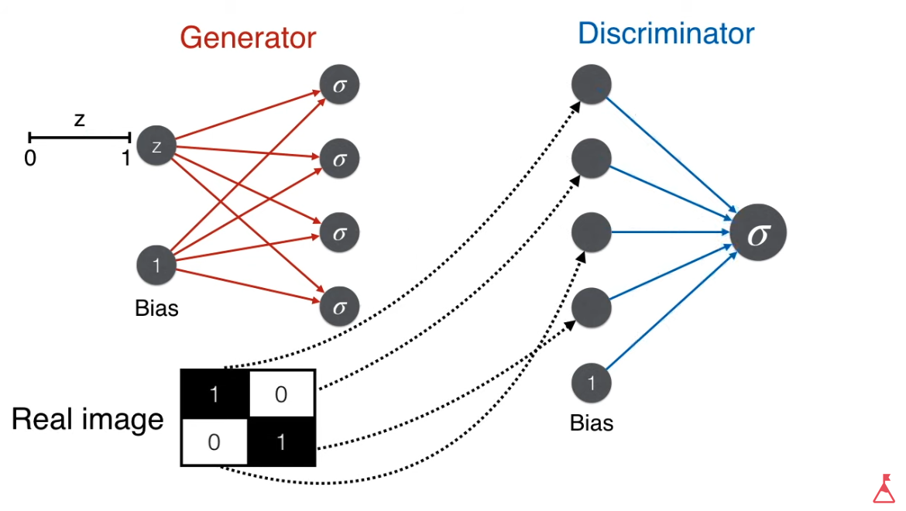
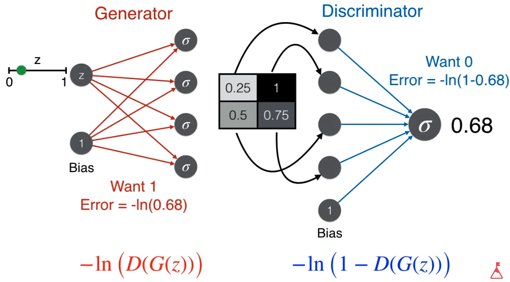
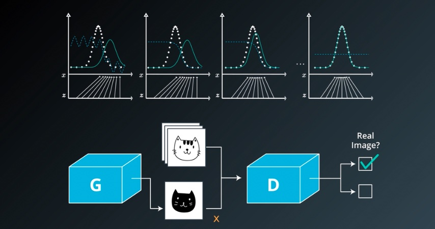
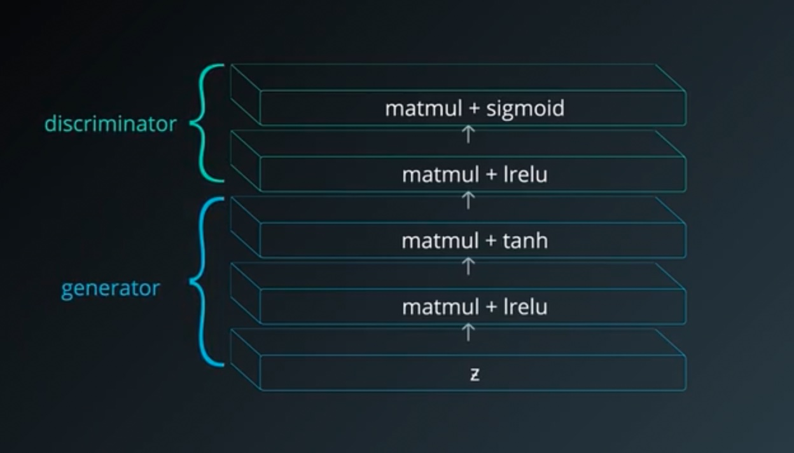

# Geneartive Adversarial Networks (GAN)

These are my personal notes taken while following the [Udacity Deep Learning Nanodegree](https://www.udacity.com/course/deep-learning-nanodegree--nd101).

The nanodegree is composed of six modules:

1. Introduction to Deep Learning
2. Neural Networks and Pytorch Guide
3. Convolutional Neural Networks (CNN)
4. Recurrent Neural Networks (RNN)
5. Generative Adversarial Networks (GAN)
6. Deploying a Model

Each module has a folder with its respective notes. This folder is the one of the **fifth module**: Generative Adversarial Networks.

Additionally, note that:

- I made many hand-written notes; check the PDFs.
- I forked the Udacity repository for the exercises [deep-learning-v2-pytorch](https://github.com/mxagar/deep-learning-v2-pytorch); all the material and notebooks are there.

## Overview of Contents

- [Geneartive Adversarial Networks (GAN)](#geneartive-adversarial-networks-gan)
  - [Overview of Contents](#overview-of-contents)
  - [1. Generative Adversarial Networks (GANs)](#1-generative-adversarial-networks-gans)
    - [1.1 Applications of GANs](#11-applications-of-gans)
    - [1.2 How GANs Work](#12-how-gans-work)
      - [Interpretation](#interpretation)
      - [Difficulties with GANs](#difficulties-with-gans)
    - [1.3 Tips for Training GANs](#13-tips-for-training-gans)
  - [X. Diffusion Models](#x-diffusion-models)
  - [X. NERFs](#x-nerfs)

## 1. Generative Adversarial Networks (GANs)

This section is taught by Ian Goodfellow himself! Goodfellow invented the Generative Adversarial Networks (GANs).

### 1.1 Applications of GANs

Some applications of GANs:

- Generate images from text: [StackGAN](https://arxiv.org/abs/1612.03242), [Dall-E](https://arxiv.org/pdf/2102.12092.pdf), [Stable Diffusion](https://arxiv.org/pdf/2112.10752.pdf), etc.
- Generate images sketches: [iGAN](https://github.com/junyanz/iGAN)
- Transform images into cartoons: [CartoonGAN](https://video.udacity-data.com/topher/2018/November/5bea23cd_cartoongan/cartoongan.pdf)

The first generates images that have been never seen by sampling in a distribution of all possible images.

The last two use a so called **Pix2Pix** approach in which an image in one domain is transformed into another domain; aka. *image translation*. It is possible to train those models in an unsupervised way, as Facebook researchers have shown with a model that transforms face photos into cartoons.

Another example is [CycleGAN](https://junyanz.github.io/CycleGAN/): unpaired image-to-image translation, i.e., they can transform an image from one domain to another in the absence of paired examples; for instance: a horse becomes a zebra. The training is unsupervised.

Some other applications of *Pix2Pix*:

- Building blueprints to finished building.
- Drawings to images.
- Photos to cartoons.
- Day images to night images.
- Adversarial examples that fool machines but not humans (captchas).
- Apple: eye image sketches to realistic eyes; then they trained a model to detect where the user is looking.

In the last example we see that GANs can be used to generate synthetic training sets.

GANs are not limited to the visual domain; we can use them to imitate anything:, e.g., Reinforcement Learning actions. 

### 1.2 How GANs Work

I made these notes following, in part, the video by Luis Serrano:

[A Friendly Introduction to Generative Adversarial Networks (GANs)](https://www.youtube.com/watch?v=8L11aMN5KY8).

Generative Adversarial Networks (GANs) were introduced by Ian Goodfellow and colleagues in 2014. They consist of two networks that compete with each other:

- The **Generator** `G()` network learns to generate fake but realistic/meaningful data from a `z` noise input. Its output is of the size of a data sample (often an image).
- The **Discriminator** `D()` network learns to distinguish between fake and real data. Its output is 1 (real) or 0 (fake).

Some notes on the notation:

- The noise is `z` (Gaussian).
- The Generator produces `x = G(z)`; `x` is an image.
- The discriminator takes that `x = G(z)` as fake input (as well as real samples) and produces `D(G(z))`, which should be real (1) even for fake (0) samples (e.g., images) at the end.

The final goal of a GAN is to train both networks together as if they are competing; then, **the resulting Generator G() is able to create very realistic fake data (e.g., face images)**.

To that end, the training works in two Phases (for each epoch) which can be repeated one after the other several times or with each batch (for some epochs):

- Phase 1: The Discriminator is trained to distinguish fake vs real
    - We generate a dataset of real images labelled as 1 and fake images generated by the Generator (with `z` noise inputs) labelled as 0.
    - The binary classification Discriminator is trained: first real samples can be used for N epochs, then fake samples.
    - Backpropagation and weight update occurs on the Discriminator.
    - As a result, the Discriminator learns to distinguish fake vs real.
- Phase 2: The Generator is trained to fool the Discriminator
    - We produce more fake images with `G()` and feed them to the Discriminator `D()` **but labelled as 1 (real)**.
    - We have a fake sample labelled as real: `D(G(z))` will probably yield something close to 'fake' or `0`, but we expect `1` or 'real'; we compute our loss according to our expectation and use it to update the weights of the Generator.
    - Backpropagation and weight update occurs on the Generator.
    - As a result, the Generator is trained to produce realistic fake samples that are classified as real by the Discriminator after a successful training.

While training phases continue one after the other, both the Generator and Discriminator get better at their jobs.

Note that **the Generator never sees a real image!** Instead it learns from the gradients of the discriminator; the more performant the discriminator, the more information it collects in its gradients.

**Figure 1: Discriminator D() fed by fake images by the Generator G()**: A noise input `z` is used to generate a fake sample; then, that fake sample is fed to a Discriminator. Credits by Luis Serrano (see link above).

**Figure 2: Discriminator D() fed with real images**: A real image is fed to Discriminator. Credits by Luis Serrano (see link above).

**Figure 3: Phase 2: Discriminator D() fed by fake images from the Generator G(), but fooled to expect real samples**: The loss function applied to the Generator is `-ln(D(G(z)))`. Credits by Luis Serrano (see link above).

#### Interpretation

- Over time, the generator is forced to produce more realistic outputs.
- Random noise `z` is mapped to an image `x = G(z)`.
- We have a distribution of images `x`, which is modeled by `G()`.
- Over time, the distribution modeled by `G()` matches the real distribution of `x`, the real images: we force the fake distribution to overlap the real one. Thus, the discriminator ends up yielding `0.5` for both real and fake images.
- The *adversarial* aspect of GANs is that we are training two networks with opposed targets: one is the police, the other is the counterfeiter. The idea is that with the training we reach an **equilibrium**, in **game-theoretical** terms.

#### Difficulties with GANs

- **Training resources**: GANs are often used for images; training on them requires powerful GPUs. We could use Google Colab, since it offers GPUs for free.

- **Mode collapse**: The Generator ends up producing a single image that always fools the Discriminator, independently of the noise input. See this [Quora link](https://www.quora.com/What-does-it-mean-if-all-produced-images-of-a-GAN-look-the-same). There are several approaches to overcome the issue:
  - Deep Convolutional GANs (DCGANs).
  - Mini-batch discrimination: generated batches that contain similar images are punished.

- **Instability**: It is sometimes difficult to evaluate performance and decide the necessary epochs, since all our images are fake. Additionally, since both `G()` and `D()` are competing, their performance score might start oscillating, which is not desired. Therefore, hyperparameter tuning is essential.

### 1.3 Tips for Training GANs

This section is summary of the paper

[Improved Techniques for Training GANs, 2016](https://arxiv.org/abs/1606.03498)
Tim Salimans, Ian Goodfellow, Wojciech Zaremba, Vicki Cheung, Alec Radford, Xi Chen

Let's consider the MNIST dataset with `28x28` grayscale images. For such small images, we can get away with fully connected networks, i.e., we end up having matrix multiplications: `matlmul`. Additionally, we would require the following:

- Both the generator `G` and the discriminator `D` need to have at least one hidden layer.
- For the hidden layers, any activation function will work, but the **leaky ReLU**, `lrelu` is specially popular. They work very well because they facilitate the propagation of the gradient in the entire network. This is good for every network, but it is specially important for GANs, since the generator needs to receive the gradients of the discriminator!
- A popular choice for the output of the generator is the hyperbolic tangent `tanh`, which yields values in `[0,1]`.
- The output of the discriminator is a `sigmoid`.

## X. Diffusion Models

- [What are Diffusion Models?](https://www.youtube.com/watch?v=fbLgFrlTnGU&list=LL)
- [Introduction to Diffusion Models for Machine Learning](https://www.assemblyai.com/blog/diffusion-models-for-machine-learning-introduction/)
- [Understanding Diffusion Models: A Unified Perspective](https://arxiv.org/abs/2208.11970)

## X. NERFs

- [NeRFs: Neural Radiance Fields - Paper Explained](https://www.youtube.com/watch?v=WSfEfZ0ilw4)
- [NeRF: Representing Scenes as Neural Radiance Fields for View Synthesis](https://arxiv.org/abs/2003.08934)
- [Jon Barron - Understanding and Extending Neural Radiance Fields](https://www.youtube.com/watch?v=HfJpQCBTqZs)