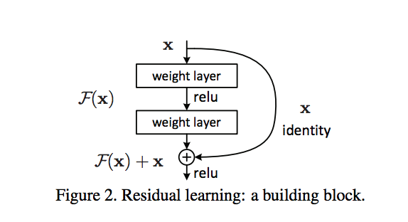

# Geneartive Adversarial Networks (GAN)

These are my personal notes taken while following the [Udacity Deep Learning Nanodegree](https://www.udacity.com/course/deep-learning-nanodegree--nd101).

The nanodegree is composed of six modules:

1. Introduction to Deep Learning
2. Neural Networks and Pytorch Guide
3. Convolutional Neural Networks (CNN)
4. Recurrent Neural Networks (RNN)
5. Generative Adversarial Networks (GAN)
6. Deploying a Model

Each module has a folder with its respective notes. This folder is the one of the **fifth module**: Generative Adversarial Networks.

Additionally, note that:

- I made many hand-written notes; check the PDFs.
- I forked the Udacity repository for the exercises [deep-learning-v2-pytorch](https://github.com/mxagar/deep-learning-v2-pytorch); all the material and notebooks are there.

## Overview of Contents

- [Geneartive Adversarial Networks (GAN)](#geneartive-adversarial-networks-gan)
  - [Overview of Contents](#overview-of-contents)
  - [1. Generative Adversarial Networks (GANs)](#1-generative-adversarial-networks-gans)
    - [1.1 Applications of GANs](#11-applications-of-gans)
    - [1.2 How GANs Work](#12-how-gans-work)
      - [Interpretation](#interpretation)
      - [Difficulties with GANs](#difficulties-with-gans)
    - [1.3 Tips for Training GANs](#13-tips-for-training-gans)
    - [1.4 MNIST GAN](#14-mnist-gan)
  - [2. Deep Convolutional GANs: DCGANs](#2-deep-convolutional-gans-dcgans)
    - [2.1 DCGAN Discriminator](#21-dcgan-discriminator)
    - [2.2 DCGAN Generator](#22-dcgan-generator)
    - [2.3 Batch Normalization](#23-batch-normalization)
      - [Implementation](#implementation)
      - [Benefits of Batch Normalization](#benefits-of-batch-normalization)
      - [Notebook: Batch Normalization](#notebook-batch-normalization)
    - [2.4 Implementing DCGAN](#24-implementing-dcgan)
    - [2.5 Other Applications of GANs](#25-other-applications-of-gans)
      - [Semi-Supervised Learning](#semi-supervised-learning)
      - [Domain Invariance](#domain-invariance)
      - [Ethical and Artistic Applications](#ethical-and-artistic-applications)
  - [3. Pix2Pix & CycleGAN: Image to Image Translation](#3-pix2pix--cyclegan-image-to-image-translation)
    - [3.1 Designing Loss Functions that Compare Images](#31-designing-loss-functions-that-compare-images)
    - [3.2 GAN Recap](#32-gan-recap)
    - [3.3 Pix2Pix and Paired Data](#33-pix2pix-and-paired-data)
      - [Pix2Pix Generator](#pix2pix-generator)
      - [Discriminator](#discriminator)
    - [3.4 CycleGAN and Unpaired Data](#34-cyclegan-and-unpaired-data)
    - [3.5 Cycle Consistency Loss](#35-cycle-consistency-loss)
    - [3.6 How Does This Work?](#36-how-does-this-work)
    - [3.7 Beyond CycleGANs](#37-beyond-cyclegans)
    - [3.8 Implementing the CycleGAN](#38-implementing-the-cyclegan)
    - [3.X Papers and Links to Check](#3x-papers-and-links-to-check)
  - [X. Interesting Links](#x-interesting-links)
  - [X. Diffusion Models](#x-diffusion-models)
  - [X. NERFs](#x-nerfs)
  - [X. GPT](#x-gpt)

## 1. Generative Adversarial Networks (GANs)

This section is taught by Ian Goodfellow himself! Goodfellow invented the Generative Adversarial Networks (GANs) with his seminal paper [Generative Adversarial Networks, 2014](https://arxiv.org/abs/1406.2661).

### 1.1 Applications of GANs

Some applications of GANs:

- Generate images from text: [StackGAN](https://arxiv.org/abs/1612.03242), [Dall-E](https://arxiv.org/pdf/2102.12092.pdf), [Stable Diffusion](https://arxiv.org/pdf/2112.10752.pdf), etc.
- Generate images sketches: [iGAN](https://github.com/junyanz/iGAN)
- Transform images into cartoons: [CartoonGAN](https://video.udacity-data.com/topher/2018/November/5bea23cd_cartoongan/cartoongan.pdf)

The first generates images that have been never seen by sampling in a distribution of all possible images.

The last two use a so called **Pix2Pix** approach in which an image in one domain is transformed into another domain; aka. *image translation*. It is possible to train those models in an unsupervised way, as Facebook researchers have shown with a model that transforms face photos into cartoons.

Another example is [CycleGAN](https://junyanz.github.io/CycleGAN/): unpaired image-to-image translation, i.e., they can transform an image from one domain to another in the absence of paired examples; for instance: a horse becomes a zebra. The training is unsupervised.

Some other applications of *Pix2Pix*:

- Building blueprints to finished building.
- Drawings to images.
- Photos to cartoons.
- Day images to night images.
- Adversarial examples that fool machines but not humans (captchas).
- Apple: eye image sketches to realistic eyes; then they trained a model to detect where the user is looking.

In the last example we see that GANs can be used to generate synthetic training sets.

GANs are not limited to the visual domain; we can use them to imitate anything:, e.g., Reinforcement Learning actions. 

### 1.2 How GANs Work

I made these notes following, in part, the video by Luis Serrano:

[A Friendly Introduction to Generative Adversarial Networks (GANs)](https://www.youtube.com/watch?v=8L11aMN5KY8).

Generative Adversarial Networks (GANs) were introduced by Ian Goodfellow and colleagues in 2014. They consist of two networks that compete with each other:

- The **Generator** `G()` network learns to generate fake but realistic/meaningful data from a `z` noise input. Its output is of the size of a data sample (often an image).
- The **Discriminator** `D()` network learns to distinguish between fake and real data. Its output is 1 (real) or 0 (fake).

Some notes on the notation:

- The noise is `z` (Gaussian). It is also known as the latent vector, i.e., we are taking a point in the latent space that contains all possible images.
- The Generator produces `x = G(z)`; `x` is an image.
- The discriminator takes that `x = G(z)` as fake input (as well as real samples) and produces `D(G(z))`, which should be real (1) even for fake (0) samples (e.g., images) at the end.

**Core idea**: The final goal of a GAN is to train both networks together as if they are competing, i.e., they have opposing objectives. Then, **the resulting Generator G() is able to create very realistic fake data (e.g., face images)**. Simultaneously, the D() is not able to distinguish between fake/generated and real, and it outputs values close to 0.5 for both.

To that end, the training works in two Phases (for each batch of real images):

- Phase 1: The Discriminator is trained to distinguish fake vs real
    - We generate a dataset of real images labelled as 1 and fake images generated by the Generator (with `z` noise inputs) labelled as 0.
    - The binary classification Discriminator is trained: first real samples can be used, then fake samples.
    - Backpropagation and weight update occurs on the Discriminator.
    - As a result, the Discriminator learns to distinguish fake vs real.
- Phase 2: The Generator is trained to fool the Discriminator
    - We produce more fake images with `G()` and feed them to the Discriminator `D()` **but labelled as 1 (real)**.
    - We have a fake sample labelled as real: `D(G(z))` will probably yield something close to 'fake' or `0`, but we expect `1` or 'real'; we compute our loss according to our expectation and use it to update the weights of the Generator.
    - Backpropagation and weight update occurs on the Generator.
    - As a result, the Generator is trained to produce realistic fake samples that are classified as real by the Discriminator after a successful training.

While training phases continue one after the other, both the Generator and Discriminator get better at their jobs. We alternate the phases for each batch and we train both networks for several epochs. Note that we need one optimizer and one loss for each network.

Note that **the Generator never sees a real image!** Instead it learns from the gradients of the discriminator; the more performant the discriminator, the more information it collects in its gradients.

**Figure 1: Discriminator D() fed by fake images by the Generator G()**: A noise input `z` is used to generate a fake sample; then, that fake sample is fed to a Discriminator. Credits by Luis Serrano (see link above).


**Figure 2: Discriminator D() fed with real images**: A real image is fed to Discriminator. Credits by Luis Serrano (see link above).


**Figure 3: Phase 2: Discriminator D() fed by fake images from the Generator G(), but fooled to expect real samples**: The loss function applied to the Generator is `-ln(D(G(z)))`. Credits by Luis Serrano (see link above).


#### Interpretation

- Over time, the generator is forced to produce more realistic outputs.
- Random noise `z` is mapped to an image `x = G(z)`.
- We have a distribution of images `x`, which is modeled by `G()`.
- Over time, the distribution modeled by `G()` matches the real distribution of `x`, the real images: we force the fake distribution to overlap the real one. Thus, the discriminator ends up yielding `0.5` for both real and fake images.
- The *adversarial* aspect of GANs is that we are training two networks with opposed targets: one is the police, the other is the counterfeiter. The idea is that with the training we reach an **equilibrium**, in **game-theoretical** terms.
- For the generator, the labels are flipped. In other words: the generator optimizes the wrong labels. The intuition is in line with the counterfeiter-police example: the counterfeiter presents to the police the fake money as it were real; the police then states: "that can't be true because the watermark is missing". The fact that the watermark is missing is the gradient: information that is propagated to the generator so that it improves.


#### Difficulties with GANs

- **Training resources**: GANs are often used for images; training on them requires powerful GPUs. We could use Google Colab, since it offers GPUs for free.

- **Mode collapse**: The Generator ends up producing a single image that always fools the Discriminator, independently of the noise input. See this [Quora link](https://www.quora.com/What-does-it-mean-if-all-produced-images-of-a-GAN-look-the-same). There are several approaches to overcome the issue:
  - Deep Convolutional GANs (DCGANs).
  - Mini-batch discrimination: generated batches that contain similar images are punished.

- **Instability**: It is sometimes difficult to evaluate performance and decide the necessary epochs, since all our images are fake. Additionally, since both `G()` and `D()` are competing, their performance score might start oscillating, which is not desired. Therefore, hyperparameter tuning is essential.

### 1.3 Tips for Training GANs

This section is summary of the paper

[Improved Techniques for Training GANs, 2016](https://arxiv.org/abs/1606.03498)
Tim Salimans, Ian Goodfellow, Wojciech Zaremba, Vicki Cheung, Alec Radford, Xi Chen

Let's consider the MNIST dataset with `28x28` grayscale images. For such small images, we can get away with fully connected networks, i.e., we end up having matrix multiplications: `matlmul`. Additionally, we would require the following:

- Both the generator `G` and the discriminator `D` need to have at least one hidden layer.
- For the hidden layers, any activation function will work, but the **leaky ReLU**, `lrelu` is specially popular. They work very well because they facilitate the propagation of the gradient in the entire network, since the gradient of `lrelu` is not 0 for negative values. This is good for every network, but it is specially important for GANs, since the generator needs to receive the gradients of the discriminator!
- A popular choice for the output of the generator is the hyperbolic tangent `tanh`, which yields values in `[0,1]`.
- The output of the discriminator is a `sigmoid`.

`LeakyReLU(x) = max(0,x) + negative_slope (default: 0.01) * min(0,x)`


In contrast to many other machine learning models, GANs require 2 losses, `g_loss` and `d_loss`, and 2 optimization algorithms running simultaneously. Additionally:

- GANs are very sensitive to the optimization parameters; usually, much effort is put on selecting the right parameters so that the networks don't overpower the other.
- Adam is a good choice.
- For the discriminator, we should use the **binary cross-entropy loss, but its stable version that uses logits**! The logits are the values produced by the discriminator, right before the sigmoid.
- For the discriminator, one GAN specific trick is to multiply the labels by 0.9 so that they are a little bit below their value. It regularizes the system and decreases extreme predictions.
- For the generator, we should use the same stable binary cross-entropy loss, but with the labels flipped. In other words: the generator optimizes the log-probability of the wrong labels.
- Some people take `g_loss = -d_loss`, but it doesn't work well in practice, because the gradient one is 0 when the other is winning. The intuition behind that choice is that both nets are adversarial, i.e., they are competing with each other, and we want to achieve an equilibrium.

 


Everything introduced so far applies to all GANs; however, if we want to scale up to large image sizes, we need to start using convolutional layers.

- Convolutional layers take 4D tensors: `(batch_size, channels, width, height)`; we need to `reshape` the noise input `z` for that.
- Classification CNNs apply convolutions and pooling to shrink the image size while enlarging the number of channels; however, for GANs, **it is recommended to increase the image size as we go deeper in the generator**! That is achieved with convolution transpose with stides larger than 1.
- We should use **batch normalization** (or equivalent) in all layers except the output layer of the generator and the input layer of the discriminator. The [DCGAN](https://arxiv.org/abs/1511.06434v2) authors also apply different batch normalizations to real and fake/generated images, and that seems to work nicely in practice.


### 1.4 MNIST GAN

**Core idea of GANs**: The final goal of a GAN is to train both networks together as if they are competing, i.e., they have opposing objectives. Then, **the resulting Generator G() is able to create very realistic fake data (e.g., face images)**. Simultaneously, the discriminator D() is not able to distinguish between fake/generated and real, and it outputs values close to 0.5 for both.

This section implements a GAN for the MNIST dataset. The notebook is in 

[deep-learning-v2-pytorch](https://github.com/mxagar/deep-learning-v2-pytorch) `/ gan-mnist`


The following steps are carried out:

1. Definition of the `Discriminator()` and the `Generator()`: fully connected layers are used.
2. Definition of the Losses & the Optimizers
3. Training Loop
4. Sample Visualization

In the second step, **Definition of the Losses & the Optimizer**, two functions are defined, which are used for both the `Discriminator()` and the `Generator()`:

- `real_loss()`: `BCEWithLogitsLoss()` if the target were 1, i.e., a real image. However, note that when training the `Generator()` (see below), we fool it pretending fake images to be real, thus we use this function with fake images, too!
- `fake_loss()`: `BCEWithLogitsLoss()` if the target were 0, i.e., a fake image.

Additionally, we require two optimizers, one for each network:

```python
d_optimizer = optim.Adam(D.parameters(), lr)
g_optimizer = optim.Adam(G.parameters(), lr)
```

The 3rd step, **Traning Loop** is very interesting; there we see that the training involves alternating between training the discriminator and the generator **in each batch**. We'll use our functions `real_loss` and `fake_loss` to help us calculate the discriminator losses in all of the following cases.

Discriminator training:

1. Compute the discriminator loss on real, training images.
2. Generate fake images with latent/noise vectors.
3. Compute the discriminator loss on fake, generated images.
4. Add up real and fake loss: `d_loss = d_real_loss + d_fake_loss`.
5. Perform backpropagation + an optimization step to update the discriminator's weights: 

  ```python
  d_loss.backward()
  d_optimizer.step()
  ```

Generator training:

1. Generate fake images with latent/noise vectors.
2. Compute the discriminator loss on fake images, using **flipped** labels! This is equivalent to using the `real_loss()` function.
3. Perform backpropagation + an optimization step to update the generator's weights:

  ```python
  g_loss.backward()
  g_optimizer.step()
  ```

In order to visualize the samples in the 4th step, **Sample Visualization**, we save 16 fake/generated images every epoch. Each time a fixed set of 16 random/latent vectors is used. We can see how the fake/generated samples become more realistic with time.

In the following, the code of the notebook is provided:

```python
%matplotlib inline

import numpy as np
import torch
import matplotlib.pyplot as plt

##
## 0. Data Loader
##

from torchvision import datasets
import torchvision.transforms as transforms

# number of subprocesses to use for data loading
num_workers = 0
# how many samples per batch to load
batch_size = 64

# convert data to torch.FloatTensor
transform = transforms.ToTensor()

# get the training datasets
train_data = datasets.MNIST(root='data', train=True,
                                   download=True, transform=transform)

# prepare data loader
# note that we have only train images,
# because this is not the typical supervised classification
train_loader = torch.utils.data.DataLoader(train_data, batch_size=batch_size,
                                           num_workers=num_workers)


# Visualize the data
# obtain one batch of training images
dataiter = iter(train_loader)
images, labels = dataiter.next()
print(images.size())
images = images.numpy()

# get one image from the batch
img = np.squeeze(images[0])

fig = plt.figure(figsize = (3,3)) 
ax = fig.add_subplot(111)
ax.imshow(img, cmap='gray')

##
## 1. Definition of the `Discriminator()` and the `Generator()`
##

import torch.nn as nn
import torch.nn.functional as F

class Discriminator(nn.Module):

    def __init__(self, input_size, hidden_dim, output_size):
        super(Discriminator, self).__init__()
        
        # define hidden linear layers
        self.fc1 = nn.Linear(input_size, hidden_dim*4)
        self.fc2 = nn.Linear(hidden_dim*4, hidden_dim*2)
        self.fc3 = nn.Linear(hidden_dim*2, hidden_dim)
        
        # final fully-connected layer
        self.fc4 = nn.Linear(hidden_dim, output_size)
        
        # dropout layer:
        # good practice to add in-between linear layers
        self.dropout = nn.Dropout(0.3)
        
    def forward(self, x):
        # flatten image
        # real images:
        # x: torch.Size([64, 1, 28, 28])
        # (batch_size, channels, width, height)
        # x = x.view(-1, x.size(2)*x.size(3)) # (batch, 784)
        # fake images:
        # x: torch.Size([64, 284])
        # Real and fake images have a different size,
        # we need to account for both cases...
        x = x.view(-1, 28*28)
        
        # pass x through all layers
        # apply leaky relu activation to all hidden layers
        x = F.leaky_relu(self.fc1(x), 0.2) # (input, negative_slope=0.2)
        x = self.dropout(x)
        x = F.leaky_relu(self.fc2(x), 0.2)
        x = self.dropout(x)
        x = F.leaky_relu(self.fc3(x), 0.2)
        x = self.dropout(x)
        # final layer
        # no sigmoid activation = logits!
        # then, we should use BCEWithLogitsLoss
        x = self.fc4(x)

        return x

class Generator(nn.Module):

    def __init__(self, input_size, hidden_dim, output_size):
        super(Generator, self).__init__()
        
        # define all layers
        # layer behaviour is reversed,
        # compared to the Discriminator
        self.fc1 = nn.Linear(input_size, hidden_dim)
        self.fc2 = nn.Linear(hidden_dim, hidden_dim*2)
        self.fc3 = nn.Linear(hidden_dim*2, hidden_dim*4)
        self.fc4 = nn.Linear(hidden_dim*4, output_size)
        
        self.dropout = nn.Dropout(0.3)
        
    def forward(self, x):
        # pass x through all layers
        x = F.leaky_relu(self.fc1(x), 0.2) # (input, negative_slope=0.2)
        x = self.dropout(x)
        x = F.leaky_relu(self.fc2(x), 0.2)
        x = self.dropout(x)
        x = F.leaky_relu(self.fc3(x), 0.2)
        x = self.dropout(x)

        # final layer should have tanh applied
        x = torch.tanh(self.fc4(x))

        return x

# Discriminator hyperparams

# Size of input image to discriminator (28*28)
input_size = 28*28 # 784
# Size of discriminator output (real or fake)
d_output_size = 1
# Size of *last* hidden layer in the discriminator
d_hidden_size = 32 # 784 -> 128 -> 64 -> 32 -> 1

# Generator hyperparams

# Size of latent vector to give to generator
z_size = 100
# Size of generator output (generated image)
g_output_size = input_size # 28*28 = 784
# Size of *first* hidden layer in the generator
g_hidden_size = 32 # 100 -> 32 -> 64 -> 128 ->  784

# instantiate discriminator and generator
D = Discriminator(input_size, d_hidden_size, d_output_size)
G = Generator(z_size, g_hidden_size, g_output_size)

# check that they are as you expect
print(D)
print()
print(G)

##
## 2. Definition of the Losses & the Optimizers
##

# The following loss functions are used for both the
# Discriminator and the Generator
# D_out: output of the Discriminator
# Case: real images passed
def real_loss(D_out, smooth=False):
    batch_size = D_out.size(0)
    # label smoothing for regularization
    if smooth:
        # smooth, real labels = 0.9
        labels = torch.ones(batch_size)*0.9
    else:
        labels = torch.ones(batch_size) # real labels = 1
        
    # numerically stable loss
    criterion = nn.BCEWithLogitsLoss()
    # calculate loss
    # squeeze any empty dimensions
    loss = criterion(D_out.squeeze(), labels)
    return loss

# Case: fake images passed
def fake_loss(D_out):
    batch_size = D_out.size(0)
    labels = torch.zeros(batch_size) # fake labels = 0
    criterion = nn.BCEWithLogitsLoss()
    # calculate loss
    loss = criterion(D_out.squeeze(), labels)
    return loss

import torch.optim as optim

# Learning rate
lr = 0.002

# Create two separate optimizers for the discriminator and generator
d_optimizer = optim.Adam(D.parameters(), lr)
g_optimizer = optim.Adam(G.parameters(), lr)

##
## 3. Training Loop
##

import pickle as pkl

# training hyperparams
num_epochs = 100

# keep track of loss and generated, "fake" samples
samples = []
losses = []

print_every = 400

# Get some fixed data for sampling. These are images that are held
# constant throughout training, and allow us to inspect the model's performance
# We save 16 fake/generated images every epoch.
# Each time a fixed set of 16 random/latent vectors is used.
# Here, we define those vectors.
sample_size=16
fixed_z = np.random.uniform(-1, 1, size=(sample_size, z_size))
fixed_z = torch.from_numpy(fixed_z).float()

# train the network
D.train()
G.train()
for epoch in range(num_epochs):
    
    for batch_i, (real_images, _) in enumerate(train_loader):
                
        batch_size = real_images.size(0)
        
        ## Important rescaling step ## 
        real_images = real_images*2 - 1  # rescale input images from [0,1) to [-1, 1)
        
        # ============================================
        #            TRAIN THE DISCRIMINATOR
        # ============================================
        
        d_optimizer.zero_grad()
        
        # 1. Train with real images

        # Compute the discriminator losses on real images 
        # smooth the real labels
        D_real = D(real_images)
        d_real_loss = real_loss(D_real, smooth=True)
        
        # 2. Train with fake images
        
        # Generate fake images
        # gradients don't have to flow during this step
        with torch.no_grad():
            z = np.random.uniform(-1, 1, size=(batch_size, z_size))
            z = torch.from_numpy(z).float()
            fake_images = G(z)
        
        # Compute the discriminator losses on fake images        
        D_fake = D(fake_images)
        d_fake_loss = fake_loss(D_fake)
        
        # add up loss and perform backprop
        d_loss = d_real_loss + d_fake_loss
        d_loss.backward()
        d_optimizer.step()
        
        
        # =========================================
        #            TRAIN THE GENERATOR
        # =========================================
        g_optimizer.zero_grad()
        
        # 1. Train with fake images and flipped labels
        
        # Generate fake images
        z = np.random.uniform(-1, 1, size=(batch_size, z_size))
        z = torch.from_numpy(z).float()
        fake_images = G(z)
        
        # Compute the discriminator losses on fake images 
        # using flipped labels!
        D_fake = D(fake_images)
        g_loss = real_loss(D_fake) # use real loss to flip labels
        
        # perform backprop
        g_loss.backward()
        g_optimizer.step()

        # Print some loss stats
        if batch_i % print_every == 0:
            # print discriminator and generator loss
            print('Epoch [{:5d}/{:5d}] | d_loss: {:6.4f} | g_loss: {:6.4f}'.format(
                    epoch+1, num_epochs, d_loss.item(), g_loss.item()))

    
    ## AFTER EACH EPOCH##
    # append discriminator loss and generator loss
    losses.append((d_loss.item(), g_loss.item()))
    
    # generate and save sample, fake images
    G.eval() # eval mode for generating samples, de-activate dropout
    samples_z = G(fixed_z)
    samples.append(samples_z)
    G.train() # back to train mode


# Save training generator samples
with open('train_samples.pkl', 'wb') as f:
    pkl.dump(samples, f)


# Note that these are not the typical learning curves
# because the Generator is trying to fool the Discriminator.
# With GANs, it's normal to see an initial decrease of the G loss
# followed by a fluctuation/oscillation around a value for both.
fig, ax = plt.subplots()
losses = np.array(losses)
plt.plot(losses.T[0], label='Discriminator')
plt.plot(losses.T[1], label='Generator')
plt.title("Training Losses")
plt.legend()


##
## 4. Sample Visualization
##

# helper function for viewing a list of passed in sample images
def view_samples(epoch, samples):
    fig, axes = plt.subplots(figsize=(7,7), nrows=4, ncols=4, sharey=True, sharex=True)
    for ax, img in zip(axes.flatten(), samples[epoch]):
        img = img.detach()
        ax.xaxis.set_visible(False)
        ax.yaxis.set_visible(False)
        im = ax.imshow(img.reshape((28,28)), cmap='Greys_r')

# Load samples from generator, taken while training
with open('train_samples.pkl', 'rb') as f:
    samples = pkl.load(f)

# -1 indicates final epoch's samples (the last in the list)
# Recall we have saved 16 images for each epoch
view_samples(-1, samples)

# We take 10 epochs and for each 6 samples, all equidistant
# We visualize those samples = fake images.
# Initially, they're noise; then, they become more realistic.
rows = 10 # split epochs into 10, so 100/10 = every 10 epochs
cols = 6
fig, axes = plt.subplots(figsize=(7,12), nrows=rows, ncols=cols, sharex=True, sharey=True)

for sample, ax_row in zip(samples[::int(len(samples)/rows)], axes):
    for img, ax in zip(sample[::int(len(sample)/cols)], ax_row):
        img = img.detach()
        ax.imshow(img.reshape((28,28)), cmap='Greys_r')
        ax.xaxis.set_visible(False)
        ax.yaxis.set_visible(False)

# Every time we run this cell we should get new 16 samples!
# randomly generated, new latent vectors
sample_size=16
rand_z = np.random.uniform(-1, 1, size=(sample_size, z_size))
rand_z = torch.from_numpy(rand_z).float()
G.eval() # eval mode
# generated samples
rand_images = G(rand_z)
# 0 indicates the first set of samples in the passed in list
# and we only have one batch of samples, here
view_samples(0, [rand_images])

```

## 2. Deep Convolutional GANs: DCGANs

In this section the [Street View House Numbers (SVHN) Dataset](http://ufldl.stanford.edu/housenumbers/) is used: a collection of house numbers images from street view that are labelled to be classified.


The dataset is more complex than MNIST and it requires convolutional layers; thus, a **Deep Convolutional GAN (DCGAN)** is defined following similar guidelines as before, but replacing any linear layers with convolutions or transpose convolutions.

The first ones to use a DCGAN were

Alec Radford, Luke Metz, Soumith Chintala, 2016. [Unsupervised Representation Learning with Deep Convolutional Generative Adversarial Networks](https://arxiv.org/abs/1511.06434)

This section is based on that paper. Radford et al. provide architectural guidelines specific for DCGANs:

> Architecture guidelines for stable Deep Convolutional GANs
> - Replace any pooling layers with strided convolutions (discriminator) and fractional-strided convolutions (generator).
> - Use batchnorm in both the generator and the discriminator.
> - Remove fully connected hidden layers for deeper architectures.
> - Use ReLU activation in generator for all layers except for the output, which uses Tanh.
> - Use LeakyReLU activation in the discriminator for all layers.

Note that the training function is basically the same as in the case of the MNIST; only, the parameters of the optimizers are different, and the Generator and the Discriminator are defined with convolutions and transpose convolutions.

### 2.1 DCGAN Discriminator

The discriminator has the architecture shown in the following:


Note that:

- There are no pooling layers! Instead, convolutions of `stride=2` are used, thus, for every 2 pixels it sees, it creates 1 filtered image.
- We use the same leaky ReLU as before.
- We use batch normalization: layer outputs are scaled to have a mean of 0 and variance of 1; that increases training speed and reduces issues to poor initialization.
- We're going to use images of size `(32, 32, 3)`.

### 2.2 DCGAN Generator

The generator has the architecture shown in the following:


Note that:

- Transpose convolutions are used to upsample the feature maps: we go from narrow and deep feature maps to wide and shallow maps (i.e., images). The output layer size depends on the stride: `stride=2` doubles the size. The change in depth is controlled by the number of channels of the kernel.
- ReLU is used, not leaky ReLU!
- Batch normalization is used.
- We're going to output images of size `(32, 32, 3)`.

### 2.3 Batch Normalization

Batch normalization was introduced by Ioffe et al. in 

[Batch Normalization: Accelerating Deep Network Training by Reducing Internal Covariate Shift](https://arxiv.org/abs/1502.03167). Sergey Ioffe, Christian Szegedy, 2015.

> Batch normalization normalizes the output of a previous layer by subtracting the batch mean and dividing by the batch standard deviation.

As a result, the batch mean becomes 0 and the variance/std. dev. 1.

The **goal of batch normalization is to improve training (make it faster) and make possible deeper networks; the accuracy of the inference might be improved a little bit.**

**Intuition**: Normalizing the inputs to a network helps the network learn a converge to a solution; we can imagine that batch normalization is like doing that between layers, i.e., it is as if a network were composed by many mini sub-networks, and we scale the input for each of them. So we'd have a series of networks feeding to each other.

Apart from that intuitive explanation, the authors prove in the paper that batch normalization decreases what they call the **internal covariate shift**:

> Internal covariate shift refers to the change in the distribution of the inputs to different layers. It turns out that training a network is most efficient when the distribution of inputs to each layer is similar!

Also, check Goodfellow's text book on Deep Learning: Chapter 8, Optimization.

#### Implementation

We compute the mean and the variance of all the values `x_i` in the batch `B` that come out from a layer **before the activation**:

`mu_B, sigma_B^2`

Then, the `x_i` values are scaled:

`x_i_scaled <- (x_i - mu_B) / sqrt(sigma_B^2 + epsilon)`

with `epsilon -> 0.001`; we add that small coefficient because

- we want to avoid division by 0,
- and because we are really trying to estimate the population variance; that variance is usually larger than the variance of the sample (the batch, in our case).

Then, we apply a scaling (`gamma`) and a shift (`beta`) to those scaled values:

`y_i <- gamma*x_i_scaled + beta`

The parameters `gamma` and `beta` are **learnable**!

Note that we usually don't use the bias term when applying batch normalization because

> since we normalize `Wx+b`, the bias `b` can be ignored given that its effect will be canceled by the subsequent mean subtraction (the role of the bias is subsumed by `beta`).

The following image/algorithm from Ioffe et al. summarizes the batch normalization algorithm:


So in summary:

- We standardize the signals with batch sample statistics: mean and variance.
- The normalization happens after the layer and before the activation.
- If we apply batch normalization, the bias term can be switched off.
- Apart from the normalization, there is a scaling and a shifting with learnable parameters. That means we need to have unique batch normalization layers for each layer.

Practical notes for Pytorch:

- In MLPs: We use [`BatchNorm1d`](https://pytorch.org/docs/stable/generated/torch.nn.BatchNorm1d.html#torch.nn.BatchNorm1d) if the layers we normalize are linear. The normalization is applied to every node signal.
- In CNNs: We use [`BatchNorm2d`](https://pytorch.org/docs/stable/generated/torch.nn.BatchNorm2d.html#torch.nn.BatchNorm2d) if the layers we normalize are convolutional. The normalization is applied to every feature map.
- In RNNs: The implementation is more complex and there is not Pytorch class ready to use; in the paper [Recurrent Batch Normalization](https://arxiv.org/abs/1603.09025), Cooijmans et al. showed how to do it; here is an exemplary [implementation code in Pytorch](https://github.com/jihunchoi/recurrent-batch-normalization-pytorch).
- We need to use `.eval()` for testing in order to apply the **population** batch normalization instead of the **batch/sample** batch normalization employed with `.train()`. Population refers to the entire dataset fed so far, while sample/batch refers to the batch.

#### Benefits of Batch Normalization

The main motivation of batch normalization is to improve the training; we can get overall better results, but the idea is to speed up the learning process so that we can try different hyperparameters in a shorter time.

- By normalizing the inputs to the next layer, we reduce the oscillations, which **improves training speed and convergence**.
- We **can use much higher learning rates**; therefore, we can train faster.
- **Weight initialization is easier**, we can be much less careful.
- **Activation functions work better**, because we input centered and scaled distributions.
- **We can create deeper networks because of the previous 4 points**, and deeper networks learn more complex features.
- **A little bit of regularization is added**, as shown experimentally; thus, we can reduce some dropout.
- **We can obtain small inference improvements**; although the main motivation is to enhance the training to try different sets of hyperparameters.

#### Notebook: Batch Normalization

This notebook shows how to use batch normalization in a classification network which uses the MNIST dataset:

[deep-learning-v2-pytorch](https://github.com/mxagar/deep-learning-v2-pytorch) `/ batch-norm`

The implementation is done using MLPs. Two networks are instantiated:

- one without batch normalization
- and one with batch normalization.

Apart from that difference, the training and testing is the same for both, i.e., the batch normalization appears only in the network layer definition and the `forward()` function.

Both networks are compared and the one with batch normalization shows better learning curves (faster, lower loss) and accuracy on the test split.

In the following, the definition of the networks, which is the most important part of the notebook:

```python
import torch.nn as nn
import torch.nn.functional as F

class NeuralNet(nn.Module):
    def __init__(self, use_batch_norm, input_size=784, hidden_dim=256, output_size=10):
        """
        Creates a PyTorch net using the given parameters.
        
        :param use_batch_norm: bool
            Pass True to create a network that uses batch normalization; False otherwise
            Note: this network will not use batch normalization on layers that do not have an
            activation function.
        """
        super(NeuralNet, self).__init__() # init super
        
        # Default layer sizes
        self.input_size = input_size # (28*28 images)
        self.hidden_dim = hidden_dim
        self.output_size = output_size # (number of classes)
        # Keep track of whether or not this network uses batch normalization.
        self.use_batch_norm = use_batch_norm
        
        # define hidden linear layers, with optional batch norm on their outputs
        # layers with batch_norm applied have no bias term
        # Ioffe et al. explain that 
        # "the bias b can be ignored since 
        # its effect will be canceled by the subsequent mean subtraction 
        # (the role of the bias is subsumed by beta)"
        if use_batch_norm:
            self.fc1 = nn.Linear(input_size, hidden_dim*2, bias=False)
            self.batch_norm1 = nn.BatchNorm1d(hidden_dim*2)
        else:
            self.fc1 = nn.Linear(input_size, hidden_dim*2)
            
        # define *second* hidden linear layers, with optional batch norm on their outputs
        if use_batch_norm:
            self.fc2 = nn.Linear(hidden_dim*2, hidden_dim, bias=False)
            self.batch_norm2 = nn.BatchNorm1d(hidden_dim)
        else:
            self.fc2 = nn.Linear(hidden_dim*2, hidden_dim)
        
        # third and final, fully-connected layer
        self.fc3 = nn.Linear(hidden_dim, output_size)
        
        
    def forward(self, x):
        # flatten image
        x = x.view(-1, 28*28)
        # all hidden layers + optional batch norm + relu activation
        x = self.fc1(x)
        if self.use_batch_norm:
            x = self.batch_norm1(x)
        x = F.relu(x)
        # second layer
        x = self.fc2(x)
        if self.use_batch_norm:
            x = self.batch_norm2(x)
        x = F.relu(x)
        # third layer, no batch norm or activation
        x = self.fc3(x)
        return x
```

### 2.4 Implementing DCGAN

This section centers around the DCGAN implementation notebook

[deep-learning-v2-pytorch](https://github.com/mxagar/deep-learning-v2-pytorch) `/ dcgan-svhn`

which follows the [DCGAN paper](https://arxiv.org/pdf/1511.06434.pdf).

In the implementation, [The Street View House Numbers (SVHN) Dataset](http://ufldl.stanford.edu/housenumbers/) is used, which consists of `32 x 32 x 3` images of door numbers. The goal is to generate fake but realistic door numbers.

Note that the training function is basically the same as in the case of the MNIST GAN; only, the parameters of the optimizers are different, and the Generator and the Discriminator are defined with convolutions and transpose convolutions.


The figures of the `Generator` and the `Discriminator` architectures are the following; however, note that the implemented channels depths are different: the figures use `conv_dim = 128`, whereas the implemented/suggested depth is based on `conv_dim = 32`:


All in all, the following steps are implemented:

1. Get and Prepare the Data
2. Define the Generator and the Discriminator
3. Loss Functions and Optimizers
4. Training
5. Evaluation / View Samples

```python
# import libraries
import matplotlib.pyplot as plt
import numpy as np
import pickle as pkl

%matplotlib inline

##
## --- 1. Get and Prepare the Data
##

import torch
from torchvision import datasets
from torchvision import transforms

# Tensor transform
transform = transforms.ToTensor()

# SVHN training datasets
svhn_train = datasets.SVHN(root='data/', split='train', download=True, transform=transform)

batch_size = 128
num_workers = 0

# build DataLoaders for SVHN dataset
train_loader = torch.utils.data.DataLoader(dataset=svhn_train,
                                          batch_size=batch_size,
                                          shuffle=True,
                                          num_workers=num_workers)

## Visualize the Data

# obtain one batch of training images
dataiter = iter(train_loader)
images, labels = dataiter.next()

# plot the images in the batch, along with the corresponding labels
fig = plt.figure(figsize=(25, 4))
plot_size=20
for idx in np.arange(plot_size):
    ax = fig.add_subplot(2, plot_size/2, idx+1, xticks=[], yticks=[])
    ax.imshow(np.transpose(images[idx], (1, 2, 0)))
    # print out the correct label for each image
    # .item() gets the value contained in a Tensor
    ax.set_title(str(labels[idx].item()))

## Scale the Data

# current range
img = images[0]
img.shape # torch.Size([3, 32, 32])

print('Min: ', img.min())
print('Max: ', img.max())
# Min:  tensor(1.00000e-02 * 8.6275)
# Max:  tensor(0.9255)

# helper scale function
def scale(x, feature_range=(-1, 1)):
    ''' Scale takes in an image x and returns that image, scaled
       with a feature_range of pixel values from -1 to 1. 
       This function assumes that the input x is already scaled from 0-1.'''
    # assume x is scaled to (0, 1)
    # scale to feature_range and return scaled x
    # If that assumption is not true:
    normalize = False
    if normalize:
        minimum = x.min()
        maximum = x.max()
        x = (x-minimum)/(maximum-minimum)
    # Now, transform to the range
    range_min, range_max = feature_range
    x = x*(range_max-range_min) + range_min
    
    return x

# scaled range
scaled_img = scale(img)

print('Scaled min: ', scaled_img.min())
print('Scaled max: ', scaled_img.max())
# Scaled min:  tensor(-0.8275)
# Scaled max:  tensor(0.8510)

##
## --- 2. Define the Generator and the Discriminator
##

import torch.nn as nn
import torch.nn.functional as F

# helper conv function
def conv(in_channels, out_channels, kernel_size, stride=2, padding=1, batch_norm=True):
    """Creates a convolutional layer, with optional batch normalization.
    """
    layers = []
    # Note that the bias term is switched off: Wx+b -> Wx;
    # that is so because the batch normalization cancels it
    # when subtracting the mean (i.e., the bias would be already in the mean)
    conv_layer = nn.Conv2d(in_channels, out_channels, 
                           kernel_size, stride, padding, bias=False)
    
    # append conv layer
    layers.append(conv_layer)

    if batch_norm:
        # append batchnorm layer
        layers.append(nn.BatchNorm2d(out_channels))
     
    # using Sequential container
    return nn.Sequential(*layers)

class Discriminator(nn.Module):

    def __init__(self, conv_dim=32):
        super(Discriminator, self).__init__()

        self.conv_dim = conv_dim
        # Default values for all conv layers
        # so that the size of the image halvens
        # without pooling
        self.stride = 2
        self.kernel = 4
        self.padding = 1
        # Default image size, width = height
        self.size = 32
        self.in_channels = 3
        
        # W_out = (W_in + 2P - F)/S + 1
        # W_out = (32 + 2 - 4)/2 + 1 = 16
        # Strided-Conv + LReLU
        self.conv1 = conv(in_channels=self.in_channels, # 3
                          out_channels=conv_dim, # 32
                          kernel_size=self.kernel,
                          stride=self.stride,
                          padding=self.padding,
                          batch_norm=False)

        # W_out = (W_in + 2P - F)/S + 1
        # W_out = (16 + 2 - 4)/2 + 1 = 8
        # Strided-Conv + BN + LReLU
        self.conv2 = conv(in_channels=conv_dim, # 32
                          out_channels=conv_dim*2, # 64
                          kernel_size=self.kernel,
                          stride=self.stride,
                          padding=self.padding,
                          batch_norm=True)

        # W_out = (W_in + 2P - F)/S + 1
        # W_out = (8 + 2 - 4)/2 + 1 = 4
        # Strided-Conv + BN + LReLU
        self.conv3 = conv(in_channels=conv_dim*2, # 64
                          out_channels=conv_dim*4, # 128
                          kernel_size=self.kernel,
                          stride=self.stride,
                          padding=self.padding,
                          batch_norm=True)
        
        # 4 x 4 x conv_dim*4
        W_out = int(self.size / self.stride**3) # 32/8 = 4
        # 4 x 4 x 128 = 2048
        self.fc = nn.Linear(W_out * W_out * conv_dim*(2**2), 1)
        
    def forward(self, x):
        
        x = F.leaky_relu(self.conv1(x), 0.2) # (input, negative_slope=0.2)
        x = F.leaky_relu(self.conv2(x), 0.2)
        x = F.leaky_relu(self.conv3(x), 0.2)

        # Flatten
        # x: (batch_size, channels, width, height)
        # x_in: (batch_size, channels*width*height)
        x = x.view(x.size(0), -1)
        
        # No activation = logits
        # We apply Softmax in the loss function: BCEWithLogitsLoss
        x = self.fc(x)
        
        return x
    

# helper deconv function
def t_conv(in_channels, out_channels, kernel_size, stride=2, padding=1, batch_norm=True):
    """Creates a transposed-convolutional layer, with optional batch normalization.
    """
    layers = []
    # Note that the bias term is switched off: Wx+b -> Wx;
    # that is so because the batch normalization cancels it
    # when subtracting the mean (i.e., the bias would be already in the mean)
    t_conv_layer = nn.ConvTranspose2d(in_channels,
                                      out_channels,
                                      kernel_size,
                                      stride,
                                      padding,
                                      bias=False)
    
    # append conv layer
    layers.append(t_conv_layer)

    if batch_norm:
        # append batchnorm layer
        layers.append(nn.BatchNorm2d(out_channels))
     
    # using Sequential container
    return nn.Sequential(*layers)


class Generator(nn.Module):
    
    def __init__(self, z_size, conv_dim=32):
        super(Generator, self).__init__()
        
        self.out_channels = 3
        self.conv_dim = conv_dim
        self.z_size = z_size
        self.size_end = 32 # final image size, width = height
        self.size_start = int(self.size_end / (2**3)) # 4 # initial image size
        
        # (conv_dim*4) * size/8 * size/8 = 32*4 * 4 * 4 = 2048
        self.fc_out = self.conv_dim*4 * self.size_start * self.size_start
        self.fc = nn.Linear(z_size, self.fc_out)

        # W_out = (W_in-1)*S - 2P + (F-1) + 1
        # A kernel of 4x4 with stride=2 and padding=1
        # doubles the size:
        # W_out = (W_in-1)*2 - 2 + (4-1) + 1 = 2W_in -2 -2 +3 +1 = 2W_in
        # W_out = 2W_in
        # W_out = 8 = 4*2
        self.t_conv1 = t_conv(in_channels=self.conv_dim*4,
                              out_channels=self.conv_dim*2,
                              kernel_size=4,
                              stride=2,
                              padding=1,
                              batch_norm=True)

        # W_out = 2W_in
        # W_out = 16 = 8*2
        self.t_conv2 = t_conv(in_channels=self.conv_dim*2,
                              out_channels=self.conv_dim,
                              kernel_size=4,
                              stride=2,
                              padding=1,
                              batch_norm=True)

        # W_out = 2W_in
        # W_out = 32 = 16*2
        self.t_conv3 = t_conv(in_channels=self.conv_dim,
                              out_channels=self.out_channels,
                              kernel_size=4,
                              stride=2,
                              padding=1,
                              batch_norm=False)

    def forward(self, x):

        # x in: (batch_size, z_size)
        # x out: (batch_size, fc_out)
        x = self.fc(x)
        
        # (batch_size, 4*conv_dim=128, 4, 4)
        x = x.view(x.size(0), self.conv_dim*4, self.size_start, self.size_start)
        
        x = F.relu(self.t_conv1(x))
        x = F.relu(self.t_conv2(x))
        x = torch.tanh(self.t_conv3(x))
        
        return x

## Build the network

# Define hyperparams
# In the image conv_dim = 128,
# but the suggestion is to use conv_dim = 32.
conv_dim = 32
z_size = 100

# define discriminator and generator
D = Discriminator(conv_dim)
G = Generator(z_size=z_size, conv_dim=conv_dim)

print(D)
print()
print(G)

## Test Feedforward

# Get image
dataiter = iter(train_loader)
images, labels = dataiter.next()
# scale
scaled_images = scale(images)

# Discriminator pass
p = D(scaled_images)
print("Discriminator output size: ", p.size())
# Discriminator output size:  torch.Size([128, 1])

# Generator pass
z = np.random.uniform(-1, 1, size=(batch_size, z_size))
z = torch.from_numpy(z).float()
x = G(z)
print("Generator output size: ", x.size())    
# Generator output size:  torch.Size([128, 3, 32, 32])

##
## --- 3. Loss Functions and Optimizers
##

train_on_gpu = torch.cuda.is_available()

if train_on_gpu:
    # move models to GPU
    G.cuda()
    D.cuda()
    print('GPU available for training. Models moved to GPU')
else:
    print('Training on CPU.')

def real_loss(D_out, smooth=False):
    batch_size = D_out.size(0)
    # label smoothing
    if smooth:
        # smooth, real labels = 0.9
        labels = torch.ones(batch_size)*0.9
    else:
        labels = torch.ones(batch_size) # real labels = 1
    # move labels to GPU if available     
    if train_on_gpu:
        labels = labels.cuda()
    # binary cross entropy with logits loss
    criterion = nn.BCEWithLogitsLoss()
    # calculate loss
    loss = criterion(D_out.squeeze(), labels)
    return loss

def fake_loss(D_out):
    batch_size = D_out.size(0)
    labels = torch.zeros(batch_size) # fake labels = 0
    if train_on_gpu:
        labels = labels.cuda()
    criterion = nn.BCEWithLogitsLoss()
    # calculate loss
    loss = criterion(D_out.squeeze(), labels)
    return loss

import torch.optim as optim

# Parameters: from DCGAN paper
lr = 0.0002
beta1 = 0.5
beta2 = 0.999 # default value

# Create optimizers for the discriminator and generator
# GANs are very sensible to hyperparameters of the optimizer
# because they can start oscillating
d_optimizer = optim.Adam(D.parameters(), lr, [beta1, beta2])
g_optimizer = optim.Adam(G.parameters(), lr, [beta1, beta2])

##
## --- 4. Training
##

import pickle as pkl

# training hyperparams
num_epochs = 50

# keep track of loss and generated, "fake" samples
samples = []
losses = []

print_every = 300

# Get some fixed data for sampling. These are images that are held
# constant throughout training, and allow us to inspect the model's performance
sample_size=16
fixed_z = np.random.uniform(-1, 1, size=(sample_size, z_size))
fixed_z = torch.from_numpy(fixed_z).float()

# train the network
from workspace_utils import active_session
with active_session():
    for epoch in range(num_epochs):

        for batch_i, (real_images, _) in enumerate(train_loader):

            batch_size = real_images.size(0)

            # important rescaling step
            real_images = scale(real_images)

            # ============================================
            #            TRAIN THE DISCRIMINATOR
            # ============================================

            d_optimizer.zero_grad()

            # 1. Train with real images

            # Compute the discriminator losses on real images 
            if train_on_gpu:
                real_images = real_images.cuda()

            D_real = D(real_images)
            d_real_loss = real_loss(D_real)

            # 2. Train with fake images

            # Generate fake images
            z = np.random.uniform(-1, 1, size=(batch_size, z_size))
            z = torch.from_numpy(z).float()
            # move x to GPU, if available
            if train_on_gpu:
                z = z.cuda()
            fake_images = G(z)

            # Compute the discriminator losses on fake images
            # In this concrete case label smoothing is off
            # because we see experimentally that it works better so
            D_fake = D(fake_images)
            d_fake_loss = fake_loss(D_fake)

            # add up loss and perform backprop
            d_loss = d_real_loss + d_fake_loss
            d_loss.backward()
            d_optimizer.step()


            # =========================================
            #            TRAIN THE GENERATOR
            # =========================================
            g_optimizer.zero_grad()

            # 1. Train with fake images and flipped labels

            # Generate fake images
            z = np.random.uniform(-1, 1, size=(batch_size, z_size))
            z = torch.from_numpy(z).float()
            if train_on_gpu:
                z = z.cuda()
            fake_images = G(z)

            # Compute the discriminator losses on fake images 
            # using flipped labels!
            D_fake = D(fake_images)
            g_loss = real_loss(D_fake) # use real loss to flip labels

            # perform backprop
            g_loss.backward()
            g_optimizer.step()

            # Print some loss stats
            if batch_i % print_every == 0:
                # append discriminator loss and generator loss
                losses.append((d_loss.item(), g_loss.item()))
                # print discriminator and generator loss
                print('Epoch [{:5d}/{:5d}] | d_loss: {:6.4f} | g_loss: {:6.4f}'.format(
                        epoch+1, num_epochs, d_loss.item(), g_loss.item()))


        ## AFTER EACH EPOCH##    
        # generate and save sample, fake images
        G.eval() # for generating samples
        # eval() turns off dropout, if any
        # and batch norm uses population
        # statistics instead of the batch
        if train_on_gpu:
            fixed_z = fixed_z.cuda()
        samples_z = G(fixed_z)
        samples.append(samples_z)
        G.train() # back to training mode


# Save training generator samples
with open('train_samples.pkl', 'wb') as f:
    pkl.dump(samples, f)


##
## --- 5. Evaluation / View Samples
##

## Plot Training Loss

fig, ax = plt.subplots()
losses = np.array(losses)
plt.plot(losses.T[0], label='Discriminator', alpha=0.5)
plt.plot(losses.T[1], label='Generator', alpha=0.5)
plt.title("Training Losses")
plt.legend()

# helper function for viewing a list of passed in sample images
def view_samples(epoch, samples):
    fig, axes = plt.subplots(figsize=(16,4), nrows=2, ncols=8, sharey=True, sharex=True)
    for ax, img in zip(axes.flatten(), samples[epoch]):
        img = img.detach().cpu().numpy()
        img = np.transpose(img, (1, 2, 0))
        img = ((img +1)*255 / (2)).astype(np.uint8) # rescale to pixel range (0-255)
        ax.xaxis.set_visible(False)
        ax.yaxis.set_visible(False)
        im = ax.imshow(img.reshape((32,32,3)))

_ = view_samples(-1, samples)

```

### 2.5 Other Applications of GANs

GANs can be used to **detect vulnerabilities in existing architectures**, as shown in the blog post [Adversarial Example Research, by OpenAI](https://openai.com/blog/adversarial-example-research/). In it, a GAN learns to add noise which is imperceptible to the human eye but which causes large classification errors:


In addition to that, many more applications are appearing, since GANs are relatively new. In the following, some cases are described.

#### Semi-Supervised Learning

Deep learning models which perform classification need vasts amounts of labelled data to outperform human performance. However, we need to take into account that their entire training time occurs during the training phase. Humans, in contrast, are training their entire lives; additionally, we perceive multi-sensory data, from many angles, with noise, etc. That means our training is much more holistic.

Probably because of our basis training and experiences, we are able to learn from few examples! That's how learning probably occurs in human beings. 


Additionally, note that many data perceived by humans is unlabelled. The idea behind **semi-supervised learning** is to train the model with labelled and unlabelled data. To that end, the discriminator output is transformed to be the class `fake` or the other real classes: `[fake, class_1, class_2, class_3, ...]`; in other words, we have split the output to be more detailed.


When GANs are used to generate images, the discriminator is used for training and then thrown away; in contrast, when we perform semi-supervised classification, the generator is used to train and thrown away, whereas the discriminator with the classification outputs is used in the final application! The advantage is that **we can use unlabelled data, which is much cheaper, a thus, probably more abundant**!

The final setup with the optimizers is the following:


We need an extra thing so that everything works: **feature matching**. It consists in adding a term to the cost function of the generator which is related to the features of discriminator (?).


OpenAI showed improved performance using smalls sets of labelled data enriched with unlabelled datasets; but still below purely supervised learning setups:

[Improved Techniques for Training GANs, 2016](https://arxiv.org/abs/1606.03498)
Tim Salimans, Ian Goodfellow, Wojciech Zaremba, Vicki Cheung, Alec Radford, Xi Chen


Note that the labelled data is usually the bottleneck which determines whether an application can be implemented or not!

Example repository: [Semi-supervised GAN](https://github.com/Sleepychord/ImprovedGAN-pytorch)

#### Domain Invariance

Sometimes the domains or sources of data can be completely different and the classifier must perform the same classification task. Domain invariance consists in learning the features that independent from each domain/source.

Example **classify car type** and predict further variables, such as income + carbon emission of car drivers, etc.; but using data from two sources:

- Street view
- cars.com

Obviously, the images are different in both platforms:

- Street view images are real world images.
- cars.com images are nice, with characteristic backgrounds, etc.

And as such, they might lead to different values for the regressed variables (income, CO2, etc.); however, if we learn domain invariant features of the images to classify the cars, we might remove the bias introduced by the platform!

The idea would be to create an adversarial network with two classifiers instead of a generator:

- One classifier recognizes car types
- The other classifier tells whether the image is from Street View or cars.com

The first classifier tries to trick the second so that the second cannot distinguish between both domains. Thus, **we find features that are domain invariant**.

Papers:

- [Fine-Grained Car Detection for Visual Census Estimation, 2017](https://arxiv.org/pdf/1709.02480.pdf)
- [Controllable Invariance through Adversarial Feature Learning, 2018](https://arxiv.org/pdf/1705.11122.pdf)

#### Ethical and Artistic Applications

Interesting articles:

- [In the Age of AI, Is Seeing Still Believing?](https://www.newyorker.com/magazine/2018/11/12/in-the-age-of-ai-is-seeing-still-believing)
- [Do Androids Dream in Balenciaga?](https://www.ssense.com/en-us/editorial/fashion/do-androids-dream-of-balenciaga-ss29)


## 3. Pix2Pix & CycleGAN: Image to Image Translation

GANs are able to generate completely new images with the input of a noise vector; if we train the GAN with cat images, we can have artificial images of cats. The GAN somehow learns the underlying structures of the objects in the images and it is able to use them to create new unseen images with related objects.

Another application of GANs consists in **image to image translation**: we can take an input image in one domain and transform it to another domain, i.e., generate a related new image.


Some applications of image to image translation:

- Semantic segmentation.
- Edge detection.
- Automatic colorization.
- Increase resolution.

This section, first, explains how to compare images; then, two specific techniques for image to image translation are shown:

1. Pix2Pix
2. CycleGAN

### 3.1 Designing Loss Functions that Compare Images

We want to find a loss function which makes a good job at comparing images from two domains.

The typical loss functions are:

- Binary cross entropy (binary classification).
- Cross entropy (classification).
- Mean square error (regression), which is the mean Euclidean distance, or L2.

We could choose to take the MSE loss, however it presents several problems if we want to compare images:

1. In colorization tasks, if the network thinks a pixel is equally likely to be red or blue, a color in between is chosen, because the loss is the average of all square distances.
2. When we are translating between domains, the content could be the same, but the pixel values are completely different (e.g., two different dogs); in contrast, we can have two very different contents that have very similar pixels (e.g., a basket ball and an orange).


We see that it's not trivial... **one way of approaching the problem is to use a GAN which determines whether a generated image is real or not.**

### 3.2 GAN Recap

GANs have a `Discriminator, D` and a `Generator, G`. `D(x)` classifies images `x` to be real or fake; `x = G(z)` maps a latent noise vector into image space, trying to fool `D`, i.e., making it believe `D(G(z))` should yield that the fake image is real.


Even though `G()` doesn't see real images, it is able to learn through the gradients of `D`; **therefore, we can say that `D` acts as a loss function for `G`: instead of defining an analytical loss function, we have defined a loss function which is able to learn how to compute the cost/loss.**


### 3.3 Pix2Pix and Paired Data

In the Pix2Pix framework we have **paired data**:

- `x_i`: images of sketches, i.e., edges
- `y_i`: the original images from which the edges have been produced

The `y_i` images are the desired output or target, and we want to learn a mapping `G: x_i -> y_i` so that the output `G(x_i)` is as close as possible to `y_i`.


Pix2Pix uses a GAN as the mapping function; this GAN has a Generator and a Discriminator, but with some differences as compared to typical GANs.

#### Pix2Pix Generator

Typical Generators take a random/latent vector and produce an image. In Pix2Pix, they take a sketch/edges image and they produce a realistic image.

That is achieved by introducing encoding layers before the Generator, so that the Generator becomes a **encoder-decoder** architecture.


The **encoder** part of the Generator has convolutional layers (with batch normalization and ReLU) that compress the sketch image into a feature level representation, which would be equivalent to the latent vector!


The **decoder** part of the Generator looks like a typical Generator: by using transpose convolutions (and batch normalization and ReLU) the latent vector is upscaled to to realistic image.


#### Discriminator

The Discriminator from Pix2Pix takes two images as input:

- the realistic image, `y_i`
- and the sketch/edged representation, `x_i`

It is necessary to pass the pair, because otherwise it's not possible to correctly learn the association!

Note that we can feed 4 combinations to the Discriminator:

- a real image with its matching sketch (real pair)
- a generated image with its matching sketch (real pair)
- a real image with a non-matching sketch (fake pair)
- a generated image with a non-matching sketch (fake pair)


As with normal GANs, both networks are trained together, but with different losses; in other words: the Generator is trying to fool the Discriminator, i.e., maximizing the Discriminator's loss. As a result, the Generator learns to create realistic images from sketches.

The GAN is called **conditional** because it is conditional on both the input and output of the Generator.

The nice thing of the Pix2Pix architecture is that the Discriminator acts as a learned loss function which compares the pair of images; the Generator itself is not doing any assumptions about paired images!

The following image shows some very nice applications of Pix2Pix:

- Labels to scene.
- Colorization.
- Day to night.
- Sketches to image.
- Image to sketches.


### 3.4 CycleGAN and Unpaired Data

Pix2Pix works with paired data; however, paired data is expensive and difficult to collect. For instance, if we want to map a horse to be a zebra we can't ask a zebra to have the same pose as the horse to pair the images.

In contrast, unpaired data is both **less expensive** and **much more feasible to collect**.

We define two unpaired datasets `X` and `Y`, such that `X` needs to be mapped to `Y` with a function `G`:

`G: X -> Y`; `G(x)` should look like as it came from `Y`.

For instance, let's consider `X` are horses and `Y` are zebras.


We can, as before, chain the `G` and the `D` and apply and use regular GAN architecture which discriminates between real and fake zebras. However, such a framework risks **mode collapse**.


**Mode collapse** occurs when the Generator learns to map any horse (`x`) to the same sebra image `y`.


To avoid mode collapse in image to image translation, a **cycle consistency constraint** is applied. Cycle consistency consists in defining both mapping functions from `X -> Y` and `Y -> X` (the inverse). The idea behind is that we add a constraint to all possible mappings so that the mode collapse can be prevented: without that constraint, all mappings could indeed collapse to one zebra image; meanwhile, going from the same zebra image to the different original images is not possible. Thus, the cycle consistency constraint forces to learn good mappings that don't collapse.

Note that this is possible because we have the original image as input, not a noise vector.

It is as if with one mapping we translate from English to French a text; then, we translate with the inverse from French to English, and we should get the same sentence as the original one. It's the same with images, or horses and zebras.

`G_XtoY(G_YtoX(x)) = x`


### 3.5 Cycle Consistency Loss

Let's take as example a style transfer application: we have images `X` and Czanne paintings `Y`; the goals is to transfer the Czanne style (color palette and brushwork) to the images.


A CycleGAN network has two adversarial discriminator networks: `D_X` and `D_Y`. `D_Y` tries to classify:

- `y` image as real
- `G_XtoY(x)` images as fake (although it's fooled by the generator)


`D_Y` has the adversarial loss `L_Y`.

Similarly, we have `D_X` tries to classify:

- `x` image as real
- `G_YtoX(y)` images as fake (although it's fooled by the generator)


`D_X` has the adversarial loss `L_X`.

In addition to those loss terms `L_Y` and `L_X`, we have other two terms related to the reconstruction error: we compare `x` and `x_hat = G_YtoX(G_XtoY(x))` and `y` and `y_hat` and the difference makes the error:

- Forward consistency loss: `diff(x, x_hat = G_YtoX(G_XtoY(x)))`
- Backward consistency loss: `diff(y, y_hat = G_XtoY(G_YtoX(y)))`

Indeed, the original and the reconstructed image should be the same.


The complete loss is the sum of all losses:

`L_Y + L_X + lambda*L_cycle_consistency`

with 

- `L_cycle_consistency`: forward + backward consistency losses.
- `lambda`: hyperparameter for weighting the consistency constraint.

### 3.6 How Does This Work?

The Generators, with the encoders, remove the style and keep the content. The Discriminators, learn the style.


This separation of style and content opens different applications for CycleGANs:

- Style transfer for images.
- Photo transformations: summer to winter.
- Transform apples to oranges, dogs into cats, etc.
- Google maps to satellite images.
- Speech from one voice to another.


### 3.7 Beyond CycleGANs

CycleGANs have also shortcomings:

- They produce one output, one mapping, although there are in reality many. But there are works that show how to learn one to many mappings: [Augmented CycleGAN](https://arxiv.org/abs/1802.10151).
- They usually produce low resolution images. But there are high resolution approaches: [pix2pixHD](https://github.com/NVIDIA/pix2pixHD).
- They can also fail to map texture.

An interesting work on GANs is the [StarGAN](https://github.com/yunjey/StarGAN), which can work with multiple domains: hair color, gender, age, skin color, emotion, etc.


### 3.8 Implementing the CycleGAN

This section centers around the CycleGAN implementation notebook

[deep-learning-v2-pytorch](https://github.com/mxagar/deep-learning-v2-pytorch) `/ cycle-gan`

which follows the [CycleGAN paper](https://arxiv.org/pdf/1703.10593.pdf) and the [CyCleGAN & Pix2Pix Repo with Pytorch (by author Zhu)](https://github.com/junyanz/pytorch-CycleGAN-and-pix2pix).

In this notebook, we use images from Yosemite Park; we have two domains: 

- winter images 
- and summer images.

The goal is to define and train a CycleGAN which is able to transform images from one domain to the other.

All the typical steps in model definition, training and evaluation are followed, adapted for the CycleGAN network.

Note that a CycleGAN is made of two discriminator and two generator networks.

The discriminators have the following architecture:


A custom convolutional block function `conv()` is provided, which consists in `Conv2d` and `BatchNorm2d` layers; strided convolutions are used, i.e., no pooling is applied, instead, image sizes are halvened adjusting the kernel size, stride and padding correctly.

The discriminators have the following architecture:


The Generator of the CycleGAN reminds the architecture of the Autoencoder. However, as we can see, **residual blocks** are used between the encoder and the decoder. Residual blocks are the building block of [ResNets](https://arxiv.org/pdf/1512.03385.pdf):



In a residual block, the input of the previous layer is connected to the output of the current layer, having typically two convolution layers and a normalization between the connection points. The effect is that the layers in the block learn the residual; that helps against two issues, which are probably related:

- The vanishing gradient problem: the gradients are propagated with the chain rule, which is a series of products of derivatives; the deeper the network, the larger the chain. Multiplying an increasing number of small values very quickly decreases the final output, and we loose information. With the residual block the signal passes between layers, we don't lose it. Therefore, deeper networks are possible, enabling better learning.
- Training degradation: in deep networks, *training degradation* occurs when the network stops learning or its accuracy decreases from a point on.

The equations of the residual block are the following:

    M(x) = y          regular mapping
    F(x) = M(x) - x   residual function
    M(x) = F(x) + x   mapping in residual block
    y = F(x) + x      F(x) is 2x conv + batchnorm

It is easier to optimize the residual function `F(x)` than it is to optimize the mapping `M(x)`.

Additional notes on the residual blocks:

- In order to be able to sum `F(x) + x`, the layers in the residual block cannot change the size of the signal, i.e., the shape is unchanged in the residual block.
- The connections that links the start and end of the residual block are called **skip connections**. These connections can link layers that are very far ways from each other in the network, and they have been shown to be very important in segmentation tasks, which require preserving spatial information; see for instance this paper: [The Importance of Skip Connections in Biomedical Image Segmentation](https://arxiv.org/abs/1608.04117).
- A medium post on different ResNet architectures: [Understanding ResNet and its Variants](https://towardsdatascience.com/understanding-resnet-and-its-variants-719e5b8d2298).

On the other hand, a custom transpose convolutional block function `deconv()` is provided, which consists in `ConvTranspose2d` and `BatchNorm2d` layers; image sizes are doubled adjusting the kernel size, stride and padding correctly.

All in all, we instantiate the following models:

- Two Discriminators: `D_X` and `D_Y`
- Two Generators: `G_XtoY` (called `G` in the paper) and `G_YtoX` (called `F` in the paper)


[Least Square Loss GANs](https://arxiv.org/abs/1611.04076)

Summary of steps:

1. Dataset loading
2. Preprocessing functions for images
3. Define the Generator and the Discriminator
4. Loss Functions and Optimizers
5. Training
6. Evaluation / View Samples

```python

### -- 1. Dataset loading


### -- 2. Preprocessing functions for images


### -- 3. Define the Generator and the Discriminator


### -- 4. Loss Functions and Optimizers


### -- 5. Training


### -- 6. Evaluation / View Samples


```


### 3.X Papers and Links to Check

- [iGAN: Interactive GANs](https://github.com/junyanz/iGAN)
- Original Pix2Pix paper: [Image-to-Image Translation with Conditional Adversarial Networks, Isola et al.](https://arxiv.org/pdf/1611.07004.pdf)
- [High-Resolution Image Synthesis and Semantic Manipulation with Conditional GANs](https://arxiv.org/pdf/1711.11585.pdf)
- [Image to Image demo](https://affinelayer.com/pixsrv/)
- Original CycleGAN paper: [Unpaired Image-to-Image Translation
using Cycle-Consistent Adversarial Networks](https://arxiv.org/pdf/1703.10593.pdf)
- [CyCleGAN & Pix2Pix Repo with Pytorch (by author Zhu)](https://github.com/junyanz/pytorch-CycleGAN-and-pix2pix)


## X. Interesting Links

- [DCGAN Tutorial, Pytorch](https://pytorch.org/tutorials/beginner/dcgan_faces_tutorial.html)
- [Cool GAN Applications](https://jonathan-hui.medium.com/gan-some-cool-applications-of-gans-4c9ecca35900)
- [Compilation of Cool GAN Projects](https://github.com/nashory/gans-awesome-applications).
- [Generative Adversarial Networks, 2014](https://arxiv.org/abs/1406.2661).
- [Improved Techniques for Training GANs, 2016](https://arxiv.org/abs/1606.03498).
- [DCGAN Paper, 2016](https://arxiv.org/abs/1511.06434v2).

## X. Diffusion Models

- [What are Diffusion Models?](https://www.youtube.com/watch?v=fbLgFrlTnGU&list=LL)
- [Introduction to Diffusion Models for Machine Learning](https://www.assemblyai.com/blog/diffusion-models-for-machine-learning-introduction/)
- [Understanding Diffusion Models: A Unified Perspective](https://arxiv.org/abs/2208.11970)
- [Diffusion Models Clearly Explained](https://medium.com/@PhysicistMarianna/diffusion-models-clearly-explained-1fbd5afa36b3)
- DALL-e

## X. NERFs

- [NeRFs: Neural Radiance Fields - Paper Explained](https://www.youtube.com/watch?v=WSfEfZ0ilw4)
- [NeRF: Representing Scenes as Neural Radiance Fields for View Synthesis](https://arxiv.org/abs/2003.08934)
- [Jon Barron - Understanding and Extending Neural Radiance Fields](https://www.youtube.com/watch?v=HfJpQCBTqZs)

## X. GPT


