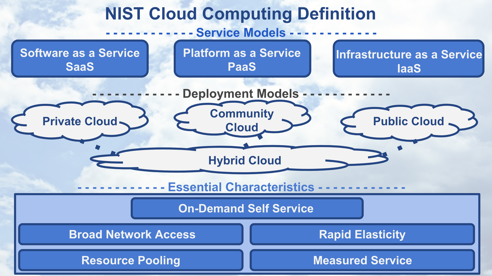
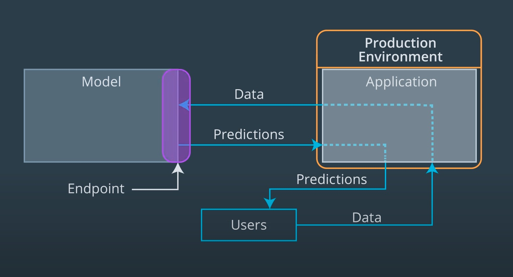
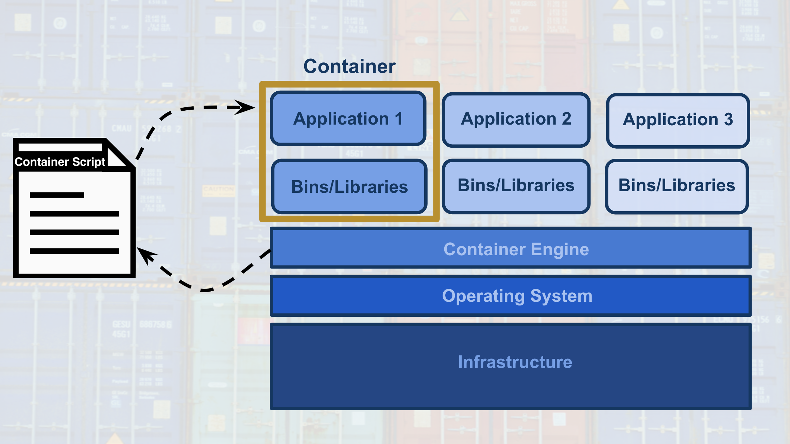

# Geneartive Adversarial Networks (GAN)

These are my personal notes taken while following the [Udacity Deep Learning Nanodegree](https://www.udacity.com/course/deep-learning-nanodegree--nd101).

The nanodegree is composed of six modules:

1. Introduction to Deep Learning
2. Neural Networks and Pytorch Guide
3. Convolutional Neural Networks (CNN)
4. Recurrent Neural Networks (RNN)
5. Generative Adversarial Networks (GAN)
6. Deploying a Model

Each module has a folder with its respective notes. This folder is the one of the **fifth module**: Generative Adversarial Networks.

Additionally, note that:

- I made many hand-written notes; check the PDFs.
- I made many hand-written notes; check the PDFs.
- I forked the Udacity repositories for the exercises; most the material and notebooks are there:
  - [deep-learning-v2-pytorch](https://github.com/mxagar/deep-learning-v2-pytorch)
  - [DL_PyTorch](https://github.com/mxagar/DL_PyTorch)
  - [sagemaker-deployment](https://github.com/mxagar/sagemer-deployment)

## Overview of Contents

- [Geneartive Adversarial Networks (GAN)](#geneartive-adversarial-networks-gan)
  - [Overview of Contents](#overview-of-contents)
  - [1. Introduction to Deployment](#1-introduction-to-deployment)
  - [2. Building a Model Using SageMaker](#2-building-a-model-using-sagemaker)
  - [3. Deploying and Using a Model](#3-deploying-and-using-a-model)
  - [4. Hyperparamter Tuning](#4-hyperparamter-tuning)
  - [5. Updating a Model](#5-updating-a-model)
  - [6. Project: Deploying a Sentiment Analysis Model](#6-project-deploying-a-sentiment-analysis-model)

## 1. Introduction to Deployment

Deployment in the Cloud is the focus of this module, concentrating on AWS SageMaker. However, the concepts are valid for any cloud platform.

Learned questions:

- What's the machine learning workflow?
- How does deployment fit into the machine learning workflow?
- What is cloud computing?
- Why would we use cloud computing for deploying machine learning models?
- Why isn't deployment a part of many machine learning curriculums?
- What does it mean for a model to be deployed?
- What are the essential characteristics associated with the code of deployed models?
- What are different cloud computing platforms we might use to deploy our machine learning models?

### 1.1 Machine Learning Workflow

The general machine learning workflow has these primary components with their sub-steps:

1. Explore & Process
  - Retrieve data
  - Clean data
  - Explore data
  - Prepare/transform
  - Split: train/validation/test
2. Modeling
  - Develop model
  - Train
  - Validate: tune, select best model
  - Evaluate model: test split
3. Deployment: **we focus here**
  - Deploy to production
  - Monitor
  - Update

Note this is **cyclical**! We start again when we see we need to update out model!


The third component, **deployment**, is where the section and the module focus on. Note that in the personal and the academic environment deployment is not relevant &mdash; but in the work environment is!

The different cloud providers describe their machine learning workflow as follows:

- [Machine Learning with Amazon SageMaker](https://docs.aws.amazon.com/sagemaker/latest/dg/how-it-works-mlconcepts.html)
- [Machine learning workflow on GCloud](https://cloud.google.com/ai-platform/docs/ml-solutions-overview)
- [Azure Machine Learning](https://learn.microsoft.com/en-us/azure/machine-learning/overview-what-is-azure-machine-learning)


### 1.2 Cloud Computing

An abstract definition of cloud computing: convert an IT product into an IT service; e.g., USB stick becomes GDrive.

The nice thing of a cloud service is that its capacity scales with the demand; that doesn't happen with traditional infrastructure.


Note that the capacity can be understood as the number of IT resources (storage, compute, network, etc.), and it has a cost associated to it.

Ideally we want to follow the black demand curve, otherwise, with a traditional infrastructure we have either:

- wasted capacity (area below the blue curve bounded by the black)
- or insufficient capacity (area below the black curve bounded by the blue).

That is clearly a missuse of resources: we are either loosing customers or money, i.e., in any case we're always loosing money.

With cloud infrastructures we can follow the demand (registered users) and trigger automatically increased/decreased capacity. The area between the black and the yellow curves is the dynamic capacity.

#### Pros and Cons

**Benefits** of cloud computing:

- Reduced investments, proportional costs: we don't need to buy and maintain servers, but we use them and pay proportionally to our usage.
- Scalability, better capacity planning: automatic triggers allocate more resources depending on users registered, i.e., demand.
- Increased availability and reliability (thus, organizational agility).

But cloud computing has also **risks**:

- (Potential) Increase in Security Vulnerabilities
- Reduced Operational Governance Control (over cloud resources)
- Limited Portability Between Cloud Providers
- Multi-regional Compliance and Legal Issues

> Indeed, the **Service Level Agreements (SLA)** provided for a cloud service often highlight security responsibilities of the cloud provider and **those assumed by the cloud user**.

In other words, the cloud providers assume responsibilities of the user regarding the risk surface they have.

More on [AWS Security](https://aws.amazon.com/security/security-learning/?cards-top.sort-by=item.additionalFields.sortDate&cards-top.sort-order=desc&awsf.Types=*all).

#### Definitions (NIST)

The National Institute of Standards and Technology (NIST) defined in 2011 cloud computing using 

1. service models,
2. deployment models,
3. and essential characteristics

as shown in the following image:



Since the, each cloud provider updated their definition, but we can take the NIST definition as reference.

There are three **software service models** depending on 

- which **cloud components** they comprise
- how the **responsibility** is delegated between the cloud provider and the customer.


The **service model** examples are:

- Software as a Service (SaaS): Google Docs, GMail; as opposed to *software as a product*, in SaaS the application is on the cloud and we access it via browser. The user has the unique responsibility of the login and the administration of the application and the content.
- Platform as a Service (PaaS): Heroku; we can use PaaS to e-commerce websites, deploy an app which is reachable via web or a REST API, etc. usually, easy deployments at the application level are done. Obviously, the user that deploys the application has more responsibilities.
- Infrastructure as a Service (IaaS): AWS; they offer virtual machines on which the user needs to do everything: virtual machine provisioning, networking, app deployment, etc.

The **deployment models** are distinguished by the group for which the service is being provided:

- Public: for use by the general public; AWS, GCloud, Azure, etc. They are the least secure, but they also enable virtual private clouds.
- Community: Government Clouds; they are more secure, because of restricted access.
- Private and Hybrid Clouds: Company clouds, with servers in the company.

The **essential characteristics** are 

- On-Demand Self Service: no human interaction, customer performs automatic provisioning.
- Broad Network Access: we can access from any device with internet.
- Resource Pooling: many customers with very different requirements need to be served.
- Rapid Elasticity: scaling of compute capabilities depending on demand.
- Measured Service: the cloud provider automatically controls and optimizes resource usage.

#### Cloud Computing Guidelines

Cloud computing is perfect for **start ups**, because

- They don't have infrastructure overhead costs, they pay as they go.
- It requires fewer staff.
- It can scale.
- It enables placing the product to market faster.

For established companies, cloud computing is not always the way to go, because they might have legacy architecture and their staff lacks the skillset.

Successful examples:

- [Instagram](https://instagram-engineering.com/migrating-from-aws-to-aws-f4b16a65e13c), which started from scratch at AWS in 2010. They migrated to Facebook serves after their purchas in 2012: [Migrating From AWS to FB](https://instagram-engineering.com/migrating-from-aws-to-fb-86b16f6766e2).
- [Netflix](https://aws.amazon.com/solutions/case-studies/netflix/) migrated from using its own servers in 2009 to AWS in 2010.

#### Cloud Computing within the Machine Learning Workflow

Depending on the amount of on-premise infratructure available at our organization and the amount of risk associated to the cloud technology we'd like to face, we can choose to:

- Implement all three components on-premises
- Implement all three components on the cloud
- Implement any of the last two components on the cloud: modeling and/or deployment.

Amazon SageMaker allows for having all 3 components on the cloud.

It is also quite common to have only the deployment component on the cloud due to security reasons.


### 1.3 Paths to Deployment

The most common ways to deploy a machine learning model have been:

1. Recode the python model into C++/java
2. Recode the model into Predictive Model Markup Language (PMML) or Portable Format Analytics (PFA).
3. **Convert python model into a format used in the production environment.** This format can be a binary or code that is compiled; the keyword is **convert**, i.e., we don't recode anything.

In recent years, the last way has become popular and seems to be the future. It's the easiest and fastest way and many frameworks (Scikit-Learn, Pytorch, etc.) are already able to do that. Sometimes intermediate formats are used, such as [ONNX](https://onnx.ai/).

Another aspect in the deployment process is who does it. Traditionally, deployment has belonged to operations and software/platform/DevOps engineers were in charge of it. However, in recent years data scientists/analysts/ML engineers have started to be responsible for it because tools for easy deployment have appeared or evolved, such as:

- Containers
- Tools for creating REST APIs
- AWS SageMaker
- Google ML Engine / [Google Vertex AI](https://cloud.google.com/vertex-ai) (equivalent to SageMaker)


### 1.4 Production and Test Environments

Usually, machine learning applications are deployed with the following architecture:



We have these parts:

- The users, who input data and get predictions associated with that data.
- The application, which is the interface to the users and the model; the application is in the **production environment**.
- The model, which usually is not in the application, but its interfaced by it. The interface between the application and the model happens in the so called **end points**, which get the user data and provide the prediction.

Note that instead of the production environment we can have a **test environment** if we are performing tests, i.e., there's no real user, but a tester (person or bot). A **production environment** is characterized by the fact that it's being used by real users.

Thus, the **type of environment (test/production)** is determined by who uses the service.

### 1.5 Endpoints and REST APIs

One way of understanding endpoints is the following:

- the ENDPOINT itself is like a function call
- the function itself would be the model and
- the Python program is the APPLICATION.

```python
# APPLICATION = The python program/script
def main():
    input_user_data = get_user_data()
    # ENDPOINT = Function call
    predictions = ml_model(input_user_data)
    display_predictions_to_user(predictions)

def ml_model(user_data):
    loaded_data = load_user_data(user_data)
    # ...
    return predictions
```

Often, the connection to the endpoint is done using a **REST API**: REpresentational State Transfer Application Programming Interface. Basically, we have a service in which the model is contained and that service is able to

- receive a **HTTP request**,
- process the request and feed it to the model,
- package the model output,
- and send a **HTTP responses** which contains the model output.

An **HTTP request** has four parts:

1. Endpoint: that's the URL which targets a specific function.
2. HTTP Method: any of these four (CRUD):
    - GET: Read
    - POST: Create (usually that's the one when we're trying to send data to get a prediction)
    - PUT: Update
    - DELETE: Delete
3. HTTP Headers: data format in the message, additional info, etc.
4. Message: the input data sent by the user.


An **HTTP response** has three parts:

1. HTTP Status Code: if data successfully received, code should start with 2, e.g., 200.
2. HTTP Headers: data format in the message, additional info, etc.
3. Message: the output data sent to the user, i.e., the prediction.

It is the application's responsibility to format the input/output data correctly for/from the model interfacing with the user. Usually, the data is formatted in CSV/JSON format.


### 1.6 Containers

The model and the application need a computing environment; often, that computing environment is a **container** (one for each). Docker is the most popular container technology.

A container is an isolated computational environment which contains all the libraries and software necessary to run an application or the part of an application.

A container can be mistaken with a virtual machine (VM), but it's not a VM, because it uses the resources of the underlying operating system via the container engine. However, for instance, we can run Linux-based container on Mac/Windows. Since they're not virtual machines, they're much lighter.



Containers are defined in image scripts which specify in layers the software components that build the container.

In Docker:

- Images are Dockerfile scripts
- Built/instantiated images are containers
- DockerHub is an image registry, i.e., a repository where container images are hosted.

Advantages of containers:

- Application is isolated, i.e., more secure.
- Requires only software to run the application.
- Application creation, replication, sharing, deletion is easier.
- We package the application in a container and it runs everywhere!

Udacity workspaces run on containers.

### 1.7 Characteristics of Deployment and Modeling


## 2. Building a Model Using SageMaker

## 3. Deploying and Using a Model

## 4. Hyperparamter Tuning

## 5. Updating a Model

## 6. Project: Deploying a Sentiment Analysis Model

