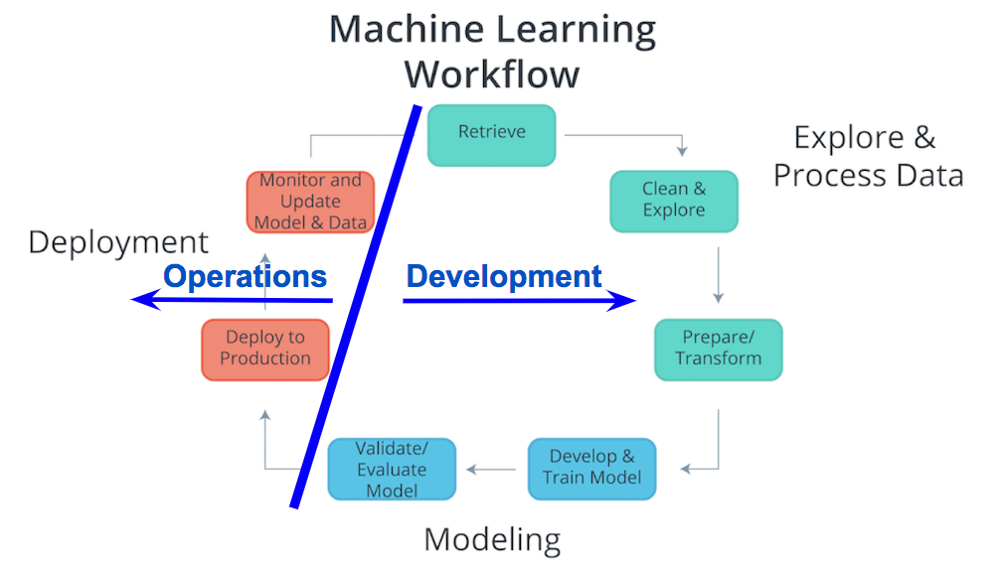

# Geneartive Adversarial Networks (GAN)

These are my personal notes taken while following the [Udacity Deep Learning Nanodegree](https://www.udacity.com/course/deep-learning-nanodegree--nd101).

The nanodegree is composed of six modules:

1. Introduction to Deep Learning
2. Neural Networks and Pytorch Guide
3. Convolutional Neural Networks (CNN)
4. Recurrent Neural Networks (RNN)
5. Generative Adversarial Networks (GAN)
6. Deploying a Model

Each module has a folder with its respective notes. This folder is the one of the **fifth module**: Generative Adversarial Networks.

Additionally, note that:

- I made many hand-written notes; check the PDFs.
- I made many hand-written notes; check the PDFs.
- I forked the Udacity repositories for the exercises; most the material and notebooks are there:
  - [deep-learning-v2-pytorch](https://github.com/mxagar/deep-learning-v2-pytorch)
  - [DL_PyTorch](https://github.com/mxagar/DL_PyTorch)
  - [sagemaker-deployment](https://github.com/mxagar/sagemer-deployment)

## Overview of Contents

- [Geneartive Adversarial Networks (GAN)](#geneartive-adversarial-networks-gan)
  - [Overview of Contents](#overview-of-contents)
  - [1. Introduction to Deployment](#1-introduction-to-deployment)
  - [2. Building a Model Using SageMaker](#2-building-a-model-using-sagemaker)
  - [3. Deploying and Using a Model](#3-deploying-and-using-a-model)
  - [4. Hyperparamter Tuning](#4-hyperparamter-tuning)
  - [5. Updating a Model](#5-updating-a-model)
  - [6. Project: Deploying a Sentiment Analysis Model](#6-project-deploying-a-sentiment-analysis-model)

## 1. Introduction to Deployment

Deployment in the Cloud is the focus of this module, concentrating on AWS SageMaker. However, the concepts are valid for any cloud platform.

Learned questions:

- What's the machine learning workflow?
- How does deployment fit into the machine learning workflow?
- What is cloud computing?
- Why would we use cloud computing for deploying machine learning models?
- Why isn't deployment a part of many machine learning curriculums?
- What does it mean for a model to be deployed?
- What are the essential characteristics associated with the code of deployed models?
- What are different cloud computing platforms we might use to deploy our machine learning models?

### 1.1 Machine Learning Workflow

The general machine learning workflow has these primary components with their sub-steps:

1. Explore & Process
  - Retrieve data
  - Clean data
  - Explore data
  - Prepare/transform
  - Split: train/validation/test
2. Modeling
  - Develop model
  - Train
  - Validate: tune, select best model
  - Evaluate model: test split
3. Deployment: **we focus here**
  - Deploy to production
  - Monitor
  - Update

Note this is **cyclical**! We start again when we see we need to update out model!


The third component, **deployment**, is where the section and the module focus on. Note that in the personal and the academic environment deployment is not relevant &mdash; but in the work environment is!

The different cloud providers describe their machine learning workflow as follows:

- [Machine Learning with Amazon SageMaker](https://docs.aws.amazon.com/sagemaker/latest/dg/how-it-works-mlconcepts.html)
- [Machine learning workflow on GCloud](https://cloud.google.com/ai-platform/docs/ml-solutions-overview)
- [Azure Machine Learning](https://learn.microsoft.com/en-us/azure/machine-learning/overview-what-is-azure-machine-learning)


### 1.2 Cloud Computing

An abstract definition of cloud computing: convert an IT product into an IT service; e.g., USB stick becomes GDrive.

The nice thing of a cloud service is that its capacity scales with the demand; that doesn't happen with traditional infrastructure.


Note that the capacity can be understood as the number of IT resources (storage, compute, network, etc.), and it has a cost associated to it.

Ideally we want to follow the black demand curve, otherwise, with a traditional infrastructure we have either:

- wasted capacity (area below the blue curve bounded by the black)
- or insufficient capacity (area below the black curve bounded by the blue).

That is clearly a missuse of resources: we are either loosing customers or money, i.e., in any case we're always loosing money.

With cloud infrastructures we can follow the demand (registered users) and trigger automatically increased/decreased capacity. The area between the black and the yellow curves is the dynamic capacity.

#### Pros and Cons

**Benefits** of cloud computing:

- Reduced investments, proportional costs: we don't need to buy and maintain servers, but we use them and pay proportionally to our usage.
- Scalability, better capacity planning: automatic triggers allocate more resources depending on users registered, i.e., demand.
- Increased availability and reliability (thus, organizational agility).

But cloud computing has also **risks**:

- (Potential) Increase in Security Vulnerabilities
- Reduced Operational Governance Control (over cloud resources)
- Limited Portability Between Cloud Providers
- Multi-regional Compliance and Legal Issues

> Indeed, the **Service Level Agreements (SLA)** provided for a cloud service often highlight security responsibilities of the cloud provider and **those assumed by the cloud user**.

In other words, the cloud providers assume responsibilities of the user regarding the risk surface they have.

More on [AWS Security](https://aws.amazon.com/security/security-learning/?cards-top.sort-by=item.additionalFields.sortDate&cards-top.sort-order=desc&awsf.Types=*all).

#### Definitions (NIST)

The National Institute of Standards and Technology (NIST) defined in 2011 cloud computing using 

1. service models,
2. deployment models,
3. and essential characteristics

as shown in the following image:


Since the, each cloud provider updated their definition, but we can take the NIST definition as reference.

There are three **software service models** depending on 

- which **cloud components** they comprise
- how the **responsibility** is delegated between the cloud provider and the customer.


The **service model** examples are:

- Software as a Service (SaaS): Google Docs, GMail; as opposed to *software as a product*, in SaaS the application is on the cloud and we access it via browser. The user has the unique responsibility of the login and the administration of the application and the content.
- Platform as a Service (PaaS): Heroku; we can use PaaS to e-commerce websites, deploy an app which is reachable via web or a REST API, etc. usually, easy deployments at the application level are done. Obviously, the user that deploys the application has more responsibilities.
- Infrastructure as a Service (IaaS): AWS; they offer virtual machines on which the user needs to do everything: virtual machine provisioning, networking, app deployment, etc.

The **deployment models** are distinguished by the group for which the service is being provided:

- Public: for use by the general public; AWS, GCloud, Azure, etc. They are the least secure, but they also enable virtual private clouds.
- Community: Government Clouds; they are more secure, because of restricted access.
- Private and Hybrid Clouds: Company clouds, with servers in the company.

The **essential characteristics** are 

- On-Demand Self Service: no human interaction, customer performs automatic provisioning.
- Broad Network Access: we can access from any device with internet.
- Resource Pooling: many customers with very different requirements need to be served.
- Rapid Elasticity: scaling of compute capabilities depending on demand.
- Measured Service: the cloud provider automatically controls and optimizes resource usage.

#### Cloud Computing Guidelines

Cloud computing is perfect for **start ups**, because

- They don't have infrastructure overhead costs, they pay as they go.
- It requires fewer staff.
- It can scale.
- It enables placing the product to market faster.

For established companies, cloud computing is not always the way to go, because they might have legacy architecture and their staff lacks the skillset.

Successful examples:

- [Instagram](https://instagram-engineering.com/migrating-from-aws-to-aws-f4b16a65e13c), which started from scratch at AWS in 2010. They migrated to Facebook serves after their purchas in 2012: [Migrating From AWS to FB](https://instagram-engineering.com/migrating-from-aws-to-fb-86b16f6766e2).
- [Netflix](https://aws.amazon.com/solutions/case-studies/netflix/) migrated from using its own servers in 2009 to AWS in 2010.

#### Cloud Computing within the Machine Learning Workflow

Depending on the amount of on-premise infratructure available at our organization and the amount of risk associated to the cloud technology we'd like to face, we can choose to:

- Implement all three components on-premises
- Implement all three components on the cloud
- Implement any of the last two components on the cloud: modeling and/or deployment.

Amazon SageMaker allows for having all 3 components on the cloud.

It is also quite common to have only the deployment component on the cloud due to security reasons.


### 1.3 Paths to Deployment

The most common ways to deploy a machine learning model have been:

1. Recode the python model into C++/java
2. Recode the model into Predictive Model Markup Language (PMML) or Portable Format Analytics (PFA).
3. **Convert python model into a format used in the production environment.** This format can be a binary or code that is compiled; the keyword is **convert**, i.e., we don't recode anything.

In recent years, the last way has become popular and seems to be the future. It's the easiest and fastest way and many frameworks (Scikit-Learn, Pytorch, etc.) are already able to do that. Sometimes intermediate formats are used, such as [ONNX](https://onnx.ai/).

Another aspect in the deployment process is who does it. Traditionally, deployment has belonged to operations and software/platform/DevOps engineers were in charge of it. However, in recent years data scientists/analysts/ML engineers have started to be responsible for it because tools for easy deployment have appeared or evolved, such as:

- Containers
- Tools for creating REST APIs
- AWS SageMaker
- Google ML Engine / [Google Vertex AI](https://cloud.google.com/vertex-ai) (equivalent to SageMaker)



### 1.4 Production and Test Environments

Usually, machine learning applications are deployed with the following architecture:


We have these parts:

- The users, who input data and get predictions associated with that data.
- The application, which is the interface to the users and the model; the application is in the **production environment**.
- The model, which usually is not in the application, but its interfaced by it. The interface between the application and the model happens in the so called **end points**, which get the user data and provide the prediction.

Note that instead of the production environment we can have a **test environment** if we are performing tests, i.e., there's no real user, but a tester (person or bot). A **production environment** is characterized by the fact that it's being used by real users.

Thus, the **type of environment (test/production)** is determined by who uses the service.

### 1.5 Endpoints and REST APIs

One way of understanding endpoints is the following:

- the ENDPOINT itself is like a function call
- the function itself would be the model and
- the Python program is the APPLICATION.

```python
# APPLICATION = The python program/script
def main():
    input_user_data = get_user_data()
    # ENDPOINT = Function call
    predictions = ml_model(input_user_data)
    display_predictions_to_user(predictions)

def ml_model(user_data):
    loaded_data = load_user_data(user_data)
    # ...
    return predictions
```

Often, the connection to the endpoint is done using a **REST API**: REpresentational State Transfer Application Programming Interface. Basically, we have a service in which the model is contained and that service is able to

- receive a **HTTP request**,
- process the request and feed it to the model,
- package the model output,
- and send a **HTTP responses** which contains the model output.

An **HTTP request** has four parts:

1. Endpoint: that's the URL which targets a specific function.
2. HTTP Method: any of these four (CRUD):
    - GET: Read
    - POST: Create (usually that's the one when we're trying to send data to get a prediction)
    - PUT: Update
    - DELETE: Delete
3. HTTP Headers: data format in the message, additional info, etc.
4. Message: the input data sent by the user.


An **HTTP response** has three parts:

1. HTTP Status Code: if data successfully received, code should start with 2, e.g., 200.
2. HTTP Headers: data format in the message, additional info, etc.
3. Message: the output data sent to the user, i.e., the prediction.

It is the application's responsibility to format the input/output data correctly for/from the model interfacing with the user. Usually, the data is formatted in CSV/JSON format.


### 1.6 Containers

The model and the application need a computing environment; often, that computing environment is a **container** (one for each). Docker is the most popular container technology.

A container is an isolated computational environment which contains all the libraries and software necessary to run an application or the part of an application.

A container can be mistaken with a virtual machine (VM), but it's not a VM, because it uses the resources of the underlying operating system via the container engine. However, for instance, we can run Linux-based container on Mac/Windows. Since they're not virtual machines, they're much lighter.


Containers are defined in image scripts which specify in layers the software components that build the container.

In Docker:

- Images are Dockerfile scripts
- Built/instantiated images are containers
- DockerHub is an image registry, i.e., a repository where container images are hosted.

Advantages of containers:

- Application is isolated, i.e., more secure.
- Requires only software to run the application.
- Application creation, replication, sharing, deletion is easier.
- We package the application in a container and it runs everywhere!

Udacity workspaces run on containers.

### 1.7 Characteristics of Deployment and Modeling

The steps of modeling and deployment have characteristic features that we need to take into account. Cloud platforms make it easier to deal with these features.

Modeling requires **hyperparameter tuning**, finding the parameters that cannot be learned from the data.


Deployment requires tracking the model performance; to that end, we need to perform the following tasks:

- Model versioning
- Model monitoring: we track the performance of the model; that way, we can detect drifts and update it.
- Model updating and routing: we deploy new updated models in parallel; we need to be able to route user requests to different models to compare them.

Additionally, note that model predictions can be

- On-demand / online: via API with JSON/XML
    - done all the time, i.e., typical phone web app
    - low latency
    - volume variability, but typically up to 5 MB
- In batch / offline: via files stored on cloud provider (e.g., S3)
    - large volume, done regularly (e.g., weekly)
    - latency is higher, but it's not an issue


### 1.8 Comparing Cloud Providers

Equivalent / similar systems that cover all 3 steps in the Machine Learning Workflow (explore & process, modeling, deployment):

- [Amazon / AWS SageMaker](https://aws.amazon.com/sagemaker/)
- [Google Vertex AI](https://cloud.google.com/vertex-ai): very similar to SageMaker; maybe SageMaker has more features at the point of the course.
- [Azure AI](https://azure.microsoft.com/en-us/solutions/ai/#platform)

Characteristics of SageMaker:

- It has [built in algorithms](https://docs.aws.amazon.com/sagemaker/latest/dg/algos.html), e.g.
    - [Linear learner](https://docs.aws.amazon.com/sagemaker/latest/dg/linear-learner.html)
    - [XGBoost](https://docs.aws.amazon.com/sagemaker/latest/dg/xgboost.html)
    - [Factorization machines](https://docs.aws.amazon.com/sagemaker/latest/dg/fact-machines.html)
    - [K-means](https://docs.aws.amazon.com/sagemaker/latest/dg/k-means.html)
    - [Image classification](https://docs.aws.amazon.com/sagemaker/latest/dg/image-classification.html)
- It also has common frameworks: Scikit-Learn, Pytorch, etc.
- We can use [docker containers](https://docs.aws.amazon.com/sagemaker/latest/dg/docker-containers.html) in which we implement our own algorithms
- We can use [Jupyter notebooks](https://docs.aws.amazon.com/sagemaker/latest/dg/nbi.html)
- We can perform automatic [hyperparameter tuning](https://docs.aws.amazon.com/sagemaker/latest/dg/automatic-model-tuning.html)
- We can [monitor models](https://docs.aws.amazon.com/sagemaker/latest/dg/monitoring-overview.html); we can check the traffic, apply routing, etc.
- We can perform on-demand (online) and batch (offline) predictions; for offline predictions, files need to be stored in S3.

Note that Google doesn't have all these features.

Other systems or cloud providers:

- [Paperspace](https://www.paperspace.com/)
- [Cloud Foundry](https://www.cloudfoundry.org/)

## 2. Building a Model Using SageMaker

SageMaker is basically 2 things:

- Managed **Jupyer notebooks** that run on a virtual machine.
- Access to **AWS APIs** that make all 3 steps of the ML workflow (explore & process, modeling, deployment) much easier. Especially, training and deploying models becomes much easier.

The SageMaker manager notebooks have access to the API. Both the training and the inference tasks performed in the notebooks using the APIs are carried out in a virtual machine. The training task generates model artifacts and the inference task uses those model artifacts, along with the user data.


### 2.1 Account Setup

## 3. Deploying and Using a Model

## 4. Hyperparamter Tuning

## 5. Updating a Model

## 6. Cloud Computing with AWS EC2

We need to perform two tasks:

1. Launch an EC2 instance
2. Connect from our computer to that EC2 instance

Note: I copied this section from my other notes in [`CVND_CloudComputing.md`](https://github.com/mxagar/computer_vision_udacity/blob/main/02_Cloud_Computing/CVND_CloudComputing.md).

### 6.1 Launch EC2 Instances

EC2 = Elastic Compute Cloud. We can launch VM instances.

Create an AWS account, log in to the AWS console & search for "EC2" in the services.

Select region on menu, top-right: Ireland, `eu-west-1`. Selecting a region **very important**, since everything is server region specific. Take into account that won't see the instances you have in different regions than the one you select in the menu! Additionally, we should select the region which is closest to us. Not also that not all regions have the same services and the service prices vary between regions!

Press: **Launch Instance**.

Follow these steps:

1. Choose an Amazon Machine Image (AMI) - An AMI is a template that contains the software configuration (operating system, application server, and applications) required to launch your instance. I looked for specific AMIs on the search bar (keyword "deep learning") and selected `Deep Learning AMI (Amazon Linux 2) Version 61.3` and `Deep Learning AMI (Amazon Linux 2) Version 61.3` for different instances. Depending on which we use, we need to install different dependencies.

2. Choose an Instance Type - Instance Type offers varying combinations of CPUs, memory (GB), storage (GB), types of network performance, and availability of IPv6 support. AWS offers a variety of Instance Types, broadly categorized in 5 categories. You can choose an Instance Type that fits our use case. The specific type of GPU instance you should launch for this tutorial is called `p2.xlarge` (P2 family). I asked to increase the limit for EC2 in the support/EC2-Limits menu option to select `p2.xlarge`, but they did not grant it to me; meanwhile, I chose `t2.micro`, elegible for the free tier.

3. Configure Instance Details - Provide the instance count and configuration details, such as, network, subnet, behavior, monitoring, etc.

4. Add Storage - You can choose to attach either SSD or Standard Magnetic drive to your instance. Each instance type has its own minimum storage requirement.

5. Add Tags - A tag serves as a label that you can attach to multiple AWS resources, such as volumes, instances or both.

6. Configure Security Group - Attach a set of firewall rules to your instance(s) that controls the incoming traffic to your instance(s). You can select or create a new security group; when you create one:
    - Select: Allow SSH traffic from anywhere
    - Then, when you launch the instance, **you edit the security group later**
    - We can also select an existing security group

7. Review - Review your instance launch details before the launch.

8. I was asked to create a key-pair; I created one with the name `face-keypoints` using RSA. You can use a key pair to securely connect to your instance. Ensure that you have access to the selected key pair before you launch the instance. A file `face-keypoints.pem` was automatically downloaded.

More on [P2 instances](https://aws.amazon.com/ec2/instance-types/p2/)

Important: Edittting the security group: left menu, `Network & Security` > `Security Groups`:

- Select the security group associated with the created instance (look in EC2 dashboard table)
- Inbound rules (manage/create/add rule):
    - SSH, 0.0.0.0/0, Port 22
    - Jupyter, 0.0.0.0/0, Port 8888
    - HTTPS (Github), 0.0.0.0/0, Port 443
- Outbound rules (manage/create/add rule):
    - SSH, 0.0.0.0/0, Port 22
    - Jupyter, 0.0.0.0/0, Port 8888
    - HTTPS (Github), 0.0.0.0/0, Port 443

If we don't edit the security group, we won't be able to communicate with the instance in the required ports!

**Important: Always shut down / stop all instances if not in use to avoid costs! We can re-start afterwards!**. AWS charges primarily for running instances, so most of the charges will cease once you stop the instance. However, there are smaller storage charges that continue to accrue until you **terminate** (i.e. delete) the instance.

We can also set billing alarms.

### 6.2 Connect to an Instance

Once the instance is created, 

1. We `start` it: 

    - EC2 dashboard
    - Instances
    - Select instance
    - Instance state > Start

2. We connect to it from our local shell

```bash
# Go to the folder where the instance key pem file is located
cd .../project
# Make sure the pem file is only readable by me
chmod 400 face-keypoints.pem
# Connect to instance
# user: 'ec2-user' if Amazon Image, 'ubuntu' if Ubuntu image
# Public IP: DNS or IP number specified in AWS EC2 instance properties
# ssh -i <pem-filename>.pem <user>@<public-IP>
ssh -i face-keypoints.pem ec2-user@3.248.188.159
# We need to generate a jupyter config file
jupyter notebook --generate-config
# Make sure that
# ~/.jupyter/jupyter_notebook_config.py
# contains 
# c.NotebookApp.ip = '*'
# Or, alternatively, directly change it:
sed -ie "s/#c.NotebookApp.ip = 'localhost'/#c.NotebookApp.ip = '*'/g" ~/.jupyter/jupyter_notebook_config.py
# Clone or download the code
# Note that the SSH version of the repo URL cannot be downloaded;
# I understand that's because the SSH version is user-bound 
git clone https://github.com/mxagar/P1_Facial_Keypoints.git
# Go to downloaded repo
cd P1_Facial_Keypoints
# When I tried to install the repo dependencies
# I got some version errors, so I stopped and
# I did not install the dependencies.
# However, in a regular situation, we would need to install them.
# Also, maybe:
# pip install --upgrade setuptools.
sudo python3 -m pip install -r requirements.txt
# Launch the Jupyter notebook without a browser
jupyter notebook --ip=0.0.0.0 --no-browser
# IMPORTANT: catch/copy the token string value displayed:
# http://127.0.0.1:8888/?token=<token-string>
```

3. Open our local browser on this URL, composed by the public IP of the EC2 instance we have running and the Jupyter token:

```
http://<public-IP>:8888/?token=<token-string>
```

### 6.3 Pricing

Always stop & terminate instances that we don't need! Terminates erases any data we have on the instance!

[Amazon EC2 On-Demand Pricing](https://aws.amazon.com/ec2/pricing/on-demand/)

## 7. Google Colab

See [`Google_Colab_Notes.md`](https://github.com/mxagar/computer_vision_udacity/blob/main/02_Cloud_Computing/Google_Colab_Notes.md).

## 8. Project: Deploying a Sentiment Analysis Model

See repository: []().

