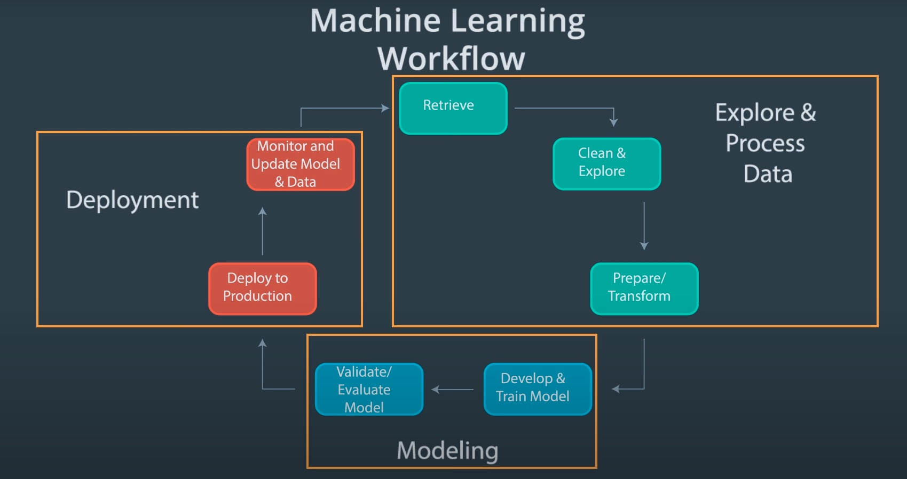
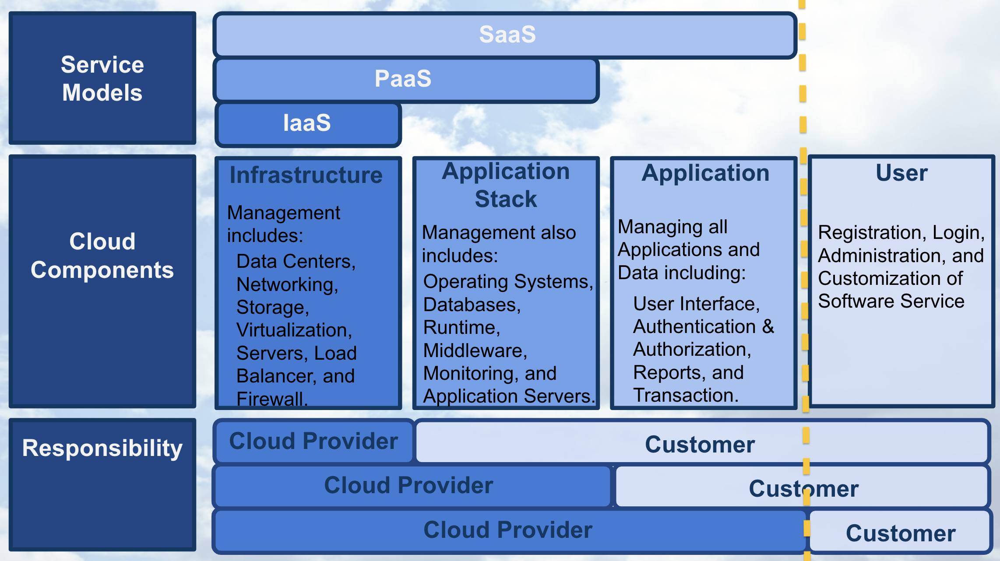

# Geneartive Adversarial Networks (GAN)

These are my personal notes taken while following the [Udacity Deep Learning Nanodegree](https://www.udacity.com/course/deep-learning-nanodegree--nd101).

The nanodegree is composed of six modules:

1. Introduction to Deep Learning
2. Neural Networks and Pytorch Guide
3. Convolutional Neural Networks (CNN)
4. Recurrent Neural Networks (RNN)
5. Generative Adversarial Networks (GAN)
6. Deploying a Model

Each module has a folder with its respective notes. This folder is the one of the **fifth module**: Generative Adversarial Networks.

Additionally, note that:

- I made many hand-written notes; check the PDFs.
- I made many hand-written notes; check the PDFs.
- I forked the Udacity repositories for the exercises; most the material and notebooks are there:
  - [deep-learning-v2-pytorch](https://github.com/mxagar/deep-learning-v2-pytorch)
  - [DL_PyTorch](https://github.com/mxagar/DL_PyTorch)
  - [sagemaker-deployment](https://github.com/mxagar/sagemer-deployment)

## Overview of Contents

- [Geneartive Adversarial Networks (GAN)](#geneartive-adversarial-networks-gan)
  - [Overview of Contents](#overview-of-contents)
  - [1. Introduction to Deployment](#1-introduction-to-deployment)
  - [2. Building a Model Using SageMaker](#2-building-a-model-using-sagemaker)
  - [3. Deploying and Using a Model](#3-deploying-and-using-a-model)
  - [4. Hyperparamter Tuning](#4-hyperparamter-tuning)
  - [5. Updating a Model](#5-updating-a-model)
  - [6. Project: Deploying a Sentiment Analysis Model](#6-project-deploying-a-sentiment-analysis-model)

## 1. Introduction to Deployment

Deployment in the Cloud is the focus of this module, concentrating on AWS SageMaker. However, the concepts are valid for any cloud platform.

Learned questions:

- What's the machine learning workflow?
- How does deployment fit into the machine learning workflow?
- What is cloud computing?
- Why would we use cloud computing for deploying machine learning models?
- Why isn't deployment a part of many machine learning curriculums?
- What does it mean for a model to be deployed?
- What are the essential characteristics associated with the code of deployed models?
- What are different cloud computing platforms we might use to deploy our machine learning models?

### 1.1 Machine Learning Workflow

The general machine learning workflow has these primary components with their sub-steps:

1. Explore & Process
  - Retrieve data
  - Clean data
  - Explore data
  - Prepare/transform
  - Split: train/validation/test
2. Modeling
  - Develop model
  - Train
  - Validate: tune, select best model
  - Evaluate model: test split
3. Deployment: **we focus here**
  - Deploy to production
  - Monitor
  - Update

Note this is **cyclical**! We start again when we see we need to update out model!



The third component, **deployment**, is where the section and the module focus on. Note that in the personal and the academic environment deployment is not relevant &mdash; but in the work environment is!

The different cloud providers describe their machine learning workflow as follows:

- [Machine Learning with Amazon SageMaker](https://docs.aws.amazon.com/sagemaker/latest/dg/how-it-works-mlconcepts.html)
- [Machine learning workflow on GCloud](https://cloud.google.com/ai-platform/docs/ml-solutions-overview)
- [Azure Machine Learning](https://learn.microsoft.com/en-us/azure/machine-learning/overview-what-is-azure-machine-learning)


### 1.2 Cloud Computing

An abstract definition of cloud computing: convert an IT product into an IT service; e.g., USB stick becomes GDrive.

The nice thing of a cloud service is that its capacity scales with the demand; that doesn't happen with traditional infrastructure.


Note that the capacity can be understood as the number of IT resources (storage, compute, network, etc.), and it has a cost associated to it.

Ideally we want to follow the black demand curve, otherwise, with a traditional infrastructure we have either:

- wasted capacity (area below the blue curve bounded by the black)
- or insufficient capacity (area below the black curve bounded by the blue).

That is clearly a missuse of resources: we are either loosing customers or money, i.e., in any case we're always loosing money.

With cloud infrastructures we can follow the demand (registered users) and trigger automatically increased/decreased capacity. The area between the black and the yellow curves is the dynamic capacity.

#### Pros and Cons

**Benefits** of cloud computing:

- Reduced investments, proportional costs: we don't need to buy and maintain servers, but we use them and pay proportionally to our usage.
- Scalability, better capacity planning: automatic triggers allocate more resources depending on users registered, i.e., demand.
- Increased availability and reliability (thus, organizational agility).

But cloud computing has also **risks**:

- (Potential) Increase in Security Vulnerabilities
- Reduced Operational Governance Control (over cloud resources)
- Limited Portability Between Cloud Providers
- Multi-regional Compliance and Legal Issues

> Indeed, the **Service Level Agreements (SLA)** provided for a cloud service often highlight security responsibilities of the cloud provider and **those assumed by the cloud user**.

In other words, the cloud providers assume responsibilities of the user regarding the risk surface they have.

More on [AWS Security](https://aws.amazon.com/security/security-learning/?cards-top.sort-by=item.additionalFields.sortDate&cards-top.sort-order=desc&awsf.Types=*all).

#### Definitions (NIST)

The National Institute of Standards and Technology (NIST) defined in 2011 cloud computing using 

1. service models,
2. deployment models,
3. and essential characteristics

as shown in the following image:


Since the, each cloud provider updated their definition, but we can take the NIST definition as reference.

There are three **software service models** depending on 

- which **cloud components** they comprise
- how the **responsibility** is delegated between the cloud provider and the customer.



The **service model** examples are:

- Software as a Service (SaaS): Google Docs, GMail; as opposed to *software as a product*, in SaaS the application is on the cloud and we access it via browser. The user has the unique responsibility of the login and the administration of the application and the content.
- Platform as a Service (PaaS): Heroku; we can use PaaS to e-commerce websites, deploy an app which is reachable via web or a REST API, etc. usually, easy deployments at the application level are done. Obviously, the user that deploys the application has more responsibilities.
- Infrastructure as a Service (IaaS): AWS; they offer virtual machines on which the user needs to do everything: virtual machine provisioning, networking, app deployment, etc.

The **deployment models** are distinguished by the group for which the service is being provided:

- Public: for use by the general public; AWS, GCloud, Azure, etc. They are the least secure, but they also enable virtual private clouds.
- Community: Government Clouds; they are more secure, because of restricted access.
- Private and Hybrid Clouds: Company clouds, with servers in the company.

The **essential characteristics** are 

- On-Demand Self Service: no human interaction, customer performs automatic provisioning.
- Broad Network Access: we can access from any device with internet.
- Resource Pooling: many customers with very different requirements need to be served.
- Rapid Elasticity: scaling of compute capabilities depending on demand.
- Measured Service: the cloud provider automatically controls and optimizes resource usage.

#### Cloud Computing Guidelines

Cloud computing is perfect for **start ups**, because

- They don't have infrastructure overhead costs, they pay as they go.
- It requires fewer staff.
- It can scale.
- It enables placing the product to market faster.

For established companies, cloud computing is not always the way to go, because they might have legacy architecture and their staff lacks the skillset.

Successful examples:

- [Instagram](https://instagram-engineering.com/migrating-from-aws-to-aws-f4b16a65e13c), which started from scratch at AWS in 2010. They migrated to Facebook serves after their purchas in 2012: [Migrating From AWS to FB](https://instagram-engineering.com/migrating-from-aws-to-fb-86b16f6766e2).
- [Netflix](https://aws.amazon.com/solutions/case-studies/netflix/) migrated from using its own servers in 2009 to AWS in 2010.

#### Cloud Computing within the Machine Learning Workflow

Depending on the amount of on-premise infratructure available at our organization and the amount of risk associated to the cloud technology we'd like to face, we can choose to:

- Implement all three components on-premises
- Implement all three components on the cloud
- Implement any of the last two components on the cloud: modeling and/or deployment.

Amazon SageMaker allows for having all 3 components on the cloud.

It is also quite common to have only the deployment component on the cloud due to security reasons.


### 1.3 Paths to Deployment

The most common ways to deploy a machine learning model have been:

1. Recode the python model into C++/java
2. Recode the model into Predictive Model Markup Language (PMML) or Portable Format Analytics (PFA).
3. **Convert python model into a format used in the production environment.** This format can be a binary or code that is compiled; the keyword is **convert**, i.e., we don't recode anything.

In recent years, the last way has become popular and seems to be the future. It's the easiest and fastest way and many frameworks (Scikit-Learn, Pytorch, etc.) are already able to do that. Sometimes intermediate formats are used, such as [ONNX](https://onnx.ai/).

Another aspect in the deployment process is who does it. Traditionally, deployment has belonged to operations and software/platform/DevOps engineers were in charge of it. However, in recent years data scientists/analysts/ML engineers have started to be responsible for it because tools for easy deployment have appeared or evolved, such as:

- Containers
- Tools for creating REST APIs
- AWS SageMaker
- Google ML Engine / [Google Vertex AI](https://cloud.google.com/vertex-ai) (equivalent to SageMaker)


### 1.4 Production and Test Environments

Usually, machine learning applications are deployed with the following architecture:


We have these parts:

- The users, who input data and get predictions associated with that data.
- The application, which is the interface to the users and the model; the application is in the **production environment**.
- The model, which usually is not in the application, but its interfaced by it. The interface between the application and the model happens in the so called **end points**, which get the user data and provide the prediction.

Note that instead of the production environment we can have a **test environment** if we are performing tests, i.e., there's no real user, but a tester (person or bot). A **production environment** is characterized by the fact that it's being used by real users.

Thus, the **type of environment (test/production)** is determined by who uses the service.

### 1.5 Endpoints and REST APIs

One way of understanding endpoints is the following:

- the ENDPOINT itself is like a function call
- the function itself would be the model and
- the Python program is the APPLICATION.

```python
# APPLICATION = The python program/script
def main():
    input_user_data = get_user_data()
    # ENDPOINT = Function call
    predictions = ml_model(input_user_data)
    display_predictions_to_user(predictions)

def ml_model(user_data):
    loaded_data = load_user_data(user_data)
    # ...
    return predictions
```

Often, the connection to the endpoint is done using a **REST API**: REpresentational State Transfer Application Programming Interface. Basically, we have a service in which the model is contained and that service is able to

- receive a **HTTP request**,
- process the request and feed it to the model,
- package the model output,
- and send a **HTTP responses** which contains the model output.

An **HTTP request** has four parts:

1. Endpoint: that's the URL which targets a specific function.
2. HTTP Method: any of these four (CRUD):
    - GET: Read
    - POST: Create (usually that's the one when we're trying to send data to get a prediction)
    - PUT: Update
    - DELETE: Delete
3. HTTP Headers: data format in the message, additional info, etc.
4. Message: the input data sent by the user.


An **HTTP response** has three parts:

1. HTTP Status Code: if data successfully received, code should start with 2, e.g., 200.
2. HTTP Headers: data format in the message, additional info, etc.
3. Message: the output data sent to the user, i.e., the prediction.

It is the application's responsibility to format the input/output data correctly for/from the model interfacing with the user. Usually, the data is formatted in CSV/JSON format.


### 1.6 Containers

The model and the application need a computing environment; often, that computing environment is a **container** (one for each). Docker is the most popular container technology.

A container is an isolated computational environment which contains all the libraries and software necessary to run an application or the part of an application.

A container can be mistaken with a virtual machine (VM), but it's not a VM, because it uses the resources of the underlying operating system via the container engine. However, for instance, we can run Linux-based container on Mac/Windows. Since they're not virtual machines, they're much lighter.


Containers are defined in image scripts which specify in layers the software components that build the container.

In Docker:

- Images are Dockerfile scripts
- Built/instantiated images are containers
- DockerHub is an image registry, i.e., a repository where container images are hosted.

Advantages of containers:

- Application is isolated, i.e., more secure.
- Requires only software to run the application.
- Application creation, replication, sharing, deletion is easier.
- We package the application in a container and it runs everywhere!

Udacity workspaces run on containers.

### 1.7 Characteristics of Deployment and Modeling

The steps of modeling and deployment have characteristic features that we need to take into account. Cloud platforms make it easier to deal with these features.

Modeling requires **hyperparameter tuning**, finding the parameters that cannot be learned from the data.


Deployment requires tracking the model performance; to that end, we need to perform the following tasks:

- Model versioning
- Model monitoring: we track the performance of the model; that way, we can detect drifts and update it.
- Model updating and routing: we deploy new updated models in parallel; we need to be able to route user requests to different models to compare them.

Additionally, note that model predictions can be

- On-demand / online: via API with JSON/XML
    - done all the time, i.e., typical phone web app
    - low latency
    - volume variability, but typically up to 5 MB
- In batch / offline: via files stored on cloud provider (e.g., S3)
    - large volume, done regularly (e.g., weekly)
    - latency is higher, but it's not an issue


### 1.8 Comparing Cloud Providers

Equivalent / similar systems that cover all 3 steps in the Machine Learning Workflow (explore & process, modeling, deployment):

- [Amazon / AWS SageMaker](https://aws.amazon.com/sagemaker/)
- [Google Vertex AI](https://cloud.google.com/vertex-ai): very similar to SageMaker; maybe SageMaker has more features at the point of the course.
- [Azure AI](https://azure.microsoft.com/en-us/solutions/ai/#platform)

Characteristics of SageMaker:

- It has [built in algorithms](https://docs.aws.amazon.com/sagemaker/latest/dg/algos.html), e.g.
    - [Linear learner](https://docs.aws.amazon.com/sagemaker/latest/dg/linear-learner.html)
    - [XGBoost](https://docs.aws.amazon.com/sagemaker/latest/dg/xgboost.html)
    - [Factorization machines](https://docs.aws.amazon.com/sagemaker/latest/dg/fact-machines.html)
    - [K-means](https://docs.aws.amazon.com/sagemaker/latest/dg/k-means.html)
    - [Image classification](https://docs.aws.amazon.com/sagemaker/latest/dg/image-classification.html)
- It also has common frameworks: Scikit-Learn, Pytorch, etc.
- We can use [docker containers](https://docs.aws.amazon.com/sagemaker/latest/dg/docker-containers.html) in which we implement our own algorithms
- We can use [Jupyter notebooks](https://docs.aws.amazon.com/sagemaker/latest/dg/nbi.html)
- We can perform automatic [hyperparameter tuning](https://docs.aws.amazon.com/sagemaker/latest/dg/automatic-model-tuning.html)
- We can [monitor models](https://docs.aws.amazon.com/sagemaker/latest/dg/monitoring-overview.html); we can check the traffic, apply routing, etc.
- We can perform on-demand (online) and batch (offline) predictions; for offline predictions, files need to be stored in S3.

Note that Google doesn't have all these features.

Other systems or cloud providers:

- [Paperspace](https://www.paperspace.com/)
- [Cloud Foundry](https://www.cloudfoundry.org/)

## 2. Building a Model Using AWS SageMaker

SageMaker is basically 2 things:

- Managed **Jupyer notebooks** that run on a virtual machine.
- Access to **AWS APIs** that make all 3 steps of the ML workflow (explore & process, modeling, deployment) much easier. Especially, training and deploying models becomes much easier.

The SageMaker manager notebooks have access to the API. Both the training and the inference tasks performed in the notebooks using the APIs are carried out in a virtual machine. The training task generates model artifacts and the inference task uses those model artifacts, along with the user data.


### 2.1 Account Setup

- Create a new account to use the [free tier](https://aws.amazon.com/premiumsupport/knowledge-center/what-is-free-tier/)
    - mxagar@gmail.com
- All [Free Tier Offerings](https://aws.amazon.com/free/)
    - 750h EC2: t2.micro or t3.micro
    - 5GB S3
    - 750h RDS (SQL Databases, e.g., PostgreSQL)
    - 750h OpenSearch (log analytics, monitoring, etc.)
    - 1 million API Gateway calls
    - ...
    - 2 Months SageMaker
    - 2 Months RedShift (warehousing)
- After the Free Tier: [Pricing](https://aws.amazon.com/pricing/)

Important: 

- We have an AWS console when we log in.
- All AWS services are accessible from that console: we choose the one we want and create an instance.
- Most important services for machine learning:
    - **S3**: Data Storage
    - **EC2**: Compute, virtual machine instances
    - **SageMaker**: a full solution to perform machine learning; it consists of
        - Notebooks
        - AWS API

#### Regions

Regions are large geographical locations:

- US East
- US West
- Europe
- South America
- ...

Every region has its own independent water and power supply; thus, I understand that system robustness is assured. We need to account for latencies, though. Additionally, **data compliance** issues are handled with regions: EU or US data compliance policies are different.

Availability zones are groups of 1+ data centers within regions, each with independent water and power supply.

Note that:

- We should take the region/zone closest to us, but
- Some services are not available in all regions/zones
- Some services are cheaper in some regions/zones
- They recently opened the EU (Spain) region, but I need to enable it

#### Amazon IAM: Identity and Access Management

Independently of region and tier, we can create user groups and manage their permissions.

By default, we access with our `root account`, which has all permissions, but we should avoid that: instead, we create IAM users immediately and work with them; the `root account` should be used only for minor management tasks.

Imagine that somebody steals your root account and they start mining bitcoin!

### 2.2 Amazon S3: Simple Storage Service

S3 = Simple Storage Service.

We use S3 to store the dataset and the model artifacts.

It is thought for data that is written/modified few times, but read very often.

We have **buckets** or general folders with a global unique name in which we can create sub-folders where files are stored.

Bucket size is unlimited, but each object must be max. of 5 TB.

We can access the data through URIs:

`s3://<bucket_id>.s3.amazonaws.com/<folder>/<file>`

`s3://my-pretty-bucket.s3.amazonaws.com/images/cat.jpg`

`s3://sagemaker-practical-mikel/XGBoost/train/salary.csv`

Also, we can access our buckets via the web interface: Console > S3: Buckets. We can manage the data/buckets there: empty, delete, etc.

#### Storage Tiers

Depending on which tier we use, we can be charged more. In general, tiers are defined according to how often we access the data:

- S3 Standard: frequent access (the most expensive)
- S3 Intelligent-Tiering: varying access
- S3 Standard Infrequent Access (IA): less frequent
- Amazon S3 Glacier: long-term archives, seldom accessed

We assign a tier to a bucket and we can change the tier in time.

#### Creating a Bucket

AWS Dashboard / Management Console > Services > (Storage) S3 > Create Bucket

- Bucket name (unique id): `sagemaker-practical-mikel`
- AWS Region: select one, e.g. `eu-west-3` or `us-east-1`
- ACLs disabled: all object in the bucket owned by the same user
- Block all public access
- Versioning: leave default: disabled
- Encryption: leave default: disabled
- Create bucket!

#### Setting Up the Bucket

After creating it, we click on its id URL: `sagemaker-practical-mikel`

We can upload files, create folders, etc.:

- Create folder: `XGBoost` (encryption: by default, we don't use it)
- We click on folder `XGBoost` and inside of it we select create folder again: `train`
- In `sagemaker-practical-mikel/XGBoost/train`, upload data: `salary.csv`

The URI of the file is 

`s3://sagemaker-practical-mikel/XGBoost/train/salary.csv`

### 2.3 Amazon EC2 Overview: Elastic Compute Cloud

With EC2 we can rent servers in the cloud with different properties and we can easily resize them.

There are several instance types, depending on 

- the compute (CPU, GPU)
- memory capabilities
- and network capabilities we choose.

The more powerful the instance type, the more expensive:

- [Amazon SageMaker Instance Pricing](https://aws.amazon.com/sagemaker/pricing/)
- [Available SageMaker Studio Instance Types](https://docs.aws.amazon.com/sagemaker/latest/dg/notebooks-available-instance-types.html)

Some generic classification of instance types (SageMaker)

- Standard: `ml.t3.medium`, ...
- Compute optimized: `ml.c5.large`, ...
- Memory optimized: `ml.r5.large`, ...
- Accelerated computing (GPU): `ml.p3.2xlarge`, ...

For instance, in the free tier, currently, we have 250 hours of `ml.t3.medium`.

An example of how to use is given in [Cloud Computing with AWS EC2](#6.-Cloud-Computing-with-AWS-EC2).

In SageMaker, we need to specify the instances we use in our code (usually, in the notebook):

```python
Xgboost_regressor = sagemaker.estimator.Estimator (...,
                                                   train_instance_count=1,
                                                   train_instance_type='ml.t3.medium'
                                                   ...)
```

We have also **inference acceleration** achieved with **Elastic Inference**. With it, we can get realtime inferences. Example: we use train our model and we deploy it to an endpoint t perform inferences. Instead of using a compute instance with GPU, we use one with CPU only, but attach a dedicated GPU to it which accelerates the inference to make it real time.

#### Instance Pricing

See:

- [Amazon SageMaker Instance Pricing](https://aws.amazon.com/sagemaker/pricing/)
- [Available SageMaker Studio Instance Types](https://docs.aws.amazon.com/sagemaker/latest/dg/notebooks-available-instance-types.html)

**Important**: SageMaker and EC2 instance types are different and their availability depends on the region we choose:

- [SageMaker Instance Pricing](https://aws.amazon.com/sagemaker/pricing/)
- [EC2 Instance Pricing](https://aws.amazon.com/ec2/instance-types/)


Models of pricing (business):

- On-demand: available, pay-per-use, scalable
- Spot instances: we compete with other users, price is much lower (-90%)
- Reserved instances: capacity reserved for 1-3 years (discounts up to 75%)
- Dedicated hosts: physical dedicated server.

### 2.4 Amazon SageMaker: Overview

- Log in to AWS
- AWS Dashboard / Management Console > Services > (Machine Learning) SageMaker.

In SageMaker, everything is organized according to the 3 components of the ML workflow (explore & process, modeling, deployment). Additionally, SageMaker is modular: we can re-use models built in other projects.

In the dashboard, we have many options in the panel of the left:

- Ground Truth: we can create labelling jobs (e.g., with Amazon Turk)
  - When we press **crate labelling job**, we can select the type of data that needs to be labelled: image, text, video
  - Each type has its own properties; e.g., for images: classification, object detection, segmentation, etc.
- Notebook instances (there are templates)
  - Jupyter environment is opened and we can upload / create notebooks
  - There are templates available: SageMake Examples tab
- Training (including hyperparameter tuning)
  - We can select algorithms
  - Select where to dump the artifacts
  - We see all our jobs
- Inference
  - We can create endpoints from which we use the model
- Augmented AI: human reviews
- AWS Marketplace: we can even buy a readily available model!


#### Quotas

AWS assigns quotas or limits to users related to specific services.

We can check the quotas from the AWS Console: Search for Quotas; then search for service SageMaker.

We can request quota increases on the [same quota page](https://us-east-1.console.aws.amazon.com/servicequotas), or in the [AWS support center](https://support.console.aws.amazon.com/support/home?region=us-east-1#/), if desired; usually, we should have the following quotas:

- `ml.m4.xlarge`: 20
- `ml.p2.xlarge`: 1

Note: ALWAYS see in which region we're!

#### AWS SageMaker Studio

AWS SageMaker Studio Overview is a fully integrated IDE. Instead of using the functionalities mentioned before in different instances, we have everything in an IDE similar to R Studio which integrates everything.

Everything can be done in there.

Among others, we can
- Create and work on notebooks
- Create experiments that try different models
- Deploy models
- etc.

Note that 

- The models and all the artifacts product of the training are stored in S3 buckets.
- Additionally, training code is stored in container images, which are collected in the Elastic Container Registry.
- The datasets need to be in Amazon S3 buckets, too.

### 2.5 Set Up a Notebook Instance and Clone the Exercise Repository

We could work with AWS SageMaker Studio; however, we learn here how to instantiate and work with single notebook workspaces.

Left panel > Notebook > Notebook Instances > Create Notebook

- Notebook instance name: `deployment-notebook`
- Notebook instance type: `ml.t2.medium`: we can choose a more powerful one if we'd like to pay
- Elastic inference: we can attach a low cost GPU to accelerate the job; we can leave it `none`.
- Platform identifier: Amazon Linux 2, Jupyter Lab 1 or 3
- Create/choose IAM role:
    - Create one if not done yet.
    - All SageMaker buckets should be accessible.
    - BUT: S3 buckets you specify: None.
    - Give/Enable root access to notebook.
- Git repositories
    - We can clone a repo to the notebook instance.
    - We can do it later, too.
    - The repo we'll work on:
        - https://github.com/mxagar/sagemaker-deployment
- We can ignore the rest.
    - Lifecycle config: no config.
    - Volume size: 5GB
    - Minimum IMDS: 1
- Create the notebook.

**VERY IMPORTANT**:

- In the Notebook Instances list, we wait until the notebook is `InService`, i.e., running. We can use the refresh button. It can take a couple of minutes.
- **ALWAYS Stop** the notebooks that should not run! Otherwise, we are paying!
    - Click on Notebook name hyperlink.
    - Click on 'Stop'. Status changes to 'Stopping'.
    - To restart: Click on 'Start' and wait again.
- **To OPEN** the notebook: Click on 'Open JupyterLab' on the notebook instance list.

**QUESTION**: How can I clone an SSH repository from Github? I tried to create credentials, but it didn't work...

#### Notebook

Recall:

- **To OPEN** the notebook: Click on 'Open JupyterLab' on the notebook instance list.
- **ALWAYS Stop** the notebooks that should not run! Otherwise, we are paying!

The notebook starts a virtual machine only for us. We interface with that virtual machine using the Jupyter Lab window!

On the left column menu of the Jupyter Lab window:

- We (can) clone a repo: https://github.com/mxagar/sagemaker-deployment
    - Then it appears in the home of the virtual machine, i.e., we see it in the system directories
- **We can open Amazon SageMaker sample notebooks!**

Like with any Jupyter Lab:

- We can start notebooks with different kernels
- We can start a Terminal! With that terminal we have access to the virtual machine. For instance, we could manually clone a git repo here, inside the folder `~/SageMaker`.

Example of what the Terminal reveals:

```bash
pwd # /home/ec2-user
ll
# anaconda3 
# LICENSE
# Nvidia_Cloud_EULA.pdf
# SageMaker # workspace
# sample-notebooks-1669023763 # examples
# tools
# examples
# nvidia-acknowledgements
# README
# sample-notebooks -> /home/ec2-user/sample-notebooks-1669023763
# src
# tutorials
cd SageMaker
# sagemaker-deployment # the repo cloned via the GUI
# lost+found
```

#### Pushing to HTTPS Repositories

There are several ways to push to repositories that were cloned with their HTTPS version:

1. Use the GIT version instead of HTTPS following the regular method:
    - `ssh-keygen` in the SageMaker notebook instance terminal
    - add the key to `~/.ssh/config`
    - execute `ssh-add`
    - copy the public key to Github (Settings > SSH keys)
2. Using the AWS secret manager: [documentation](https://docs.aws.amazon.com/sagemaker/latest/dg/nbi-git-resource.html).
3. Using the Github Personal Access Tokens: **Recommended**.

I used the third method: Personal Access Tokens. Steps:

- Create a token on Github: Github Settings > Developer Settings > Personal Access Token: Create
- In the notebook instance terminal, set user account and activate credential storing:

```bash
# Open Terminal and set user account
git config --global user.email "mxagar@gmail.com"
git config --global user.name "mxagar"

# Activate credential storing to local file
# If we use 
#   credendial.helper cache
# instead of
#   credendial.helper store
# the credential (token) is saved to memory
git config --global credential.helper store

git pull

# Edit something
git add .
git commit -m "message"
git push
# Input
# - username
# - pw: token

# Check that the credential is there!
# If we chose 'store', it should be there
less ~/.git-credentials
```

Later on, to push, either do it in the Terminal, or using the GUI: left menu panel, Git icon.

Note that with the option `credendial.helper store` a file is stored with our credentials, without encryption!

More information:

- [Pushing to HTTPS repositories](https://repost.aws/questions/QU-P1Hlk4OR6K6kAug-wHT_g/can-sagemaker-git-repositories-use-ssh-secrets-no-name-and-password)
- [Git Credentials Storage](https://git-scm.com/book/en/v2/Git-Tools-Credential-Storage)

### 2.6 Examples: Boston Housing and IMDB Sentiment Analysis

The rest of the module works mainly with 2 examples/projects, which are located in the repository [sagemaker-deployment](https://github.com/mxagar/sagemaker-deployment):

1. The Boston Housing Regression in the folder `Tutorial`, with the following notebooks:

    - `Boston Housing - XGBoost (Batch Transform) - High Level.ipynb`
    - `Boston Housing - XGBoost (Batch Transform) - Low Level.ipynb`
    - `Boston Housing - XGBoost (Deploy) - High Level.ipynb`
    - `Boston Housing - XGBoost (Deploy) - Low Level.ipynb`
    - `Boston Housing - XGBoost (Hyperparameter Tuning) - High Level.ipynb`
    - `Boston Housing - XGBoost (Hyperparameter Tuning) - Low Level.ipynb`
    - `Boston Housing - Updating an Endpoint.ipynb`

2. The IMDB Sentiment Analysis Classification, in the folder `Mini-Projects`, with the following notebooks:

    - `IMDB Sentiment Analysis - XGBoost (Batch Transform) - Solution.ipynb`
    - `IMDB Sentiment Analysis - XGBoost (Batch Transform).ipynb`
    - `IMDB Sentiment Analysis - XGBoost (Hyperparameter Tuning) - Solution.ipynb`
    - `IMDB Sentiment Analysis - XGBoost (Hyperparameter Tuning).ipynb`
    - `IMDB Sentiment Analysis - XGBoost (Updating a Model) - Solution.ipynb`
    - `IMDB Sentiment Analysis - XGBoost (Updating a Model).ipynb`

The IMDB mini-project is actually a small project that needs to be carried out after following the videos related to the Boston Housing example.

This section focuses with the model building and inference using batch transform; the next sections explain:

- Deployment
- Hyperparamter Tuning
- Updating a Model

### 2.7 Example: Boston Housing: XGBoost Model Batch Transform - High Level

This section starts with the *Boston Housing* example in which a model is built using XGBoost.

Repository: [sagemaker-deployment](https://github.com/mxagar/sagemaker-deployment).

In this section, the notebook `Tutorials / XGBoost (Batch Transform) - High Level.ipynb` is used.

Note that the *high level* label refers to the SageMaker API, which is more high level than the *low level* API. In the section []() the *low level* API is explained; it is interesting to understand what's going on under the hood, which is necessary when we debug the any level API code.

We can select among several kernels; note that the ones with `amazonei` have GPU acceleration; we need to pay for that.

#### Set Up: Session and Role

There are some specific cells in the notebook that are related to SageMaker:

- Session: special object that allows you to do things like manage data in S3 and create and train any machine learning models.
- Role: the IAM role we used for the notebook instance generation.

We need to create these `session` and `role` objects for training. We can create them now or later.

```python
import sagemaker
from sagemaker import get_execution_role
from sagemaker.amazon.amazon_estimator import get_image_uri
from sagemaker.predictor import csv_serializer

# This is an object that represents the SageMaker session that we are currently operating in. This
# object contains some useful information that we will need to access later such as our region.
session = sagemaker.Session()

# This is an object that represents the IAM role that we are currently assigned. When we construct
# and launch the training job later we will need to tell it what IAM role it should have. Since our
# use case is relatively simple we will simply assign the training job the role we currently have.
role = get_execution_role()
print(role)
```

#### Upload Dataset to S3

SageMaker creates a container for training and inference; to that end, we need to have the training and validation data in S3. We can upload any data from the notebook to S3 using `session`. Note that each notebook instance has an S3 bucket associated to it, and we can connect to it via `session`:

```python
# Load Dataset to local folder on SageMaker notebook VM
boston = load_boston()

# Features & target (median price)
X_bos_pd = pd.DataFrame(boston.data, columns=boston.feature_names)
Y_bos_pd = pd.DataFrame(boston.target)

# We split the dataset into 2/3 training and 1/3 testing sets.
X_train, X_test, Y_train, Y_test = sklearn.model_selection.train_test_split(X_bos_pd, Y_bos_pd, test_size=0.33)

# Then we split the training set further into 2/3 training and 1/3 validation sets.
X_train, X_val, Y_train, Y_val = sklearn.model_selection.train_test_split(X_train, Y_train, test_size=0.33)

# Local directory in notebook VM
We need to make sure that it exists.
data_dir = '../data/boston'
if not os.path.exists(data_dir):
    os.makedirs(data_dir)

# We use pandas to save our test, train and validation data to csv files.
# IMPORTANT: Note that we make sure not to include header
# information or an index as this is required by the built in algorithms provided by Amazon.
X_test.to_csv(os.path.join(data_dir, 'test.csv'), header=False, index=False)

# Also, for the train and
# validation data, it is assumed that the first entry in each row is the target variable.
pd.concat([Y_val, X_val], axis=1).to_csv(os.path.join(data_dir, 'validation.csv'), header=False, index=False)
pd.concat([Y_train, X_train], axis=1).to_csv(os.path.join(data_dir, 'train.csv'), header=False, index=False)

# To save a bit of memory
# we can set the data splits we don't use in the notebook
# explicitly to None.
# However, not ethat these must be saved to file before doing that!
# This step is common, because the VM RAM is usually small,
# so we don't want to run out of memory.
X_train = X_val = Y_val = Y_train = None

###### UPLOAD TO S3

# Each notebook has an S3 bucket.
# The prefix is the folder name in the S3 bucket.
prefix = 'boston-xgboost-HL'

test_location = session.upload_data(os.path.join(data_dir, 'test.csv'), key_prefix=prefix)
val_location = session.upload_data(os.path.join(data_dir, 'validation.csv'), key_prefix=prefix)
train_location = session.upload_data(os.path.join(data_dir, 'train.csv'), key_prefix=prefix)

```

Once the data has been uploaded to the buckets, we can access it:

- on the web interface: S3,
- via the URIs: see section [2.2 Amazon S3: Simple Storage Service](#2.2-Amazon-S3:-Simple-Storage-Service).

#### Create Training Container and Train Model

In order to train a model, we need to create a docker container for that. With the high-level API, these are the steps:

- We create a training container which has the scripts for training; we need to pass the region we're in and the model/algorithm we'd like to use, i.e., `xgboost`.
- We create an estimator and pass the container to it, as well as additional parameters: instance type, output path, etc.
- We set the [hyperparameters of the estimator](https://docs.aws.amazon.com/sagemaker/latest/dg/xgboost_hyperparameters.html).
- We set the dataset (train and validation splits) to the estimator.
- We fit the estimator with the high-level command `fit()`.

In reality, we are creating a **training job** which is executed in a container. We can check information related to that training job in the SageMaker dashboard: Training > Training jobs: Click on the job we want + search 'View logs'.

Checking the logs of the training lob is very important for debugging.

Note that the training jobs we create have a unique name, in the high level API, the name of the container followed by a time stamp; in the low level API the unique name is manually given.

The output of a training job with the high level API is a **model**; a model is in SageMaker

- the training artifact 
- + metadata 
- + information on how to use the artifacts

In the low level API **building the model** means to package all that into a set of files in S3; in the high level API it's done automatically.

We can check our models in the AWS SageMaker web interface: Inference > Models.

Note that models have also unique names.

```python
# As stated above, we use this utility method to construct the image name for the training container.
# We pass: the region we're in and the name of the model/algorithm we'd like to use.
# IMPORTANT: In SageMaker v 2.x, get_image_uri() has been deprecated in favor of
# sagemaker.image_uris.retrieve()
container = get_image_uri(session.boto_region_name, 'xgboost')

# Now that we know which container to use, we can construct the estimator object.
xgb = sagemaker.estimator.Estimator(container, # The image name of the training container
                                    role,      # The IAM role to use (our current role in this case)
                                    train_instance_count=1, # The number of instances to use for training
                                    train_instance_type='ml.m4.xlarge', # The type of instance to use for training
                                    output_path='s3://{}/{}/output'.format(session.default_bucket(), prefix),
                                                                        # Where to save the output (the model artifacts)
                                    sagemaker_session=session) # The current SageMaker session

# Hyperparameters:
# https://docs.aws.amazon.com/sagemaker/latest/dg/xgboost_hyperparameters.html
# Note that in our case we have a regression problem, thus: objective='reg:linear'
# In a binary classification, we'd use objective='binary:logistic'
# Look here more possible objective functions & hyperparameters:
# https://github.com/dmlc/xgboost/blob/master/doc/parameter.rst#learning-task-parameters
xgb.set_hyperparameters(max_depth=5,
                        eta=0.2,
                        gamma=4,
                        min_child_weight=6,
                        subsample=0.8,
                        objective='reg:linear',
                        early_stopping_rounds=10,
                        num_round=200)

# This is a wrapper around the location of our train and validation data, to make sure that SageMaker
# knows our data is in csv format
s3_input_train = sagemaker.TrainingInput(s3_data=train_location, content_type='csv')
s3_input_validation = sagemaker.TrainingInput(s3_data=val_location, content_type='csv')

# Train
xgb.fit({'train': s3_input_train, 'validation': s3_input_validation})
```

#### Test Trained Model: Batch Transform

We can test the trained model in several ways; one common way is to use the *batch transformer*: an object that takes data in bulk and predicts the target. Note that a container is also started to run the batch transformer; we need to wait for the container to finish and generate the results in a file in S3. After that, we can fetch the output file and load it into the notebook.

In reality, we're creating a **transform job**, which is the container that executes the inference. We can check information about the transform jobs in the AWS SageMaker dashboard: Inference > Batch transform jobs.

```python
# We create the batch transformer object
xgb_transformer = xgb.transformer(instance_count = 1, instance_type = 'ml.m4.xlarge')
# We transform the test split; we need to pass
# - The S3 location
# - The type of data
# - If the transformer needs to split the data in chunks, where it should do it
xgb_transformer.transform(test_location, content_type='text/csv', split_type='Line')
# Since the transformer runs in a container, we need to wait until it finishes
# before we check the results.
xgb_transformer.wait()

# Fetch results from S3 to notebook VM 
!aws s3 cp --recursive $xgb_transformer.output_path $data_dir

# Load file from notebook VM
Y_pred = pd.read_csv(os.path.join(data_dir, 'test.csv.out'), header=None)

# Plot y_true vs y_pred
plt.scatter(Y_test, Y_pred)
plt.xlabel("Median Price")
plt.ylabel("Predicted Price")
plt.title("Median Price vs Predicted Price")

# Clean up to continue using the notebook VM!
# First we will remove all of the files contained in the data_dir directory
!rm $data_dir/*

# And then we delete the directory itself
!rmdir $data_dir
```

### 2.8 Mini-Project: IMDB Sentiment: XGBoost Model Batch Transform - High Level

This section deals with the *IMDB Sentiment Analysis* mini-project in which a model is built using XGBoost.

Repository: [sagemaker-deployment](https://github.com/mxagar/sagemaker-deployment).

In this section, the notebook `Mini-Projects / IMDB Sentiment Analysis - XGBoost (Batch Transform).ipynb` is used.

The mini-project uses the [IMDB Dataset](http://ai.stanford.edu/~amaas/data/sentiment/), for which an XGBoost model is defined in a very similar fashion as in the previous section.

First, some pre-processing is performed on the dataset:

- Download and unzip it.
- Data is extracted as reviews and labels.
- Data is split into train/test.
- Reviews are processed with the `PorterStemmer()` from NLTK and then converted to data-term matrices with `CountVectorizer()`.

Interestingly, everything is packed in functions which save the steps into pickles and check whether the pickles are already on disk before carrying out any job. that's because the stemming process takes around 1h.

Then, a very similar sequence is followed to train the XGBoost model; nothing new.

### 2.9 Example: Boston Housing: XGBoost Model Batch Transform - Low Level / In Depth

This section shows how to run the *Boston Housing* example using XGBoost but with the **low level** SageMaker API.

Repository: [sagemaker-deployment](https://github.com/mxagar/sagemaker-deployment).

In this section, the notebook `Tutorials / XGBoost (Batch Transform) - Low Level.ipynb` is used.

> The high level approach makes developing new models very straightforward, requiring very little code. The reason this can be done is that certain decisions have been made for you. The low level approach allows you to be far more particular in how you want the various tasks executed, which is good for when you want to do something a little more complicated. Also, when you're debugging the high-level code, we know much better what's going under the hood.

We can select among several kernels; note that the ones with `amazonei` have GPU acceleration; we need to pay for that.

#### Set Up: Session and Role

Same as before.

#### Upload Dataset to S3

Same as before.

#### Create Training Container and Train + Build Model

Now things start to change. We have access to many parameters related to the (1) model and (2) SageMaker.

Additionally,

- We need to create the training job manually; we can check the logs or any metadata of the training job on the AWS SageMaker web interface, as explained in the *low level* implementation: Training > Training jobs.
- We need to **build** the model after it's trained. Building the model in AWS means to package the trained model artifact with metadata and instructions on how to use it. We can check those models on the AWS SageMaker web interface, as explained in the *high level* implementation: Inference > Models. 

```python
# We will need to know the name of the container that we want to use for training. SageMaker provides
# a nice utility method to construct this for us.
container = get_image_uri(session.boto_region_name, 'xgboost')

# We now specify the parameters we wish to use for our training job
training_params = {}

# We need to specify the permissions that this training job will have. For our purposes we can use
# the same permissions that our current SageMaker session has.
training_params['RoleArn'] = role

# Here we describe the algorithm we wish to use. The most important part is the container which
# contains the training code.
training_params['AlgorithmSpecification'] = {
    "TrainingImage": container,
    "TrainingInputMode": "File"
}

# We also need to say where we would like the resulting model artifacts stored.
training_params['OutputDataConfig'] = {
    "S3OutputPath": "s3://" + session.default_bucket() + "/" + prefix + "/output"
}

# We also need to set some parameters for the training job itself. Namely we need to describe what sort of
# compute instance we wish to use along with a stopping condition to handle the case that there is
# some sort of error and the training script doesn't terminate.
training_params['ResourceConfig'] = {
    "InstanceCount": 1,
    "InstanceType": "ml.m4.xlarge",
    "VolumeSizeInGB": 5
}
    
training_params['StoppingCondition'] = {
    "MaxRuntimeInSeconds": 86400
}

# Next we set the algorithm specific hyperparameters. You may wish to change these to see what effect
# there is on the resulting model.
training_params['HyperParameters'] = {
    "max_depth": "5",
    "eta": "0.2",
    "gamma": "4",
    "min_child_weight": "6",
    "subsample": "0.8",
    "objective": "reg:linear",
    "early_stopping_rounds": "10",
    "num_round": "200"
}

# Now we need to tell SageMaker where the data should be retrieved from.
training_params['InputDataConfig'] = [
    {
        "ChannelName": "train",
        "DataSource": {
            "S3DataSource": {
                "S3DataType": "S3Prefix",
                "S3Uri": train_location,
                "S3DataDistributionType": "FullyReplicated"
            }
        },
        "ContentType": "csv",
        "CompressionType": "None"
    },
    {
        "ChannelName": "validation",
        "DataSource": {
            "S3DataSource": {
                "S3DataType": "S3Prefix",
                "S3Uri": val_location,
                "S3DataDistributionType": "FullyReplicated"
            }
        },
        "ContentType": "csv",
        "CompressionType": "None"
    }
]

### Training Job: Definition and Execution

# First we need to choose a training job name. This is useful for if we want to recall information about our
# training job at a later date. Note that SageMaker requires a training job name and that the name needs to
# be unique, which we accomplish by appending the current timestamp.
training_job_name = "boston-xgboost-" + strftime("%Y-%m-%d-%H-%M-%S", gmtime())
training_params['TrainingJobName'] = training_job_name

# And now we ask SageMaker to create (and execute) the training job
training_job = session.sagemaker_client.create_training_job(**training_params)

# The training job has been created
# If we want some output about the process & we want to wait until it's done
# we use logs_for_job with wait=True
session.logs_for_job(training_job_name, wait=True)

### Build the Model

# In SageMake, a model is a collection of information
# about a specific algorithm along with the artifacts which result from a training job.
# Building the model means packaging all that information
# We begin by asking SageMaker to describe for us the results of the training job. The data structure
# returned contains a lot more information than we currently need, try checking it out yourself in
# more detail.
training_job_info = session.sagemaker_client.describe_training_job(TrainingJobName=training_job_name)

model_artifacts = training_job_info['ModelArtifacts']['S3ModelArtifacts']

```

#### Test Trained Model: Batch Transform

In the low level API, again, we can specify many parameters for testing.

We take the example of the batch transformer, i.e., we predict in bulk the outcome of a large dataset.

In the high level API, we created a batch `transformer`; in the low level API we create and configure a transform job. We can check information of those transform jobs on the AWS SageMaker web interface, as explained in the *high level* implementation: Inference > Batch transform jobs.

As before, we need to wait for the container to finish and generate the results in a file in S3. After that, we can fetch the output file and load it into the notebook.

```python
# Just like in each of the previous steps, we need to make sure to name our job and the name should be unique.
transform_job_name = 'boston-xgboost-batch-transform-' + strftime("%Y-%m-%d-%H-%M-%S", gmtime())

# Now we construct the data structure which will describe the batch transform job.
transform_request = \
{
    "TransformJobName": transform_job_name,
    
    # This is the name of the model that we created earlier.
    "ModelName": model_name,
    
    # This describes how many compute instances should be used at once. If you happen to be doing a very large
    # batch transform job it may be worth running multiple compute instances at once.
    "MaxConcurrentTransforms": 1,
    
    # This says how big each individual request sent to the model should be, at most. One of the things that
    # SageMaker does in the background is to split our data up into chunks so that each chunks stays under
    # this size limit.
    "MaxPayloadInMB": 6,
    
    # Sometimes we may want to send only a single sample to our endpoint at a time, however in this case each of
    # the chunks that we send should contain multiple samples of our input data.
    "BatchStrategy": "MultiRecord",
    
    # This next object describes where the output data should be stored. Some of the more advanced options which
    # we don't cover here also describe how SageMaker should collect output from various batches.
    "TransformOutput": {
        "S3OutputPath": "s3://{}/{}/batch-bransform/".format(session.default_bucket(),prefix)
    },
    
    # Here we describe our input data. Of course, we need to tell SageMaker where on S3 our input data is stored, in
    # addition we need to detail the characteristics of our input data. In particular, since SageMaker may need to
    # split our data up into chunks, it needs to know how the individual samples in our data file appear. In our
    # case each line is its own sample and so we set the split type to 'line'. We also need to tell SageMaker what
    # type of data is being sent, in this case csv, so that it can properly serialize the data.
    "TransformInput": {
        "ContentType": "text/csv",
        "SplitType": "Line",
        "DataSource": {
            "S3DataSource": {
                "S3DataType": "S3Prefix",
                "S3Uri": test_location,
            }
        }
    },
    
    # And lastly we tell SageMaker what sort of compute instance we would like it to use.
    "TransformResources": {
            "InstanceType": "ml.m4.xlarge",
            "InstanceCount": 1
    }
}

### Execute the transform job

transform_response = session.sagemaker_client.create_transform_job(**transform_request)

# The transform job is being executed in a container
# If we want information on what's going on and know when it's finished
# we need to run wait_for_transform_job
transform_desc = session.wait_for_transform_job(transform_job_name)

### Analyze the results

transform_output = "s3://{}/{}/batch-bransform/".format(session.default_bucket(),prefix)

# Fetch the output from S3 to the VM
!aws s3 cp --recursive $transform_output $data_dir

Y_pred = pd.read_csv(os.path.join(data_dir, 'test.csv.out'), header=None)
plt.scatter(Y_test, Y_pred)
plt.xlabel("Median Price")
plt.ylabel("Predicted Price")
plt.title("Median Price vs Predicted Price")

### clean up

# First we will remove all of the files contained in the data_dir directory
!rm $data_dir/*

# And then we delete the directory itself
!rmdir $data_dir

```

## 3. Deploying and Using a Model

In this section:

- The model is deployed so that it can be used from the outside.
- 

## 4. Hyperparamter Tuning

## 5. Updating a Model

## 6. Cloud Computing with AWS EC2

We need to perform two tasks:

1. Launch an EC2 instance
2. Connect from our computer to that EC2 instance

Note: I copied this section from my other notes in [`CVND_CloudComputing.md`](https://github.com/mxagar/computer_vision_udacity/blob/main/02_Cloud_Computing/CVND_CloudComputing.md).

### 6.1 Launch EC2 Instances

EC2 = Elastic Compute Cloud. We can launch VM instances.

Create an AWS account, log in to the AWS console & search for "EC2" in the services.

Select region on menu, top-right: Ireland, `eu-west-1`. Selecting a region **very important**, since everything is server region specific. Take into account that won't see the instances you have in different regions than the one you select in the menu! Additionally, we should select the region which is closest to us. Not also that not all regions have the same services and the service prices vary between regions!

Press: **Launch Instance**.

Follow these steps:

1. Choose an Amazon Machine Image (AMI) - An AMI is a template that contains the software configuration (operating system, application server, and applications) required to launch your instance. I looked for specific AMIs on the search bar (keyword "deep learning") and selected `Deep Learning AMI (Amazon Linux 2) Version 61.3` and `Deep Learning AMI (Amazon Linux 2) Version 61.3` for different instances. Depending on which we use, we need to install different dependencies.

2. Choose an Instance Type - Instance Type offers varying combinations of CPUs, memory (GB), storage (GB), types of network performance, and availability of IPv6 support. AWS offers a variety of Instance Types, broadly categorized in 5 categories. You can choose an Instance Type that fits our use case. The specific type of GPU instance you should launch for this tutorial is called `p2.xlarge` (P2 family). I asked to increase the limit for EC2 in the support/EC2-Limits menu option to select `p2.xlarge`, but they did not grant it to me; meanwhile, I chose `t2.micro`, elegible for the free tier.

3. Configure Instance Details - Provide the instance count and configuration details, such as, network, subnet, behavior, monitoring, etc.

4. Add Storage - You can choose to attach either SSD or Standard Magnetic drive to your instance. Each instance type has its own minimum storage requirement.

5. Add Tags - A tag serves as a label that you can attach to multiple AWS resources, such as volumes, instances or both.

6. Configure Security Group - Attach a set of firewall rules to your instance(s) that controls the incoming traffic to your instance(s). You can select or create a new security group; when you create one:
    - Select: Allow SSH traffic from anywhere
    - Then, when you launch the instance, **you edit the security group later**
    - We can also select an existing security group

7. Review - Review your instance launch details before the launch.

8. I was asked to create a key-pair; I created one with the name `face-keypoints` using RSA. You can use a key pair to securely connect to your instance. Ensure that you have access to the selected key pair before you launch the instance. A file `face-keypoints.pem` was automatically downloaded.

More on [P2 instances](https://aws.amazon.com/ec2/instance-types/p2/)

Important: Editing the security group: left menu, `Network & Security` > `Security Groups`:

- Select the security group associated with the created instance (look in EC2 dashboard table)
- Inbound rules (manage/create/add rule):
    - SSH, 0.0.0.0/0, Port 22
    - Jupyter, 0.0.0.0/0, Port 8888
    - HTTPS (Github), 0.0.0.0/0, Port 443
- Outbound rules (manage/create/add rule):
    - SSH, 0.0.0.0/0, Port 22
    - Jupyter, 0.0.0.0/0, Port 8888
    - HTTPS (Github), 0.0.0.0/0, Port 443

If we don't edit the security group, we won't be able to communicate with the instance in the required ports!

**Important: Always shut down / stop all instances if not in use to avoid costs! We can re-start afterwards!**. AWS charges primarily for running instances, so most of the charges will cease once you stop the instance. However, there are smaller storage charges that continue to accrue until you **terminate** (i.e. delete) the instance.

We can also set billing alarms.

### 6.2 Connect to an Instance

Once the instance is created, 

1. We `start` it: 

    - EC2 dashboard
    - Instances
    - Select instance
    - Instance state > Start

2. We connect to it from our local shell

```bash
# Go to the folder where the instance key pem file is located
cd .../project
# Make sure the pem file is only readable by me
chmod 400 face-keypoints.pem
# Connect to instance
# user: 'ec2-user' if Amazon Image, 'ubuntu' if Ubuntu image
# Public IP: DNS or IP number specified in AWS EC2 instance properties
# ssh -i <pem-filename>.pem <user>@<public-IP>
ssh -i face-keypoints.pem ec2-user@3.248.188.159
# We need to generate a jupyter config file
jupyter notebook --generate-config
# Make sure that
# ~/.jupyter/jupyter_notebook_config.py
# contains 
# c.NotebookApp.ip = '*'
# Or, alternatively, directly change it:
sed -ie "s/#c.NotebookApp.ip = 'localhost'/#c.NotebookApp.ip = '*'/g" ~/.jupyter/jupyter_notebook_config.py
# Clone or download the code
# Note that the SSH version of the repo URL cannot be downloaded;
# I understand that's because the SSH version is user-bound 
git clone https://github.com/mxagar/P1_Facial_Keypoints.git
# Go to downloaded repo
cd P1_Facial_Keypoints
# When I tried to install the repo dependencies
# I got some version errors, so I stopped and
# I did not install the dependencies.
# However, in a regular situation, we would need to install them.
# Also, maybe:
# pip install --upgrade setuptools.
sudo python3 -m pip install -r requirements.txt
# Launch the Jupyter notebook without a browser
jupyter notebook --ip=0.0.0.0 --no-browser
# IMPORTANT: catch/copy the token string value displayed:
# http://127.0.0.1:8888/?token=<token-string>
```

3. Open our local browser on this URL, composed by the public IP of the EC2 instance we have running and the Jupyter token:

```
http://<public-IP>:8888/?token=<token-string>
```

### 6.3 Pricing

Always stop & terminate instances that we don't need! Terminates erases any data we have on the instance!

[Amazon EC2 On-Demand Pricing](https://aws.amazon.com/ec2/pricing/on-demand/)

## 7. Google Colab

See [`Google_Colab_Notes.md`](https://github.com/mxagar/computer_vision_udacity/blob/main/02_Cloud_Computing/Google_Colab_Notes.md).

## 8. Project: Deploying a Sentiment Analysis Model

See repository: []().

